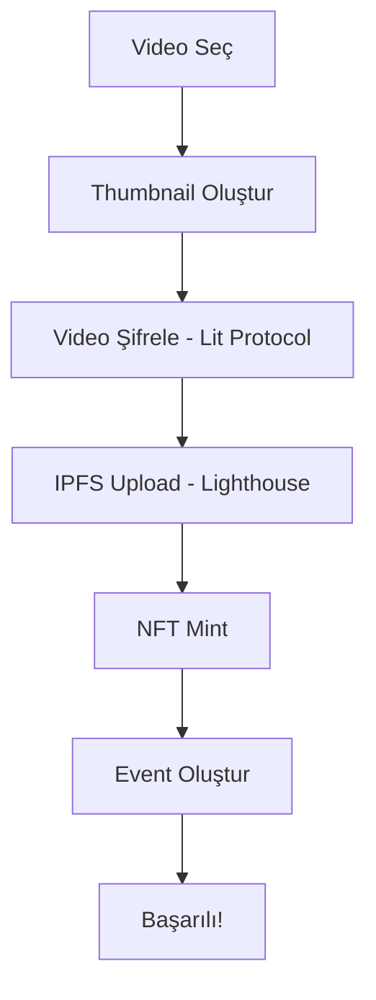
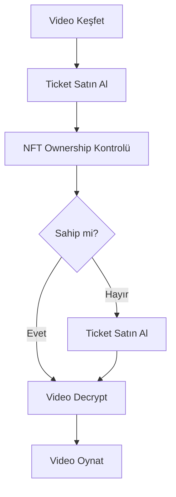

# YouTick MVP - Teknik Dokümantasyon

## 🎯 Proje Özeti

YouTick, NEAR Protocol üzerinde çalışan merkezi olmayan bir video paylaşım ve monetizasyon platformudur. İçerik oluşturucuların videolarını NFT-gated access control ile güvence altına almasını ve monetize etmesini sağlar.

### Temel Özellikler

- ✅ **Şifreli Video Depolama**: Lit Protocol kullanılarak client-side encryption
- ✅ **NFT-Gated Access**: Sadece NFT sahibi kullanıcılar videoyu izleyebilir
- ✅ **Merkezi Olmayan Depolama**: IPFS (Lighthouse) üzerinde video storage
- ✅ **Session Key Desteği**: GasTank ile kullanıcı deneyimi iyileştirmesi
- ✅ **Event Sistemi**: Video başına ticket/event oluşturma
- ✅ **Profil Sayfası**: Kullanıcı bakiyeleri ve ticket yönetimi

## 🏗️ Mimari

### Frontend (Next.js 14)

```
apps/web/
├── app/
│   ├── discover/        # Tüm video listesi
│   ├── upload/          # Video yükleme sayfası
│   ├── watch/           # Video oynatıcı
│   └── profile/         # Kullanıcı profili
├── components/
│   ├── IpfsPlayer.tsx              # Şifreli video oynatıcı
│   ├── UploadForm.tsx              # Video yükleme formu
│   ├── TicketPurchaseCard.tsx      # Ticket satın alma
│   ├── Navbar.tsx                  # Navigasyon
│   └── providers/
│       └── WalletProvider.tsx      # NEAR wallet entegrasyonu
└── hooks/
    ├── useOwnedTokens.ts           # Kullanıcımın token'ları
    ├── useAllVideos.ts             # Tüm videolar
    └── useEventDescription.ts      # Event açıklamaları
```

### Smart Contract (Rust/NEAR)

```
contracts/nft-ticket/
└── src/
    └── lib.rs           # Ana contract dosyası
```

**Contract Adresi**: `utick6.testnet`

#### Ana Contract Fonksiyonları

**NFT İşlemleri:**
- `nft_mint(receiver_id, token_metadata, video_metadata)` - Video NFT oluşturma
- `nft_mint_prepaid(...)` - Session key ile mint (GasTank kullanır)
- `buy_ticket(receiver_id, encrypted_cid)` - Event ticket satın alma

**Event İşlemleri:**
- `create_event(encrypted_cid, title, description, price)` - Yeni event oluşturma
- `get_event(encrypted_cid)` - Event bilgilerini getirme
- `get_events()` - Tüm eventleri listele

**GasTank (Prepaid System):**
- `deposit_funds()` - GasTank'e NEAR yatırma
- `get_user_balance(account_id)` - Kullanıcı bakiyesi

**View Fonksiyonları:**
- `get_tokens_with_video(account_id, from_index, limit)` - Kullanıcının token'ları + video metadata
- `nft_metadata()` - Contract metadata

### Veri Yapıları

#### Event Struct

```rust
pub struct Event {
    pub title: String,
    pub description: String,
    pub price: U128,
    pub creator_id: AccountId,
    pub created_at: u64,
}
```

#### VideoMetadata Struct

```rust
pub struct VideoMetadata {
    pub encrypted_cid: String,       // Lighthouse encrypted video CID
    pub livepeer_playback_id: String,
    pub duration_seconds: u32,
    pub event_date: Option<u64>,
    pub content_type: ContentType,   // Concert, Cinema, Exclusive, LiveEvent
}
```

## 🔐 Güvenlik ve Şifreleme

### Video Şifreleme Akışı

1. **Client-Side Encryption** (Lit Protocol)
   - Video dosyası browser'da şifrelenir
   - Access Control Conditions (ACC) oluşturulur
   - Şifreli dosya IPFS'e yüklenir

2. **Access Control**
   ```typescript
   const accessControlConditions = [
       {
           contractAddress: NFT_CONTRACT_ID,
           functionName: 'nft_tokens_for_owner',
           functionParams: ['account_id'],
           returnValueTest: {
               key: '$.length',
               comparator: '>',
               value: '0'
           }
       }
   ];
   ```

3. **Decryption**
   - Kullanıcı NFT sahibi mi kontrol edilir
   - Lit Protocol ile decryption key alınır
   - Video decrypt edilip oynatılır

### MPC (Multi-Party Computation)

YouTick, NEAR hesaplarını Ethereum adreslerine bağlamak için MPC kullanır:

```typescript
// NEAR hesabından Ethereum adresi türetme
const derivedAddress = await deriveAddress(accountId, path);

// Lit Protocol için signature
const signature = await signMessage(message, path);
```

## 💳 Session Key ve GasTank

### GasTank Sistemi

Kullanıcılar önceden NEAR yatırarak session key ile transaction yapabilir:

1. **Deposit**
   ```bash
   near call utick6.testnet deposit_funds --accountId user.testnet --deposit 1
   ```

2. **Session Key Kullanımı**
   - Kullanıcı bir kez signature verir
   - Session key browser'da saklanır
   - Sonraki işlemler otomatik olarak gerçekleşir

3. **Prepaid Mint**
   ```typescript
   await callMethod('nft_mint_prepaid', {
       receiver_id: accountId,
       token_metadata,
       video_metadata
   });
   ```

## 📊 Kullanıcı Akışları

### 1. Video Yükleme Akışı



**Adımlar:**
1. Kullanıcı video seçer ve önizleme
2. Video Lit Protocol ile şifrelenir
3. Şifreli video Lighthouse (IPFS) üzerinde saklanır
4. NFT mint edilir (token_metadata + video_metadata)
5. Event oluşturulur (title, description, price)

### 2. Ticket Satın Alma ve İzleme



**Adımlar:**
1. Kullanıcı Discover sayfasında video görür
2. Ticket satın almak için tıklar
3. `buy_ticket` fonksiyonu ile NFT mint edilir
4. Wallet'a NFT eklenir
5. Watch sayfasında video decrypt edilir ve oynatılır

### 3. Profil Sayfası

```
/profile
├── Account Info       # accountId display
├── Wallet Balance     # from NEAR account
├── GasTank Balance    # from contract
└── My Tickets         # grid of owned NFTs
```

## 🎨 UI/UX Özellikleri

### Sayfa ve Bileşenler

#### 1. Discover Page (`/discover`)
- Tüm event'lerin grid görünümü
- Thumbnail preview
- Event title ve fiyat
- En yeniden eskiye sıralama

#### 2. Upload Page (`/upload`)
- Drag & drop video upload
- Canlı thumbnail preview
- Event bilgileri formu (title, description, price)
- Şifreleme ve upload progress

#### 3. Watch Page (`/watch`)
- Video oynatıcı (IpfsPlayer)
- Event description display
- Horizontal slider ile kullanıcının kütüphanesi
- NFT ownership kontrolü

#### 4. Profile Page (`/profile`)
- Account ID display
- Wallet balance
- GasTank prepaid balance
- Owned tickets grid

### Tasarım Sistemi

- **Renkler**: Dark theme (black, zinc-900, zinc-800)
- **Aksan Renkleri**: Purple-500, Blue-500, Green-500
- **Typography**: Inter font family
- **Icons**: Lucide React
- **Responsive**: Mobile-first yaklaşım

## 🔄 State Yönetimi

### React Hooks

```typescript
// Token ownership
const { tokens, loading } = useOwnedTokens();

// Event descriptions
const { description } = useEventDescription(cid);

// All videos
const { eventTokens, loading } = useAllVideos();

// Wallet connection
const { accountId, selector, modal } = useWallet();
```

### Data Flow

```
NEAR Contract <-> Hooks <-> Components <-> UI
       ↓
    IPFS/Lighthouse (videos)
       ↓
    Lit Protocol (encryption/decryption)
```

## 🧪 Test Senaryoları

### 1. Temel Kullanıcı Akışı

```bash
# 1. Wallet bağlan
# 2. GasTank'e deposit yap
near call utick6.testnet deposit_funds --accountId test.testnet --deposit 0.5

# 3. Video yükle
# - /upload sayfasına git
# - Video seç, form doldur, upload

# 4. Discover'da görüntüle
# - /discover sayfasında yeni video görünmeli

# 5. Başka hesaptan ticket al
# - Farklı wallet ile bağlan
# - Ticket satın al

# 6. Video izle
# - /watch sayfasında decrypt ve oynat
```

### 2. Contract View Testleri

```bash
# NFT metadata
near view utick6.testnet nft_metadata

# Event bilgisi
near view utick6.testnet get_event '{"encrypted_cid":"VIDEO_UUID"}'

# User balance
near view utick6.testnet get_user_balance '{"account_id":"test.testnet"}'

# Owned tokens
near view utick6.testnet get_tokens_with_video \
  '{"account_id":"test.testnet","from_index":"0","limit":10}'
```

## 📈 Gelecek Geliştirmeler

### Planlanan Özellikler

- [ ] **Livestreaming**: Canlı etkinlik desteği
- [ ] **Royalty System**: Creator'lara secondary sales'ten pay
- [ ] **Social Features**: Comments, likes, follows
- [ ] **Advanced Analytics**: Creator dashboard
- [ ] **Mobile App**: React Native implementation
- [ ] **Multi-chain**: Ethereum, Polygon desteği

### Teknik İyileştirmeler

- [ ] **Caching**: Video metadata caching
- [ ] **CDN Integration**: Faster video delivery
- [ ] **Batch Operations**: Multiple NFT mints
- [ ] **Upgrade Mechanism**: Contract upgrade path
- [ ] **Testing**: Comprehensive test suite

## 🔗 Bağımlılıklar

### Frontend

```json
{
  "dependencies": {
    "next": "16.0.5",
    "react": "19.0.0",
    "near-api-js": "^5.0.1",
    "@lit-protocol/lit-node-client": "^6.9.1",
    "@near-wallet-selector/core": "^8.9.13",
    "lighthouse-web3": "^0.0.9"
  }
}
```

### Smart Contract

```toml
[dependencies]
near-sdk = "5.5.0"
near-contract-standards = "5.5.0"
```

## 📝 Lisans

MIT License

---

**Son Güncelleme**: 2025-12-12  
**Contract Version**: 1.0.0  
**Contract Address**: utick6.testnet
