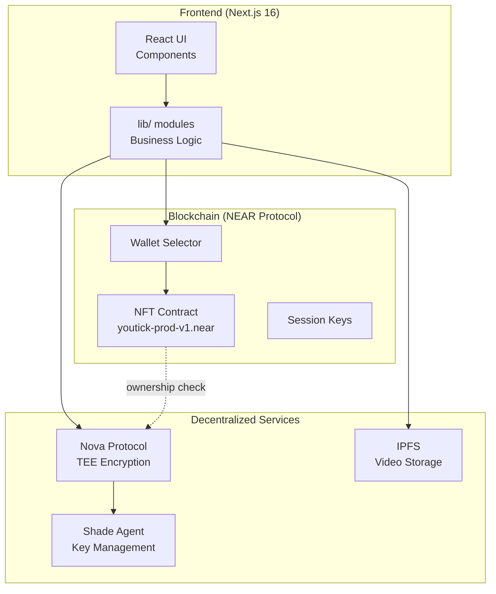

# YouTick

> **Decentralized Video-on-Demand Platform on NEAR Protocol**

YouTick is a Web3-native VOD platform where creators upload encrypted videos to IPFS and monetize through NFT-gated access. Built with NEAR Protocol and Nova Protocol for TEE-based encryption.


## Why YouTick?

### True Digital Ownership
Traditional platforms give you a "viewing right" that can be revoked anytime. YouTick gives you an **NFT ticket** that sits in your wallet forever. You can transfer it, sell it on secondary markets, or keep it as a collectible.

### Frictionless Web3 UX
Most dApps suffer from "Signature Fatigue" – endless wallet pop-ups. YouTick uses **Session Keys** to create a seamless experience:
- **First upload** → One signature to create Session Key
- **Subsequent uploads** → Fully signless
- **Video playback** → Signless decryption for ticket holders

### Creator-First Economics
- **98% Revenue to Creators** – Only 2% protocol fee
- **No Middlemen** – Smart contract routes payment directly from buyer to creator
- **No Demonetization** – Your content, your rules

### Censorship-Resistant Infrastructure
- Content stored on **IPFS** (distributed, persistent)
- Encryption via **Nova Protocol** (TEE-based key management)
- Access rights on **NEAR blockchain** (immutable)
- Even if the frontend goes down, your content and access rights persist

## Features

- **Decentralized Storage** – Videos encrypted client-side and stored on IPFS
- **NFT-Gated Access** – Only ticket (NFT) holders can decrypt and watch content
- **Session Key Uploads** – Seamless batch transactions with progress tracking
- **Pay-Per-View Events** – Create ticketed events with custom NEAR pricing
- **TEE Encryption** – Secure encryption via Nova's Shade Agent (Phala Network)
- **Gift Tickets** – Create shareable gift links for your videos; recipients can claim NFT tickets
- **Trial Accounts** – New users can claim gifts without a NEAR wallet; automatic sub-account creation

## Architecture



> **Detailed Documentation**: See [docs/](./docs/) for comprehensive technical guides.

## Tech Stack

| Layer | Technology | Version |
|-------|------------|---------|
| Frontend | Next.js (App Router) | 16.0.10 |
| UI Framework | React | 19.2.3 |
| Styling | Tailwind CSS | 4.x |
| Language | TypeScript | 5.x |
| Blockchain | NEAR Protocol | Mainnet |
| Smart Contract | Rust (NEAR SDK) | 5.1.0 |
| Encryption | Nova Protocol | TEE |
| Storage | IPFS (Crust Network) | - |
| Wallet | NEAR Wallet Selector | 10.1.2 |

## Quick Start

### Prerequisites

- Node.js 18+
- NEAR Wallet ([mynearwallet.com](https://app.mynearwallet.com))

### Installation

```bash
# Clone repository
git clone https://github.com/4rmus/youtick-mvp.git
cd youtick-mvp

# Install dependencies
cd apps/web
npm install

# Configure environment
cp .env.example .env.local
# Edit .env.local with your settings

# Start dev server
npm run dev
```

Open [http://localhost:3000](http://localhost:3000)

### Environment Variables

Create `apps/web/.env.local`:

```env
# Network
NEXT_PUBLIC_NEAR_NETWORK=mainnet
NEXT_PUBLIC_NFT_CONTRACT_ID=youtick-prod-v1.near

# Nova Protocol
NEXT_PUBLIC_NOVA_NETWORK=mainnet
NEXT_PUBLIC_NOVA_CONTRACT_ID=nova-sdk.near
NEXT_PUBLIC_NOVA_API_KEY=
NEXT_PUBLIC_NOVA_ACCOUNT_ID=

# Relayer (Optional - for sponsored transactions)
RELAYER_ACCOUNT_ID=relayer.youtick-prod-v1.near
RELAYER_PRIVATE_KEY=ed25519:...
```

## Usage

### Upload Video

1. Connect NEAR wallet
2. Go to `/upload`
3. Select video, enter title/description/price
4. Click "Upload Video" – progress UI shows each step:
   - Session Setup
   - Nova Group Creation
   - File Encryption & Upload
   - NFT Minting
5. Video is encrypted, uploaded to IPFS, and NFT minted

### Watch Video

1. Browse `/discover`
2. Purchase ticket (costs NEAR)
3. Open `/watch` – video auto-decrypts for ticket holders

### Gift Tickets

1. Go to `/profile`
2. Click "Gift" button
3. Select the video you want to gift
4. Choose how many gift links to create
5. Share the generated links – recipients can claim tickets

### Trial Accounts (for Gift Recipients)

1. Open a gift link (e.g., `/claim?secret=...`)
2. Choose "New Account"
3. Enter a username – a sub-account is created automatically
4. Ticket is claimed and you're logged in instantly

### Profile

View balances and owned tickets at `/profile`

## Project Structure

```text
youtick-mvp/
├── apps/
│   └── web/                 # Next.js frontend
│       ├── app/             # App Router pages
│       ├── components/      # React components
│       ├── hooks/           # Custom hooks
│       └── lib/             # Utilities & services
│           └── nova/        # Nova SDK integration
├── contracts/
│   └── nft-ticket/          # NEAR smart contract
│       └── src/lib.rs       # Contract source code
└── docs/                    # Detailed technical documentation
```

## Smart Contract

Deployed to: `youtick-prod-v1.near`

### Key Functions

| Function | Description |
|----------|-------------|
| `nft_mint()` | Mint video NFT |
| `create_event()` | Create ticketed event |
| `buy_ticket()` | Purchase event ticket |
| `buy_ticket_prepaid()` | Buy ticket with prepaid balance |
| `create_sponsored_trial()` | Create trial subaccount (sponsored) |
| `claim_free_ticket_sponsored()` | Claim free ticket (sponsored) |
| `fund_trial_pool()` | Fund trial/sponsorship pool |
| `get_event()` | Get event details |
| `nft_tokens()` | List all tokens |

### Deploy Your Own (Optional)

```bash
cd contracts/nft-ticket
cargo build --target wasm32-unknown-unknown --release

# Optimize WASM
wasm-opt -Oz -o target/.../youtick_nft_opt.wasm \
             target/.../youtick_nft.wasm

# Deploy
near deploy YOUR_ACCOUNT.near target/.../youtick_nft_opt.wasm \
     --initFunction new --initArgs '{"owner_id":"YOUR_ACCOUNT.near"}'
```

## Security

- **Client-side encryption**: Videos never leave browser unencrypted
- **NFT ownership verification**: On-chain proof required for decryption
- **TEE key management**: Keys isolated in Trusted Execution Environment (Phala)
- **Nova group access**: Programmable access control via group membership

## Cost Advantage

YouTick operates on a **Zero-Server Economy**:
- No monthly AWS/server bills
- IPFS storage: ~$4/GB one-time fee
- Costs scale linearly with usage
- Compare: Traditional video platforms cost thousands monthly

## Testing

```bash
# View contract metadata
near view youtick-prod-v1.near nft_metadata '{}'

# List tokens
near view youtick-prod-v1.near nft_tokens '{"from_index":"0","limit":10}'

# Get event details
near view youtick-prod-v1.near get_event '{"encrypted_cid":"VIDEO_CID"}'
```

## License

MIT License

## Links

- [NEAR Protocol](https://near.org)
- [Nova Protocol](https://nova.ai)
- [Phala Network](https://phala.network)

---

**Contract**: `youtick-prod-v1.near` | **Network**: Mainnet

*"Own Your Content. Own Your Audience. Own Your Revenue."*
