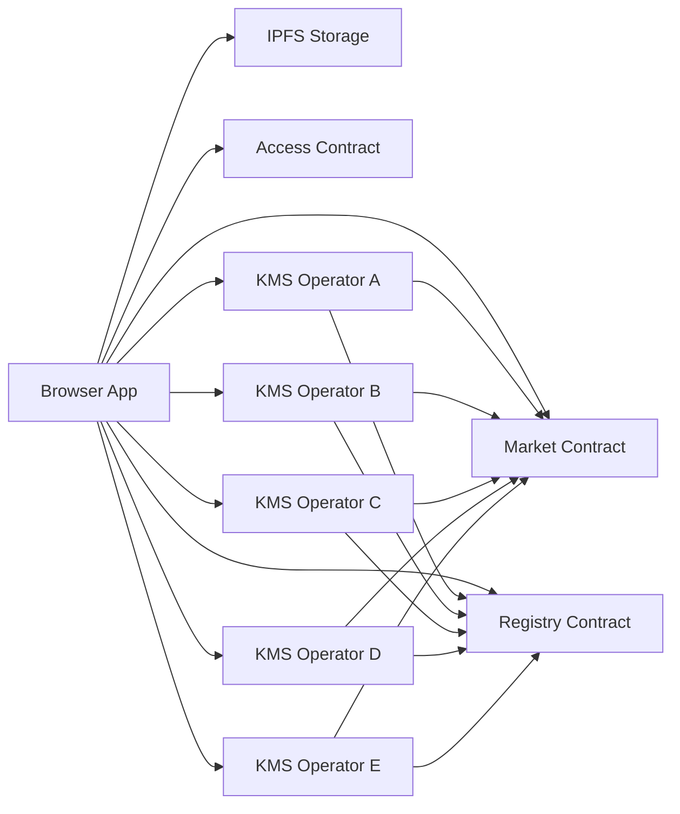

# YouTick System Architecture

> Current live runtime: browser encryption, NEAR entitlements, access grants, registry-enforced operators, share-based playback, and hybrid decentralized operations

---

## Summary

Today, YouTick runs through five active layers:

| Layer | Responsibility |
|-------|----------------|
| Web app | Encrypts media, uploads manifests and segments, and manages purchase/watch UX |
| Market contract | Stores events, tickets, purchase logs, and creator ownership |
| Access contract | Stores short-lived session grants used by off-chain authorization |
| Registry contract | Stores active decryption operators and relayers |
| KMS operators | Store encrypted key shares and release them only after authorization checks |

IPFS storage stores encrypted media assets and manifests. Lighthouse is the
primary write provider through `workers/storage-api`; Crust remains for legacy
compatibility and opt-in diagnostics during rollout. The browser is still the
place where the final playback key is reconstructed and media is decrypted.

This page describes the current public-alpha model. It is hybrid decentralized:
ownership and policy live on NEAR, encrypted media lives on IPFS storage, while
KMS operators currently run on Cloudflare Workers with KV-backed share storage.

---

## High-Level Flow

### Upload

1. The browser generates an AES key and encrypts media locally.
2. Encrypted segments and manifests are uploaded to IPFS.
3. The AES key is split into shares.
4. Shares are stored across active operators.
5. The market contract records the event and NFT metadata.

### Watch

1. The app reads active operators from the registry.
2. It ensures a short-lived `Play` grant in the access contract.
3. It requests shares from the active operators in parallel.
4. Operators check registry status, access grants, and on-chain entitlement.
5. The browser reconstructs the AES key after enough shares arrive and starts playback.

### Gift and Trial

1. Gift and trial flows continue to use the market contract as the entitlement source of truth.
2. Trial relayer usage is now constrained by the registry.

---

## Active Code Surfaces

### Web

- `apps/web/components/UploadForm.tsx`
- `apps/web/components/IpfsPlayer.tsx`
- `apps/web/lib/access-grants.ts`
- `apps/web/lib/registry.ts`
- `apps/web/lib/kms/*`
- `apps/web/lib/crust/*`
- `apps/web/lib/storage/*`
- `apps/web/lib/upload-session-manager.ts`

### Workers

- `workers/youtick-kms/src/index.ts`
- `workers/storage-api/src/index.ts`
- `workers/media-delivery/src/index.ts`

### Contracts

- `contracts/nft-ticket/src/lib.rs`
- `contracts/access-control/src/lib.rs`
- `contracts/operator-registry/src/lib.rs`

---

## Important Design Choices

### 1. Media is still encrypted in the browser

Raw video is never uploaded in plaintext. The browser encrypts first, then uploads.

### 2. Upload keeps the low-friction session-key path

Upload uses the narrow upload session key path because it preserves the single-approval UX. We intentionally did not replace upload with session grants.

### 3. Playback moved to share-based decryption

The playback key is no longer treated as a single KMS secret. It is split into shares and reconstructed in the browser.

### 4. Registry is now an enforcement layer

The registry no longer acts as a passive address book. Operators and relayers must be active in the registry to participate.

### 5. Access grants standardize off-chain authorization

The access contract standardizes short-lived `Play`, `Publish`, `ClaimGift`, and `ClaimTrial` authorization checks without replacing the upload session model.

### 6. Governance is owner-controlled in public alpha

Emergency takedown and owner governance remain owner-controlled in V1 public
alpha. DAO/multisig governance is a target, not an implemented guarantee.

---

## Related Pages

- [Storage & Delivery](./storage.md)
- [Session Keys & Upload Sessions](./session-keys.md)
- [Smart Contract](./smart-contract.md)
- [Security](../security.md)
