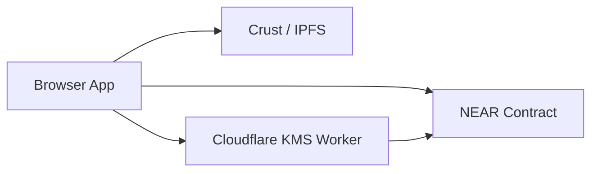

# YouTick System Architecture

> Aktif sistem akisi: browser, KMS worker, Crust/IPFS ve NEAR contract

---

## Ozet

YouTick'in bugunku calisan yolu uc ana parcadan olusur:

| Parca | Gorevi |
|-------|--------|
| Web uygulamasi | Videoyu sifreler, IPFS'e yukler, satin alma ve izleme akisini yonetir |
| KMS worker | AES anahtarlarini saklar, imza ve sahiplik kontrolu yapar |
| NEAR contract | Event, NFT ticket, gift, trial ve odeme mantigini tutar |

Crust/IPFS ise sifrelenmis medya dosyalarini ve manifestleri saklar.

---

## Ust Duzey Akis

### Upload

1. Browser videoyu AES-CTR ile sifreler.
2. Sifreli dosya veya segmentler IPFS'e yuklenir.
3. AES anahtari KMS worker'a kaydedilir.
4. NFT ve event kaydi NEAR uzerinde olusur.

### Watch

1. Uygulama event ve sahiplik durumunu okur.
2. KMS'ye imzali bir anahtar talebi yollar.
3. KMS contract uzerinden erisim kontrolu yapar.
4. Player IPFS'ten sifreli icerigi alir, browser'da cozer ve oynatir.

### Gift ve Trial

1. Creator hediye linkleri uretir.
2. Alici mevcut hesaba ya da yeni hesaba claim eder.
3. Trial hesaplar onboarding key veya opsiyonel relayer ile acilir.

---

## Aktif Kod Yuzeyleri

### Web

- `apps/web/components/UploadForm.tsx`
- `apps/web/components/IpfsPlayer.tsx`
- `apps/web/components/TicketPurchaseCard.tsx`
- `apps/web/lib/kms/*`
- `apps/web/lib/crust/*`
- `apps/web/lib/upload-session-manager.ts`

### Worker

- `workers/youtick-kms/src/index.ts`

### Contract

- `contracts/nft-ticket/src/lib.rs`

---

## Onemli Tasarim Kararlari

### 1. Medya istemci tarafinda sifrelenir

Ham video backend'e gitmez. Browser sifreler, sonra yukler.

### 2. Anahtar KMS worker'da tutulur

IPFS sadece sifreli veri gorur. KMS ise anahtari ancak imza ve sahiplik kontrolunden sonra verir.

### 3. Kontrat bilet sahipligini belirler

KMS kendi basina karar vermez. Son karar contract'taki sahiplik verisidir.

### 4. Upload icin kisa omurlu yetki kullanilir

Tercih edilen yol `create_upload_session` ile acilan gecici upload yetkisidir. Frontend'de eski session-key yardimcilari hala durur, ama bunlar artik ana yol degildir.

### 5. Eski uyumluluk alanlari sadece veri devamlıligi icin kalmistir

Kontratta eski alanlar gorulebilir. Bunlar yeni akisin parcasi degil, eski kayitlari okuyabilmek icin tutulur.

---

## Ilgili Sayfalar

- [Storage & Delivery](./storage.md)
- [Session Keys & Upload Sessions](./session-keys.md)
- [Smart Contract](./smart-contract.md)
- [Security](../security.md)
