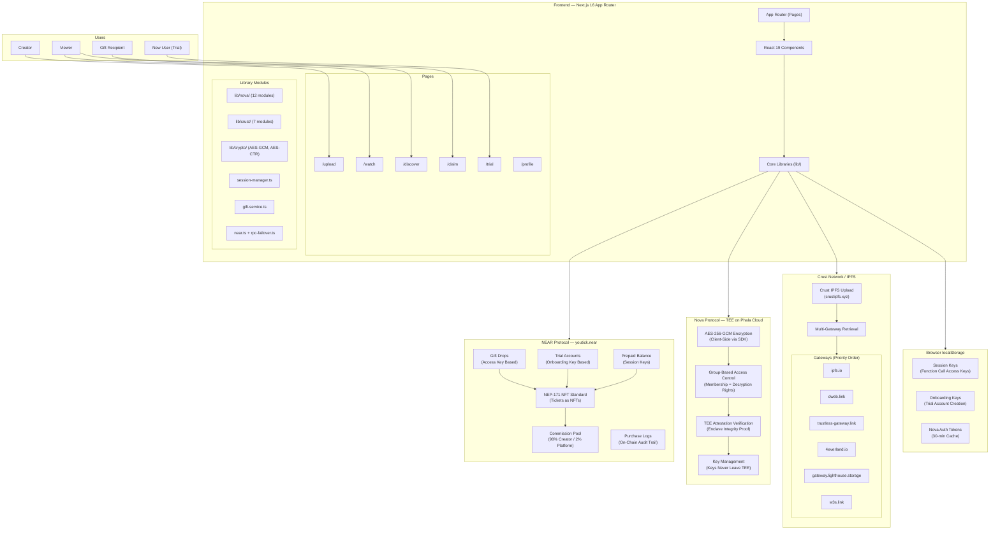
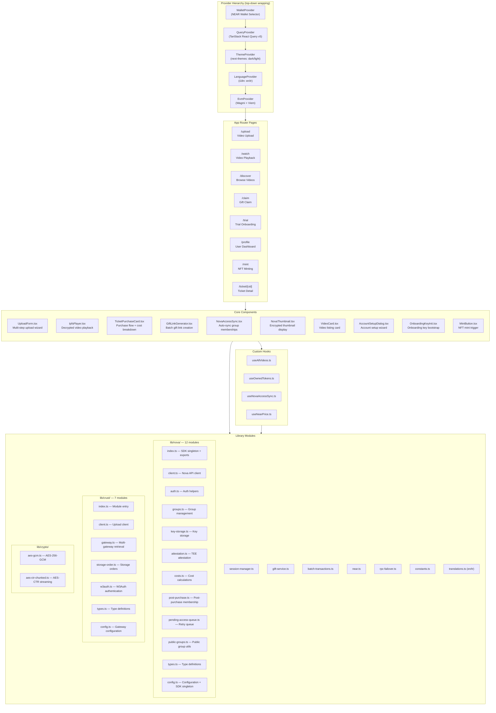
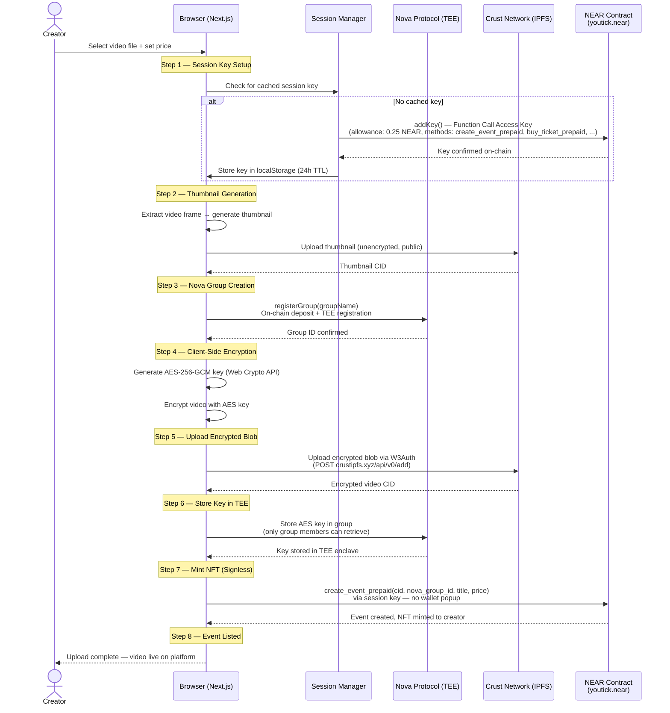
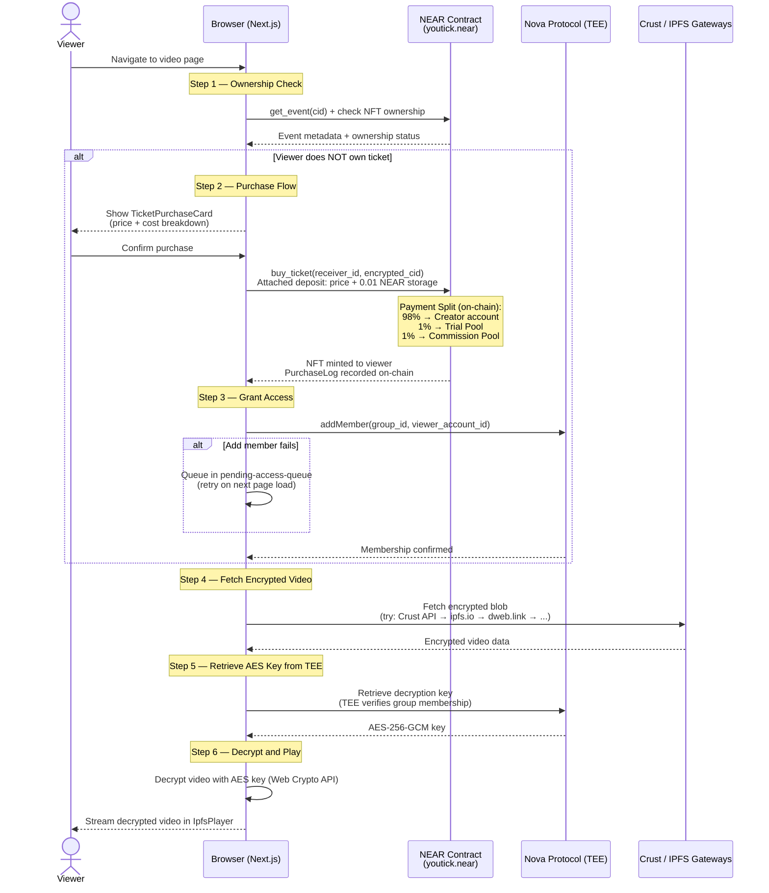
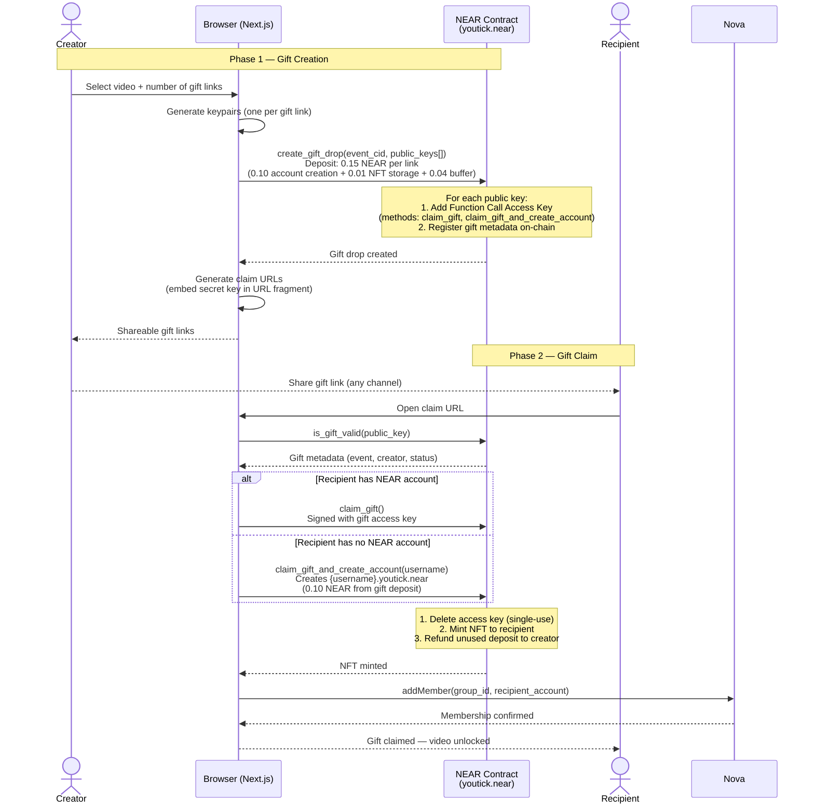
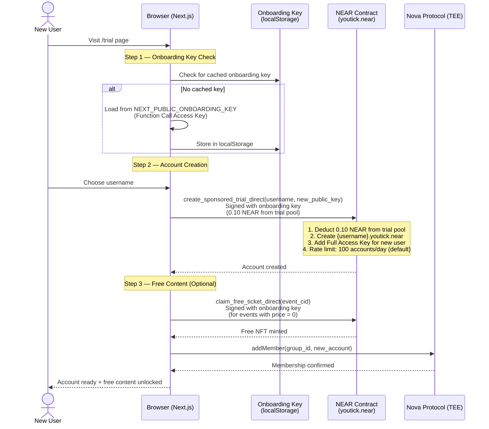

# YouTick System Architecture

> Decentralized Video-on-Demand platform built on NEAR Protocol, Nova Protocol (TEE), and Crust Network (IPFS).

**Contract**: `youtick.near` (mainnet) | **Network**: NEAR Mainnet | **Architecture**: Client-Side (No Server Dependencies)

---

## Table of Contents

- [System Overview](#system-overview)
- [High-Level Architecture](#high-level-architecture)
- [Component Architecture](#component-architecture)
- [Data Flow Diagrams](#data-flow-diagrams)
  - [Video Upload Flow](#video-upload-flow)
  - [Video Purchase and Watch Flow](#video-purchase-and-watch-flow)
  - [Gift Link Flow](#gift-link-flow)
  - [Trial Account Flow](#trial-account-flow)
- [Technology Stack](#technology-stack)
- [Security Architecture](#security-architecture)
- [Design Principles](#design-principles)
- [Contract Addresses](#contract-addresses)
- [Related Documents](#related-documents)

---

## System Overview

YouTick is a decentralized Video-on-Demand (VoD) platform on NEAR Protocol. Creators upload encrypted videos, mint NFT tickets, and receive 98% of every sale. Viewers purchase tickets to unlock content. The entire flow -- from encryption to payment to playback -- executes client-side in the browser with no centralized server dependencies.

The platform integrates three decentralized protocols:

| Protocol | Role | Key Capability |
|----------|------|----------------|
| **NEAR Protocol** | Blockchain layer | NFT minting, payments, session keys, gift drops, trial accounts |
| **Nova Protocol** | Encryption layer | AES-256-GCM encryption via TEE (Phala Cloud), group-based access control |
| **Crust Network / IPFS** | Storage layer | Encrypted blob storage with multi-gateway failover retrieval |

> [!NOTE]
> YouTick follows a **Client-Side First** architecture. Every operation -- NFT minting, video encryption, payment processing, group membership management -- runs in the user's browser. No backend server, no API gateway, no centralized point of failure.

---

## High-Level Architecture



> [!IMPORTANT]
> The NEAR smart contract at `youtick.near` handles all financial operations on-chain. The 98/2 commission split (1% to trial pool + 1% to platform commission) is enforced at the contract level and cannot be modified without a redeployment.

---

## Component Architecture



> [!NOTE]
> The provider hierarchy follows a strict wrapping order. `WalletProvider` must be the outermost provider because downstream providers and components depend on wallet connection state for NEAR operations.

---

## Data Flow Diagrams

### Video Upload Flow

The upload flow encrypts video content client-side, stores it on decentralized storage, and mints an NFT ticket on NEAR -- all without server involvement.



> [!WARNING]
> Nova group registration requires an on-chain deposit (~0.67 NEAR for paid videos). If the registration fails mid-transaction due to RPC propagation delays, the system retries up to 3 times with escalating delays (3s, 5s, 8s). On balance errors during retry, it checks whether the previous attempt succeeded on-chain before failing.

---

### Video Purchase and Watch Flow

Purchase splits payment on-chain (98% creator, 2% platform), grants Nova group membership for decryption rights, and streams decrypted video directly in the browser.



> [!IMPORTANT]
> If Nova group membership addition fails after purchase (due to network issues), the system queues the operation in `pending-access-queue.ts`. The queue retries on subsequent page loads via the `NovaAccessSync` component, ensuring eventual consistency between NFT ownership and decryption access.

---

### Gift Link Flow

Creators can generate shareable gift links that allow recipients to claim a free NFT ticket. Each link is backed by a NEAR Function Call Access Key scoped to the `claim_gift` and `claim_gift_and_create_account` methods.



> [!NOTE]
> Gift links are single-use by design. The access key is deleted on-chain during the claim transaction, preventing double-claims. Unused deposit balance (beyond account creation and storage costs) is refunded to the creator.

---

### Trial Account Flow

New users without a NEAR account can onboard through the trial system. An **Onboarding Key** (a Function Call Access Key stored in the browser) creates sponsored subaccounts under `youtick.near` and optionally claims free content.



> [!WARNING]
> The trial pool is funded by the 1% platform commission from every ticket sale. When the pool is depleted, trial account creation fails. Monitor the pool balance with `near view youtick.near get_trial_pool_balance '{}'` and top up with `fund_trial_pool` when needed.

---

## Technology Stack

| Layer | Technology | Version | Purpose |
|-------|-----------|---------|---------|
| **Frontend** | Next.js (App Router) | 16.x | Pages, routing, static export |
| **UI Framework** | React | 19.x | Component rendering |
| **Language** | TypeScript | 5.x | Type safety across the codebase |
| **State Management** | TanStack React Query | 5.x | Server state, caching, background refetch |
| **Styling** | Tailwind CSS + Radix UI | 4.x | Utility-first CSS + accessible primitives |
| **Blockchain** | NEAR Protocol (near-api-js) | 7.x | On-chain operations, wallet interaction |
| **Wallet** | NEAR Wallet Selector | 10.1.4 | Multi-wallet support (MyNearWallet, Meteor) |
| **Smart Contract** | Rust + NEAR SDK | 5.5.0 | NFT ticket contract (80+ methods) |
| **NFT Standards** | NEP-171 / NEP-177 / NEP-178 | -- | Core NFT, metadata, approval management |
| **FT Standard** | NEP-141 | -- | wNEAR payment receiver (ft_on_transfer) |
| **EVM Bridge** | Wagmi + Viem | 2.x | EVM wallet connectivity |
| **Encryption** | Nova Protocol SDK (nova-sdk-js) | 1.0.3 | TEE-based AES-256-GCM encryption |
| **Storage** | Crust Network / IPFS | -- | Decentralized encrypted blob storage |
| **Testing** | Vitest | 4.x | Unit and integration tests |

---

## Security Architecture

### Encryption and Key Management

```
Video File
    │
    ▼
┌─────────────────────────────┐
│  AES-256-GCM Encryption     │
│  (Web Crypto API, browser)   │
│                              │
│  Key: Random 256-bit         │
│  IV:  Random 96-bit          │
│  Auth Tag: 128-bit           │
└──────────────┬──────────────┘
               │
       ┌───────┴───────┐
       │               │
       ▼               ▼
  Encrypted        AES Key
  Blob → IPFS      → Nova TEE
                    (Phala Cloud)
```

| Security Layer | Mechanism | Protection |
|----------------|-----------|------------|
| **Video encryption** | AES-256-GCM (client-side, Web Crypto API) | Content confidentiality at rest and in transit |
| **Key custody** | Nova TEE on Phala Cloud (keys never leave enclave) | Key material isolation from all parties |
| **TEE attestation** | Remote attestation verification (enclave hash) | Enclave integrity proof before trusting key operations |
| **Access control** | Nova group membership (verified on-chain + in TEE) | Only NFT holders can retrieve decryption keys |
| **NFT ownership** | NEAR NEP-171 on-chain verification | Tamper-proof proof of purchase |
| **Session key limits** | Function Call Access Key (0.25 NEAR allowance, 24h TTL) | Limits damage from key compromise |
| **Prepaid withdrawal cap** | 0.1 NEAR max per withdrawal | Prevents session key abuse for fund extraction |
| **Onboarding rate limiting** | 100 trial accounts/day (configurable on-chain) | Prevents Sybil attacks on trial pool |
| **Gift link scoping** | Access keys scoped to claim_gift methods only | Gift keys cannot call arbitrary contract methods |
| **RPC failover** | 3 endpoints (fastnear, near.org, pagoda.co) | Resilience against single RPC provider failure |
| **IPFS gateway failover** | 6+ gateways with health tracking | Resilience against gateway downtime |

> [!WARNING]
> The `NEXT_PUBLIC_NOVA_API_KEY` environment variable must contain only a flag value like `"enabled"` or `"proxy-injected"` -- never the actual API secret. The real Nova API key is injected server-side by the CORS proxy (Cloudflare Worker or Next.js API route). Leaking the real key in the client bundle would allow unauthorized Nova operations.

### Threat Model Summary

| Threat | Mitigation |
|--------|------------|
| Video piracy (direct IPFS access) | Content is AES-256-GCM encrypted; raw CID yields only ciphertext |
| Key extraction from TEE | Phala Cloud SGX enclave; keys bound to enclave identity |
| Session key theft | Limited allowance (0.25 NEAR), 24h expiry, scoped to specific methods |
| Trial pool drain (Sybil) | On-chain rate limit (100/day), minimum 0.10 NEAR per account |
| Gift link replay | Access key deleted on-chain during claim (single-use) |
| RPC manipulation | FailoverRpcProvider rotates across independent providers |

---

## Design Principles

### 1. Client-Side First

Every operation runs in the user's browser. There is no centralized backend, no API server, and no database. The platform depends solely on three decentralized protocols (NEAR, Nova, Crust) and the user's browser.

| Operation | Implementation | Server Required |
|-----------|---------------|:---:|
| Video encryption / decryption | Web Crypto API + Nova SDK | No |
| NFT minting and transfers | NEAR session keys | No |
| Payment processing | NEAR smart contract (on-chain split) | No |
| Video storage and retrieval | Crust IPFS + multi-gateway failover | No |
| Gift link creation and claiming | NEAR Access Keys (Function Call) | No |
| Trial account onboarding | NEAR Onboarding Keys (on-chain) | No |
| Group access management | Nova SDK (client-side) | No |
| Content discovery | NEAR contract view calls | No |

### 2. Signless UX

Session Keys eliminate wallet confirmation popups for common operations. After a one-time wallet connection, users interact with the platform as smoothly as a Web2 application.

```
Initial Setup (one-time):
  User connects wallet → Generate Function Call Access Key →
  Store in localStorage (24h TTL) → All subsequent transactions are signless

Operations covered by session key:
  - create_event_prepaid (upload)
  - buy_ticket_prepaid (purchase)
  - deposit_funds (top-up prepaid balance)
  - withdraw_funds (withdraw prepaid balance)
```

### 3. Zero-Knowledge Encryption

Video encryption keys are generated in the browser and stored exclusively inside the Nova TEE enclave on Phala Cloud. Neither YouTick, nor IPFS gateways, nor any third party can access the decryption key. Only verified Nova group members (NFT holders) can retrieve the key from the TEE.

### 4. Progressive Decentralization

The platform prioritizes direct on-chain methods over relayer-based alternatives:

| Operation | Preferred (Direct) | Fallback (Relayer) |
|-----------|--------------------|--------------------|
| Trial account creation | Onboarding Key (on-chain) | Relayer account (server) |
| Gift claiming | Gift access key (on-chain) | -- |
| Ticket purchase | Session key (client-side) | Wallet signature |

### 5. Transparent Metrics

All decentralization-relevant operations log structured events to the browser console with the `[DECENTRALIZATION_METRIC]` prefix. This allows auditing the degree of decentralization at runtime.

```
[DECENTRALIZATION_METRIC] session_key_used: true
[DECENTRALIZATION_METRIC] nova_group_created: client-side
[DECENTRALIZATION_METRIC] ipfs_upload: crust-direct
[DECENTRALIZATION_METRIC] rpc_endpoint: fastnear (primary)
```

---

## Contract Addresses

| Contract | Network | Address | Purpose |
|----------|---------|---------|---------|
| NFT Ticket | Mainnet | `youtick.near` | Production NFT contract |
| NFT Ticket | Testnet | `v1.utick.testnet` | Test environment |
| Nova SDK | Mainnet | `nova-sdk.near` | TEE group management |
| Nova SDK | Testnet | `nova-sdk-6.testnet` | Test TEE environment |

---

## Related Documents

| Document | Description |
|----------|-------------|
| [Smart Contract](./smart-contract.md) | Contract specification, data structures, 80+ methods |
| [Nova Protocol](./nova-protocol.md) | TEE encryption architecture, group management |
| [Shade Agent](./shade-agent.md) | Phala Network TEE key management internals |
| [Session Keys](./session-keys.md) | Signless UX implementation and session lifecycle |
| [Chain Signatures](./chain-signatures.md) | NEAR MPC for cross-chain operations |
| [Storage](./storage.md) | IPFS and Crust Network storage architecture |
| [User Flows](../guides/user-flows.md) | End-to-end interaction diagrams |
