# YouTick mevcut uygulama için Desktop, 20 GB paid video, merkeziyetsiz storage ve yüksek ölçekli streaming nihai mimari planı

**Tarih:** 2026-07-23

**Durum:** Mevcut YouTick için nihai hedef mimari ve uygulama planı;
uygulama, deploy veya production kanıtı değildir

**Güncelleme:** Mevcut YouTick sistemi korunarak creator odaklı Desktop uygulaması
tasarlanmış, paid kaynak video sınırı tam `20.000.000.000 byte` kabul edilmiş,
web paid upload kaldırılmıştır. Lighthouse L3 hattı 2026-07-23 tarihli resmi
dokümantasyon ve `lighthouse-web3/lighthouse-package` kaynak koduyla yeniden
tasarlanmıştır: normal ürün yolu multipart/CAR veya Lighthouse encrypted SDK değil,
en fazla `64 MiB` immutable ciphertext object'lerinin tekil presigned `PutObject`
ile doğrudan yüklenmesi, object-level resume ve bütün envanteri bağlayan canonical
JSON manifest CID'sidir. 2026-07-23 Lite gerçek-hesap küçük canary'si exact
PUT/HEAD/GET, full readback, signed length reddi, replay ve cleanup davranışını
teknik olarak geçmiştir; bu sonuç 20 GB, fatura/quota, expiry, dedicated gateway,
Filecoin veya production kanıtı değildir. Dedicated Lighthouse gateway CDN origin adayı, Bunny CDN
Volume tek primary viewer-delivery katmanıdır; NEAR runtime referansı nearcore
`2.13.1` ve mainnet Protocol `86`dır.

**İncelenen repo snapshot'ı:** `agent/performance-security-hardening` / `bce0c6cecef19bfcba2333f8d8ed7e13aebaca53`

**NEAR referans çizgisi:** nearcore `2.13.1` (`9d05464`), mainnet Protocol
`86`; 2026-07-22 tarihli resmi release ve canlı RPC kanıtı

**Yöntem:** Yerel kod ve belge denetimi, mimari/güvenlik incelemesi, 2026-07-23
tarihli resmi sağlayıcı ve Tauri belgeleri, nearcore kaynakları ile
`lighthouse-web3/lighthouse-package@9b35c67d7f1aa8a2f8827c40e6e68b8ece83bb79`
kaynak kodunun yeniden kontrolü

**Sınır:** Mainnet protocol/runtime config salt-okunur doğrulandı; Lighthouse Lite
hesabında yalnız sentetik `4 KiB` gerçek-hesap canary'si çalıştırıldı. GitHub CI,
canlı Cloudflare deployment'ları, deploy edilmiş NEAR kontrat code hash'leri,
dedicated gateway ve production sağlayıcı hesabı doğrulanmadı.

## 1. Yönetici kararı

YouTick için doğru hedef **tamamen merkeziyetsiz streaming** değildir. Teknik ve ekonomik olarak doğru hedef şudur:

> **Merkeziyetsiz ve doğrulanabilir kalıcılık + değiştirilebilir, merkezi edge dağıtımı + bağımsız erişim otoritesi.**

Bu güncellemede kabul edilen ürün kararları:

1. **Paid kaynak video üst sınırı tam `20.000.000.000 byte`tır.**
   `20.000.000.001` byte ve `20 GiB` (`21.474.836.480 byte`) reddedilir.
2. **Web'de paid upload kaldırılır.** `/upload` yüzeyi yalnız free browser upload
   sunar. Kullanıcı paid seçtiğinde file input ve web publish eylemi yerine
   `Studio'da aç` gösterilir; paid media byte'ı web hook/API yoluna hiç girmez.
3. **20 GB paid yükleme yalnız YouTick Studio Desktop üzerinden yapılır.** Studio
   kurulu değilse aynı kart ikincil `Studio'yu indir` eylemi gösterir.
4. **Mevcut ücretsiz browser sınırı 64 MiB (`67.108.864 byte`) olarak kalır.**
   Free limit değişikliği bu kararın kapsamı değildir.
5. **20 GB kaynak dosya sınırıdır; output, duration, frame/pixel ve maliyet sınırı
   değildir.** Süre üst sınırı ayrıca kararlaştırılmadan `3 saat` ürün politikası
   sayılmaz; 3 saat yalnız kabul testi fixture'ı olabilir.
6. **Mevcut `youtick` web, NEAR, KMS ve playback sistemi evrimleştirilir;
   greenfield rewrite yapılmaz.** Bu repo ve bu belge uygulamanın tek hedef
   kaynağıdır; başka bir repo migration veya runtime karar kaynağı değildir.
7. **Desktop ilk aşamada creator aracıdır.** İzleyici playback'i ve satın alma web'de
   kalır; ayrı bir Watch Desktop ürünü bu kapsamda yoktur.
8. **Paid video için tek primary CDN segment yolu Bunny CDN Volume Pull Zone'dur.**
   Standard tier otomatik fallback değildir. Bunny outage sırasında bağımsız CID
   gateway'e session-level emergency fallback yalnız `%0.1` contingency bütçesi ve
   ölçülmüş SLO içinde açılabilir; kalıcı rota değişikliği fiyat onayı ister.
9. **Minimum paid fiyat stable-value olarak `$2.00`dır.** Launch profile içindeki
   `$2` satıştaki `%2`
   platform payının `$0.032` kısmı önce bir tam-izleme delivery rezervine, kalan
   `$0.008` kısmı trial/growth rezervine ayrılır. Mevcut `%50/%50` kontrat
   bölünmesi bu hedef değildir ve migration gerektirir.
10. **Creator job ücreti kaynak GB başına `$0.20` tabanlıdır fakat tek fiyat
    sinyali değildir.** Nihai ücret, bu taban ile tahmini ciphertext output,
    local processing hizmeti, persistence ve retention maliyetinin yüksek olanıdır.
    Ücret iş başlamadan rezerve edilir; yalnız tanımlı hizmet kapısı tamamlanınca
    kesinleşir, başarısız veya iptal işte açık refund kuralı uygulanır. Playback bu
    upload ücretinden değil bilet delivery rezervinden karşılanır.
11. **NEAR production referansı nearcore `2.13.1` / Protocol `86`dır; bu, yeni
    özelliklerin uygulamada otomatik kullanılabildiği anlamına gelmez.** Mevcut
    ordinary FunctionCall ve system-browser wallet finalize yolu korunur. Gas key,
    `DelegateV2`, strict nonce, ML-DSA-65 ve deterministic yield ayrı PoC/ADR
    olmadan production akışına girmez.

Önerilen sorumluluk paylaşımı:

| Gerçek / sorumluluk | Kanonik katman | Kanonik olmayan yardımcı katman |
|---|---|---|
| Medya kimliği ve bütünlüğü | CID, `manifest_root`, `inventory_root` | CDN URL'si, provider video ID'si |
| Uzun süreli kalıcılık | Lighthouse L3/IPFS/Filecoin + bağımsız ikinci replica | Bunny Storage yalnız sonradan ölçümle açılan opsiyonel hot mirror |
| Sahiplik, satış, entitlement | Mevcut NEAR kontratları; additive finalize/v3 alanları | CDN tokenı |
| Paid erişim anahtarı | 5 bağımsız KMS operatörü | CDN tokenı yalnız abuse kontrolü; Bunny DRM kullanılmaz |
| Transcode ve paketleme | Paid için mevcut sisteme bağlı Studio Desktop'ta yerel FFmpeg/CMAF | Free veya açık rızalı akışta Livepeer/Bunny/Cloudflare |
| Desktop ciphertext ingress | Lighthouse L3'e object başına tekil, exact-key presigned `PutObject`; object `<=64 MiB` | Multipart normal yolu, Worker byte proxy veya client'a verilen master S3 key |
| Yüksek hacimli dağıtım | Bunny CDN Volume Pull Zone + Origin Shield; dedicated Lighthouse gateway origin | Bağımsız replica gateway session-level standby |
| Paid delivery bütçesi | Ticket değerinin `%1.6`sı; `$2` için `$0.032`; `all-in delivery cost <= reserve` | Sabit GB ve oran sınırlarını birbirinden bağımsız toplamak |
| Creator upload bütçesi | `max($0.20 × source decimal GB, processing+output+persistence+retention quote)` | Source GB'yi storage veya playback tüketimi sanmak |
| Arama ve katalog | Indexer/materialized read model | Zincir RPC'si üzerinden geniş tarama |

Net seçim:

1. **Bunny Stream, paid YouTick hattının omurgası olmamalı.** Upload, transcode, storage, player ve DRM'yi tek sağlayıcıda birleştirir; plaintext'in sağlayıcıya gitmesini ve anahtar otoritesinin kısmen Bunny'ye geçmesini gerektirir.
2. **R2 ve explicit Bunny Storage hedef data-plane'den kaldırılır.** Studio en
   fazla `64 MiB` olan immutable ciphertext CMAF object'lerini doğrudan Lighthouse
   L3'e tekil `PutObject` ile yükler; her finalized object CID ile tanımlanır.
   SQLite ledger object düzeyinde devam ettirir. Multipart, CAR ve
   `@lighthouse-web3/sdk` paid ürün yolunda yoktur. Bunny yalnız Volume CDN/cache
   rolündedir.
3. **Lighthouse/Filecoin kanonik ingress ve kalıcılık olarak korunmalı fakat tek
   provider sayılmamalı.** İkinci replica farklı idari ve gerçek storage-provider
   hata alanında olmalı. Lighthouse'ın public şartlarında imzalı Service Order
   olmadan SLA yoktur; YouTick ekip cevabı veya yazılı SLA beklemez, dedicated
   gateway kapasitesini gerçek hesap canary ve load testiyle ölçer. Cold-origin
   SLO geçmezse paid production kapalı kalır.
4. **Bunny Player kullanılmamalı; mevcut YouTick player korunmalı.** Bunny Player
   Bunny Stream `library_id/video_id` varlıklarına bağlıdır; harici Bunny Storage
   object'leri için YouTick'in AES-GCM çözme ve 5-KMS anahtar akışını sunmaz.
5. **Production paid video Studio Desktop'ta yerel olarak ABR CMAF'a çevrilip AES-256-GCM ile mühürlenmeli.** Private beta mevcut player için tek rendition üretir. Büyük plaintext hiçbir Worker, Web API, Bunny veya Lighthouse geçici alanında kalıcı olmamalı.
6. **Publish fail-closed olmalı.** Persistence quorum, yalnız auditor'a açık geçici
   delivery readback, güncel on-chain creator job fee rezervi ve 5/5 KMS durable
   store/readback tamamlanmadan finalize çağrısı açılamamalı. Finalize job fee'yi
   settle edip asset'i aynı transaction'da publish etmelidir. Geçici audit yolu
   normal viewer veya public origin erişimi açmamalıdır.
7. **Lighthouse L3 + dedicated gateway + Bunny Volume hedefi `CONDITIONAL GO`dur.**
   Exact-key presigned `PutObject`, gerçek 20 GB job, object-level restart/resume,
   overwrite/replay doğrulaması, L3 `503 SlowDown` davranışı ve ölçülmüş dedicated
   gateway bandwidth/QoE kapıları geçmeden paid production açılmaz. Provider'ın
   signed checksum veya conditional write uyguladığı varsayılmaz; doğruluk
   provider sonrası full readback SHA-256 ile kurulur. Direct modun maliyet
   güvenliği için signed `Content-Length`, chunked bypass ve aynı URL replay
   davranışı gerçek hesapta ayrıca geçmelidir. Kapı geçmezse gizli
   R2/Bunny Storage fallback eklenmez; özellik kapalı kalır ve ingress/origin
   ADR'si yeniden açılır.
8. **Bunny Volume Standard'a bütçesiz düşmez.** Volume'un 10-PoP ağı hedef
   bölgelerde QoE/load testini geçmelidir; Standard gerekirse yeni fiyat ve ürün
   onayı ister.
9. **İkinci CDN ilk günden aktif-active çalışmamalı.** Vendor-bağımsız
   `PlaybackDescriptor` hazırlanmalı; gerçek SLO veya sözleşme ihtiyacı oluştuğunda
   Lighthouse/bağımsız replica kökenli session bazlı failover açılmalı.

Bu karar, mevcut güçlü ayrımları korur; CDN'yi ürünün merkezi otoritesi haline getirmeden 1.000–10.000 ve üstü eşzamanlı izleyici sınıfına çıkmayı mümkün kılar.

Current-system uyumluluk iki basamaklıdır. İlk private beta, mevcut
`DeliveryManifestV2` ve player ile **tek rendition / mevcut AES-GCM byte formatı**
üretir. Gerçek ABR, canonical AAD ve açık inventory kökü additive manifest v3 ve
dual v2/v3 player ile gelir. 20 GB sınırı private beta'da denenebilir; yüksek
ölçekli production release ABR/v3 kapısı geçmeden açılmaz.

## 2. Mevcut durum: çalışan gerçek, hedef ve eski planı ayırma

### 2.1 Repo-current

Mevcut public-alpha sistemde:

- NEAR kontratları NFT/event/satış/entitlement bilgisini taşır.
- Yeni upload'lar tarayıcıda segment başına AES-GCM ile şifrelenir; AES-CTR yalnız legacy playback uyumluluğu için kalmıştır.
- Lighthouse tek write provider'dır.
- Storage API, Media Delivery, KMS ve Web4 ayrı Worker yüzeyleridir.
- Normal Media Delivery akışı ciphertext taşır; key veya plaintext taşımaz. Mevcut
  Worker bunu published inventory allowlist'iyle henüz zorlamaz ve keyfi geçerli
  CID/path isteğini kabul edebilir; hedef plan bu açığı kapatır.
- KMS endpoint ve threshold'u registry'den keşfedilir. Repo hedef config'i 3/5
  playback gösterir; canlı registry/account/deploy durumu bu çalışmada doğrulanmadı.
- Ürün kendini dürüst biçimde public-alpha / hybrid-decentralized olarak tanımlar.

Lighthouse persistence, KMS access ve NEAR ownership/entitlement ayrımı doğrudur ve
korunmalıdır. Tek provider, açık CID proxy ve doğrulanmamış live quorum gibi mevcut
uygulama kusurları ise hedef planın kapatacağı borçlardır.

### 2.2 Bu belgenin hedefi

Bu plan yalnız mevcut `/Users/arair/works/youtick` uygulamasını evrimleştirir:

- mevcut web katalog, satın alma ve player yüzeyi korunur,
- mevcut NEAR kontratları additive ve versioned alanlarla genişletilir,
- mevcut KMS share formatı compatibility vector'larıyla korunur,
- `apps/studio` yalnız paid büyük medya hazırlama/upload companion'ı olarak eklenir,
- Lighthouse persistence, KMS erişim kararı ve NEAR sahiplik/entitlement ayrımı
  korunur,
- CDN kanonik kimlik veya entitlement kaynağı yapılmaz.

Studio job ledger'ı, manifest v3, bounded-memory sealer ve 5/5 publish receipt'i
bu repoya eklenecek hedef yüzeylerdir; bugün varmış gibi yorumlanmamalıdır.

Repo-current'ta Tauri/Cargo tabanlı bir Desktop paketi ve kök workspace yoktur.
Dolayısıyla Desktop bugün var olan bir yüzey değil, bu raporun tasarladığı yeni
`apps/studio` companion uygulamasıdır. Mevcut web upload kodu doğrudan Desktop'a
taşınmamalı; yalnız protokol şemaları ve golden crypto vector'lar paylaşılmalıdır.

Repo-current `apps/`, `workers/`, `contracts/` ve `scripts/` altında Cloudflare R2
data-plane entegrasyonu yoktur. `contracts/nft-ticket/README.md` içindeki “R2” eski
kontrat release etiketidir, storage ürünü değildir. Dolayısıyla burada R2'yi hedef
mimariden çıkarmak runtime data migration gerektirmez; önceki rapor önerisini
değiştirir.

### 2.3 Çelişen eski taslak

Aynı repodaki eski taslak paid publish için 4/5 KMS'e izin verirken bu nihai plan:

- publish/listing: **5/5 durable store + readback**,
- 4/5: **repair-only**,
- playback: **3/5**

olarak tanımlar. Bu kural kanoniktir; çelişen eski taslak `SUPERSEDED` yapılmalıdır.

### 2.4 nearcore 2.13.1 ve Protocol 86 uyumluluk kararı

Üç farklı gerçek birbirine karıştırılmamalıdır:

1. **Node sürümü:** `/status.version` yalnız cevap veren RPC node'unun binary
   sürümünü gösterir.
2. **Aktif ağ protokolü:** Final block için protocol config, zincirde hangi
   kuralların çalıştığını gösterir.
3. **Uygulama desteği:** `near-sdk`, `near-api-js`, wallet, relayer, RPC ve sandbox
   aynı özelliği gerçekten encode edip çalıştırabilmelidir.

nearcore `2.13.1`, `2.13.0` üzerine gelen geniş bir özellik paketi değildir.
`2.13.0` ağ yükseltmesini Protocol 84'ten doğrudan 86'ya taşır; ilgili yeni
özelliklerin çoğu Protocol 85 eşiğinde açılır ve dolayısıyla 86'da aktiftir.
`2.13.1` bunların içindeki gas-key host fonksiyonlarının public-key byte
ücretlendirmesini düzelten dar bir patch'tir.
Bu yüzden self-hosted node için minimum referans `2.13.1` olmalı; managed RPC'de
binary etiketi yerine aktif protokol ve kullanılan özelliğin uçtan uca testi kapı
olmalıdır.

2026-07-22T19:17:32Z salt-okunur canlı kanıtı:

- resmi mainnet endpoint'i `2.13.1`, commit `9d05464`, Protocol `86`,
  `latest_protocol_version=86` ve `syncing=false` döndürdü;
- final protocol config Protocol `86`, `min_gas_purchase_price=0.001 NEAR/TGas`
  `account_creation_charge=0.007 NEAR` ve receipt başına hard storage-proof sınırı
  `4.000.000 byte` döndürdü;
- repo-current mainnet RPC havuzları spot kontrolde Protocol `86` döndürdü; load
  balanced provider node sürümü değişebildiği için bu bilgi kalıcı capability
  kanıtı sayılmadı.

Repo-current tooling gerçeği de sınırlıdır:

- üç Rust kontratı `near-sdk = 5.5.0` kullanır;
- web lockfile'ı `near-api-js = 7.2.0` çözer;
- bu `near-api-js` sürümünün üretilmiş RPC tipleri gas-key alanlarını tanır, fakat
  transaction encoder'ı `TransactionV1`, `AddGasKey`, `DelegateV2`, strict nonce
  veya ML-DSA-65 imzalamaz;
- `near-sdk 5.5.0` deterministic-ID yield host fonksiyonlarını sunmaz;
- current `workers/web4-proxy` allowlist'i gas-key view, paginated `view_state` ve
  `EXPERIMENTAL_receipt_to_tx` yöntemlerini açmaz; bunlar gerekirse public player
  yoluna değil ayrı, yetkili ops/audit yoluna eklenir;
- `near-workspaces 0.14.1 -> near-sandbox-utils 0.10.0` varsayılan olarak nearcore
  `2.0.0` sandbox indirir. Mevcut sandbox PASS sonucu `2.13.1` runtime kanıtı değildir.

Bu nedenle mevcut mimari yeni Protocol 86 API'sine bağımlı olmayacak; release
manifestinde açıkça kullanılan yeni/opt-in API'ler için başlangıç değeri
`required_opt_in_protocol_features=[]` olacaktır. Bu alan mandatory runtime
kurallarını değil, uygulamanın bilerek seçtiği yeni transaction/API biçimlerini
listeler. Ordinary FunctionCall ile direct-wallet `finalize_desktop_publish` bu
baseline ile uyumludur.

| 2.13.x değişikliği | YouTick'e net fayda/etki | Plan kararı |
|---|---|---|
| Minimum gas purchase ve yeni hesap ücreti `~0.007 NEAR` | Eski FC-key allowance/minimum balance'ları bozabilir; trial/guest ve gift maliyetini yükseltir | **Hemen düzelt:** attached gas, key allowance, `0.002 NEAR` ilk bakiye ve protocol ücretini ayrı ölç |
| Receipt başına `4.000.000 byte` hard storage-proof sınırı | Tek bir receipt'in state witness'ı aşırı büyütmesini önler; çok fazla state okuyan/yazan finalize işlemini reddedebilir | **CI kapısı:** worst-case finalize fixture'ı P86 runtime altında sınırın altında geçer; iş bölme/idempotency gerekirse ölçüme göre yapılır |
| Gas keys + `DelegateV2` | İleride platformun gas sponsorluğu ve 1.024 nonce lane ile yoğun relayer trafiğinde daha az nonce çakışması | **Sonra PoC:** yalnız düşük riskli, method-bounded işlemler; finalize, ödeme ve KMS authority için kullanılmaz |
| `ExecutionMetadata::V4` | Indexer her action sırasında receiver'daki kontrat kodunu görerek deploy/provenance teşhisini güçlendirebilir | **Kullan:** forward-compatible parser ve canary; canonical WASM/code-hash kanıtının yerine geçmez |
| `EXPERIMENTAL_receipt_to_tx` ve paginated `view_state` | Async publish/refund arızalarını bulmayı ve büyük state audit'ini kolaylaştırır | **Opsiyonel gözlem:** best-effort/experimental; ödeme veya publish doğruluğu buna bağlanmaz |
| Dynamic resharding, sticky assignment ve congestion düzeltmeleri | Ağın yoğunlukta daha dengeli çalışmasına yardımcı olur | **Dolaylı fayda:** uygulama SLO'su sayılmaz; indexer shard index/layout hard-code etmez |
| Strict nonce | Sıralı özel signer akışlarında ek replay disiplini sağlayabilir | **Varsayılan kullanma:** paralel wallet UX'ini kırabilir; idempotency ve state guard'ın yerine geçmez |
| ML-DSA-65 | Uzun vadeli post-quantum transaction key seçeneği | **İzle:** mevcut JS/wallet desteği yok; video şifreleme veya KMS çözümü değildir |
| Deterministic yield/resume ID | Bazı on-chain async tasarımlarda yield ID storage'ını azaltabilir | **Kullanma:** media job off-chain state machine'de kalır; mevcut SDK da API'yi sunmaz |
| External-storage state sync kaldırılması | Yalnız kendi `neard` node'unu işleten ekip için config etkisi | **Şimdilik N/A:** node işletilirse `Peers`/default ve `2.13.1+` zorunlu |

Gas key avantajı sınırlı okunmalıdır. Gas key gas'ı kendi bakiyesinden öder; action
deposit'i yine account balance'dan gelir. FunctionCall gas key'de klasik allowance
limiti de yoktur. Bu nedenle yöntem allowlist'i, düşük key bakiyesi, rotation,
revoke, PoP ve idempotency olmadan “gasless” diye açılmaz. Mevcut kısa ömürlü
`issue_session_grant` key'i de ölçüm olmadan gas key'e çevrilmez.

## 3. Mevcut mimarinin en kritik bulguları

### P0-1 — Durability doğrulanmadan zincirde yayın açılıyor

Bugünkü sıra:

1. Lighthouse'a upload ve manifest readback,
2. KMS store/readback,
3. NFT/event publish,
4. storage order ve persistence verification.

Sorunlar:

- `apps/web/hooks/useUpload.ts:634-640` zincir publish'ini yapıyor; persistence kontrolü `:649-710` arasında daha sonra çalışıyor.
- `apps/web/lib/storage/provider.ts:78-91` içindeki `placeStorageOrders()` gerçek bir order veya pin yapmadan bütün varlıkları başarılı sayıyor.
- Persistence hatası publish'i geri almıyor; yalnız kullanıcı mesajı değişiyor.

Sonuç: kalıcılığı kanıtlanmamış içerik satılabilir hale gelebilir.

### P0-2 — Ingest yapısı büyük medya için büyütülemez

- UI limiti 64 MiB'dir (`apps/web/components/UploadForm.tsx:27-31`).
- Worker ve main-thread paketleme yolları bütün dosyayı `file.arrayBuffer()` ile belleğe alır.
- MP4Box çıktılarının tamamı ve hazırlanan şifreli Blob'lar upload öncesi bellekte tutulur.
- Storage Worker `request.formData()` ile gövdeyi açıp Lighthouse'a tekrar proxy eder.
- Direct resumable provider upload yoktur.

Dosya limitini web'de 20 GB'a yükseltmek çözüm değildir. Bellek kullanımı dosya
boyutundan bağımsız hale gelmeli; büyük byte kontrol düzleminden geçmemelidir.
Exact decimal ürün limiti Desktop preflight ve server job beyanında aynı constant
ile uygulanır. Source cihazdan çıkmadığı için bu bir güvenlik sınırı değildir;
server maliyet güvenliğini ölçtüğü output/object/byte/cost kotalarıyla sağlar.

### P0-3 — Gerçek ABR transcode yok

Mevcut MP4Box hattı kaynağı parçalar; farklı çözünürlük ve bitrate üretmez. Bu nedenle:

- mobil bağlantıda rebuffer riski artar,
- yüksek bitrate her izleyicide gereksiz egress yaratır,
- başlangıç ve seek gecikmesi büyür,
- CDN maliyeti kontrol edilemez.

Yüksek stream hedefinin ön şartı gerçek probe + FFmpeg transcode + çoklu CMAF rendition hattıdır.

### P0-4 — Repo KMS topolojisi ortak hata alanı riski taşıyor; live durum doğrulanmadı

Repo yapılandırması tek Wrangler projesi altında beş target environment gösterir ve
mevcut belgeler bunları aynı Cloudflare hesabı gibi anlatır. Canlı hesap/deploy
authority bu çalışmada doğrulanmadı. Bu nedenle mevcut kurulum en fazla
`REPO_CONFIGURED` sayılır; 3/5 matematiğinin tek hesap, tek deploy veya tek
cloud-provider hata alanına dayanmadığı production öncesi canlı kanıtlanmalıdır.

### P0-5 — Media Delivery yüksek hacimde origin proxy'ye dönüşüyor

- Range istekleri cache dışıdır.
- Gateway'ler dört saniyelik timeout ile sırayla denenir.
- Varsayılan immutable media cache TTL'i yalnız 300 saniyedir.
- Media Delivery etkin olduğunda browser'ın doğrudan bağımsız gateway fallback'i kapanır.
- Tek Worker bütün ciphertext byte yoluna girer.

Bu tasarım küçük alpha için yararlıdır; yüksek eşzamanlılıkta CDN önüne konacak kalıcı hot origin değildir.

### P0-6 — Wallet doğrulaması storage bütçe yetkisi değildir

Storage API'de geçerli upload auth token alan herhangi bir hesap `/uploads/intent`
üretebilir. Intent, bir on-chain publish authorization/job, creator quota, kalan byte
bütçesi veya storage credit reserve ile bağlı değildir. Varsayılan sınır hesap+IP
başına saatte 1.000 intent'tir. `/pins` aynı Lighthouse master hesabına keyfi bir
geçerli CID/DAG için pin isteği taşıyabilir.

Sonuç: imzalı wallet kötüye kullanımı engellemez; platform storage hesabı maliyet
ve quota saldırısına açıktır. Hedef capability şu alanlara bağlı olmalıdır:

```text
job_id, creator, content_id, generation, operation,
max_ingress_bytes, max_billable_logical_bytes, max_objects_total,
max_object_bytes=67108864, quote_id, charge_asset, max_charge_minor,
rate_version, persistence_policy_id, expires_at, idempotency_key
```

Direct provider modunda Worker byte'ı görmediği için upload ortasında cumulative
kotayı kesemez. Control plane, her object descriptor'ü için byte/object/operation
rezervini **grant vermeden önce** atomik ayırmalı ve yalnız
`jobs/{job_id}/objects/{ordinal}-{ciphertext_sha256}` biçimindeki exact key'e kısa
ömürlü presigned `PutObject` üretmelidir. Studio bir object'i en fazla `64 MiB`
tutar; tamamlanmış object resume sırasında tekrar gönderilmez. Provider completion
sonrası server `HeadObject` ile CID/size/metadata alır, ardından object'i baştan sona
stream ederek SHA-256 doğrular ve kullanılan bütçeyi reconcile eder.

Lighthouse L3 presigned URL toplam cumulative byte/object/cost kotasını
kendiliğinden uygulamaz. L3 ayrıca IAM/bucket policy, conditional write, aktif
versioning ve object lock sunmaz. Resmi belgeler `Content-Length` veya
`x-amz-checksum-sha256` değerinin presigned upload sırasında zorunlu
enforcement'ını vaat etmez. İçerik doğruluğu bu başlıklara dayanmaz; full streaming
readback yanlış byte'ı finalize öncesi reddeder. Fakat doğrudan upload maliyet
güvenliği için real-account canary, `Content-Length` SignedHeaders içindeyken farklı
uzunluk ve `aws-chunked` bypass'ını reddettiğini, aynı URL replay'inin quota/fatura
etkisini kanıtlamalıdır. Exact method/key, en fazla iki açık object grant, kısa TTL,
immutable hash key, device rate limit, on-chain maliyet rezervi ve account kill
switch kalan blast radius'i sınırlar. Bu kapı geçmezse production direct upload
açılmaz; byte-counting enforcing gateway ayrı ADR olur.

### P0-7 — Media Delivery keyfi CID için açık egress proxy'sidir

Bugünkü `GET /ipfs/:cid/:path*` yüzeyi, geçerli CID/path dışında published
inventory, signed capability, byte bütçesi veya tenant kontrolü istemez. CORS
allowlist'i server-to-server çağrıları durdurmaz. Saldırgan YouTick'e ait olmayan
büyük IPFS içeriğini Worker/gateway üzerinden geçirerek egress, CPU ve upstream
quota maliyeti üretebilir.

CDN geçişinde iki sınır birlikte uygulanmalıdır:

- normal viewer için yalnız finalized/published inventory'deki immutable CID/path'ler
  CDN origin'inden alınmalı,
- publish öncesi delivery testi için `DELIVERY_AUDIT_READY` inventory yalnız kayıtlı
  auditor'a, exact asset root'a bağlı ve en fazla 10 dakika yaşayan capability ile
  açılmalı; bu yetki player/public token üretememeli,
- Bunny advanced token path/expiry/hotlink ve gerektiğinde hız/IP kısıtı için kullanılmalı.

Token entitlement değildir; yalnız delivery abuse sınırıdır. Origin allowlist'i
inventory root'tan türetilmeli, kullanıcı tarafından verilen rastgele CID listesi
olmamalıdır. Bunny token cumulative session byte sayacı değildir; toplam egress
bütçesi ayrı session telemetry/edge ledger ve anomaly enforcement gerektirir.
Dedicated origin doğrudan internete açık bir bypass olmamalı; yalnız Bunny Pull
Zone'un dönen origin credential'ı veya eşdeğer mTLS/network policy'si kabul
edilmelidir. Bu sınır dedicated gateway sözleşmesinde sağlanamıyorsa production
delivery `NO-GO`dur.

### P0-8 — Mevcut KMS write quorum'u kalıcı 5/5 değildir

KMS client registry'nin bildirdiği `requiredShares` eşiğine ulaştığında başarılı
döner; kalan store çağrıları fire-and-forget devam eder. Bu eşik canlı registry'de
3 ise paid publish üç doğrulanmış store acknowledgement ile ilerleyebilir; bunlar
imzalı/durable 5/5 receipt kanıtı değildir. Ayrıca creator aynı video kaydındaki
share'i yeniden yazabilir;
share/meta/owner birden fazla KV yazısı olduğundan ara hata atomik olmayan state
üretebilir. Mutable operator set/threshold ile varlığın immutable operator epoch'u
arasında da açık bağ yoktur.

Hedefte her operator receipt'i `content_id + generation + operator_epoch +
share_commitment` alanlarına bağlı, write-once compare-and-set olmalıdır. Beş
receipt'in hepsi readback ile doğrulanmadan paid publish açılmamalıdır.

### P0-9 — Mevcut signless session 20 GB Desktop işiyle uyumlu değildir

`apps/web/lib/upload-session-manager.ts` varsayılan olarak 15 dakikalık bir upload
session üretir, geçici FunctionCall access key secret'ını browser `sessionStorage`
içinde tutar ve mevcut kontrattaki iki metoda yetki verir. Ardından
`apps/web/lib/batch-transactions.ts` önce `nft_mint_prepaid`, sonra
`create_event_prepaid` çağırır. Bu iki çağrı isimde “batch” olsa da atomik değildir.

20 GB kaynağın local transcode, sealing, upload ve provider readback'i 15 dakikaya
sığdırılamaz. Session süresini saatlere çıkarmak da gereksiz zincir yetkisi ve
cihaz kaybı riskini büyütür. Mevcut sisteme uyumlu ayrım şudur:

- uzun media işi için on-chain FunctionCall key olmayan, yenilenebilir ve iptal
  edilebilir `media_job` capability,
- capability içinde creator, device public key, content/generation, source/output
  byte, object, cost ve expiry bütçesi,
- production KMS write için wallet-paired `media_job` device proof-of-possession;
  bu device key NEAR account'una access key olarak eklenmez,
- 5/5 KMS dahil bütün kapılardan sonra system browser wallet'ın **doğrudan**
  çağırdığı atomik `finalize_desktop_publish`; mevcut FunctionCall key bu yeni
  metoda yetkili değildir ve allowlist'i genişletilmez.

Yalnız testnet/private beta v2 akışı, media/storage hazır olduktan sonra just-in-time
mevcut 15 dakikalık upload session açıp KMS PoP + sıralı iki çağrıyı kullanabilir.
Bu yol production sale gate değildir. Desktop seed phrase, NEAR FullAccess key veya
uzun ömürlü FunctionCall key saklamamalıdır.

Private-beta session bitişi yalnız local secret'ı silmemelidir. Bugünkü
`clearSession` zincirdeki account access key'i kaldırmaz. Başarı/iptal/timeout
akışı `DeleteKey` veya açık revoke kanıtı üretmeli; cleanup başarısızsa görünür
repair işi açmalıdır. Production direct-wallet finalize yeni account access key'i
oluşturmaz.

### P0-10 — AccountCostIncrease (P85; mevcut mainnet P86) gas ve onboarding bütçelerini geçersiz kılmış olabilir

`AccountCostIncrease` Protocol 85'te açılmıştır ve mevcut mainnet Protocol 86
içinde aktiftir. Her receipt'in bağlı gas'ı en az `0.001 NEAR/TGas` fiyatından
başta satın alınır; kullanılmayan fark daha sonra hesaba iade edilir. Limited
FunctionCall key allowance ise transaction başında bu yüksek toplam tutarla
kontrol edilip azaltılır. Bu, final işlem maliyeti aynı kalsa bile eski key ve
minimum-balance hesaplarının çağrıyı başlatamamasına yol açabilir.

Repo-current'taki doğrudan çakışmalar:

- upload session key allowance'ı `0.15 NEAR`, iki publish çağrısının her biri
  varsayılan `300 TGas`; tek çağrının yalnız attached-gas başlangıç ihtiyacı
  yaklaşık `0.30 NEAR`dır;
- gift key allowance'ı `0.05 NEAR`, client çağrısı `200 TGas`; başlangıç ihtiyacı
  yaklaşık `0.20 NEAR`dır;
- trial invite key allowance'ı `0.05 NEAR`, client çağrısı `100 TGas`; başlangıç
  ihtiyacı yaklaşık `0.10 NEAR`dır;
- signless session key `0.25 NEAR` allowance ve `100 TGas` ile ilk çağrıyı
  karşılayabilir, fakat `0.01 NEAR` remaining-allowance eşiği artık güvenli değildir;
- implicit trial/guest hesaba aktarılan `0.002 NEAR`, `30 TGas` bir takip çağrısının
  yaklaşık `0.03 NEAR` başlangıç ihtiyacını bile karşılamaz.

2026-07-22'de resmi mainnet RPC üzerinden salt-okunur `youtick.near` access-key
audit'i, upload yöntemleriyle sınırlı key'de yaklaşık `0.1488 NEAR` allowance ve
onboarding key'de yaklaşık `9.94 NEAR` allowance gösterdi. Gerçek transaction smoke
yapılmadı; bu nedenle upload, gift, trial ve signless akışları canlıda **P0
regression adayıdır**, çalışıyor kabul edilemez.

P85'te gelen ve mevcut P86'da aktif hesap yaratma kuralı ayrıca yaklaşık
`0.007 NEAR` keser. Repo'daki
`TRIAL_ACCOUNT_STORAGE_COST = 0.002 NEAR` ise implicit hesaba aktarılan ilk
bakiyedir; aynı şey değildir. `0.002`yi körlemesine `0.009` yapmak çözüm olmaz.
Phase 0'da her methodun gerçek gas profili ölçülmeli; fazla attached gas
düşürülmeli, limited key allowance ve remaining threshold yeni formülle yeniden
üretilmeli, trial hesabın ilk takip işlemi ya yeterli başlangıç bakiyesiyle ya da
ayrı ve sınırlandırılmış gas sponsorship ile karşılanmalıdır. Eski key'ler
reprovision edilmeden ve mevcut P86 runtime canary'si geçmeden ilgili akışlara GO
verilmez.

Trial counter `0.002` pool drawdown'ından yaklaşık claim sayısını üretmeye devam
edebilir; toplam trial maliyeti ve sponsor gas tüketimi için ayrı ledger gerekir.
`10 NEAR ~= 5.000 trial` yorumu da kaldırılmalıdır.

### P1-1 — Mevcut GCM kullanımı yeterli bağlam bütünlüğü sağlamıyor

Yeni segmentler AES-GCM kullanır; ancak encryption/decryption çağrılarında AAD
yoktur. Manifest şeması rendition, sequence, generation ve object inventory
hash'lerini kriptografik olarak bağlamaz; validator da büyük ölçüde üst alanları
kontrol eder. Raw CID olmayan dag-pb/subpath response'larda flat CID hash doğrulaması
yapılamaz.

Sonuç: saldırgan plaintext'i okuyamasa bile aynı DEK/generation içindeki geçerli
IV+ciphertext çiftlerini yanlış sequence/rendition bağlamında replay etmeyi
deneyebilir. Hedef AAD en az şu canonical alanları taşımalıdır:

```text
network_id, nft_ticket_contract_id, content_id, version_id, generation,
rendition_id, track_id, object_kind, sequence, plaintext_length
```

Manifest ve inventory imzası bu bağlamı ve her ciphertext hash'ini doğrulamalıdır.

### P1-2 — Domain ve operasyon borçları

- `encrypted_cid` gerçek CID değil UUID'dir; manifest CID display başlığına delimiter ile gömülür.
- `StorageProvider` yalnız Lighthouse'ı destekler; gerçek provider abstraction değildir.
- NFT kontratı NFT, event, gift, trial, onboarding, komisyon, profil ve Web4 sorumluluklarını bir arada taşır.
- KMS operatörlerinin her biri playback başlangıcında NEAR RPC çarpanı üretir.
- Pozitif KMS access kararı 60 saniye cache'lenir; revoke/takedown SLO'su bundan
  kısa olamaz. IP bazlı retrieve limiti aynı NAT altındaki salon/okul trafiğini
  yanlış sınırlayabilir; rate-limit session/capability + abuse sinyali kullanmalıdır.
- Takedown, CDN purge, KMS deny ve provider unpin tek idempotent workflow değildir.
- Release provenance yalnız NFT kontratında güçlüdür; Worker/Web4/diğer kontratlarda build-once ve runtime digest zinciri eksiktir.
- Ürün tarafındaki storage fiyat modeli gerçek provider spend/quota gerçeğine
  bağlı değildir; sıfır maliyet varsayımı paid publish authorization'a taşınmamalıdır.
- `apps/web/lib/price.ts` storage fiyatını sıfır ve GiB tabanlı hesaplar. Paid 20 GB
  quote final unique persisted ciphertext byte, replica/hot policy ve decimal GB
  üzerinden integer/fixed-point hesaplanmalı; source archive seçeneği varsa ayrı
  billable inventory olmalıdır.

## 4. Hedef mimari

```mermaid
flowchart LR
  Web["Mevcut YouTick web\ncatalog, buy, watch, Studio handoff"]
  Wallet["System browser\nNEAR wallet"]
  Studio["YouTick Studio Desktop\nTauri UI + Rust job core"]
  Media["FFprobe / FFmpeg sidecar\nABR CMAF + AES-GCM sealer"]
  Ledger["Local SQLite ledger\nOS secure store"]
  Control["Storage Control\njob, quota, capability, receipts"]
  Fees["Creator job fee ledger\nquote, reserve, settle, refund"]
  L3["Lighthouse L3 S3\nciphertext ingress + CID"]
  Core["Mevcut NEAR kontratları\nownership, event, sale, entitlement"]
  KMS["5 independent KMS operators\nkey shares + access"]
  Persist["Persistence coordinator\ncopy, attest, repair"]
  Lh["Lighthouse / IPFS / Filecoin"]
  Replica["Independent replica\nStoracha or Filecoin Onchain pilot"]
  Repair["Auditor + repair controller"]
  Gateway["Dedicated Lighthouse gateway\nBunny origin"]
  CDN["Bunny CDN Volume Pull Zone\nOrigin Shield"]
  DeliveryCtl["Media Delivery control\ndescriptor + asset-scoped token"]
  Standby["Independent gateway standby\nsecond replica origin"]
  Indexer["Indexer / read model"]
  Player["Mevcut web / TV player\nverify + decrypt + MSE"]

  Web -->|"opaque one-time handoff"| Studio
  Studio <-->|"wallet intent + verified deep link"| Wallet
  Studio --> Media
  Studio --> Ledger
  Studio -->|"job authorization; no media byte"| Control
  Control <-->|"reserved/settled/refunded"| Fees
  Control -->|"exact-key presigned capability"| Studio
  Studio -->|"exact-key presigned ciphertext PUT"| L3
  L3 --> Persist
  Studio -->|"DEK shares"| KMS
  Persist --> Lh
  Persist --> Replica
  Persist -->|"durability receipts"| Control
  Lh --> Repair
  Replica --> Repair
  Repair --> Lh
  Control -->|"finalize intent"| Core
  Wallet -->|"short final authorization"| Core
  Core --> Indexer
  Indexer --> Player
  Player -->|"session entitlement"| KMS
  Player -->|"descriptor request"| DeliveryCtl
  KMS -->|"signed session grant"| DeliveryCtl
  DeliveryCtl -->|"scoped CDN token"| Player
  Control -->|"auditor-only capability"| Repair
  Repair -->|"delivery readback"| CDN
  Player -->|"ciphertext"| CDN
  CDN --> Gateway
  Gateway --> Lh
  Player -. "session-level failover" .-> Standby
  Standby --> Replica
  Player -->|"local decrypt only"| Player
```



### 4.1 Düzlem sınırları

#### Web paid upload kaldırma sözleşmesi

Bu karar yalnız buton metni değişikliği değildir. Repo-current'ta `/upload`
doğrudan `UploadForm` render eder; `accessMode` fiyatın sıfırdan büyük olmasından
türetilir, file input her iki modda görünür ve aynı `useUpload.handleUpload` paid
parametresini de kabul eder. Bu nedenle üç katmanda birlikte kapatılmalıdır:

1. `/upload` başlangıcında açık `Free / Paid` seçimi gösterilir. Free seçilirse
   mevcut 64 MiB file formu açılır. Paid seçilirse web file input, cost receipt ve
   `Yükle` eylemi hiç render edilmez; ana CTA `Studio'da aç`, ikincil CTA
   `Studio'yu indir` olur.
2. Kullanıcı free formda dosya seçtikten sonra paid'e geçerse `File`, thumbnail
   blob/preview ve upload state'i temizlenir. Web bu dosyadan probe, thumbnail,
   encryption veya storage intent üretmez.
3. UI bypass edilebildiği için `useUpload` paid isteğini sabit bir
   `PAID_UPLOAD_DESKTOP_ONLY` hatasıyla reddeder; mevcut web storage/publish API'si
   de client/route işaretine güvenmeden paid legacy payload'ı fail-closed reddeder.

`Studio'da aç` URL'si title/price/file path/signature taşımamalıdır. Server'daki
kısa ömürlü, tek kullanımlık handoff kaydına işaret eden opaque code + state taşır;
Studio device pairing sonrası ayrıntıyı authenticate ederek alır. Studio kurulu
değilse web aynı kartta imzalı installer sayfasını açar. Terms/privacy metinlerindeki
“paid content browser'da şifrelenir” ifadesi de Desktop gerçeğine çevrilmelidir.

Kabul kanıtı: paid seçiminde browser network trace'te media byte, storage intent,
Lighthouse upload veya KMS store çağrısı sıfırdır; doğrudan legacy API denemesi
reddedilir; free 64 MiB upload ve paid Studio handoff E2E testleri birlikte geçer.

#### Desktop ürün yüzeyi

Önerilen paket `apps/studio` altında bağımsız bir **Tauri 2 + Rust** uygulamasıdır.
Mevcut Next.js uygulamasını WebView içine gömmek yerine paid creator işine özel,
küçük bir local UI kullanılmalıdır. İlk sürümün ekranları kaynak seçimi, preflight,
kalite/ücret tahmini, job ilerlemesi, duraklat/devam et, final publish ve evidence
export ile sınırlıdır.

| Bileşen | Sorumluluk | Güven sınırı |
|---|---|---|
| Tauri UI | Job görünümü ve kullanıcı kararı | Remote HTML yüklemez; secret/DEK almaz |
| Rust job core | State machine, hash, crypto, upload, receipt doğrulama | Tek yetkili local media orchestrator |
| FFprobe/FFmpeg sidecar | Probe ve ABR CMAF üretimi | Sabit binary/arg allowlist; network protokolleri kapalı |
| SQLite WAL ledger | Job/object checkpoint ve idempotency | Raw DEK, wallet secret veya provider master key içermez |
| OS secure store + Stronghold | Native keychain wrapping key; sarılmış per-job DEK/device secret | UI JavaScript'ine export edilmez |
| System browser + deep link | Wallet approval dönüşü | URL yalnız opaque tek-kullanımlık code/state taşır |
| Signed updater | Exact Desktop artifact dağıtımı | İmzalanmamış update kurulmaz |

Tauri'nin capability sistemi yalnız gerekli window/webview izinlerini açmaya,
sidecar çalıştırmayı isim ve argüman kapsamıyla sınırlamaya imkân verir. Remote
origin'e Tauri IPC yetkisi verilmemelidir. Capability tanımı custom Rust command'ları
kendiliğinden güvenli yapmaz; `invoke_handler` command allowlist'i ayrıca dar
tutulmalı, Stronghold işlemleri Rust-only olmalı ve WebView'e Stronghold/shell/
updater yazma izni verilmemelidir. [Tauri capabilities](https://v2.tauri.app/security/capabilities/),
[sidecar](https://v2.tauri.app/develop/sidecar/),
[Stronghold](https://v2.tauri.app/plugin/stronghold/)

Wallet Desktop içinde yeniden uygulanmaz. Studio system browser'da mevcut web
wallet akışını açar; callback'teki `state`, nonce, account, job ve expiry server
tarafında doğrulanır. Deep link komut satırından taklit edilebildiği için URL'deki
veri yetki veya secret sayılmaz. [Tauri deep linking](https://v2.tauri.app/plugin/deep-linking/)

Desktop release'i macOS/Windows/Linux hedefi başına code-signing, notarization veya
installer doğrulamasından geçmelidir. Tauri updater update signature'ını zorunlu
tutar; updater private key CI secret store/HSM'de tutulmalı ve kayıp/rotation
runbook'u yazılmalıdır. Update/sidecar aktif job ortasında değiştirilmez; job
ledger app, protocol ve FFmpeg artifact digest'ini taşır, update bir sonraki güvenli
checkpoint'e ertelenir. FFmpeg binary checksum/SBOM release manifestine girer.
[Tauri updater](https://v2.tauri.app/plugin/updater/)

FFmpeg kullanıcı makinesindeki rastgele binary'den çalıştırılmaz; platform başına
exact, imzalı sidecar bundle kullanılır. Build flag'leri, LGPL/GPL yükümlülükleri,
codec/patent dağıtım koşulları ve üçüncü taraf notice'ları hukuk/release kapısıdır;
`--enable-nonfree` ile üretilmiş artifact YouTick installer veya updater içinde
yeniden dağıtılamaz ve hard `NO-GO`dur. Release manifesti exact source, configure
flags, `ffmpeg -buildconf`, protocol allowlist, SBOM ve gerekli notice/source-offer
kanıtını taşır. [FFmpeg legal](https://ffmpeg.org/legal.html)

Raw DEK, device private key, `media_job` capability, Lighthouse L3 presigned URL,
L3 API/S3 secret, private-beta final session secret, deep-link one-time code ve varsa
release download token hassastır. Bunlar WebView'e export edilmez; SQLite, normal
log, crash dump/Sentry, support/evidence bundle, clipboard veya FFmpeg argv/env
içinde bulunmaz. Sidecar'a gereken plaintext segment akışı ve job context yalnız
dar Rust pipe/IPC ile verilir; FFmpeg hiçbir wallet/provider credential almaz.

Aktif generation exact app/protocol/FFmpeg digest'ine pinlenir. Update aynı
generation'ın byte'ını değiştirmez: eski signed artifact güvenli biçimde korunup
job onunla biter; artifact yoksa resume fail-closed olur ve kullanıcı onayıyla yeni
generation/DEK başlar. SQLite migration preflight+backup/rollback, updater downgrade
ve replay red, ayrıca eski updater key'iyle imzalanmış bridge release üzerinden
signing-key rotation test edilmelidir.

#### Lighthouse istemci kararı: SDK değil dar S3 PUT

`lighthouse-web3/lighthouse-package` v0.4.7 kaynak kodu paid Desktop yoluna uygun
bir resumable veya streaming-encryption protokolü sunmaz:

- Node file upload tek multipart/form-data isteğini
  `upload.lighthouse.storage/api/v0/add` yüzeyine stream eder; bağlantı koptuğunda
  object-level checkpoint yoktur ve bu L3 S3 yolu değildir.
- CAR upload tek `.car` dosyasını `/api/v0/dag/import` yüzeyine yollar; resume
  sağlamaz.
- Node encrypted-file yolu `readFileSync` ile dosyanın tamamını belleğe alır,
  Kavach share akışını kullanır ve böylece hem 20 GB bellek sınırıyla hem YouTick'in
  5-KMS otoritesiyle çelişir.
- Browser yolları Blob/FormData tabanlıdır; paid byte'ın web/Worker sınırına
  girmemesi kararıyla uyumsuzdur.

Bu nedenle Studio `@lighthouse-web3/sdk`, `uploadEncrypted` veya CAR import
kullanmaz. Rust job core native HTTP client ile signer'ın verdiği tekil presigned
`PutObject` URL'sine ciphertext dosyasını stream eder. Yeni AWS/Lighthouse runtime
SDK dependency'si eklenmez; SigV4 imzalama yalnız control plane'de kalır. Bu karar
public repo'nun `9b35c67d7f1aa8a2f8827c40e6e68b8ece83bb79` commit'ine pinlidir;
L3 servisinin server implementasyonu bu public repoda bulunmadığı için servis
semantiğinde resmi L3 belgeleri + gerçek hesap canary'si otoritedir.

#### Lighthouse GitHub süreci ve evidence seviyesi

| İncelenen yüzey | 2026-07-23 kanıtı | YouTick kararı |
|---|---|---|
| `lighthouse-web3/gitbook` | `e7dcb1cfd6c7ad9775514a597d3cbdb1297d4fe7` tree'sinde canlı L3 sayfalarının `docs-s3` kaynağı yok; canlı “Edit this page” bağlantısı bu eksik yola gidiyor | L3 davranışı gitbook commit'inden türetilmez; kullanılan canlı doküman URL'si, erişim tarihi ve içerik hash'i evidence lock'a girer |
| `lighthouse-web3/lighthouse-package` | v0.4.7 / `9b35c67...`; normal API, CAR ve encrypted upload client'ları var; public L3 server kodu yok | Paket sürümü L3 servis sürümü veya production conformance kanıtı sayılmaz |
| Paket CI | Node 20 üzerinde `npm install`, build ve test; testler canlı `TEST_API_KEY`, private/public key secret'ları ister; L3 S3 contract lane'i yok | Upstream CI yeşili olsa bile YouTick presign/readback/resume canary'sinin yerine geçmez |
| [v0.4.7 PR #142](https://github.com/lighthouse-web3/lighthouse-package/pull/142) | `9b35c67...` merge commit'i; kayıtlı review yok ve bağlı Node CI check'i failure | Release etiketi tek başına upload güvenilirliği kanıtı değildir; kullanılan kod path'i kaynak incelemesi + YouTick testleriyle kabul edilir |

[Gitbook pinned tree](https://github.com/lighthouse-web3/gitbook/tree/e7dcb1cfd6c7ad9775514a597d3cbdb1297d4fe7),
[package CI workflow](https://github.com/lighthouse-web3/lighthouse-package/blob/9b35c67d7f1aa8a2f8827c40e6e68b8ece83bb79/.github/workflows/node.js.yml)

#### 20 GB ürün ve enforcement sözleşmesi

Tek machine-readable policy kaynağı şu iki değeri decimal string olarak taşımalıdır:

```json
{
  "paidSourceMaxBytes": "20000000000",
  "freeBrowserMaxBytes": "67108864"
}
```

- Desktop `u64`, web gerektiğinde `BigInt` ile parse eder; kesir, `NaN`, negatif,
  overflow ve bilimsel gösterim API sınırında reddedilir.
- `19.999.999.999` ve `20.000.000.000` kabul; `20.000.000.001` ve
  `21.474.836.480` reddir. UI metni `En fazla 20 GB (20.000.000.000 byte;
  yaklaşık 18,63 GiB)` olmalıdır.
- Mevcut `workers/storage-api/src/index.test.ts` large-video testi
  `20 * 1024^3` metadata gönderir; bu 20 GiB'dir ve gerçek byte upload etmez.
  Ürün kanıtı olarak kullanılamaz.
- Mevcut intent parser yalnız finite/positive number kontrol eder. Yeni job API
  integer ve policy maximum'u server tarafında doğrulamalıdır.
- Studio seçili file handle'ını açtıktan sonra size, mtime/file identity ve içerik
  fingerprint'i checkpoint eder. Kaynak değişirse aynı generation'a devam etmez.
- Source cihazdan çıkmadığı için server `source_bytes` beyanını bağımsız olarak
  kanıtlayamaz. Bu değer ürün/support sınırıdır; maliyet ve abuse güvenliği server'ın
  ölçtüğü `max_ingress_bytes`, `max_billable_logical_bytes`, total object,
  `max_charge_minor` ve aktif job kotasından gelir.
- Boyut tek başına işlem maliyetini sınırlamaz. Duration, width/height, fps, track
  sayısı, decode pixel-frame, codec ve tahmini output için ayrı launch profili
  onaylanmadan production açılmaz. `3 saat` şimdilik yalnız PoC fixture'ıdır.
- Paid/free mode ve `policy_version` job açıldıktan sonra immutable'dır. Paid job'ın
  kotası free path'e çevrilerek aşılamaz; yeni version/job gerekir.

#### Studio / ingest

- Paid kaynak dosya ve plaintext rendition yalnız creator cihazında bulunur.
- Upload object bazında streaming ve resumable'dır; process belleği dosya boyutuyla
  büyümez. Yarım kalmış tekil PUT tekrar başlar, daha önce doğrulanmış object tekrar
  gitmez.
- Job-scoped capability yalnız belirli content/generation/byte bütçesi için geçerlidir.
- Kaynak dosya cloud'a gönderilmez. FFmpeg çıktısı mümkün olduğunca pipe üzerinden
  sealer'a gider; yalnız local encrypted spool restart için tutulur.
- Sealer; manifest, init, segment ve recovery shard dahil her ciphertext object'i
  `<= 67.108.864 byte` tutar. Normal dört saniyelik CMAF segmenti bu sınırdan çok
  küçüktür; `64 MiB + 1` object localde reddedilir ve upload grant alamaz.
- SQLite object durumu
  `PLANNED -> SEALED -> GRANTED -> PUT_COMPLETE -> L3_VERIFIED ->
  REPLICA_VERIFIED` ilerler. Resume yalnız son iki doğrulanmış durumdan devam eder;
  client'ın ETag/CID beyanı `L3_VERIFIED` sayılmaz.
- İlk profil aynı anda en fazla iki PUT çalıştırır. `503 SlowDown`, timeout ve 5xx
  exponential backoff + jitter ile tekrar edilir; başarılı object tekrar edilmez.
- Free disk preflight'i duration/ladder'dan tahmin edilen encrypted output, scratch,
  ledger ve en az `%20` emniyet payını kapsar. Source ikinci kez kopyalanmaz.
- Bütün process tree için 20 GB PoC peak RSS hedefi `<= 2 GiB` ve source boyutundan
  bağımsızdır.

Current-system rollout iki media contract kullanır:

1. **Private beta / manifest v2 uyumluluğu:** FFprobe/FFmpeg ile tek rendition,
   dört saniyelik CMAF ve mevcut AES-GCM byte formatı üretilir. Mevcut
   `encrypted_cid` UUID KMS kimliği, event-title manifest CID uyumluluğu ve web
   player korunur. Rust ile TypeScript için KMS share, commitment, manifest ve
   ciphertext golden vector'ları birebir geçmeden beta açılmaz.
2. **Production / manifest v3:** 1080p, 720p, 480p ve ayrı audio rendition'ları;
   her segmentte bağımsız AES-256-GCM nonce/tag; canonical AAD ile
   content/version/generation/rendition/track/sequence bağı; açık inventory root.
   Web player v2 ve v3'ü birlikte okuyabilmelidir.

V2 uyumluluk katmanı geçici migration yüzeyidir. Mevcut manifest rendition,
sequence ve AAD'yi kriptografik olarak bağlamadığı için v3 olmadan “ABR ve güçlü
context integrity tamamlandı” denemez.

#### Mevcut sisteme authorization ve publish köprüsü

```text
Studio local source preflight / FFprobe
  -> server quote + kısa kabul penceresi
  -> Web / Studio wallet auth
  -> FUNDS_RESERVED + media_job oluştur
  -> renewable device-bound capability + bağımsız upload_deadline
  -> local transcode / seal
  -> direct ciphertext ingress + resume
  -> dual persistence
  -> auditor-only DELIVERY_AUDIT_READY + Bunny delivery receipt
  -> 5/5 KMS store + readback
  -> creator-bound KMS audit grant + real player smoke
  -> READY_TO_FINALIZE
  -> system browser wallet'ta atomic finalize_desktop_publish
     (FUNDS_SETTLED + PUBLISHED aynı transaction)
```

Önerilen capability alanları:

```text
job_id, creator, device_public_key, content_id, version_id,
mode=PAID_ENCRYPTED, policy_version, generation, allowed_object_descriptors,
reported_source_bytes, max_source_bytes=20000000000,
max_ingress_bytes, max_billable_logical_bytes, max_objects_total,
quote_id, charge_asset, max_charge_minor, rate_version,
payer, reservation_id, fee_state_version, fee_policy_version, cancel_charge_cap_minor,
persistence_policy_id, persistence_term_end,
issued_at, expires_at, upload_deadline, device_counter, nonce, idempotency_key
```

Exact-object upload grant kısa ömürlü ve yenilenebilir; job deadline ondan ayrıdır.
Başlangıç beta değeri olarak object başına 10 dakikalık grant ve en fazla 72 saatlik
job deadline ölçülebilir; bunlar telemetry ve abuse sonucuna göre sıkılaştırılır.
Yenileme aynı device key, job/object descriptor, accepted quote/policy ve kalan
rezerve bütçeye bağlıdır; wallet popup gerektirmez.

Creator job fee ledger'ı ticket satışından ayrıdır. Launch'taki on-chain payment
rail'leri için rezervasyon ve publish aynı `nft-ticket` state'inde şu tek yönlü akışı
kullanır:

```text
QUOTE_ISSUED -> QUOTE_ACCEPTED -> FUNDS_RESERVED
FUNDS_RESERVED -> FUNDS_SETTLED + PUBLISHED  (tek finalize transaction'ı)
FUNDS_RESERVED -> RELEASE_PENDING -> FUNDS_RELEASED
FUNDS_RESERVED -> REFUND_PENDING -> REFUNDED
FUNDS_RESERVED -> CANCEL_REFUND_PENDING
  -> CANCEL_COST_SETTLED + REMAINDER_REFUNDED
```

- Quote local FFprobe özetinden sonra üretilir; `reported_source_bytes` ticari ürün
  girdisidir, server'ın kanıtladığı güvenlik sınırı değildir. Server zararı
  `max_ingress_bytes`, logical output, object ve `max_charge_minor` rezerviyle
  sınırlar.
- İlk provider grant'ından önce aktif on-chain payment rail'inde
  job/creator/quote/policy/amount/expiry ve monotonik `fee_state_version`a bağlı
  escrow rezervasyonu gerekir. Control plane yalnız RPC `wait_until=Final`, bütün
  recursive receipt outcome'larında başarı ve final state query'de beklenen
  reservation state'i birlikte görüldükten sonra upload grant verir. Top-level tx
  success veya `IncludedFinal` tek başına yeterli değildir. Aynı `reservation_id`
  ikinci kez settle veya refund edilemez.
- Teknik hizmet `PERSISTENCE_VERIFIED + DELIVERY_VERIFIED + KMS_5_OF_5_VERIFIED +
  PLAYABLE_AUDIT_VERIFIED` olduğunda job `READY_TO_FINALIZE` olur; para hâlâ
  `FUNDS_RESERVED`dır. `finalize_desktop_publish` aynı kontrat transaction'ında
  güncel rezervasyonu tüketir, `FUNDS_SETTLED` yapar, retention süresini başlatır ve
  asset'i `PUBLISHED` yapar. Transaction başarısızsa iki state de değişmez ve güvenli
  retry mümkündür. Bu atomiklik yalnız aynı `nft-ticket` state'indeki escrow ledger
  ve publish flag'i içindir; dış NEP-141 payout atomikmiş gibi yorumlanmaz.
- İlk billable provider kullanımından önce creator iptalinde rezervin tamamı bırakılır.
  Sonrasında creator kaynaklı iptal/bozuk istemcide yalnız bağımsız ölçülen ve önceden
  gösterilen `cancel_charge_cap_minor` içindeki maliyet kesinleşir, kalanı iade edilir.
  Platform/provider/contract kaynaklı terminal başarısızlıkta on-chain rezervasyon
  `REFUNDED` olur ve oluşan maliyeti platform üstlenir.
- Creator wallet finalize ekranını kapatırsa para reserved kalır; bounded finalize
  penceresinde retry edebilir. Pencere sonunda policy, ölçülen iptal maliyetini
  settle edip kalanı iade eder veya tamamını bırakır. Hazırlanmış private asset
  cleanup/retention kuralı aynı terminal state'e bağlıdır.
- Bütün reserve/settle/release/refund event'leri integer minor-unit, immutable audit
  kaydı, `fee_state_version` ve idempotency key taşır. Refund/release transaction'ı
  eski finalize receipt/capability'sini aynı state'te geçersiz kılar; refund almış
  job sonradan publish edilemez. Gelecekteki off-chain/card rail'i eşdeğer atomiklik
  sağlamadan paid Studio job'unda açılmaz.
- FT refund/release dış çağrısı boyunca reservation pending ve finalize'a kapalıdır.
  `FUNDS_RELEASED`, `REFUNDED` veya `REMAINDER_REFUNDED` yalnız başarılı callback
  sonrası terminal olur; callback failure aynı idempotency key ile retry/repair
  state'inde kalır ve ikinci ödeme üretmez. Creator/platform payout dış FT çağrısı
  da `PAYOUT_PENDING -> PAID` olarak callback sonrası terminal olur; payout failure
  publish'i geri alınmış gibi gösterilmez ve ikinci transfer üretmez.

Wallet pair mesajı device public key, job, mode, policy, quote ve bütçe kökünü
imzalar. Sonraki her control mutation device private key ile
`method + path + body_hash + monotonic_counter + timestamp` üzerinde imzalanır.
Server counter/replay ve device revoke state'ini doğrular. Lost-device akışı wallet
ile device/job revoke eder; yeni grant ve refresh hemen kesilir, önceden verilmiş
bearer grant ise kısa TTL sonunda ölür ve gelen object quarantine edilir.

`finalize_desktop_publish` mevcut kontrata eklenecek **additive fakat material** bir
versioned yüzeydir ve system-browser wallet tarafından doğrudan çağrılır. Tek çağrı NFT/event ilişkisini,
job/version/mode/policy/quote, manifest/inventory, generation/operator epoch ve
imzalı receipt root'larını atomik bağlar; aynı job'ın on-chain fee reservation'ını
settle eder. Önceki `nft_mint_prepaid` +
`create_event_prepaid` sırası production fallback'i değildir.

Bu kontrat değişikliği mevcut UUID `encrypted_cid`, event-title manifest CID ve v2
read yollarını bozamaz. V3 için `content_id + version_id + generation` anahtarı,
`asset_root_cid`, versioned state enum'u ve indexer mapping'i eklenir; mevcut NFT/event
kayıtları yeniden basılmaz. Root storage layout additive/versioned tutulur. Layout
değişmesi zorunluysa forward ve reverse migration sandbox'ta prova edilir; eski WASM
yalnız yeni state'i gerçekten deserialize edebiliyorsa rollback adayıdır, aksi halde
rollback yolu forward-fix artifact'ıdır. V2/v3 dual indexer parity'si geçmeden
mainnet activation yapılmaz.

Minimum control-plane API sözleşmesi:

| Yüzey | Dönen/işlenen gerçek | Media byte taşır mı? |
|---|---|---:|
| `POST /studio/quotes` | Local probe özeti, policy ve bounded output/cost teklifi | Hayır |
| `POST /studio/jobs` | İmzalı quote kabulü + finalized on-chain reservation receipt | Hayır |
| `POST /studio/jobs/{id}/pair` | Wallet-bound device authorization | Hayır |
| `POST /studio/jobs/{id}/objects` | Tek object descriptor rezervi + exact-key L3 presigned `PutObject` | Hayır |
| `POST /studio/jobs/{id}/objects/{ordinal}/complete` | Client sonucu; `HeadObject` + full-readback + replica kuyruğu | Hayır |
| `GET /studio/jobs/{id}` | Resume state, receipts, remaining budget, repair state | Hayır |
| `POST /studio/jobs/{id}/seal` | Doğrulanmış object envanterinden canonical `StorageManifestV1`; manifest CID generation lock olur | Hayır |
| `POST /studio/jobs/{id}/finalize-intent` | Wallet'ta onaylanacak bounded final payload | Hayır |
| `POST /studio/jobs/{id}/cancel` | Credential revoke ve orphan cleanup lease | Hayır |
| `POST /studio/jobs/{id}/refund` | Wallet'ta onaylanacak bounded release/refund intent'i | Hayır |
| `POST /studio/devices/{publicKey}/revoke` | Wallet-authorized lost-device/job revocation | Hayır |

Bütün mutation'lar `idempotency_key` ister. Client'ın ETag/byte beyanı kanıt değildir;
coordinator her object'i kopyalarken stream-hash eder, size + digest/CID'yi canonical
inventory ile birebir doğrular. Bütün media object'leri iki domain'de doğrulandıktan
sonra Studio'nun önerdiği envanteri sıralar, canonical JSON byte'ını üretir ve
manifesti de immutable object olarak iki domain'e yazar. Manifestin CID'si
`asset_root_cid` olur; içindeki herhangi bir object CID/hash/size değişikliği yeni
root üretir. Inventory'deki tek eksik/yanlış object finalize'ı kapatır. Seçilmiş
readback yalnız publish sonrası sürekli sağlık denetimidir. Control plane hiçbir
endpoint'te source/segment body kabul etmez.

#### Persistence

- Desktop büyük media byte'ını Worker/API üzerinden proxy etmez. İlk ve kanonik
  ingress, Lighthouse'ın `s3.lighthouse.storage` L3 yüzeyindeki yalnız rezerve
  edilmiş exact key'lere bağlı encrypted object'lerdir. Storage Control Worker
  API/S3 key'lerini secret store'da tutar, SigV4 presign yapar ve Desktop'a exact
  method/key/expiry/metadata ile beklenen `Content-Length` signed header'ına bağlı
  kısa ömürlü `PutObject` URL'si verir; master credential Desktop'a gitmez.
  Presigned isteğe gerçek body digest'i olarak `x-amz-content-sha256` eklenmez:
  ayrı Lite exploratory live probe bu varyantı `SignatureDoesNotMatch` ile
  reddetmiştir. Beklenen
  ciphertext SHA-256 imzalı metadata ve immutable key'de taşınır; içerik doğruluğu
  yalnız provider sonrası full streaming readback ile kurulur.
  Bu length enforcement gerçek hesap canary'sinden geçmeden production capability
  değildir. Worker yalnız control-plane JSON taşır.
  [Lighthouse L3](https://docs.lighthouse.storage/s3/intro)
- Normal encrypted CMAF segmentleri ve bütün yardımcı object'ler `<=64 MiB`
  immutable object'tir. Tekil `PUT` + SQLite object ledger resume sağlar; yarım
  object baştan gider, `L3_VERIFIED` object tekrar gitmez. Böylece 20 GB kaynak
  tek object veya multipart session yapılmaz. L3 `5 GiB` object ve 10.000 multipart
  part desteklese de bu limitler ürün protokolüne taşınmaz; multipart yalnız
  sağlayıcı uyumluluk canary'sinde izlenir. [L3 sınırları](https://docs.lighthouse.storage/s3/reference/limits)
  `64 MiB`, sağlayıcı limiti değil YouTick policy'sidir: tek retry'nin maliyetini
  sınırlar, mevcut free sınırıyla aynı primitive'i kullanır ve yalnız yeni
  `policy_version` + load kanıtıyla değişir.
- L3 per-account rate limit uygular ve aşımda `503 SlowDown` döndürür; public
  sayısal RPS/bandwidth kotası yayımlanmadığı için Studio başlangıçta iki eşzamanlı
  PUT, exponential backoff+jitter ve ölçülen account telemetry'si kullanır. Viewer
  trafiği L3 S3 endpoint'ine değil Bunny CDN arkasındaki dedicated gateway'e gider.
- L3'te IAM/bucket policy, aktif CORS/lifecycle/versioning/object-lock ve
  conditional write yoktur. Tauri/Rust browser CORS'una bağlı değildir; unique
  generation/hash key, full readback ve application-owned orphan sweeper
  zorunludur. ETag, custom metadata veya `x-amz-meta-cid` tek başına içerik
  doğrulama kanıtı sayılmaz. [L3 desteklenen işlemler](https://docs.lighthouse.storage/s3/reference/supported-operations)
- L3 tamamlanan her object için CID üretir. Lite canary `x-amz-meta-cid` içinde
  canonical CIDv0/dag-pb döndürmüştür. Verifier provider CID'yi HEAD/GET boyunca
  aynı değer olarak doğrular, gateway readback'te bu raw provider locator'ını
  kullanır, gateway request CID'sini receipt'e bağlar ve manifest için
  deterministic CIDv1/dag-pb'ye normalize eder.
  Finalize, mutable bucket/key adını değil canonical CID + byte length +
  ciphertext digest'i inventory'ye; raw provider CID'yi ise provider receipt/
  delivery locator'ına bağlar.
  Persistence coordinator aynı byte'ı bağımsız ikinci replica'ya taşır; Lighthouse
  tek provider veya tek failure domain sayılmaz.
- Ayrı object CID'leri kendiliğinden path-traversable directory değildir. İlk
  sürüm bu problemi UnixFS builder/CAR ile çözmez. RFC 8785 canonical JSON
  `StorageManifestV1`; sıralı `objects[]` içinde relative path, role, track/rendition,
  sequence/time, CID, ciphertext SHA-256, byte length ve encryption/AAD version
  taşır. Bu küçük manifest de L3 + bağımsız replica'da full-readback doğrulanır;
  manifest CID'si `asset_root_cid` ve inventory commitment'tır.
  İlk protokol sözleşmesi
  `protocol/storage-manifest-v1/schema.json` altında sabitlenmiştir. Root'a bağlı
  `media` alanı CMAF content type/duration ile codec, bitrate, timescale ve
  rendition taşıyan sıralı track envanterini içerir; böylece delivery manifesti
  şifreli init segmentini control plane'de açmadan türetilebilir. Her encrypted
  object 12-byte unique nonce, plaintext length ve
  `ciphertext || 16-byte GCM tag` zarfını bağlar. `job_id`, quote/policy,
  provider/bucket/key, ETag ve signed URL içerik kimliği değildir; job
  ledger/receipt'te kalır.
  `youtick.media-object-aad.v1`, content/version/generation + object
  ordinal/path/role/track/rendition/timeline/plaintext-length alanlarının aynı
  canonical JSON byte'ıdır. Nonce aynı encryption generation içinde tekrar
  edemez. Private-beta V1 yalnız audio/video `init|segment` rolleri taşır; tek
  global CMAF init veya her track için ayrı init seti ve her track için en az bir
  monotonic/non-overlap segment zorunludur. Network vocabulary
  `mainnet|testnet` olarak sabittir. Manifest CID'i yalnız parse edilmiş lowercase
  CIDv1/base32, `raw|dag-pb` codec ve `sha2-256/32-byte` multihash ise kabul
  edilir. L3 receipt sınırında canonical CIDv0/base58btc dag-pb de kabul edilir
  ve manifest öncesi CIDv1'e çevrilir; canary provider çıktısını CIDv0/dag-pb
  olarak pinlemiştir.
  `inventory_root`, object canonical byte'larından
  `leaf=SHA256(0x00 || object)` ve `node=SHA256(0x01 || left || right)` ile
  RFC 9162 §2.1.1 ağacı olarak hesaplanır; tek yaprak kopyalanmaz.
  TypeScript ve Rust uygulamaları aynı checked-in golden vector'a bağlıdır.
  `StorageManifestV1` persistence protokolüdür; private beta
  `DeliveryManifestV2` ve production `DeliveryManifestV3` bunun doğrulanmış
  envanterinden türetilir. V2'nin mevcut şeması değişmiyorsa bu bağ control/indexer
  mapping'inde tutulur; production V3 aynı `asset_root_cid`yi açıkça referanslar.
- Publish öncesi manifestteki her object CID iki persistence domaininde doğrudan
  `/ipfs/{object_cid}` üzerinden okunur; byte length ve ciphertext digest eşleşir.
  L3 object başarıları manifest full readback'i ve bütün object receipt'leri
  olmadan yeterli değildir.
- Coordinator publish öncesinde canonical inventory'deki her object'i stream-hash
  eder; her replica için size + digest/CID + manifest-root eşleşmesini tamamlar.
  `HEAD`, ETag veya sample tek başına integrity receipt değildir. Sample readback
  yalnız sonraki periyodik availability audit'inde kullanılır.
- Lighthouse L3/API kesilirse Studio encrypted local spool'u korur ve exact object
  ledger'dan devam eder. Gateway kesintisi upload state'ini bozmaz; CDN'de olmayan
  object'ler bağımsız replica gateway fallback'ine gider.
- Manifest CID'si, object CID'leri ve ciphertext hash envanteri provider-bağımsız
  kanonik kimliktir.
- Lighthouse/IPFS/Filecoin ana replica'dır.
- İkinci replica farklı API adı taşımanın ötesinde farklı idari ve gerçek storage-provider hata alanı göstermelidir.
- `file_info found` veya tek gateway GET durability sayılmaz.
- Kanıt zinciri: full inventory stream-hash/root → upload receipt → CID/readback →
  hot pin → Filecoin order/deal/PDP → bağımsız replica full verify → signed receipt.
  Publish sonrası dönemsel sample readback availability sağlığını izler.
- `DEAL_ACTIVE` anlık snapshot'tır; kanıt `remaining_term`, `renew_at`, `expires_at`,
  `last_readback_at`, replica health root ve aktif repair lease taşımalıdır.
- Süresi yaklaşan veya readback'i yaşlanan replica otomatik olarak
  `RENEWAL_REQUIRED`/`REPAIR_REQUIRED` durumuna düşmelidir.
- Launch retention policy'si creator job quote'unda en az 12 aylık kalıcılığı
  finanse eder. Yeni paid satış anında `persistence_term_end` en az 12 ay ileride
  değilse listing otomatik durur; creator renewal quote'u kabul etmeden yeni satış
  açılamaz. On-chain entitlement süresiz sahiplik/erişim kaydıdır, fakat “lifetime
  playback” garantisi değildir. Satın alma ekranı garanti edilen availability
  bitişini gösterir; platform yalnız ayrıca fonlanmış bir backstop varsa creator
  yerine renewal üstlenir.

Filecoin doğrulanabilir storage ve açık provider pazarı sağlar; fakat storage proof'u tek başına düşük gecikmeli video delivery kanıtı değildir. [Filecoin resmi açıklaması](https://docs.filecoin.io/basics/how-storage-works/filecoin-and-ipfs)

#### Edge delivery

- Paid media segmentlerinin normal/primary yolu yalnız Bunny CDN **Volume** Pull
  Zone'dur. Volume ilk 500 TB için düz global `$0.005/GB` ve 10 PoP sunar;
  Standard tier otomatik fallback değildir. Bunny outage emergency gateway byte'ı
  ayrı telemetry ve contingency ledger'ına yazılır.
  [Bunny CDN fiyatları](https://docs.bunny.net/cdn/pricing)
- Pull Zone origin'i, CDN-origin kullanımına ve ölçülmüş kapasiteye izin veren
  dedicated Lighthouse gateway'dir. Public gateway production origin sayılmaz.
  Dedicated origin yalnız Pull Zone'un dönen origin credential'ını veya eşdeğer
  mTLS/network policy'sini kabul eder; browser'ın origin'i doğrudan çağırması 403'tür.
- Origin Shield ilk sürümde ücretsiz tek ikincil cache katmanıdır; farklı edge
  PoP miss yükünü azaltır/birleştirir fakat tek origin isteği garantisi vermez.
  [Origin Shield](https://docs.bunny.net/cdn/performance/origin-shield)
- `Cache-Control: public, max-age=31536000, immutable` yalnız generation'ı değişmeyen segment/init/manifest yollarına uygulanır.
- Her finalized generation bir immutable manifest CID'si (`asset_root_cid`) ve
  ayrı immutable media object CID'leri taşır. `Media Delivery` control servisi
  doğrulanmış manifestten playlist/descriptor üretir ve her media URL'sini exact
  `/ipfs/{object_cid}` path'ine kısa ömürlü Bunny token ile bağlar. Manifest
  endpoint'i control-plane'dir; media byte'ı taşımaz. Player ciphertext'i CDN'den
  alır ve canonical envanterdeki length/hash ile doğrular.
- Advanced HMAC-SHA256 exact-path token yalnız hotlink ve bant genişliği kötüye
  kullanımını azaltır; entitlement değildir. Tek `/ipfs/` prefix tokenı arbitrary
  CID egress proxy'si oluşturacağı için verilmez.
  [Bunny advanced token dokümanı](https://docs.bunny.net/cdn/security/token-authentication/advanced)
- Mevcut `workers/media-delivery` byte proxy olmaktan çıkarılıp control-only
  descriptor/playlist + exact-object token issuer'a evrilir. Free asset'te
  finalized catalog state'ini, paid asset'te KMS'in imzaladığı kısa session grant'ını
  doğrular; Bunny secret'ı browser'a vermez. `DELIVERY_AUDIT_READY` tokenını ise
  yalnız kayıtlı auditor capability'si için, seçili manifest/object CID'lerine ve
  en fazla 10 dakikaya sınırlar.
- Request coalescing yalnız herkes için aynı olan ciphertext yollarında açılır; kullanıcıya özel manifest/JSON üzerinde açılmaz. [Bunny request coalescing dokümanı](https://docs.bunny.net/cdn/request-coalescing)
- Premiere öncesi manifest, init ve ilk oynatma penceresi kontrollü prewarm edilir;
  bütün kataloğu körlemesine kopyalamak veya iki CDN'e paralel istek atmak yoktur.

Perma-Cache ilk hedef değildir: explicit Bunny Storage Zone ekler, origin'i kalıcı
tutma zorunluluğunu kaldırmaz ve Origin Shield ile birlikte kullanılamaz. Long-tail
ölçümleri dedicated gateway maliyet/SLO'sunu bozarsa ayrı ADR ile opsiyonel hot
mirror veya Perma-Cache değerlendirilir. [Perma-Cache sınırları](https://docs.bunny.net/cdn/perma-cache)

#### Access

- Paid publish için 5/5 KMS durable store/readback gerekir.
- 4/5 durumunda içerik repair state'inde kalır; yeni listing açılamaz.
- Playback session'ında 3/5 yeterlidir.
- Normal paid playback grant'ı yalnız finalized entitlement ile verilir. Publish
  öncesi tek istisna, creator wallet'ın aynı job/generation sahipliğine ve
  `DELIVERY_AUDIT_READY` state'ine bağlı, audience=`delivery_auditor`, en fazla
  10 dakikalık device-sealed audit grant'ıdır. Bu grant satın alma entitlement'ı
  oluşturmaz, yenilenemez ve normal viewer tokenı üretmez.
- KMS çağrısı segment başına değil session başına bir kez yapılır.
- Kısa süreli operator cache'i aynı finalized block/policy epoch snapshot'ını kullanır; TTL revoke SLO'sundan uzun olamaz.
- CDN anahtar, share, plaintext veya nihai access kararı görmez.
- Bu repo-current davranışı değildir: mevcut client threshold'a ulaştığında başarılı
  dönebilir ve kalan store'ları background'da bırakır. Studio bunu reuse etmez;
  Shamir-v1/share commitment byte formatını golden vector ile üretir ve beş ayrı
  operator receipt'ini bekler. Production'da client beyanı değil finalization
  contract'ına bağlı receipt root doğrulanır.

#### İmzalı receipt güven kökü

Salt `receipt_root` coordinator/client beyanıdır, kanıt değildir. Production için
canonical `SignedReceiptV1` yaprağı en az şunları bağlamalıdır:

```text
domain, job_id, creator, content_id, version_id, mode, policy_version,
generation, manifest_root, inventory_root, object_count, logical_bytes,
receipt_kind, signer_id, signer_epoch, subject_provider_or_operator,
result_digest, issued_at, valid_until, nonce, signature
```

- Domain separation `YOUTICK_KMS_RECEIPT_V1`, `YOUTICK_REPLICA_RECEIPT_V1` ve
  `YOUTICK_DELIVERY_RECEIPT_V1` gibi ayrı değerler kullanır.
- KMS yaprağını her operator kendi registry public key'iyle, share commitment ve
  readback sonucunu bağlayarak imzalar; beş farklı aktif signer gerekir.
- Lighthouse/ikinci replica provider imza vermiyorsa, kayıtlı bağımsız replica
  attestor'ı full inventory verify ve provider evidence digest'i sonrası imzalar.
  Policy belirli bağımsız `replica_id` setini ister; aynı signer iki replica yerine
  sayılamaz.
- Delivery receipt'ini kayıtlı auditor, Bunny Volume üzerinden manifest, init,
  ilk 60 saniye ve deterministik rendition/segment sample'ı hash/readback
  doğrulamasından sonra imzalar. Full inventory integrity persistence receipt'inde
  zaten zorunludur; CDN'yi bütünüyle prewarm etmek publish kapısı değildir. Bu
  receipt decentralized persistence değil, sale-readiness operasyon kanıtıdır.
- Bu readback, inventory `DELIVERY_AUDIT_READY` durumundayken yalnız auditor tokenıyla
  yapılır. Token issuer public viewer tokenı üretmez; dedicated origin de doğrudan
  erişilemez. Başarılı `finalize_desktop_publish` aynı root'u zincirde atomik olarak
  `PUBLISHED` yapar; token issuer yalnız finalized block'u gördükten sonra public
  viewer tokenı üretir. Zincir ile CDN arasında ACID atomiklik varsayılmaz, gecikme
  her zaman fail-closed'dur. Cancel/refund transaction'ı fee state version'ını ve
  yeni audit-token üretimini kapatır; daha önce verilmiş auditor tokenı en fazla
  10 dakikada ölür ve root public allowlist'e hiç girmez.
- Kontrat canonical leaf/root, signature, signer registry epoch, unique signer,
  validity, policy/quote/job/generation bağı ve replay kullanımını doğrular.
  Forged, duplicate, expired veya stale-epoch receipt finalize edemez.
- Job fee için signed off-chain receipt tek başına yetki değildir. `nft-ticket`,
  kendi `job_fee_reservations` state'inde aynı creator/job/quote/policy/amount ve
  `fee_state_version` için güncel `FUNDS_RESERVED` kaydını okur. Finalize aynı
  transaction'da bu kaydı `FUNDS_SETTLED` yapar; `RELEASED`, `REFUNDED`, iptal
  maliyeti için settled veya eski-version kayıt listing açamaz.

Mevcut KMS `/store` cevabı imzalı receipt üretmez; bu yüzey ve registry attestation
key/epoch alanları additive production blocker'dır.

#### On-chain signer trust root

`nft-ticket` finalize sırasında ayrı `operator-registry` kontratını senkron okuyamaz.
Bu nedenle production seçimi, `nft-ticket` içinde timelocked local checkpoint
mirror'ıdır:

```text
SignerSetCheckpointV1 =
  kind, epoch, merkle_root, threshold,
  valid_from_block, valid_until_block, governance_proposal_hash
```

- KMS operator, persistence attestor ve delivery auditor setleri ayrı `kind` ve root
  taşır; aynı signer farklı role otomatik geçmez.
- Mevcut operator registry değişiklik önerisi/transparency kaynağıdır. Yetkili
  governance önce exact root+epoch'u `nft-ticket`ta propose eder, timelock sonrası
  activate eder. İki kontrat arasında ACID veya sync-view varsayılmaz.
- Finalize payload'ı her signed receipt için active local root'a karşı Merkle
  membership proof taşır; threshold, unique signer, epoch ve validity aynı kontrat
  çağrısında doğrulanır. Asset ayrıca seçilen KMS `operator_epoch + operator_set_root`
  değerini pinler.
- Registry ile local checkpoint drift ederse alarm oluşur ve yeni finalize fail-closed
  durur; mevcut asset kendi pinli epoch'uyla playback/repair politikasını sürdürür.
- Emergency root değişimi normal timelock'u atlayamaz; compromise halinde yeni
  publish durur, açık incident governance'i ve asset-bazlı epoch rotation uygulanır.

#### Chain ve read model

Mevcut kontrat bu alanları açık biçimde taşımıyor. Additive
`finalize_desktop_publish` / manifest v3 kaydı en az şunları taşımalıdır:

```text
job_id
content_id
version_id
mode
policy_version
quote_id
reservation_id
fee_state_version
job_fee_receipt_root
manifest_root
inventory_root
asset_root_cid
schema_version
encryption_generation
operator_epoch
operator_set_root
persistence_policy_id
persistence_term_end
kms_receipt_root
persistence_receipt_root
delivery_receipt_root
receipt_schema_version
publish_state
```

Burada `manifest_root`, RFC 8785 canonical manifest byte'ının SHA-256 digest'i;
`inventory_root`, sıralı object yapraklarının Merkle kökü; `asset_root_cid` ise aynı
canonical manifest byte'ının IPFS CID'sidir. Üçü aynı envanteri farklı doğrulama
yüzeylerinde bağlar; hiçbiri directory/path root anlamına gelmez.

Provider adı, CDN domain'i veya geçici signed URL zincire yazılmamalıdır. Katalog ve profil sorguları indexer/materialized read model üzerinden yapılmalıdır.

## 5. Publish ve playback durum makineleri

### 5.1 Publish

Aşağıdaki ayrıntılı durumlar Desktop SQLite + Storage Control job ledger'ında
tutulmalıdır. Mevcut NEAR kontratı processing checkpoint'leriyle şişirilmez; zincir
yalnız additive finalization çağrısında final root ve receipt bağını alır.

```text
DRAFT
  -> SOURCE_VALIDATED
  -> QUOTE_ACCEPTED
  -> FUNDS_RESERVED
  -> JOB_AUTHORIZED
  -> PROCESSING
  -> OBJECTS_UPLOADING
  -> L3_VERIFYING
  -> REPLICATING
  -> PERSISTENCE_VERIFIED
  -> MANIFEST_SEALING
  -> MANIFEST_VERIFIED
  -> DELIVERY_AUDIT_READY
  -> DELIVERY_VERIFIED
  -> KMS_STORING
  -> KMS_5_OF_5_VERIFIED
  -> PLAYABLE_AUDIT_VERIFIED
  -> READY_TO_FINALIZE
  -> WALLET_FINALIZING
  -> PUBLISHED + FUNDS_SETTLED
```

Yan durumlar:

```text
4/5 KMS             -> KMS_REPAIRING, publish kapalı
replica eksik       -> PERSISTENCE_REPAIRING, publish kapalı
delivery probe eksik -> DELIVERY_REPAIRING, publish kapalı
fund reserve yok    -> PAYMENT_REQUIRED, hiçbir provider grant'ı yok
terminal teknik hata -> REFUND_PENDING -> REFUNDED, publish kapalı
publish sonrası 4/5 -> playback açık, yeni satış politikaya göre durdurulur
3/5 altı            -> fail-closed playback
credential expired  -> credential refresh; job/source generation değişmez
cancel/timeout       -> audit capability revoke + CANCELLED/EXPIRED;
                        funds policy + orphan lifecycle başlar
```

Önemli sadeleştirme: zincire önce taslak event yazıp daha sonra “belki düzelir”
denmemeli. Zincirde satılabilir kayıt yalnız bütün kapılar tamamlandığında atomik
`finalize_desktop_publish` ile açılmalıdır.

Publish sonrası kalıcılık ayrı, sürekli bir sağlık döngüsüdür:

```text
HEALTHY -> EXPIRING | DEGRADED -> REPAIRING -> HEALTHY
BLOCKED -> PURGE_REQUESTED -> CONTROLLED_COPIES_PURGED
```

### 5.2 Playback

1. Private beta v2 asset mevcut event-title/manifest resolver yolunu kullanır;
   production v3 asset indexer'dan vendor-bağımsız `PlaybackDescriptor` alır.
2. V3 manifest ve inventory root zincir kaydıyla eşleştirilir; v2 uyumluluk parser'ı
   yeni asset üretimi kapandıktan sonra yalnız legacy read için kalır.
3. Free içerik doğrudan CDN'den oynar; wallet/KMS yoktur.
4. Paid içerik tek session challenge ile finalized entitlement kanıtlar.
5. Üç KMS payı device/session public key'ine mühürlenir.
6. Player Bunny CDN'den ciphertext alır, GCM tag ve inventory hash'ini doğrular, yerelde çözer.
7. Aynı CDN'de art arda hata eşiği aşılırsa session bütünüyle standby base URL'ye geçer.

Segment başına iki CDN'e paralel istek atılmamalıdır. Bu yöntem maliyeti ve origin yükünü ikiye katlar, failure sinyalini bulanıklaştırır. Failover session/asset bazında olmalıdır.

## 6. Bunny.net kararı

### 6.1 Neden Bunny CDN doğru

- Volume Pull Zone, video için optimize edilmiş düz global fiyat ve 10 PoP sunar;
  Standard'ın 119 PoP kapsaması bu paid media bütçesinin varsayılanı değildir.
- Immutable şifreli segmentler edge cache için ideal payload'dır.
- Advanced token exact immutable object path'lerini session süresiyle sınırlar.
- Request coalescing aynı popüler segmentte origin stampede'i azaltır.
- Volume ilk 500 TB için `$0.005/GB`, 500 TB–1 PB için `$0.004/GB`'dır;
  Standard EU/NA `$0.01/GB` ve diğer bölgelerde daha pahalıdır.
  [Bunny CDN fiyatları](https://docs.bunny.net/cdn/pricing)
- Origin Shield ücretsizdir ve edge miss yükünü dedicated Lighthouse origin önünde
  azaltır/birleştirir; tek origin request garantisi yoktur ve cache-miss latency
  etkisi hot/cold testte ayrıca ölçülür.

### 6.2 Neden Bunny Stream + Bunny Player paid omurga olmamalı

- Bunny kendi HLS/MP4 storage yapısını ve video ID'sini üretir. [Bunny Stream storage structure](https://docs.bunny.net/stream/storage-structure)
- Çoklu rendition transcode için plaintext kaynağı veya çözülebilir kaynak gerekir.
- MediaCage/enterprise DRM access authority'yi Bunny lisans sistemine taşır.
- YouTick'in AES-GCM segment formatı, kendi 5-operator KMS'i ve creator-side plaintext sınırı zayıflar.
- Provider değiştirmek, yalnız CDN domain'i değiştirmekten daha zor hale gelir.
- Bunny Player embed sözleşmesi işlenmiş bir Stream varlığı için
  `library_id/video_id` ister; arbitrary Bunny Storage URL, custom manifest source
  veya external KMS/decrypt callback yayımlamaz. Bunny'nin custom integration
  yönlendirmesi raw Stream dosyalarını **kendi player'ınızla** kullanmaktır.
  [Bunny Player embedding](https://docs.bunny.net/stream/embedding)
- Repo-current YouTick player manifestteki IV ve AES-GCM bilgisini okuyup KMS'ten
  gelen key ile WebCrypto çözmesi yapar. Bunny iframe player'a geçmek bu davranışı
  UI değişikliğiyle değil, erişim ve şifreleme otoritesi değişikliğiyle kaybettirir.
- MediaCage Enterprise içeriği Bunny transcoding/packaging sırasında şifreler ve
  lisansı Bunny akışından verir; bu YouTick'in 5 KMS operator receipt'i değildir.
  [Bunny MediaCage DRM](https://docs.bunny.net/stream/drm)

Bunny Stream yalnız iki ayrı ürün yolunda düşünülebilir:

1. **Free video:** Cloud transcode kolaylığı için; CID'li kalıcı kopya ayrıca YouTick'te kalır.
2. **Opt-in managed DRM:** İçerik sahibi Widevine/FairPlay sınıfı vendor DRM'i açıkça seçerse; bu, self-custody hattından ayrı bir ürün/sözleşme olur.

### 6.3 Önerilen Lighthouse L3 + Bunny Volume + YouTick Player kurulumu

```text
YouTick Studio
  -> local FFmpeg/CMAF
  -> local AES-256-GCM seal; each ciphertext object <=64 MiB
  -> reserve exact jobs/{job_id}/objects/{ordinal}-{sha256}
  -> one presigned Lighthouse L3 PutObject
  -> HeadObject + full streaming SHA-256 readback
  -> independent replica full verify
  -> canonical StorageManifestV1 JSON
  -> manifest CID = asset_root_cid

media.youtick.net
  -> Media Delivery control: verified playlist + exact-object tokens
  -> Bunny Volume Pull Zone + Origin Shield
  -> dedicated Lighthouse gateway /ipfs/{object_cid}
  -> mevcut YouTick player: hash/GCM verify + KMS key + local decrypt
```

Başlangıç ayarları:

- Lighthouse L3 bucket/key yalnız ingest/resume kolaylığıdır; finalized playback
  identity'si manifest CID + her object için `canonical CIDv1 + byte length +
  ciphertext SHA-256` üçlüsüdür. Lighthouse/Bunny origin locator'ı ayrıca
  doğrulanmış raw provider CID'yi taşıyabilir; locator içerik kimliği değildir.
- Production, staging ve testnet ayrı Lighthouse hesapları ve bucket'ları kullanır.
  L3 IAM/bucket policy sunmadığı ve S3 key'leri aynı hesaptaki bucket'ları gördüğü
  için yalnız bucket prefix'i çevre izolasyonu sayılmaz. Resmi belgelerde aktif
  keypair sayısı `1` ve `10` olarak çelişir; tasarım tek aktif key ile çalışır ve
  rotation davranışını gerçek hesap canary'siyle ölçer. Ekipten yazılı cevap
  beklenmez. [L3 key yönetimi](https://docs.lighthouse.storage/s3/how-to/create-s3-keys)
- Exact provider key'i
  `jobs/{job_id}/objects/{ordinal}-{ciphertext_sha256}` biçimindedir. Aynı logical
  path için yeni generation yeni key üretir; mutable `latest` veya overwrite
  normal akış değildir.
- Studio `@lighthouse-web3/sdk`, Lighthouse encrypted upload, browser
  Blob/FormData, CAR import veya AWS SDK kullanmaz. Rust native HTTP client yalnız
  exact presigned `PutObject` URL'sine local ciphertext dosyasını stream eder.
- Bütün object'ler `<=64 MiB` ve tekil PUT'tur. Normal product yolunda multipart
  yoktur; resume object ledger'dır. URL upload sırasında ölürse yalnız o object
  yeni grant ile baştan gider. İlk concurrency `2`, `503 SlowDown`/5xx/timeout
  backoff+jitter ile tekrar edilir.
- L3 SigV4 istekleri 15 dakikadan büyük clock skew'da reddeder. Signer ve Studio
  NTP/monotonic-clock preflight'i yapar; clock sağlıksızsa grant üretilmez.
- Presign exact method/key/expiry, beklenen `Content-Length` ve custom metadata'yı
  SignedHeaders'a bağlar. Gerçek hesap canary'si farklı length, eksik header ve
  `aws-chunked` bypass'ını reddetmelidir; resmi belge tek başına enforcement kanıtı
  değildir. Lite küçük canary farklı length'i `403` ile reddetmiştir; `aws-chunked`
  hâlâ açık kapıdır. Machine-checked 16-check evidence dışında tutulan ayrı
  exploratory `x-amz-checksum-sha256` tanı varyantında aynı uzunluktaki bozuk
  body de `200` kabul edildiği için SHA-256 header enforcement'ı yok sayılır.
  Client ETag, CID veya
  metadata'sı yalnız gözlemdir; coordinator `HeadObject` sonrası bütün byte'ı
  okuyup SHA-256 hesaplamadan object doğrulanmış sayılmaz.
- L3'te conditional write/versioning/object lock yoktur. Overwrite yeni CID
  üretir, eski CID kalır; delete yalnız bucket/key eşlemesini kaldırır ve IPFS/
  Filecoin byte'ının silindiğini garanti etmez. Unique hash key + full readback
  yanlış-byte/overwrite'i yakalar; identical replay ve quota/fatura etkisi yalnız
  provider telemetry deltasıyla kanıtlanır ve bu kapı geçmeden direct mode açılmaz.
  Takedown/cancel gerçeği mapping cleanup + KMS crypto-erasure'dır.
- `StorageManifestV1` RFC 8785 canonical JSON'dur. Sıralı `objects[]` her relative
  path, role, rendition/track, sequence/time, object CID, ciphertext SHA-256,
  byte length ve encryption/AAD version'ını taşır. Manifest iki persistence
  domaininde full-readback doğrulanır; CID'si `asset_root_cid` olur. İlk sürüm
  UnixFS directory builder veya CAR üretmez.
- Media Delivery control servisi verified manifestten playlist üretir ve her
  segmenti `media.youtick.net/ipfs/{object_cid}` exact path tokenıyla verir. Tek
  `/ipfs/` veya bucket prefix tokenı verilmez; control servisi media byte'ı proxy
  etmez.
- Manifest, init, ilk 60 saniye ve deterministik segment sample'ı publish sırasında
  `DELIVERY_AUDIT_READY` capability ile Bunny Volume URL'sinden readback edilir;
  full inventory Lighthouse ve bağımsız replica tarafında stream-hash edilir.
- 4 saniyelik segmentler; video ve audio ayrı.
- Segmentler public-cacheable ciphertext; token auth yalnız abuse kontrolü.
- Token süresi playback session'ından kısa olmamalı; IP locking mobil/VPN ağlarında varsayılan kapalı olmalı.
- Cache purge normal versiyonlama aracı değil; yeni generation yeni immutable path üretir.
- Takedown için exact URL purge + KMS deny + catalog block workflow'u test edilir;
  IPFS/Filecoin CID'nin üçüncü taraflardan tamamen silineceği söylenmez.
- TUS resumable/presigned upload **Bunny Stream** ürününe aittir ve bu self-custody
  yolunda kullanılmaz. L3 direct yolunun ürün sözleşmesi S3 SigV4 presigned
  `PutObject`tır. [L3 desteklenen işlemler](https://docs.lighthouse.storage/s3/reference/supported-operations)
- Cancel/expiry tekil presigned URL'yi anında geri çağırmaz; yeni grant kesilir,
  eski URL kısa TTL sonunda ölür ve geç gelen completion quarantine edilir.
  Application sweeper başarısız job prefix mapping'lerini siler, bağımsız replica
  staging kayıtlarını temizler ve DEK/KMS share'leri crypto-erase eder.
- Volume'un 10-PoP ağı hedef bölgelerde `<2.5 s` first-playable ve `<%1` rebuffer
  SLO'sunu geçmelidir. Geçmezse Standard'a sessiz geçilmez; fiyat/bütçe ADR'si açılır.

### 6.4 R2 ve explicit Bunny Storage'ı kaldırma kararı

| Karar | Sonuç | Şart |
|---|---|---|
| Lighthouse L3 → dedicated gateway → Bunny Volume | **CONDITIONAL GO; ana hedef** | L3 gerçek-hesap canary + measured gateway/load/QoE kapıları |
| Bunny Volume + YouTick Player | **COMPONENT-FIT GO; production conditional** | Exact-object delivery, private-origin auth, load/QoE, bütçe ve KMS/NEAR kapıları geçmeli |
| Bunny Storage hot mirror / Perma-Cache | **Varsayılan kapalı** | Yalnız ölçülen long-tail QoE veya gateway maliyeti ayrı ADR ile gerekçelendirirse |
| Player → public Lighthouse gateway | **Production primary için NO-GO** | Yalnız fallback, private beta veya bağımsız erişim smoke'u |
| Bunny Stream + Bunny Player | **Paid self-custody için NO-GO** | Ancak açıkça ayrı managed DRM ürünü olabilir |

Private beta için L3 exact-object ingress, gerçek 20 GB resume, full readback ve
bağımsız replica kapıları zorunludur. Private beta testnet/non-sale asset'i kontrollü
gateway ile oynatabilir; dedicated production gateway veya Bunny Volume hazırmış
gibi gösterilemez.

Paid production öncesi gateway + Volume kapısı:

1. L3 presigned `PutObject` exact method/key/expiry/`Content-Length` davranışı
   gerçek hesapta doğrulanıyor; farklı length, eksik signed header, `aws-chunked`
   bypass, yanlış key ve süresi geçmiş URL reddediliyor. Aynı URL replay/overwrite
   quota/fatura deltası ölçülüyor; kontrol dışı tekrar maliyeti varsa direct mode
   açılmıyor. Lite küçük canary exact key/length, full readback ve replay teknik
   kısmını geçti; expiry, `aws-chunked` ve provider telemetry deltası açık kaldı.
   Yanlış byte her durumda full readback ile finalize öncesi reddediliyor.
2. Exact `20.000.000.000` byte source fixture; app/OS kill, ağ kesintisi, URL
   yenileme, L3/API kesintisi, `503 SlowDown` ve object-level resume testlerini
   geçiyor. Hiçbir ciphertext object `64 MiB`yi aşmıyor; `64 MiB + 1` local ve
   server sınırında reddediliyor.
3. Resmi belgelerdeki `1`/`10` aktif keypair çelişkisi tek-key rotation canary'siyle,
   per-account request/bandwidth davranışı kademeli load testiyle ölçülüyor.
   Dedicated origin yalnız Pull Zone credential/mTLS/network policy ile erişiliyor;
   doğrudan browser/public bypass isteği reddediliyor. Lighthouse ekibinden yazılı
   cevap veya SLA bu kapının girdisi değildir.
4. Full Lighthouse readback hash'i ve bağımsız replica receipt'i eşleşmeden;
   canonical manifest iki tarafta doğrulanıp CID'si object envanterini bağlamadan;
   Bunny Volume exact-object delivery sample'ı geçmeden publish açılmıyor.
5. 100 smoke ve 1.000 concurrent hot/long-tail testinde Volume regional QoE,
   Origin Shield, cold miss, cache purge ve gateway outage senaryoları bütçe/SLO'yu
   geçiyor.
6. Bunny tamamen erişilemezken Studio upload L3'e devam edebiliyor; published asset
   bağımsız gateway path'inden session-level fallback ile oynayabiliyor.

10.000 concurrent hot/long-tail testi paid production'ın değil Phase 5 **scale GO**
kapısıdır. Bu kapılardan biri geçmezse R2 veya Bunny Storage otomatik fallback
değildir. L3/private-beta kapısı geçmezse Studio beta da kapalıdır; yalnız
gateway/Volume production kapısı geçmezse testnet/non-sale private beta devam
edebilir. Böylece sade hedef arka kapıdan doğrulanmamış ikinci data-plane'e dönüşmez.

## 7. Alternatifler ve karar matrisi

Puan: 5 çok uygun, 1 uyumsuz. “Merkeziyetsiz kalıcılık” vendor pazarlaması değil, YouTick'in bağımsız doğrulayabildiği ve taşıyabildiği veri gerçeğini ifade eder.

| Seçenek | Rol | Merkeziyetsiz kalıcılık | Yüksek delivery | Paid KMS uyumu | Portability | Karar |
|---|---|---:|---:|---:|---:|---|
| Lighthouse L3 + Filecoin | Encrypted ingress + kanonik persistence | 4 | 2 | 5 | 4 | Ana replica; L3 gerçek-hesap canary, deal/readback ve measured gateway şart |
| Bağımsız ikinci Filecoin/IPFS onramp | Replica/repair | 4 | 2 | 5 | 4 | Zorunlu; gerçek failure-domain bağımsızlığı kanıtlanmalı |
| Lighthouse L3 + contracted gateway + Bunny Volume + YouTick Player | Ingress + persistence + edge | 4 | 5 | 5 | 4 | **Önerilen sade hedef**; provider/load/bütçe kapıları açık |
| Bunny Storage + Bunny Volume | Opsiyonel hot mirror + edge | 1 | 5 | 5 | 4 | Ana hedef değil; yalnız ölçülmüş long-tail/gateway ihtiyacında ayrı ADR |
| Livepeer Transcode API | Processing adapter | 3 | 4 | 2 | 4 | Free/opt-in; paid plaintext hattına varsayılan değil |
| Bunny Stream + Bunny Player | Managed video platform | 1 | 5 | 2 | 2 | Free/managed DRM dışında ana yol değil |
| Cloudflare Stream | Managed video platform | 1 | 5 | 2 | 2 | Basit managed alternatif; decentralized foundation değil |
| Mux + DRM | Premium managed DRM | 1 | 5 | 1 | 2 | Stüdyo DRM sözleşmesi gerekirse ayrı ürün yolu |
| Filecoin Onchain Cloud/Synapse | Yeni persistence protokolü | 5 | 2 | 5 | 4 | PoC; bugün yaklaşık 1 GiB parça sınırı var |
| Storacha | Secondary IPFS/Filecoin replica | 3 | 2 | 5 | 4 | Pilot secondary; public gateway high-scale origin olmamalı |

### Sağlayıcı notları

- Lighthouse public planları IPFS hot storage + Filecoin backup sunar; fakat güncel şartlar “permanent/lifetime” ifadesinin sonsuz storage/retrieval garantisi olmadığını ve imzalı Service Order/SLA yoksa service level verilmediğini açıkça söyler. [Lighthouse planları](https://www.lighthouse.storage/), [Lighthouse güncel şartları](https://gateway.lighthouse.storage/ipfs/bafkreidx6qtkebzxqjgcei5vhbfsfk2uf7iyaypppgvmhophv7q255x6x4)
- Lighthouse L3 SigV4, presigned URL, PUT/GET/HEAD, Range ve multipart sunar; her
  object response'unda CID taşır. Buna karşılık max object `5 GiB`, per-account
  rate limit, IAM/bucket policy ve conditional write yokluğu yayımlanır. Resmi
  limits sayfası `1`, key yönetimi sayfası `10` aktif key söylediği için tasarım
  tek key gerektirir ve rotation'ı gerçek hesapta ölçer; vendor cevabı beklemez.
  Master key client'a gömülmez; backend exact-object presign, quota, cleanup ve
  full-readback uygular. Normal ürün yolunda multipart kullanılmaz.
  [Lighthouse L3](https://docs.lighthouse.storage/s3/intro),
  [L3 işlemleri](https://docs.lighthouse.storage/s3/reference/supported-operations),
  [L3 sınırları](https://docs.lighthouse.storage/s3/reference/limits),
  [L3 key yönetimi](https://docs.lighthouse.storage/s3/how-to/create-s3-keys)
- `lighthouse-web3/lighthouse-package` v0.4.7 L3 server implementasyonu değildir.
  Node file upload tek API POST stream'i, CAR upload tek import isteği,
  encrypted-file yolu ise `readFileSync` + Kavach kullanır. Bu nedenle paid
  Studio bu SDK'yı veya `uploadEncrypted` akışını kullanmaz; resmi L3 S3
  semantiği ve gerçek hesap canary'si esas alınır.
  [Node file upload](https://github.com/lighthouse-web3/lighthouse-package/blob/9b35c67d7f1aa8a2f8827c40e6e68b8ece83bb79/src/Lighthouse/upload/files/node.ts),
  [Node CAR upload](https://github.com/lighthouse-web3/lighthouse-package/blob/9b35c67d7f1aa8a2f8827c40e6e68b8ece83bb79/src/Lighthouse/upload/car/node.ts),
  [Node encrypted upload](https://github.com/lighthouse-web3/lighthouse-package/blob/9b35c67d7f1aa8a2f8827c40e6e68b8ece83bb79/src/Lighthouse/uploadEncrypted/encrypt/file/node.ts)
- Storacha business SLA'sı upload/read için %99.9 söyler; fakat yalnız satın alıp açıkça etkinleştiren business customer'a uygulanır. TOS, Filecoin deal gecikmesini ve IPFS kopyalarının silme sonrası kalabileceğini belirtir. [Storacha SLA](https://docs.storacha.network/service-level-agreement/), [Storacha TOS](https://docs.storacha.network/terms/)
- Filecoin Onchain Cloud Synapse bugün yaklaşık 1 GiB upload sınırı yayınlar;
  küçük ciphertext CMAF object'leri buna uyabilir, ancak object sayısı, ödeme,
  PDP ve repair operasyonu load test edilmeden primary yapılmamalıdır.
  [Synapse teknik sınırları](https://docs.filecoin.cloud/developer-guides/synapse/)
- Bunny Storage S3 public preview alternatif hot-mirror yüzeyidir; ana ingress veya
  production blocker değildir. Açılırsa backend presign + application quota/cleanup/
  full-readback ve yazılı production support yine zorunludur.
  [Bunny Storage S3](https://docs.bunny.net/storage/s3)
- Livepeer Transcode API S3-compatible veya Web3.Storage output üretebilir; bu portability açısından değerlidir. Ancak provider plaintext'i işlediği için paid self-custody hattında varsayılan olamaz. Livepeer'in kendi encrypted-asset yolu yalnız AES-CBC destekler ve anahtarı Livepeer public key'ine sarar; YouTick KMS modeliyle uyumsuzdur. [Livepeer Transcode API](https://docs.livepeer.org/v1/api-reference/transcode/create), [Livepeer encrypted asset](https://docs.livepeer.org/v1/developers/guides/encrypted-asset)
- Cloudflare Stream ingress/encoding'i fiyata dahil eder, 30 GB altı dosya kabul eder ve dakika bazlı managed delivery sunar; bu kolaylık karşılığında video lifecycle'ı Cloudflare'a bağlanır. [Cloudflare Stream fiyatları](https://developers.cloudflare.com/stream/pricing/), [upload sınırları](https://developers.cloudflare.com/stream/uploading-videos/)
- Mux DRM Widevine/FairPlay/PlayReady yönetir; anahtar/lisans otoritesi Mux'a geçer. Güncel fiyat $100/ay + lisans başına $0.003'tür. [Mux DRM](https://www.mux.com/docs/guides/protect-videos-with-drm)

## 8. Kapasite ve maliyet modeli

Bu bölüm vaat değil, mimari boyutlandırma örneğidir.

### 8.1 20 GB source, output ve ücret aynı ölçü değildir

`20.000.000.000 byte` yalnız kullanıcının seçtiği source file tavanıdır. ProRes bir
source 20 GB'a yaklaşırken kısa olabilir; yüksek sıkıştırılmış bir source çok daha
küçük olup saatlerce sürebilir. İşlem, storage ve delivery boyutlandırması şu
ölçülerden yapılmalıdır:

```text
estimated_output_bytes
  = duration_seconds * sum(target_ladder_bits_per_second) / 8
    + container + encryption + manifest overhead
```

Örneğin aşağıdaki 9,328 Mbps ladder üç saat için overhead hariç yaklaşık
`12,59 GB`, makul envelope ile yaklaşık `13,2 GB` ciphertext üretir. Dört saniyelik
3 video + 1 audio track yaklaşık 10.800 media object demektir. Bu nedenle job quote
ve provider capability source 20 GB'a değil, ölçülen duration ve hesaplanan output
envelope'una bağlanmalıdır.

Source master'ı ayrıca saklamak varsayılan değildir. Creator açıkça encrypted
archive isterse ayrı CID/inventory, retention, replica ve fiyat kalemi oluşur.

Creator job ücretinde kaynak GB başına `$0.20` ürün tabanıdır; tek maliyet ölçüsü
değildir. Authoritative quote integer/fixed-point ile şu yüksek değeri alır:

```text
source_floor = exact_source_decimal_GB * $0.20
creator_job_fee = max(source_floor,
                      processing + encrypted_output + replicas + retention quote)
```

Tam 20 GB source için taban `$4` olur. Bu gelir processing/persistence/retention
bütçesidir; ayrıca playback kredisi sayılmaz. Aksi halde aynı para hem storage hem
delivery için iki kez sayılmış olur.

Varsayım:

- 2 saat video,
- izlenen rendition ortalama 5 Mbps video + 128 Kbps audio,
- stored ladder: 1080p 5 Mbps + 720p 2.8 Mbps + 480p 1.4 Mbps + 128 Kbps audio,
- 4 saniyelik ayrı video/audio segmentleri,
- `$2` ticket,
- ondalık GB.

### 8.2 Bir varlık ve bir izleme

| Ölçü | Yaklaşık değer |
|---|---:|
| Tek tam izleme egress'i | 4.62 GB |
| `%30` HLS/retry/seek güvenlik zarfı | 6.00 GB |
| ABR ladder storage | 8.40 GB + manifest/thumbnail overhead |
| Tam izleme media-object GET sayısı | 3,600 + manifest/init istekleri |
| Bunny Volume ham tam izleme | $0.0231 |
| Bunny Volume güvenli primary rezerv | $0.0300 |
| Ticket başına total delivery rezervi | $0.0320 all-in maliyet tavanı; sabit GB hakkı değildir |
| Bunny EU/NA Standard ham benchmark | $0.0462; primary olarak bütçeye uymaz |
| Opsiyonel Bunny iki-bölge hot mirror | $0.168 / varlık / ay hesabı; Bunny'nin $1/account/ay minimumu ayrıca geçerli, baseline'a dahil değil |

Gerçek maliyet izleme tamamlama oranına, izlenen kaliteye, bölge karışımına, vergilere, ücretsiz katmanlara ve sözleşmeli fiyatlara göre değişir.

### 8.3 Delivery-first komisyon bütçesi

Launch policy'si creator payını değiştirmez; `%2` platform payını şu şekilde
bütçeler:

| Ayrım | Ticket yüzdesi | `$2` ticket |
|---|---:|---:|
| Creator | `%98` | `$1.960` |
| Primary Bunny Volume rezervi | `%1.5` | `$0.030` |
| Fallback/origin/fatura sapması | `%0.1` | `$0.002` |
| Trial/growth | `%0.4` | `$0.008` |

Üçüncü on-chain havuz gerekmez: gelecekteki platform komisyonunun `%80`i mevcut
`commission_pool` içinde delivery reserve, `%20`si `trial_pool` olur. Primary
`%75` + contingency `%5` alt ayrımı provider faturasıyla uzlaşan micro-USD finans
ledger'ında tutulur. Eski pool bakiyeleri grandfather edilir; yeni oran yalnız
activation block'tan sonraki satışlara uygulanır.

```text
expected_full_view_GB
  = duration_hours * average_playback_Mbps * 0.45 * 1.30

expected_primary_cost_usd
  = expected_primary_GB * primary_delivery_USD_per_GB

expected_all_in_delivery_cost_usd
  = sum(expected_route_GB_i * all_in_route_rate_i) + allocated_fixed_cost

asset_min_ticket_usd
  = max($2.00,
        ceil_cent(expected_primary_cost_usd / 0.015),
        ceil_cent(expected_all_in_delivery_cost_usd / 0.016))
```

İki saat ve 5.128 Mbps örneğinde envelope yaklaşık `6 GB`, Volume maliyeti `3¢`
ve product floor `$2` yeterlidir. Aynı profilde üç saat yaklaşık `9 GB` ve minimum
fiyat yaklaşık `$3.00` olur; dolayısıyla `$2` her duration/kalite için evrensel
garanti değildir. Doğru iddia şudur: **`$2` launch-profile ticket bir modellenmiş
ilk tam oynatmayı finanse eder.** On-chain ticket entitlement kaydı bitimsizdir ve
tekrar izleme ile tükenmez; bu kayıt sınırsız replay veya sonsuz availability
garantisi değildir. Satış anında görünen `persistence_term_end` en az 12 ay ileride
olmalı, aksi halde yeni satış durmalıdır.

Operasyon kapıları:

- `$2` launch-profile cohort hedefi `<= 6.0 delivered GB / settled paid ticket`;
  daha uzun/yüksek bitrate asset'te sabit 6 GB sınırı yerine dinamik minimum fiyat
  uygulanır;
- tek otoriter ekonomi invariant'ı
  `sum(delivered_GB_i × all_in_rate_i) + allocated_fixed_cost <= ticket_delivery_reserve`;
- `$2` ticket için primary Volume harcaması `<= $0.030`, fallback/origin/fatura
  sapması `<= $0.002` ve toplam `<= $0.032`;
- `6.4 GB` yalnız gerçekleşen all-in oran tam `$0.005/GB` veya daha düşük ve
  contingency harcaması sıfırsa türeyen teorik üst değerdir; bağımsız ürün hakkı
  veya ikinci bir hard limit değildir;
- `3.0¢` altı yeşil, `3.0–3.2¢` alarm, `>3.2¢` fiyat/bitrate yeniden onayıdır;
- Standard veya başka pahalı rota otomatik açılmaz; yeni rate ile
  `asset_min_ticket_usd` yeniden hesaplanır.

Repo-current bu hedef değildir: `contracts/nft-ticket/src/lib.rs:227-239` ve
`contracts/nft-ticket/src/market.rs:589-622` `%2`yi `%50 trial / %50 commission`
böler; `contracts/nft-ticket/src/lib.rs:550-553` minimum USDC fiyatını `$0.50`
tutar. Prospective migration `%80/%20` split'i,
`$2` stable-value floor'u ve düşük fiyatlı legacy event purchase revalidation'ını
NEAR/USDC/USDT/wNEAR yollarında aynı kurala getirmelidir. Native NEAR volatil
olduğu için dolar garantisi bounded signed USD quote olmadan kullanılamaz. Stripe
Direct Charge planı da henüz drafttır; refund/chargeback, vergi ve processor maliyeti
delivery rezervinden sessizce düşülemez.

### 8.4 Eşzamanlılık

| Eşzamanlı izleyici | Yaklaşık edge egress | Yaklaşık segment RPS |
|---:|---:|---:|
| 100 | 0.51 Gbps | 50 |
| 1,000 | 5.13 Gbps | 500 |
| 10,000 | 51.28 Gbps | 5,000 |

Bu yük origin Worker'ın değil CDN'nin taşıması gereken yüktür. Hot cache hit `%95` olduğunda 10.000 izleyicide bile origin RPS teorik olarak yaklaşık 250 seviyesine iner; popüler segmentlerde request coalescing bunu daha da azaltabilir. Yine de aynı-asset hot test ile long-tail cold test ayrı yapılmalıdır.

### 8.5 100.000 minimum-ticket satışı ve tam izleme örneği

- Yaklaşık 461.5 TB son kullanıcı egress'i.
- Bunny Volume ham maliyeti yaklaşık `$2,308`.
- `%30` envelope yaklaşık 600 TB'dır; progressive Volume liste fiyatı varsayımıyla
  yaklaşık `$2,900`dır. Tier uygulaması faturada yazılı doğrulanmalıdır.
- 100.000 × `$2` satış `$200,000` gross; platform `%2` payı `$4,000`dır.
- Primary Volume reserve `$3,000`, fallback/origin reserve `$200`, trial/growth
  `$800`dır. Böylece envelope primary reserve içinde, toplam delivery rezervi
  `$3,200` altında kalır.
- Cloudflare Stream dakika bazlı fiyatla 12 milyon delivered minute, yaklaşık `$12,000`.
- Livepeer liste fiyatıyla 12 milyon delivered minute, yaklaşık `$6,000`; Growth planının `$100` minimumu ve sağlayıcı şartları ayrıca geçerlidir. [Livepeer fiyatları](https://livepeer.studio/pricing)

Bu karşılaştırma Lighthouse gateway/persistence, KMS, vergi, refund, transcode,
support ve sözleşmeli indirimleri içermez. Bu giderler delivery rezervine gizlice
yüklenirse bir-tam-oynatma garantisi bozulur.

## 9. Güvenlik ve erişim modeli

### 9.1 Korunan şey

YouTick'in KMS modeli bir DRM değildir. Şunları sağlar:

- paid ciphertext'in anahtarsız açılamaması,
- tek operatorün tam DEK elde edememesi,
- finalized entitlement veya creator-bound kısa audit grant olmadan 3 share
  toplanamaması,
- storage/CDN sağlayıcısının plaintext görememesi.

Şunları sağlamaz:

- ekran kaydını engelleme,
- yetkili kullanıcının runtime plaintext'ini kopyalamasını kesin önleme,
- daha önce release edilmiş DEK'i uzaktan geri alma.

Stüdyo lisans sözleşmesi Widevine L1/FairPlay/PlayReady istiyorsa, bunu YouTick KMS diye pazarlamak yerine Mux/Bunny enterprise DRM gibi ayrı managed ürün yolu seçilmelidir.

### 9.2 KMS bağımsızlığı

Her operator için farklı:

- hukuki/idari organizasyon,
- cloud/billing hesabı,
- deploy authority,
- vault/HSM anahtarı,
- RPC sağlayıcı sırası,
- incident owner

gerekir. Beş Worker'ın adını değiştirmek bağımsızlık değildir.
En az üç ayrı cloud/runtime failure domain'i olmalı ve tek bir cloud provider 2/5'ten
fazla operator barındırmamalıdır; böylece tek provider-wide kesintiden sonra en az
3/5 playback quorum'u kalır. Bu topoloji canlı account, deploy key, billing owner ve
failure-injection kanıtıyla doğrulanır.

### 9.2.1 KMS repair ve operator epoch değişimi

`4/5` publish için yeterli değildir; otomatik repair şu protokolü izler:

1. Registry yeni/replacement operator public key'ini ve monotonik yeni epoch'u
   yönetim kararıyla yayınlar. Job `KMS_REPAIRING` durumunda kalır; yeni listing yoktur.
2. Repair yalnız dışarıdan incelenmiş VSS/proactive-resharing protokolü ve sabitlenmiş
   library ile yapılır. Protokol donor share'leri ve tek tek terslenebilir katkıları
   replacement/coordinator'a açamaz; replacement yalnız aggregate sonucundan kendi
   final share'ini elde edebilir. Exact transcript/commitment formatı ayrı crypto
   ADR'sinde ve cross-implementation test vector'larında sabitlenir.
3. Replacement final share'in commitment, content/generation ve epoch bağını
   doğrular, write-once kaydeder ve signed store+readback receipt verir. Ev yapımı
   “Lagrange katkılarını replacement'a ayrı ayrı gönder” yaklaşımı donor share'lerini
   sızdırabileceği için production `NO-GO`dur.
4. Operator seti veya share-compromise riski değiştiyse tek share tamiri yerine aynı
   secret için proactive re-share yapılır. Registry yeni epoch'u önce `PREPARED`
   yayınlar; KMS bu durumda normal session grant vermez.
5. Her asset, yeni epoch için 5/5 store/readback receipt'ini doğrulayan aynı
   `nft-ticket` çağrısında kendi `operator_epoch` pinini atomik değiştirir. Ayrı
   kontratlar arasında ACID atomiklik varsayılmaz. KMS session grant'ı global latest
   epoch'a değil asset'in zincirde pinli epoch'una göre verir; geçiş yarıda kalırsa
   asset eski epoch'ta kalır veya fail-closed olur.
6. Asset pin değişiminden sonra eski epoch o asset için yeni session grant vermez.
   Önceden verilmiş kısa session'lar TTL sonuna kadar bitebilir; ardından eski
   operatorler signed retirement/deletion receipt üretir. Downgrade veya iki epoch
   receipt karışımı reddedilir.

Eski epoch'ta 3'ten az sağlıklı share kaldıysa otomatik recovery mümkün değildir.
İncelenmiş repair protokolü henüz yoksa 4/5 asset mevcut 3/5 playback politikasına
göre çalışabilir fakat yeni satış açamaz; tek güvenli çıkış creator-authorized yeni
DEK/generation ile tam rekey'dir. 3'ten az share'de asset fail-closed kalır.
Repair implementasyonu, 3-of-5 bütün kombinasyonlar, malicious
contribution, stale epoch, partial activation ve operator retirement testlerini
geçmeden production'a alınmaz.

### 9.3 Bütünlük

- Her segment AES-GCM tag'iyle doğrulanır.
- Manifest, inventory root ve object hash'leri imzalıdır.
- CDN response'u decrypt edilmeden önce inventory ile doğrulanır.
- Range gereksinimi küçük immutable segmentlerle azaltılır; monolitik encrypted MP4 ana playback formatı değildir.

## 10. Takedown ve silme gerçeği

IPFS/Filecoin için “her kopya silindi” garantisi verilmemelidir. Doğru takedown workflow'u:

```text
BLOCK_REQUESTED
  -> catalog delist
  -> new purchase block on NEAR
  -> KMS deny / future release block
  -> Bunny exact-path purge
  -> optional Bunny hot mirror delete, yalnız mirror policy açıksa
  -> independent standby descriptor revoke/purge
  -> renewable pin/deal renewal stop
  -> provider unpin request
  -> signed incident evidence
  -> BLOCKED
```

Kritik dürüstlük:

- Şifreli kopyalar üçüncü IPFS node'larında kalabilir.
- Önceden anahtarı almış kullanıcıdan plaintext geri alınamaz.
- Takedown'ın etkili kontrolü gelecekteki discover/purchase/key release ve merkezi hot delivery'yi kapatmaktır.

## 11. Uygulama ilkeleri

1. **Mevcut sistemi evrimleştirin; rewrite yapmayın.** Web katalog/satın alma/player,
   NEAR entitlement ve registry/KMS uyumluluğu korunur; büyük media data-plane
   `apps/studio` companion ve additive contract/protocol yüzeyi olarak eklenir.
2. **Tek `StorageProvider` arayüzünü üç role ayırın:** `IngressTarget`, `PersistenceReplica`, `DeliveryOrigin`.
3. **Büyük byte için mega-worker kurmayın.** API yalnız job, capability, object
   descriptor/ledger ve receipt taşır.
4. **Tek vendor-neutral manifest kullanın.** HLS/DASH türevleri aynı inventory'den üretilsin; provider ID zincire girmesin.
5. **Free ve paid pipeline'ı ayırın.** Web yalnız free upload taşır; paid seçimi
   `Studio'da aç` handoff'udur. Paid local sealer kullanır; web paid API'si
   fail-closed kapalıdır.
6. **Multi-CDN'yi erken aktif-active yapmayın.** Önce tek primary + hazır fallback descriptor.
7. **Cache purge yerine immutable generation kullanın.** Purge yalnız incident/takedown içindir.
8. **KMS çağrısını session başına sabitleyin.** Segment başına access/RPC yok.
9. **Kontrat hot read model olmasın.** Indexer, profil/katalog/arama yükünü taşır.
10. **Desktop kapsamını dar tutun.** İlk sürüme Watch Desktop, embedded wallet,
    social/katalog kopyası veya cloud source archive eklenmesin.
11. **Bir kanonik truth belgesi seçin.** Legacy V2 planını supersede edin;
    `REPO_CURRENT`, `TARGET_PLAN`, `LIVE_VERIFIED` etiketlerini machine-checkable yapın.
12. **Build once, deploy exact artifact.** Bütün kontrat/Worker/Web4 yüzeyleri runtime'da commit SHA, artifact digest ve config schema version döndürsün.
13. **Next.js upload kodunu Desktop'a taşımayın.** Paylaşılan şey UI veya provider
    client değil; policy schema, manifest types ve Rust/TypeScript golden vector'larıdır.
14. **Bunny Player ile ikinci playback sistemi kurmayın.** Mevcut YouTick player'ın
    AES-GCM/KMS davranışını koruyun; dedicated Lighthouse gateway ciphertext origin,
    Bunny yalnız Volume CDN/cache olsun.
15. **İki ingress ve bridge kurmayın.** Lighthouse L3 doğrudan ingress olduğunda
    Bunny → Lighthouse copy bridge, iki upload ledger'ı ve iki provider credential
    akışı hedef mimariden kalkar.

## 12. Tamamlayıcı tasarım kararları

### 12.1 Availability budget per asset

“Kalıcı storage” soyut bir vaat olmamalı. Her asset şu bütçeyi taşımalı:

- persistence süresi,
- replica sayısı,
- delivery origin/cache ve varsa opsiyonel hot-mirror süresi,
- beklenen izleme/egress,
- repair rezervi,
- yenileme sorumlusu.

Satış fiyatı ve platform holdback bu gerçek maliyet bütçesini karşılamalıdır.

### 12.2 Signed PlaybackDescriptor

Manifestin içine vendor domain'i gömmek yerine kısa ömürlü descriptor:

```json
{
  "contentId": "...",
  "generation": 3,
  "manifestRoot": "bafy...",
  "assetRootCid": "bafy...",
  "deliveryBases": [
    "https://media.youtick.net/ipfs/bafy.../",
    "https://media-backup.youtick.net/ipfs/bafy.../"
  ],
  "expiresAt": "<playback sessionExpiresAt; ör. issuedAt + 2 saat>",
  "signature": "..."
}
```

Production descriptor ve içindeki primary/standby tokenlar bounded playback
session'ının sonuna kadar geçerlidir; descriptor token'dan önce sona ermez ve KMS
session grant'ını aşmaz. Böylece iki saatlik session sonunda failover yolu kaybolmaz.
`DELIVERY_AUDIT_READY` descriptor'ı ise ayrı olarak en fazla 10 dakika yaşar. Model
CDN migration'ını on-chain değişiklik olmadan yapar. Descriptor erişim otoritesi
değildir; paid key yine KMS'ten gelir.

### 12.3 QoE-cost router

Player session başında bölge, son ölçülen startup/rebuffer ve provider maliyetine göre bir base seçer. Segment segment en ucuz provider'ı aramaz; session boyunca kararlı kalır. Failover yalnız ölçülmüş hata eşiğinde olur.

### 12.4 Cold asset ve ölçümle açılan hot mirror

Bir cold asset istendiğinde ilk yol dedicated Lighthouse gateway + Origin Shield
olmalıdır. Premiere öncesi manifest/init/ilk 60 saniye prewarm edilir; player
session-level standby descriptor taşıdığı için gateway kesintisinde bağımsız replica
origin'e geçebilir. Ancak rolling long-tail ölçümü cold-start veya gateway faturasının
SLO/bütçeyi bozduğunu gösterirse yalnız ilgili generation Bunny Storage hot mirror'a
materialize edilir. Bütün kataloğu baştan iki bölgede kopyalamak baseline değildir;
temperature tiering ayrı ADR ve silme/retention ledger'ı ister.

### 12.5 Verifiable delivery receipts

Storage proof ile playback readiness ayrılmalıdır:

- `PERSISTENCE_VERIFIED`: replica/deal/readback kanıtı,
- `DELIVERY_AUDIT_READY -> DELIVERY_VERIFIED`: yalnız auditor tokenıyla Bunny
  Volume'dan manifest/init/ilk 60 saniye/sample readback,
- `PLAYABLE_AUDIT_VERIFIED`: creator wallet job bağına dayanan, 10 dakikayı aşmayan ve satış
  entitlement'ı olmayan KMS audit grant'ıyla gerçek player smoke testi,
- `READY_TO_FINALIZE`: 5/5 KMS + güncel on-chain job fee reservation + bütün önceki
  kapılar; atomik finalize rezervi settle eder ve bu durumu `PUBLISHED` allowlist'ine
  terfi ettirir.

Bu ayrım “deal active ama video açılmıyor” sınıfını görünür yapar.

### 12.6 Creator recovery bundle

Creator, provider hesabına bağımlı olmayan şifreli recovery bundle almalı:

- canonical manifest byte'ı ve CID'si,
- sıralı object CID/hash/size/path envanteri,
- content/generation metadata,
- KMS share commitment'ları ve operator epoch,
- storage receipts,
- yeniden pin/repair talimatı.

Bundle plaintext DEK veya beş share'in birleşik kopyasını içermemelidir.

### 12.7 Web-to-Studio handoff

Web paid upload alanı source byte almaz. Paid kartı file input yerine doğrudan
`Studio'da aç` gösterir; daha önce seçilmiş free dosya/blobs state'ten temizlenir.
Eylem server'da kısa ömürlü, tek kullanımlık bir handoff kaydı üretir ve Desktop'ı
yalnız opaque code + state ile açar. Job ayrıntısı Desktop authenticate olduktan
sonra alınır. Böylece deep link logları creator metadata, wallet signature,
provider credential veya fiyat yetkilendirmesi taşımaz. UI yanında hook/API guard'ı
olmadan bu ürün kararı tamamlanmış sayılmaz.

### 12.8 Local resource ve fiyat önizlemesi

Studio FFprobe sonucundan tahmini süre, output byte, geçici disk, encode süresi ve
availability policy ücretini publish öncesi gösterir. Quote hard cap'i server'dan
gelir; local tahmin yalnız kullanıcı deneyimidir. Gerçek sealed object ledger cap'i
aşarsa job otomatik ücretlendirilmez, yeniden açık onay ister.

## 13. Gözlemlenebilirlik ve SLO

### Release hedefleri

| Alan | Hedef |
|---|---|
| First playable frame p95 | `< 2.5 s` warm asset, Volume hedef bölgelerinde |
| Rebuffer ratio | `< %1` |
| Segment CDN hit | `> %95` warm test |
| Persistence-origin trafik | `< %5` viewer byte'ı |
| KMS grant p95 | `< 800 ms` 3/5, cold ve warm ayrı |
| Publish completeness | `%100` dual persistence + 5/5 KMS + delivery/player audit + settled job fee |
| 20 GB product boundary | Official Studio'da exact decimal limit kabul; `+1` ve 20 GiB red; server maliyet sınırı değildir |
| Web paid data plane | Paid seçiminde `0` media byte, storage intent ve KMS store |
| Lighthouse L3 ingress | Her product object `<=64 MiB`; tekil PUT; `503 SlowDown` backpressure ve quota alarmı |
| Manifest commitment | Canonical manifest ve object'lerin `%100`ü iki persistence domaininde aynı CID/length/digest ile doğrulanır |
| Paid media tier | Primary CDN segment byte'ının `%100`ü Bunny Volume; Standard `0`; emergency gateway ayrı ölçülür |
| Ticket delivery bütçesi | `$2` launch profile hedefi `<=6.0 GB`; her asset'te ölçülen all-in maliyet kendi ticket rezervini aşmaz |
| Minimum-ticket reserve | Primary spend `<= $0.030`, contingency `<= $0.002`, total `<= $0.032`; fatura uzlaşması tam |
| Creator job fee | Her job tam olarak bir `FUNDS_SETTLED`, `FUNDS_RELEASED`, `REFUNDED` veya `CANCEL_COST_SETTLED` kapanış receipt'i taşır |
| Studio process tree RSS | 20 GB fixture'da `<= 2 GiB`, source boyutuna göre büyümez |
| Resume | Tamamlanmış ve doğrulanmış object'lerin `>= %99`u tekrar gitmez; en fazla in-flight object tekrarlar |
| Source mutation | Size/mtime/fingerprint değişiminde aynı generation finalize olmaz |
| Wallet/secret | Master ve temporary secrets WebView/log/DB/crash/argv-env'de yok; device revoke/direct wallet finalize kanıtlı |
| Takedown | KMS deny + primary CDN purge için tanımlı ve ölçülmüş SLO |

İzlenecek metrikler:

- CDN hit/miss, origin byte, first-byte ve regional 5xx,
- segment download time / media duration oranı,
- player startup, rebuffer, quality switches ve fatal decode/GCM hataları,
- KMS operator latency, quorum, RPC amplification, cache hit ve epoch drift,
- replica/deal/PDP yaşı, readback hatası ve repair backlog,
- storage intent reserved/used byte, rejected over-budget request ve provider spend,
- delivery published-CID reject, token reject, asset/session byte ve egress anomaly,
- content bazında stored GB, delivered GB, full-play-equivalent, repeat-view factor,
  settled ticket, earned/spent delivery reserve ve availability reserve,
- bütün servislerde commit SHA/artifact digest/config version.

## 14. Load ve chaos test matrisi

Her seviye iki farklı trafik şekliyle ölçülmelidir:

- **Hot premiere:** aynı asset/aynı segmentlere eşzamanlı talep.
- **Long-tail:** çok sayıda asset ve cold cache.

| Test | Beklenen sonuç |
|---|---|
| 100 concurrent | Beta smoke; player/KMS/CDN telemetry tam |
| 1,000 concurrent | SLO'lar geçer; origin hit `< %5` |
| 10,000 concurrent | Volume 10-PoP sözleşme/limit ve regional QoE kanıtı |
| Lighthouse L3/API down | Yeni Studio upload encrypted spool'da bekler/resume eder; published CDN path'i ayrıdır |
| Bunny CDN 5xx | Session-level independent gateway/CDN fallback |
| Bunny account-wide outage | Studio upload L3'e devam eder; published asset CID standby path'inden oynar |
| Dedicated Lighthouse gateway down | Warm CDN cache çalışabilir; cold miss bağımsız replica gateway'e geçer ve alarm oluşur |
| Ana persistence provider down | İkinci replica readback ve origin repair mümkün |
| İki KMS down | 3/5 playback devam eder |
| Üç KMS down | Fail-closed; key release olmaz |
| NEAR RPC primary down | Operatorlerin bağımsız RPC sıraları çalışır |
| Tam cache purge | Origin Shield/coalescing stampede'i sınırlar; cold-start SLO ölçülür |
| Creator app restart | Job idempotent devam eder |
| Takedown | Chain/KMS/CDN ve varsa mirror/provider evidence tamamlanır |

Zorunlu adversarial testler:

- `0`, empty/non-decimal/scientific notation, `limit - 1`, exact
  `20.000.000.000`, `limit + 1`, 20 GiB, kesirli, negative ve overflow byte değerleri,
- sparse boundary fixture yanında gerçek geçerli 5/10/20 GB H.264, HEVC ve
  ProRes kaynak; bütün process tree RSS/disk bütçesi,
- source size/mtime/fingerprint değişimi, symlink swap, malformed container,
  dev metadata ve FFmpeg network-protocol denemesi,
- web paid kartında file input/upload CTA bulunmaması; UI bypass, doğrudan hook/API
  paid denemesi ve handoff replay'inin sabit hata ile reddi; free 64 MiB regresyonu,
- app/FFmpeg/OS kill, disk-full, power-loss, 10/100 Mbps network, offline/online;
  crash sonrası en az `%99` tamamlanmış object reuse,
- Lighthouse L3 `503 SlowDown`/5xx/timeout ve gerçek-account rate backpressure;
  product `64 MiB + 1` object red, grant expiry/refresh, 15 dakika clock-skew
  sınırı, tek keypair rotation, key escape, signed `Content-Length` eksik/farklı,
  `aws-chunked` bypass, aynı URL hızlı/ardışık replay ve quota/fatura deltası,
  overwrite, yanlış metadata,
  uncommitted extra object, tiny-object storm ve cumulative ingress/billable/cost
  quota aşımı; application orphan mapping cleanup ve crypto-erasure,
- accepted quote'un başka job/content/version/policy/rate/asset için replay'i ve
  paid job'ı free finalize etme denemesi,
- çalınmış pair/grant, yanlış device signature, eski monotonic counter ve revoked
  device refresh/finalize denemesi,
- Lighthouse `found` fakat deal/ikinci replica yokken finalize reddi,
- bütün 3-of-5 playback kombinasyonları; 4/5 publish reddi ve otomatik repair,
- KMS KV ara-yazı hatası, operator epoch değişimi ve finalize sonrası overwrite reddi,
- forged/duplicate/expired/stale-epoch signed receipt, aynı signer'ın iki replica
  veya operator yerine sayılması ve receipt-root replay'i,
- segment bit flip, IV/AAD/sequence/rendition/generation swap ve manifest tamper,
- inventory'deki tek eksik/yanlış object, ETag/CID metadata'nın digest sayılması,
  non-canonical manifest JSON, object sırası/path/sequence/CID/hash/size tamper'i;
  publish öncesi canonical manifest CID + full object hash ve iki-domain gate,
- keyfi CID pin/proxy, abandoned upload, tiny-object storm ve egress amplification,
- sahte/replay deep link; old FC-key allowlist ile finalize red, direct wallet exact
  method/args/deposit ile başarı; private-beta key cleanup sonrası yeniden kullanım red,
- sensitive value'ların WebView/SQLite/log/crash/evidence/clipboard/sidecar argv-env
  leak taraması,
- signed update/sidecar tamper, downgrade/replay, signing-key rotation, DB migration
  rollback ve active generation sırasında update,
- v2 legacy playback, web 64 MiB free upload ve v2/v3 dual player regresyonu,
- `AccountCostIncrease` (P85; mevcut mainnet P86) `min_gas_purchase_price`
  sınırında upload/gift/trial/signless key
  allowance boundary'leri; `allowance - 1`, exact allowance, refund sonrası kalan
  allowance, `0.002 NEAR` trial hesabın ilk çağrısı ve `0.007 NEAR` account charge,
- P86 `per_receipt_storage_proof_size_limit=4.000.000` altında worst-case
  `finalize_desktop_publish`; sınırı aşan fixture'ın fail-closed kalması,
- top-level tx success fakat child receipt failure; `IncludedFinal` görüldüğü halde
  final state oluşmaması ve yalnız `Final + all outcomes + final state` ile grant,
- bilinmeyen `ExecutionMetadata` sürümü, resharding sonrası shard-layout değişimi ve
  experimental `receipt_to_tx` cevabının bulunamadığı durumda indexer/repair devamı,
- tek eksik persistence/KMS/delivery/player-audit/fee receipt'te sıfır publish;
  bütün kapılarda retry ile exactly-once `finalize_desktop_publish`,
- takedown sonrası yeni key release kesilmesi ve daha önce verilen DEK'in geri
  alınamadığının açık ürün testi.

## 15. Fazlı uygulama planı

### Phase 0 — Karar ve provider doğrulama

- Mevcut `youtick` implementation ve bu belge tek kanonik hedef olur; çelişen eski
  repo içi taslaklar `SUPERSEDED` olarak etiketlenir.
- NEAR release manifesti network bazlıdır: `chain_id`, final block hash/height,
  observed protocol, informational node version,
  `required_opt_in_protocol_features`, `near-sdk`, resolved `near-api-js`, sandbox
  nearcore, rustc/cargo-near, canonical WASM/ABI hash ve deployed code hash
  alanlarını taşır. Başlangıçta açıkça kullanılan yeni/opt-in Protocol 86 API
  listesi `required_opt_in_protocol_features=[]`dır; mandatory runtime config
  değerleri ayrıca canary ile doğrulanır.
- Mainnet ve testnet ayrı kontrol edilir. Managed RPC için binary string'i değil,
  final protocol config ve kullanılan method/action canary'si; self-hosted node için
  nearcore `2.13.1+`, `sync=Peers` ve config migration kanıtı kapıdır. Current
  mainnet kapısı en az `protocol_version=86`, `min_gas_purchase_price=0.001
  NEAR/TGas`, `account_creation_charge=0.007 NEAR` ve
  `per_receipt_storage_proof_size_limit=4.000.000` değerlerini doğrular.
- P85 AccountCostIncrease / mevcut P86 gas uyumluluk hotfix planı çıkarılır:
  upload/gift/trial/signless
  methodlarının gerçek gas'ı ölçülür, fazla attached gas düşürülür, limited key
  allowance/remaining threshold formülle yeniden hesaplanır, eski key'ler
  reprovision edilir ve implicit trial hesabın ilk takip çağrısı finanse edilir.
  Bu canary geçene kadar ilgili mevcut akışlar `NO-GO`dur.
- Account creation `0.007 NEAR` protocol charge, hesaba aktarılan ilk bakiye ve
  normal execution gas'ı ayrı maliyet kalemleridir; trial/gift ekonomisi, sponsor
  minimum balance, günlük quota ve alarm eşikleri buna göre yenilenir.
- `docs/public/transparency.md`, `workers/media-delivery/src/index.ts` açıklamaları,
  root `README.md` ve `apps/web/lib/constants.ts` mevcut AES-GCM/legacy AES-CTR ve
  Worker-etkinken browser gateway fallback gerçeğiyle aynı değişiklikte hizalanır;
  public docs/comment drift'i açık bırakılmaz.
- `paidSourceMaxBytes=20000000000`, desktop-only paid ve unchanged 64 MiB free web
  policy'si machine-readable ADR/contract'a bağlanır.
- Web paid form/submit kaldırma sözleşmesi; `PAID_UPLOAD_DESKTOP_ONLY` hook/API
  guard'ı, `Studio'da aç` handoff'u ve Terms/Privacy düzeltmesi onaylanır.
- Duration/resolution/fps/codec/output/cost launch profile'ı ürün + güvenlik +
  finance tarafından ayrıca onaylanır; 3 saat otomatik ürün limiti yapılmaz.
- `$2` stable-value floor, `%1.5` Volume + `%0.1` contingency + `%0.4`
  trial/growth komisyon bütçesi, tek all-in reserve invariant'ı ve dinamik
  `asset_min_ticket_usd` ADR'ye bağlanır.
- Creator job quote/reserve/settle/release/refund kuralları, 12 aylık minimum
  availability ve satışa devam için renewal gate'i ürün/hukuk/finance tarafından
  versioned policy olarak onaylanır.
- Quorum 5/5 publish, 4/5 repair, 3/5 playback olarak ADR'ye bağlanır.
- Lighthouse public L3 docs/terms ve
  `lighthouse-package@9b35c67d7f1aa8a2f8827c40e6e68b8ece83bb79`
  kaynak snapshot'ı evidence lock'a alınır. L3 keypair/rate/deletion çelişkileri
  ekip sorusuyla değil fail-closed tek-key tasarım ve gerçek hesap canary'siyle
  çözülür.
- Lighthouse L3 gerçek hesabında exact-object presigned `PutObject`, exact
  method/key/expiry/metadata/`Content-Length`, farklı length ve `aws-chunked`
  bypass, reservation/reconciliation, aynı URL replay/overwrite ve quota deltası,
  product `64 MiB` object cap, exact 20 GB source job resume, `503 SlowDown`,
  clock-skew, key rotation ve orphan mapping cleanup PoC'si yapılır. Canonical
  manifest + bütün object CID/hash/size envanteri iki persistence domaininde full
  readback geçer.
- Bunny Volume Pull Zone + Origin Shield PoC hesabı açılır; 10-PoP bölgesel QoE,
  progressive fiyat ve limitler gerçek trafik/fatura telemetry'siyle doğrulanır.
- İkinci persistence provider'ın gerçek storage-provider bağımsızlığı doğrulanır.
- 100 private-beta smoke, 1.000 paid-production ve 10.000 scale sınıfları ile aylık
  TB bütçesi ayrı ayrı ürün tarafından onaylanır.

**Exit:** Ürün sınırı ve açık launch profile sabittir; sağlayıcı varsayımları
public-source-pinned ve ölçülmüş hale gelir; client'a master key gerektiren yol reddedilir.
L3 exact ingress/20 GB/full-readback kapısı geçmediyse private beta yoktur.
Dedicated gateway veya Volume kapısı geçmediyse yalnız testnet/non-sale private beta
mümkündür; paid production yoktur. P85 AccountCostIncrease / mevcut P86
FC-key-account canary'si geçmediyse
trial, gift, signless session ve private-beta upload session açılmaz.

### Phase 1 — Mevcut sisteme compatibility spine

- Current manifest v2, KMS share/commitment, `encrypted_cid` ve event metadata için
  Rust/TypeScript golden compatibility vector'ları.
- nearcore `2.13.1` binary SHA'sına pinli ayrı sandbox/localnet CI lane'i;
  `NEAR_SANDBOX_BIN_PATH` veya eşdeğer explicit pin kullanılır. Varsayılan nearcore
  `2.0.0` sandbox yalnız legacy testtir. Lane ayrıca `protocol_version=86`, final
  runtime config ve `per_receipt_storage_proof_size_limit=4.000.000` assertion'ı
  yapar; binary/SHA tek başına PASS değildir. Eski WASM/state fixture -> yeni WASM
  migration -> forward-fix/gerçekten uyumluysa rollback ile gas, storage ve finality
  regresyonları çalıştırılır. Worst-case finalize fixture'ı 4 MB storage-proof
  sınırı altında geçer; sınır aşımı fail-closed olur.
- Web'de paid file/submit surface'i kaldırılır; free form ayrı kalır. Hook/API
  bypass guard'ları ve opaque Studio handoff'u E2E test edilir.
- Publish job state machine ve idempotency.
- Probe-sonrası quote ile job oluşturma sırası; funds reserve/settle/release/refund
  ledger'ı ve active payment rail testleri.
- Device-bound `media_job` capability, Lighthouse L3 exact-object grant mint/refresh, byte/object/cost
  ledger ve orphan lifecycle.
- System-browser pair/deep-link, production direct-wallet finalize ve yalnız
  private-beta just-in-time session/cleanup tasarımı.
- Versioned `finalize_desktop_publish`, legacy UUID/event-title read uyumluluğu,
  `content_id/version_id/generation/asset_root_cid` state/indexer mapping'i ve
  fail-closed migration tests.
- Indexer `ExecutionMetadata::V4` ve bilinmeyen gelecek sürümler için
  forward-compatible olur; shard index/layout hard-code etmez.
- Reservation ve finalize E2E'si `wait_until=Final`, bütün recursive receipt
  outcome'ları ve final state query'yi birlikte kanıtlar; `IncludedFinal` yeterli
  sayılmaz.
- `nft-ticket` timelocked KMS/replica/auditor signer-set checkpoint root'ları,
  receipt Merkle proof doğrulaması ve registry-drift fail-closed testleri.
- Yukarıdaki exact network/runtime/toolchain/code-hash alanlarını taşıyan build-once
  release manifesti.

**Exit:** Küçük v2 fixture Rust Studio ve mevcut web'de aynı hash/CID/KMS sonucunu
üretir; yanlış L3 object key grant alamaz, yanlış byte full readback'te finalize'ı
kapatır; paid web network trace sıfır media byte gösterir; hiçbir eksik receipt
veya funds reservation publish açmaz.
Pinned `2.13.1` runtime lane'i ve hedef ağ wallet canary'si aynı ordinary
FunctionCall sonucunu verir; current upload/gift/trial/signless allowance testleri
ya geçer ya da ilgili feature kapalıdır.

### Phase 2 — Studio private beta ve exact 20 GB

- Tauri/Rust Studio, FFprobe/FFmpeg tek-rendition v2-compatible CMAF.
- Streaming AES-GCM sealer, wrapped per-job DEK ve secretsiz SQLite ledger.
- Lighthouse L3 direct object-resumable ciphertext ingress; persistence coordinator
  aynı immutable CID envanterini bağımsız replica'ya taşır; canonical
  `StorageManifestV1` byte'ı iki tarafta doğrulanır ve manifest CID'si
  `asset_root_cid` olur.
- Crash/restart/cancel/cleanup.
- Just-in-time 15 dakikalık current upload session yalnız testnet/private beta final
  adımında kullanılır; iki-call publish production sale gate değildir.

**Exit:** `20.000.000.000` byte gerçek fixture'da process-tree RSS `<=2 GiB`;
`+1` ve 20 GiB red; plaintext cloud'da persist edilmez; her ciphertext object
`<=64 MiB`; completed object reuse `>= %99`; full readback ve bağımsız replica
geçer; mevcut web player kontrollü testnet/non-sale asset'i manifestteki exact
`/ipfs/{object_cid}` yollarından oynatır. L3/manifest kapısı geçmezse bu faz
`NO-GO`dur.

### Phase 3 — Production media release candidate ve atomik publish

- Manifest v3, inventory root, canonical AAD ve 1080/720/480 + audio ABR.
- Mevcut player'da v2/v3 dual support ve legacy regression.
- `finalize_desktop_publish` direct-wallet deploy/hash/provenance ve private-beta
  access-key cleanup regression'u.
- Signed KMS/replica/delivery receipt schema, signer registry/epoch ve on-chain signature/
  quorum/replay doğrulaması.
- Lighthouse L3/Filecoin primary + bağımsız replica.
- Receipt normalizer, readback auditor ve repair controller.
- Private dedicated Lighthouse gateway + Bunny Volume Pull Zone + Origin Shield;
  direct-origin bypass testi.
- Manifest CID + exact-object token yolları; control-only Media Delivery
  descriptor/playlist/token issuer; auditor-only `DELIVERY_AUDIT_READY` ve atomik
  `PUBLISHED` promotion.
- Creator-bound kısa KMS audit grant'ıyla gerçek v3 player smoke; grant'in normal
  viewer/purchase entitlement'ına çevrilemediği adversarial test.
- Signed `PlaybackDescriptor` ve bağımsız replica gateway emergency fallback.

**Exit:** Eksik tek receipt release-candidate publish'i kapatır; tamamı tam olarak
bir kez atomik publish açar; pre-publish root normal viewer'a kapalıdır; tek provider
kaybında asset bağımsız gateway'den oynar; Bunny primary path 1.000 concurrent
SLO'yu geçer. Bu henüz paid production GO değildir; Phase 4 de tamamlanmalıdır.

### Phase 4 — Paid production NEAR/KMS

- Beş gerçek bağımsız KMS operatorü; en az üç cloud/runtime failure domain'i ve tek
  providerda en fazla 2/5 operator.
- 5/5 publish, 4/5 repair, 3/5 playback.
- Dışarıdan incelenmiş VSS/proactive-resharing library'siyle missing-share repair,
  epoch activation ve old-operator retirement/deletion receipt testleri; ev yapımı
  Lagrange contribution yok.
- Session grant ve RPC amplification sınırı.
- Prospective `%80 delivery / %20 trial` komisyon split'i, `$2` stable-value floor,
  dinamik asset minimumu, creator job fee lifecycle ve bütün payment rail'lerde
  activation/migration testi.
- Purchase/entitlement/takedown uçtan uca testleri.

**Exit:** İki operator down iken playback; üç down iken fail-closed; hiçbir partial
KMS state yeni paid listing açmaz. Paid production GO ancak Phase 3 ve Phase 4
exit'leri birlikte sağlandığında verilir.

### Phase 5 — Scale ve opsiyonel ikinci ticari CDN

- Regional synthetic player probes.
- 10.000 concurrent hot ve long-tail testleri.
- Phase 3'te hazır olan bağımsız gateway emergency fallback korunur; ölçülen ihtiyaç
  varsa ikinci ticari CDN standby eklenir. R2 yoktur.
- QoE-cost router ve opsiyonel Bunny Storage/Perma-Cache temperature tiering ancak
  ölçüm ve ayrı ADR sonrası.
- Yalnız gerçek relayer nonce çakışması veya gas-sponsorship ihtiyacı ölçülürse,
  güncel client/wallet desteğiyle gas key + `DelegateV2` sandbox PoC'si yapılır.
  Method allowlist, düşük key bakiyesi, revoke/rotation ve ayrı threat model geçmeden
  production'a açılmaz; `finalize_desktop_publish`, ödeme ve KMS authority kapsam dışıdır.

**Exit:** 10.000 hot/long-tail ölçülmüş SLO, incident runbook'u, all-in maliyet
alarmı ve chaos kanıtıyla ayrı **scale GO**.

## 16. Go / no-go kapıları

### Paid production GO

- Mevcut-system target truth, exact decimal paid policy ve karar sahipleri belli.
- Exact NEAR release manifesti, final protocol config, pinned nearcore `2.13.1`
  runtime test kanıtı, canonical WASM SHA/deployed code hash eşleşmesi ve hedef ağ
  system-browser wallet ordinary FunctionCall E2E'si var. Kullanılan her yeni
  protocol feature için ayrıca SDK/client/wallet/RPC/sandbox kanıtı bulunuyor.
- P85 AccountCostIncrease / mevcut P86 gas-account canary'si
  upload/gift/trial/signless akışlarında geçmiş; P86 4 MB receipt proof sınırı
  worst-case finalize fixture'ıyla doğrulanmış; attached gas, account balance,
  limited key allowance ve remaining
  threshold ölçülmüş. Eski uyumsuz key kalmamış veya ilgili feature kapalı.
- Reservation/finalize sonucu `Final`, bütün recursive receipt outcome'ları ve
  final state query ile doğrulanıyor; top-level tx hash tek başına yetki açmıyor.
- Paid source yalnız Studio'da; web paid file/submit yüzeyi yok, hook/API bypass
  fail-closed ve network trace sıfır media byte. Web free 64 MiB akışı ile legacy
  playback yeşil.
- Lighthouse L3 exact-key presigned `PutObject` ve exact 20 GB source resume
  PoC'si geçmiş; bütün object'ler `<=64 MiB`, L3 + bağımsız replica full readback
  doğrulanmış ve canonical manifest CID'si envanteri bağlıyor. Signed
  `Content-Length`/chunked-bypass ve presigned replay quota/fatura testleri direct
  modun maliyet sınırını doğruluyor. Dedicated gateway bandwidth/QoE ile Bunny
  Volume limit/fatura davranışı gerçek trafikle ölçülmüş.
- `%80 delivery / %20 trial` prospective komisyon politikası, `$2` stable-value
  floor ve dinamik asset minimumu bütün aktif payment rail'lerinde aynı sonucu veriyor.
- Creator job fee her terminal akışta tam olarak bir `FUNDS_SETTLED`,
  `FUNDS_RELEASED`, `REFUNDED` veya `CANCEL_COST_SETTLED` receipt'i üretiyor;
  reserve olmadan provider grant'ı verilmiyor.
- `$2` launch-profile full-view hedefi `<=6.0 GB`; primary spend `<= $0.030`,
  contingency `<= $0.002` ve
  `sum(delivered_GB_i × all_in_rate_i) + allocated_fixed_cost <= ticket_delivery_reserve`
  her asset'in settled ticket cohort'unda sağlanıyor. Daha büyük envelope dinamik
  minimum fiyatla daha büyük reserve ayırıyor. Primary CDN segment byte'ının `%100`ü
  Volume tier'da, emergency gateway ayrı ledger'da.
- Yeni production paid asset yalnız manifest v3 + canonical AAD + full inventory
  root ile üretiliyor; v2 yalnız testnet/private beta veya legacy read yüzeyidir.
- Paid plaintext yalnız creator device sınırı testle kanıtlı.
- Desktop bundle/log/SQLite içinde seed, FullAccess key, raw DEK veya provider
  master key yok; temporary grant/job/final-session/deep-link secret'ları da
  WebView/log/crash/evidence/argv/env'e sızmıyor. Wallet system browser'da ve deep
  link tek kullanımlık.
- Device-bound capability her mutation'da PoP/counter ister; lost-device revoke
  sonrası refresh ve finalize reddedilir.
- Source sınırından bağımsız output/object/cost/active-job kotası server tarafından
  uygulanıyor.
- Publish öncesi dual persistence, Bunny Volume delivery readback ve 5/5 KMS receipt var.
- Creator-bound kısa audit grant'ıyla gerçek player smoke geçiyor; grant normal
  viewer veya purchase entitlement'ı olarak yeniden kullanılamıyor.
- Delivery readback yalnız auditor-scoped `DELIVERY_AUDIT_READY` tokenıyla yapılıyor;
  normal player tokenı atomik finalize öncesi verilmiyor ve direct-origin bypass 403.
- Her inventory object'i full hash/root verify edildi; imzalı receipt signer
  registry/epoch/quorum/replay kontrolünden geçti.
- Receipt signer'ları `nft-ticket` içindeki active timelocked checkpoint root'una
  Merkle proof ile bağlı; registry drift yeni finalize'ı durduruyor.
- Production publish system-browser wallet'ın doğrudan atomik çağrısıdır; yeni FC
  access key yoktur. Private-beta session kullanılırsa cleanup evidence'i vardır.
- En az iki storage failure domain'i ve iki delivery yolu var; production fallback
  bağımsız replica gateway'dir, ikinci ticari CDN şart değildir.
- Beş KMS en az üç cloud/runtime failure domain'indedir, tek provider en fazla 2/5
  taşır ve lost-share/epoch repair testi geçmiştir.
- Yeni satışta funded `persistence_term_end` en az 12 ay ileridedir; renewal yoksa
  listing fail-closed durur ve “lifetime playback” iddiası kullanılmaz.
- Bunny/Cloudflare/IPFS domain'leri zincir kimliği değil.
- 1.000 concurrent paid-production hot/long-tail testi ve failure injection geçiyor.
- Takedown/deletion söylemi hukuken ve teknik olarak dürüst.

### Scale GO

- 10.000 concurrent hot ve long-tail testleri hedef bölgelerde SLO'yu geçiyor.
- Gerçek fatura tier/billing-unit davranışı ölçülmüş; all-in reserve invariant'ı
  korunuyor.
- İkinci ticari CDN yalnız ölçülen ihtiyaç varsa ayrı ADR ve bütçeyle açılıyor;
  Phase 3 bağımsız gateway fallback'i bu karardan önce de hazırdır.

### No-go

- nearcore `2.13.1` binary string'ini protocol activation veya uygulama capability
  kanıtı saymak; Protocol `86`yı SDK/wallet serializer desteği sanmak.
- Varsayılan nearcore `2.0.0` sandbox PASS'ini `2.13.1`/Protocol 86 runtime kanıtı
  saymak veya yalnız node sürümünü eşlemek için `near-sdk` yükseltmek.
- P85 AccountCostIncrease kuralının mevcut P86'daki yüksek upfront gas fiyatını
  hesaba katmadan eski upload/gift/trial FC-key allowance'larını veya `0.002 NEAR`
  trial balance'ını production'da kullanmak.
- Gas key, `DelegateV2`, strict nonce, ML-DSA-65 veya deterministic yield'i ayrı
  ADR, güncel serializer/wallet desteği ve uçtan uca test olmadan açmak.
- `EXPERIMENTAL_receipt_to_tx` sonucunu ödeme/publish correctness kaynağı yapmak.
- nearcore'daki `ExternalStorage` state-sync kaldırılmasını Lighthouse/IPFS media
  storage kararıyla karıştırmak; bu yalnız `neard` node operatörü ayarıdır.
- `IncludedFinal`, top-level success veya tx hash gördüğünde child receipt/final
  state doğrulamadan provider grant, ödeme terminal state'i veya publish açmak.
- Yalnız `MAX_FILE_SIZE` sabitini 20 GB yapmak veya 20 GiB metadata testini kanıt saymak.
- Worker üzerinden 20 GB proxy upload.
- Lighthouse L3 master key veya Bunny credential'ını Desktop'a vermek.
- L3 presigned URL'yi cumulative job kotası sanmak; exact-object reservation,
  `<=64 MiB` object policy ve full readback olmadan production'a açmak.
- Signed `Content-Length` ve aynı-URL replay quota testleri geçmeden direct L3
  grant'ını maliyet-bounded saymak.
- Lighthouse encrypted SDK'sını 20 GB streaming/resume çözümü sanmak; SDK'nın
  `readFileSync` + Kavach yolunu paid Studio'ya taşımak.
- Normal paid upload için multipart/CAR/UnixFS directory builder eklemek veya ayrı
  object CID'lerini otomatik directory DAG sanmak.
- Provider ekibinden cevap ya da yazılı SLA beklemek; gerçek-hesap canary/load
  kapısı geçmediğinde sessizce R2/Bunny Storage fallback eklemek.
- Paid segmentleri Standard tier'a bütçe/minimum-price yeniden onayı olmadan yönlendirmek.
- Duration/bitrate envelope ve komisyon migration'ı olmadan “her `$2` ticket bir
  tam oynatmayı finanse eder” iddiasında bulunmak.
- Wallet/seed'i WebView içine gömmek veya deep link payload'ını yetki saymak.
- `--enable-nonfree` FFmpeg artifact'ını installer/updater ile dağıtmak.
- Current 15 dakikalık session'ı media işi boyunca açık tutmak.
- Mevcut FC-key allowlist'inin `finalize_desktop_publish`i çağırabildiğini varsaymak.
- Sıralı `nft_mint_prepaid` + `create_event_prepaid` çağrılarını production'da atomik saymak.
- Manifest v2 tek rendition private beta'yı yüksek ölçekli ABR production diye sunmak.
- Tek Lighthouse `file_info` cevabını durability saymak.
- Beş KMS'i aynı Cloudflare hesabında bırakıp “decentralized KMS” demek.
- Tek cloud provider'da 3/5 veya daha fazla KMS bırakmak ya da repair/epoch retirement
  protokolü olmadan operator değiştirmek.
- Bunny Stream/Bunny Player/MediaCage'i sessizce mevcut YouTick player ve paid KMS
  yerine koymak.
- CDN tokenını entitlement kabul etmek.
- Filecoin deal active durumunu stream-ready kabul etmek.
- `4/5` KMS ile yeni paid publish açmak.
- Yalnız health 200 veya local test ile production/high-scale iddiası yapmak.

## 17. Nihai öneri

YouTick'in farklılaştırıcı mimarisi “videoyu IPFS'e koymak” değildir. Güçlü ürün tezi şu olmalıdır:

> Creator paid plaintext'i teslim etmeden, content-addressed ve provider-taşınabilir ciphertext üretir; kalıcılık birden fazla bağımsız storage kanıtıyla, erişim NEAR + threshold KMS ile, yüksek hacimli izleme ise değiştirilebilir CDN ile sağlanır.

Bu tezi koruyan en sade 2026 mimarisi:

```text
Current Web --one-time handoff--> Studio Tauri/Rust
Studio local FFmpeg + AES-GCM --ciphertext only-->
  <=64 MiB exact-object presigned L3 PutObject
  -> immutable object CIDs
  -> canonical StorageManifestV1 JSON CID = asset_root_cid
  -> Lighthouse/Filecoin primary
  -> independent persistence replica
  -> dedicated Lighthouse gateway
  -> Bunny CDN Volume + Origin Shield primary
  -> exact /ipfs/{object_cid} tokenized playlists
  -> independent replica gateway standby when justified
  -> Web/TV local decrypt

Current NEAR contracts + additive atomic finalize = ownership/sale/entitlement
KMS = paid access authority
Indexer = catalog/read model
CDN = replaceable ciphertext courier; Bunny Storage baseline değildir
Production finalize = system-browser wallet direct call; no new FC access key
Creator job fee = on-chain reserve; settle + publish same transaction
Paid commission = %1.5 Volume + %0.1 contingency + %0.4 trial/growth
```

İlk uygulanabilir Lighthouse dilimi CDN veya Tauri UI entegrasyonu değildir.
`StorageManifestV1` şeması, exact AAD/envelope/Merkle kuralları ve ortak
Rust/TypeScript golden vector'ları repo içinde başlatılmıştır. İkinci çekirdek
dilim de repo içinde başlamıştır:

- job başına ayrı `MediaJobState` Durable Object; exact object/byte rezervi,
  idempotency request hash'i, monotonic device counter, iki açık grant ve
  verified receipt reconciliation aynı transaction sınırındadır;
- `aws4fetch` tabanlı SigV4 signer yalnız
  `jobs/{job_id}/objects/{ordinal}-{ciphertext_sha256}` için en fazla 10 dakikalık
  `PutObject` üretir; `Content-Length`, content type, ciphertext digest ve object
  metadata'sı `allHeaders` ile imzalanır;
- full GET doğrulama çekirdeği hem exact L3 key hem dönen `/ipfs/{cid}` için Rust
  `Read` stream'inde incremental SHA-256 yapar; raw CID'de embedded digest de
  ciphertext hash'e bağlanır. `200` dışı cevap, redirect,
  `206`/`Content-Range`, content encoding, eksik/uyuşmayan CID-size-metadata ve
  kısa/uzun/yanlış byte reddedilir. Media byte'ı Storage Control Worker'dan
  geçmez.

Bu çekirdekler production capability değildir. Public
`POST /studio/jobs/{id}/objects` route'u bilerek mount edilmemiştir. Üçüncü
çekirdek dilimde şu source-level temeller eklenmiştir:

- `nft-ticket` root Borsh layout'unu değiştirmeyen versioned lazy sidecar
  `MediaJobFeeReservationV1`; exact NEAR charge + ledger storage deposit,
  creator-scoped idempotency, unique reservation, toplam NEAR liability,
  billable provider kullanımı kapalıyken
  `FUNDS_RESERVED -> CANCEL_PENDING -> FUNDS_RELEASED|CANCEL_FAILED` tam iptal
  callback akışı, payer-only missing-callback acknowledgement ve fail-closed
  accounting event'leri. İptal pause sırasında açıktır; yeni reserve kapalıdır.
  FT rail'i, usage lock, ölçülmüş cancel-cost settlement ve settle/publish bu
  dilimde yoktur.
- Storage Control'de `wait_until=FINAL` transaction, exact
  `reserve_media_job_fee_v1` method/args/deposit, başarılı aggregate status, en
  az bir receipt ve bütün dönen receipt outcome'ları, beklenen chain + pinli
  contract code hash ve ayrı `finality=final` state query'si uyuşmadan authority
  üretmeyen normalizer.
  Bu normalizer henüz public `POST /studio/jobs` route'una bağlanmamıştır.
- Job `UNPAIRED` başlar. Pair challenge job, reservation, quote, policy/rate,
  bütçe, deadline, fee version, authority digest ve device key'i NEP-413
  mesajına bağlar. Challenge üretimi aynı creator'a ait geçerli wallet-auth
  token'ı ve final state'te FullAccess key gerektirir. `/pair` imzayı RPC'den
  önce doğrular ve yalnız final state'te bulunan FullAccess wallet key'i kabul
  eder; legacy upload FunctionCall key'i pairing yetkisi değildir.
- `L3_VERIFIED` geçişi shared verifier attestation secret olmadan kapalıdır ve
  64-hex `verification_id` ile idempotent bağlanır.
- `verification_id`, immutable authority/job/generation/reservation/object
  tuple'ından yalnız Durable Object tarafından deterministic üretilir.
  `RESERVED -> VERIFY_PENDING` ve outbox kaydı aynı transaction'da yazılır.
  Queue mesajı yalnız `schema`, `verificationId`, `jobId`, `generation` ve
  `ordinal` taşır; URL, CID, hash, boyut, object key, credential, secret veya
  media byte taşımaz. Transaction sonrası Queue gönderimi başarısız olur veya
  Worker kapanırsa Durable Object alarmı `PENDING` outbox kaydını otonom yeniden
  gönderir; duplicate teslim deterministic ID ve lease ile güvenlidir. Başarılı
  verifier claim'i aynı transaction'da outbox'ı `DISPATCHED` yapar; böylece
  Queue teslimi ile producer dispatch-marker yazımı arasındaki crash penceresi
  de kapanır.
- Verifier claim'i `VERIFYING` durumuna beş dakikalık fenced lease ile geçer;
  exact beklenen metadata ile altı dakikalık, yalnız ilgili key'e bağlı L3
  `HEAD` ve `GET` grant'lerini döndürür. Eski lease success/fail yazamaz.
  `L3_VERIFIED` ilk ve tek quota reconcile noktasıdır; kesin hata `FAILED`,
  geçici hata `VERIFY_FAILED`, deneme tükenmesi `DLQ` olarak fail-closed kalır.
- `crates/storage-manifest` aynı doğrulama çekirdeğini kullanan incremental
  `CiphertextStreamVerifier` ve strict Rust queue şemasını içerir. TypeScript
  ve Rust deterministic ID aynı repo golden vector'ıyla kilitlidir.

Bu kaynak kod live capability değildir: 2026-07-23 mainnet denetiminde yeni
reservation view ve `finalize_desktop_publish` canlı WASM'da yoktur. Public job
creation için signed quote doğrulaması + trusted DO initialize köprüsü; ağ yapan
ayrı Rust Queue consumer'ı ve consumer/DLQ binding'i hâlâ eksiktir. Durable
Object alarmı otonom orphan recovery sağlar; control-only
`/verification-reconcile` ayrıca operasyonel tekrar yüzeyi olarak kapalı trust
boundary içinde kalır. Lighthouse'ın açık L3 dokümanı PUT/HEAD/GET sonucundaki
CID alanını `x-amz-meta-cid` olarak tanımlar; fakat bu canlı sayfaların public
GitHub kaynağında commit-pinned `docs-s3` ağacı ve L3 server implementasyonu
yoktur. Gerçek L3 hesabındaki küçük canary bu header'ın PUT/HEAD/GET
tutarlılığını ve CID full-readback sonucunu repo fixture'ına kilitlemelidir.
Ayrıca provider grant açılmadan önce final on-chain usage lock ve ölçülmüş
cancel-cost/refund state makinesi tamamlanmalıdır. Media byte Storage Control
Worker veya queue'dan geçmemelidir.

Bu gerçek-hesap kapısının ilk opt-in aracı repo içinde
`workers/storage-api/scripts/l3-account-canary.mjs` olarak eklenmiştir.
Canary yalnız açık mutasyon onayı verilmiş dedicated non-production bucket'ta
iki benzersiz `4 KiB` sentetik object yazar. Exact PUT, HEAD, L3 full GET,
CID-gateway full GET, bir byte kısa signed-length negatif PUT, iki aynı-URL
replay ve replay sonrası ikinci bounded full GET ölçülür. Ardından iki mapping
DELETE edilir; signed HEAD+GET `404` görüldükten sonra süresi dolmamış eski PUT
URL bir kez daha çağrılır, mapping yeniden oluşursa exact full readback yapılır
ve ikinci DELETE uygulanır. Son HEAD+GET `404` sonucu 9.25 saniyelik bounded
`HEAD/GET -> gerekirse DELETE` safety window içinde tekrar doğrulanır. Recovery
dosyası başarılı koşuda da korunur; bu pencere grant expiry veya gelecekteki
replay'i kanıtlamaz. CID'nin mapping silindikten sonra kalıcı okunabilirliği de
ölçülür. Yalnız
`x-amz-meta-cid` kabul edilir; değer canonical CIDv0/base58btc dag-pb veya
lowercase CIDv1/base32 `raw|dag-pb` ve `sha2-256/32-byte` olarak parse edilir;
raw CIDv1 digest'i ciphertext SHA-256 ile eşleşmek zorundadır. Mutation öncesinde operatorün
verdiği absolute path'te overwrite etmeyen mode `0600` recovery dosyası
oluşturulur. Presigned URL/query, credential, ham header map, ham response body
veya ham hata evidence'e girmez; çıktı
`protocol/l3-account-canary-v1/schema.json` ile fail-closed doğrulanır.
`technicalResult=PASS` dahi production GO değildir ve üst verdict replay
fatura/quota etkisi ile presigned URL expiry ölçülmediği için
`EVIDENCE_MISSING` kalır. Evidence RFC 8785 canonical JSON ile hashlenir;
schema, payload hash ve gözlem/check ilişkileri ayrı machine checker tarafından
yeniden doğrulanır.

2026-07-23 Lite gerçek-hesap koşusunda `technicalResult=PASS`,
`verdict=EVIDENCE_MISSING` ve bütün 16 teknik check `true` olmuştur. Exact PUT,
HEAD, L3 full GET, CIDv0 public-gateway full GET, iki replay, replay sonrası
readback, signed-length negatif PUT, post-delete eski URL ile mapping'in yeniden
oluşması ve final mapping cleanup ölçülmüştür. Bucket koşu sonunda `0` object
göstermiş; CID mapping silinse de sentetik içerik gateway'de okunabilir kalmıştır.
Machine evidence payload SHA-256
`d6af8771c7005279579de6085a169b6d05c7bca7aa03dc3ed65addbb01fc7cbf`dır.
Koşu exact source commit
`269fc4dd93e470f52d710eb8d54547fd5ec4d883` üzerinde `sourceDirty=false`
olarak tekrarlanmıştır; önceki dirty gözlem bu temiz provenance kanıtıyla
supersede edilmiştir.
Machine evidence'e dahil olmayan ayrı exploratory probe'larda body digest
`x-amz-content-sha256` presigned varyantı `SignatureDoesNotMatch` vermiş,
`x-amz-checksum-sha256` ise aynı uzunluktaki bozuk body'yi de `200` kabul etmiştir.
Replay fatura/quota deltası, presigned URL expiry, `aws-chunked`, key rotation,
exact 20 GB resume, Filecoin, CDN ve playback kapıları açıktır.

Ardından aynı protokol küçük bir CLI canary ile gerçek L3 hesabında tek-key
rotation, clock skew, `503 SlowDown`, signed `Content-Length`/chunked bypass,
aynı URL replay quota etkisi, object-level restart ve yanlış-byte reddini
geçmelidir. Sonra bağımsız replica copy/verify eklenir; en son Tauri job core bu
kanıtlanmış protokolü çağırır.

Web paid yolu UI + hook + API katmanında kapalı kalır; mevcut gift/trial yüzeyleri
bu Lighthouse redesign kapsamında değiştirilmez. Exact `20.000.000.000` byte gerçek
fixture, fail-closed durability/KMS ve mevcut web playback geçmeden kullanıcıya
production paid upload açılmaz.

## 18. Resmi kaynaklar

- [nearcore 2.13.1 release](https://github.com/near/nearcore/releases/tag/2.13.1)
- [nearcore 2.13.0 / Protocol 86 değişiklikleri](https://github.com/near/nearcore/releases/tag/2.13.0)
- [nearcore 2.13.1 ProtocolFeature eşikleri](https://github.com/near/nearcore/blob/2.13.1/core/primitives-core/src/version.rs)
- [nearcore 2.13.0...2.13.1 karşılaştırması](https://github.com/near/nearcore/compare/2.13.0...2.13.1)
- [2.13.1 gas-key charging düzeltmesi](https://github.com/near/nearcore/commit/e015669)
- [NEP-611 gas keys ve pending transaction queue](https://github.com/near/NEPs/blob/master/neps/nep-0611.md)
- [NEP-642 account cost increase](https://github.com/near/NEPs/blob/8ddd74e8538f74695e9d9c2be8c72d0f36775133/neps/nep-0642.md)
- [NEAR mainnet canlı status](https://rpc.mainnet.near.org/status)
- [NEAR protocol config RPC](https://docs.near.org/api/rpc/protocol)
- [NEAR transaction execution ve finality](https://docs.near.org/protocol/transactions/transaction-execution)
- [Bunny CDN](https://docs.bunny.net/cdn)
- [Bunny CDN fiyatları](https://docs.bunny.net/cdn/pricing)
- [Lighthouse L3 introduction](https://docs.lighthouse.storage/s3/intro)
- [Lighthouse L3 quick start](https://docs.lighthouse.storage/s3/quick-start)
- [Lighthouse L3 upload](https://docs.lighthouse.storage/s3/how-to/upload/)
- [Lighthouse L3 Node AWS SDK v3](https://docs.lighthouse.storage/s3/how-to/upload/aws-sdk-js)
- [AWS S3 SigV4 presigned query kuralları ve resmi test vektörü](https://docs.aws.amazon.com/AmazonS3/latest/developerguide/sigv4-query-string-auth.html)
- [aws4fetch `allHeaders` signer kaynağı](https://github.com/mhart/aws4fetch/blob/master/src/main.js)
- [Lighthouse L3 download, Range, ETag ve CID](https://docs.lighthouse.storage/s3/how-to/download)
- [Lighthouse L3 supported operations](https://docs.lighthouse.storage/s3/reference/supported-operations)
- [Lighthouse L3 limits](https://docs.lighthouse.storage/s3/reference/limits)
- [Lighthouse L3 S3/IPFS semantics](https://docs.lighthouse.storage/s3/reference/s3-and-ipfs)
- [Lighthouse L3 key management](https://docs.lighthouse.storage/s3/how-to/create-s3-keys)
- [Lighthouse package source, pinned commit](https://github.com/lighthouse-web3/lighthouse-package/tree/9b35c67d7f1aa8a2f8827c40e6e68b8ece83bb79)
- [Lighthouse Gitbook pinned tree](https://github.com/lighthouse-web3/gitbook/tree/e7dcb1cfd6c7ad9775514a597d3cbdb1297d4fe7)
- [Lighthouse package Node CI](https://github.com/lighthouse-web3/lighthouse-package/blob/9b35c67d7f1aa8a2f8827c40e6e68b8ece83bb79/.github/workflows/node.js.yml)
- [Lighthouse package v0.4.7 PR #142](https://github.com/lighthouse-web3/lighthouse-package/pull/142)
- [Lighthouse Node file upload source](https://github.com/lighthouse-web3/lighthouse-package/blob/9b35c67d7f1aa8a2f8827c40e6e68b8ece83bb79/src/Lighthouse/upload/files/node.ts)
- [Lighthouse Node CAR upload source](https://github.com/lighthouse-web3/lighthouse-package/blob/9b35c67d7f1aa8a2f8827c40e6e68b8ece83bb79/src/Lighthouse/upload/car/node.ts)
- [Lighthouse Node encrypted upload source](https://github.com/lighthouse-web3/lighthouse-package/blob/9b35c67d7f1aa8a2f8827c40e6e68b8ece83bb79/src/Lighthouse/uploadEncrypted/encrypt/file/node.ts)
- [RFC 8785 JSON Canonicalization Scheme](https://www.rfc-editor.org/rfc/rfc8785)
- [Bunny Storage fiyatları](https://docs.bunny.net/storage/pricing)
- [Bunny Storage S3 public preview](https://docs.bunny.net/storage/s3)
- [Bunny Request Coalescing](https://docs.bunny.net/cdn/request-coalescing)
- [Bunny Origin Shield](https://docs.bunny.net/cdn/performance/origin-shield)
- [Bunny Perma-Cache](https://docs.bunny.net/cdn/perma-cache)
- [Bunny Advanced Token Authentication](https://docs.bunny.net/cdn/security/token-authentication/advanced)
- [Bunny Stream TUS uploads](https://docs.bunny.net/stream/tus-resumable-uploads)
- [Bunny Player embedding](https://docs.bunny.net/stream/embedding)
- [Bunny Player control API](https://docs.bunny.net/stream/playback-api)
- [Bunny MediaCage DRM](https://docs.bunny.net/stream/drm)
- [Cloudflare Stream pricing](https://developers.cloudflare.com/stream/pricing/)
- [Cloudflare Queues başlangıç ve binding modeli](https://developers.cloudflare.com/queues/get-started/)
- [Cloudflare Queues at-least-once teslim modeli](https://developers.cloudflare.com/queues/reference/how-queues-works/)
- [Cloudflare Queues retry ve DLQ ayarları](https://developers.cloudflare.com/queues/configuration/batching-retries/)
- [Cloudflare Durable Object alarm ve at-least-once davranışı](https://developers.cloudflare.com/durable-objects/api/alarms/)
- [Cloudflare Workers Rust desteği](https://developers.cloudflare.com/workers/languages/rust/)
- [workers-rs Queue event örneği](https://github.com/cloudflare/workers-rs/blob/main/README.md)
- [Wrangler Queue ve dış Worker binding ayarları](https://developers.cloudflare.com/workers/wrangler/configuration/)
- [Livepeer pricing](https://livepeer.studio/pricing)
- [Livepeer Transcode API](https://docs.livepeer.org/v1/api-reference/transcode/create)
- [Filecoin and IPFS](https://docs.filecoin.io/basics/how-storage-works/filecoin-and-ipfs)
- [Filecoin Onchain Cloud Synapse](https://docs.filecoin.cloud/developer-guides/synapse/)
- [Lighthouse plans](https://www.lighthouse.storage/)
- [Lighthouse terms](https://gateway.lighthouse.storage/ipfs/bafkreidx6qtkebzxqjgcei5vhbfsfk2uf7iyaypppgvmhophv7q255x6x4)
- [Storacha business SLA](https://docs.storacha.network/service-level-agreement/)
- [Storacha terms](https://docs.storacha.network/terms/)
- [Mux DRM](https://www.mux.com/docs/guides/protect-videos-with-drm)
- [Tauri 2 capabilities](https://v2.tauri.app/security/capabilities/)
- [Tauri sidecars](https://v2.tauri.app/develop/sidecar/)
- [Tauri deep links](https://v2.tauri.app/plugin/deep-linking/)
- [Tauri Stronghold](https://v2.tauri.app/plugin/stronghold/)
- [Tauri signed updater](https://v2.tauri.app/plugin/updater/)
- [FFmpeg legal and redistribution guidance](https://ffmpeg.org/legal.html)
- [FFmpeg license details](https://ffmpeg.org/doxygen/trunk/md_LICENSE.html)
