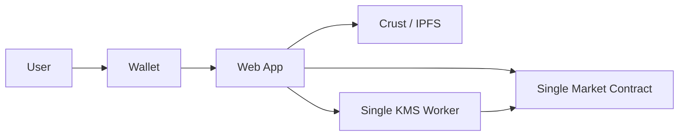
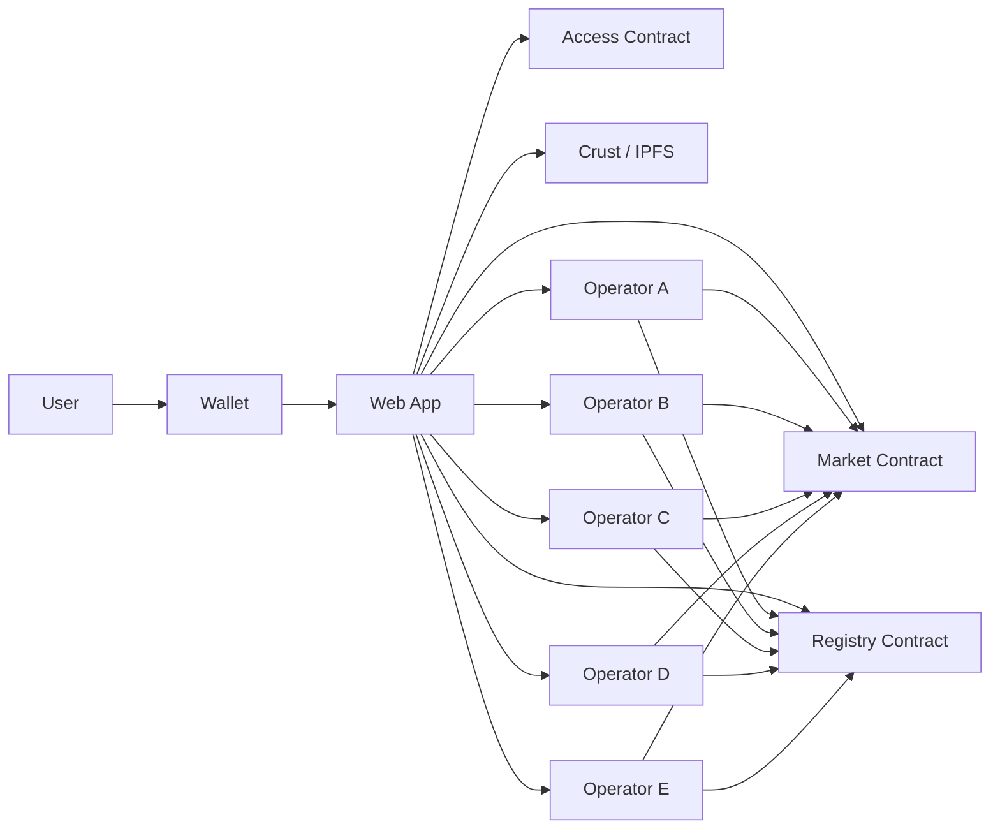
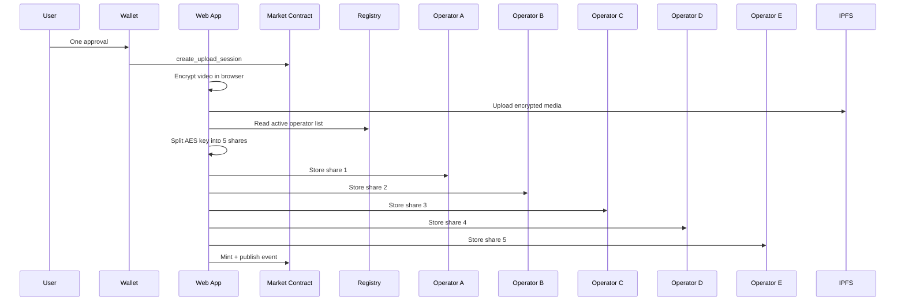
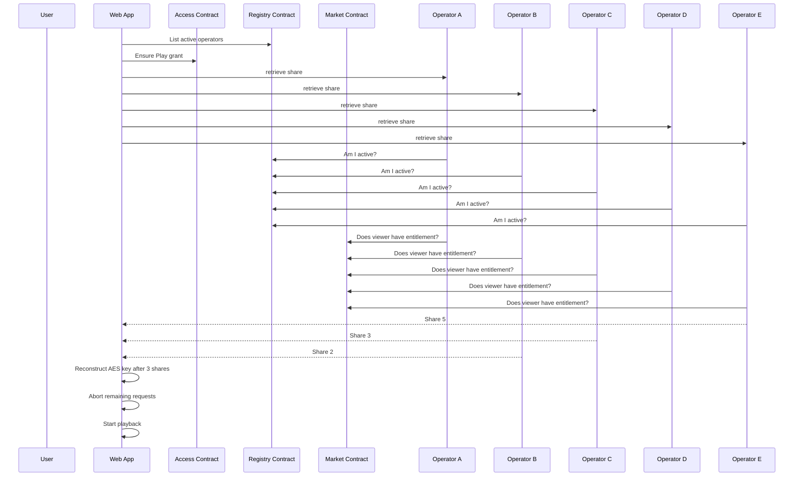
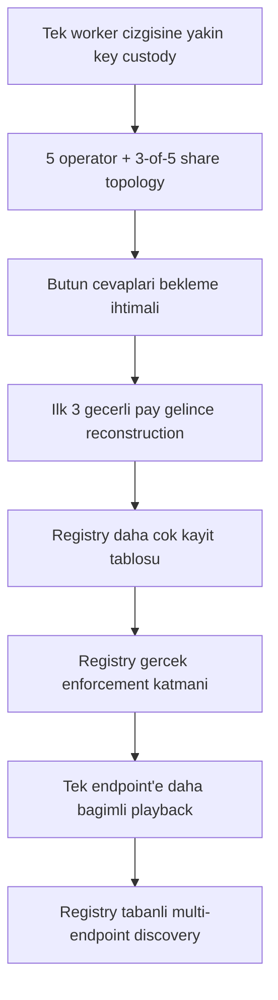

# Final Implementation Report

> YouTick testnet implementation summary for zero-trust access, registry enforcement, and share-based playback

**Date:** March 16, 2026  
**Branch:** `hls-dash-migration-plan`  
**Environment:** Testnet

---

## 1. Kisa Ozet

Bu branch uzerinde YouTick icin su hedefler gerceklestirildi:

- upload akisi tek imza deneyimini koruyacak sekilde tutuldu
- playback yetkisi ve off-chain authorization mantigi daha guclu hale getirildi
- `access` ve `registry` kontratlari testnet'e deploy edildi
- tek KMS worker mantigindan, registry kontrollu cok operatorlu yapıya gecildi
- paylastirilmis anahtar modeli kuruldu
- playback tarafi gercek `share-based reconstruction` ile calisti
- performans iyilestirmesi yapilarak ilk gerekli paylar gelir gelmez oynatma baslatilabilir hale getirildi

Kisa sonucu tek cumlede soylemek gerekirse:

> YouTick testnet ortami artik tek anahtar veren tek worker modelinden cikti; `registry` ile yonetilen, `3-of-5` operator topolojisine dayanan ve anahtari parcalardan yeniden kuran bir playback yapisina gecti.

---

## 2. Canli Testnet Bilesenleri

### 2.1 Canli kontratlar

| Bilesen | Contract ID |
|--------|-------------|
| Market | `dev-1773607954211-252231.v2-0.utick.testnet` |
| Access | `access-1773606802388.v2-0.utick.testnet` |
| Registry | `registry-1773606802388.v2-0.utick.testnet` |

### 2.2 Canli operator endpoint'leri

| Operator | Endpoint |
|---------|----------|
| `kms-a` | `https://youtick-kms-testnet.araafatsum.workers.dev` |
| `kms-b` | `https://youtick-kms-testnet-b.araafatsum.workers.dev` |
| `kms-c` | `https://youtick-kms-testnet-c.araafatsum.workers.dev` |
| `kms-d` | `https://youtick-kms-testnet-d.araafatsum.workers.dev` |
| `kms-e` | `https://youtick-kms-testnet-e.araafatsum.workers.dev` |

### 2.3 Registry canli topoloji

| Ayar | Deger |
|------|-------|
| Active operator count | `5` |
| Threshold | `3-of-5` |
| Active relayer count | `1` |

---

## 3. Son Testlerin Zincir Ustu Durumu

Son testlerde market kontratinda dogrulanan durum:

- toplam event sayisi: `5`
- toplam purchase sayisi: `4`

Son testte dogrulanan event:

| Alan | Deger |
|------|-------|
| `event_cid` | `8b8c9836-6f5f-4251-ac84-4264a3519075` |
| `creator_id` | `soteri.testnet` |
| `price` | `21157000000000000000000` |

Son testte dogrulanan satin alma:

| Alan | Deger |
|------|-------|
| `buyer_id` | `utick.testnet` |
| `creator_id` | `soteri.testnet` |
| `event_cid` | `8b8c9836-6f5f-4251-ac84-4264a3519075` |
| `purchase_type` | `Direct` |

Bu neyi gosteriyor:

- video publish edildi
- satin alma yazildi
- buyer icin entitlement olustu
- playback log'u ile zincir verisi birbiriyle uyumlu

---

## 4. Mimari Once Nasil Calisiyordu

Bu modelde:

- video browser'da sifreleniyordu
- medya IPFS'e gidiyordu
- anahtar pratikte tek KMS worker cizgisine dayaniyordu
- playback sirasinda sahiplik kontrolu zincirden yapilsa da key release noktasi tekil kalabiliyordu

---

## 5. Simdi Nasil Calisiyor

Bu modelde:

- `market` event ve entitlement kaynagi
- `access` session grant kaynagi
- `registry` operator ve relayer kaynagi
- playback `5` operator arasindan en az `3` pay ile aciliyor

---

## 6. Upload Akisi

Upload tarafinda ana yetki modeli `upload session key`.

Bu bilincli bir karar.

Neden?

- upload zaten dar yetkili ve kisa omurlu key ile yapiyor
- tek imza deneyimini koruyor
- gereksiz ikinci popup cikarmiyor

Upload akisinin basit hali:

Bu yapida:

- tam anahtar tek yere yazilmaz
- her operator sadece kendi payini gorur
- upload UX bozulmaz

---

## 7. Playback Akisi

Playback tarafinda ana yetki modeli `session grant + registry + share reconstruction`.

Son testte gordugumuz log:

- `mode: reconstructed`
- `requiredShares: 3`
- `collectedShares: 3`
- `shareIds: [5, 3, 2]`

Bu da su demek:

- playback gercekten paylardan acildi
- tum operatorleri beklemedik
- ilk gelen 3 pay yeterli oldu

---

## 8. Access Contract Ne Icin Var

Access contract'in gorevi:

- kisa omurlu yetki uretmek
- playback gibi off-chain authorisation noktalarina standart cevap vermek

Basitce su soruya cevap verir:

> Bu kullanici bu icerik icin bu anda yetkili mi?

Kullandigi ana alanlar:

- scope
- resource id
- ttl
- origin hash
- device hash

Bu branch'te access contract upload'in ana yolu olmadi.

Bu bilincli bir secim:

- upload icin `upload session key` daha iyi UX verdi
- access contract daha cok playback ve off-chain kontrolu standartlastirdi

---

## 9. Registry Contract Ne Icin Var

Registry contract'in gorevi:

- hangi operator aktif
- hangi relayer aktif
- sistem kacta kac threshold ile calisiyor

Yani registry su soruya cevap verir:

> Kime guvenecegiz ve minimum kac operatorden cevap bekleyecegiz?

Bu branch'te registry artik sadece bir kayit tablosu degil.

Gercek enforcement noktasina donustu:

- KMS worker kendini registry'ye gore dogruluyor
- relayer route registry'ye gore dogrulaniyor
- istemci aktif operator endpoint'lerini registry'den okuyabiliyor

---

## 10. Operatorler Nasil Calisiyor

Operator worker'lar:

- birbirinden ayri Cloudflare Worker endpoint'leri
- registry'de ayri kimliklerle kayitli
- sadece kendi paylarini sakliyorlar
- kendi `OPERATOR_SHARE_SECRET` degerleri ile bu paylari sifreliyorlar

Health ciktisi su bilgileri donduruyor:

- market contract
- access contract
- registry contract
- operator kimligi
- registry'de aktif olup olmadigi
- share mode

Bugun her operator icin:

- `registryOperatorActive = true`
- `shareMode = operator-encrypted-share`

Bu da operatorlerin gercekten canli ve policy altinda oldugunu gosteriyor.

---

## 11. Subaccount ve Hesaplar Ne Ise Yariyor

Bu noktada en cok karistirilan konu bu.

### 11.1 Gercek NEAR account olanlar

Gercek on-chain hesap olanlar:

- `access-1773606802388.v2-0.utick.testnet`
- `registry-1773606802388.v2-0.utick.testnet`
- `v2-0.utick.testnet`
- market contract account

Bunlar:

- zincirde hesap olarak var
- bakiye tasir
- deploy edilirken storage maliyeti olusur
- change method cagrisinda gaz tuketebilir

### 11.2 Registry icindeki operator kimlikleri

`kms-a`, `kms-b`, `kms-c`, `kms-d`, `kms-e` kimlikleri bugun registry identity olarak kullaniliyor.

Bunlarin bugunku rolu:

- operatoru ayirt etmek
- health ve enforcement'ta kimin kim oldugunu soylemek
- payin hangi operatorden geldigini loglamak

Onemli nokta:

- bunlar bugun gercek NEAR account olmak zorunda degil
- bugun bunlarin kendisi icin zincirde bakiye tutulmuyor
- bunlar "operator identity" olarak registry'de var

### 11.3 Relayer hesabi

Bugun aktif relayer:

- `v2-0.utick.testnet`

Bu gercek bir NEAR hesabidir.

Bu hesap:

- change call yaptiginda gaz oder
- trial benzeri sponsorlu akislarda islem maliyetini tasiyabilir

---

## 12. Bu Hesaplarin Maliyeti Var mi?

### Kisa cevap

- `access` ve `registry` kontratlari icin evet
- `operator identity` kayitlari icin bugun hayir
- relayer kullaniliyorsa relayer hesabinin gaz maliyeti var

### Detay

#### Access ve Registry kontratlari

Maliyet kaynaklari:

- hesap acma
- kontrat deploy etme
- state storage
- owner tarafindan yapilan change method cagri gazlari

#### Operator kayitlari

Bugunku operator kayitlari:

- registry state icinde saklanir
- bu state artisi storage maliyeti dogurur
- ama operator identity'nin kendisi ayri bir NEAR bakiye hesabi degildir

Yani:

- registry'ye operator eklemek storage buyutur
- fakat `kms-a...` diye ayri bir zincir hesabi icin otomatik para kilitlenmez

#### Playback sirasinda bakiye dusuyor mu?

Hayir, playback sirasinda:

- market kontrolu `view` ile yapilir
- access grant dogrulamasi `view` ile yapilir
- registry operator kontrolu `view` ile yapilir

Bu tip sorgular kullanici bakiyesinden para dusurmez.

#### Satin alma sirasinda ne olur?

Satin alma bir change method oldugu icin:

- buyer para oder
- creator pay alir
- komisyon ve havuz paylari ayrilir

Bu branch'te son satin alma logunda bunu gorduk:

- `buyer_id = utick.testnet`
- `creator_id = soteri.testnet`

#### Upload sirasinda ne olur?

Upload session acarken:

- kontrata depozit kilitlenir
- mint ve event olusturma masraflari buradan karsilanir

Yani upload tarafindaki on-chain maliyet orada vardir.

Ama playback sirasinda yeni bir NEAR transferi olmaz.

---

## 13. Onceki Duruma Gore Neler Degisti

### En onemli degisimler

- tek worker mantigindan cikildi
- anahtar paylara bolundu
- 5 aktif operator topolojisi kuruldu
- 3 pay yeterli hale geldi
- playback bekleme suresi kisaldi
- operatorler registry enforcement altina alindi
- relayer route registry enforcement altina alindi

---

## 14. Bu Yapinin Avantajlari

- tek operator bozulsa bile sistem tamamen durmaz
- anahtar tek yerde acik sekilde tutulmaz
- playback daha hizli acilabilir
- hangi operatorlerin gecerli oldugunu zincir belirler
- loglardan hangi paylarin geldigi gorulebilir
- upload UX bozulmadan guvenlik seviyesi artar

---

## 15. Dürust Teknik Notlar

Bu branch cok buyuk ilerleme sagladi ama tam bitmis bir son hal degil.

Kalan gercekler:

- operatorler hala ayni Cloudflare ekosisteminde kosuyor
- operator identity'ler bugun gercek NEAR account degil, registry kimligi
- `transport_public_key` tam kanal dogrulamasinda henuz kullanilmiyor
- operator secimi su an "aktif operator listesinden hepsine dene, ilk 3 ile bitir" seklinde
- daha akilli latency tabanli siralama sonraki adim olabilir

---

## 16. Sonuc

Bu branch sonunda YouTick testnet yapisi su noktaya geldi:

- upload zincire dogru yaziyor
- satin alma zincire dogru yaziyor
- entitlement dogru olusuyor
- registry gercek enforcement yapiyor
- 5 aktif operator var
- playback gercek `3-of-5` share reconstruction ile aciliyor
- performans olarak ilk 3 pay gelince oynatma basliyor

Kisa final cumlesi:

> YouTick testnet ortami artik tek worker tabanli playback mantigini astı; registry kontrollu, 5 operatorlu, gercek paylastirilmis anahtar modeliyle calisan ve 3 pay gelir gelmez videoyu acabilen bir yapiya gecti.
