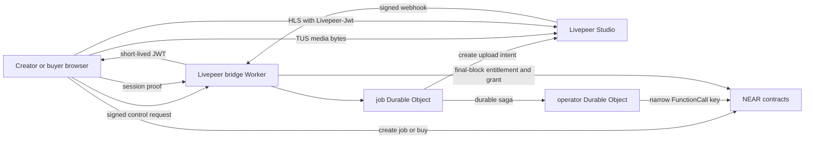

# NEAR + Livepeer Paid Media v1 Implementation Plan

> Status: `DECISION_LOCKED / CONDITIONAL_GO / TESTNET_EVIDENCE_ONLY / RUNTIME_NOT_DEPLOYED`
>
> Initial baseline: `origin/main@c1c59f6a30006492582ab3898b7bba466b9e7f2c`
>
> Delivery model: incremental PR branches from the latest accepted `origin/main`
>
> This is the only active target plan for the paid-media rewrite. The current
> public-alpha runtime remains live until a separately approved cutover.

## 1. Decision and evidence status

| Layer | Decision |
|---|---|
| Livepeer component fit | `GO` |
| Architecture direction | `CONDITIONAL_GO` |
| Implementation progress | `PR_6_LOCAL_CODE_MERGED / WEB_UI_WIRING_MERGED / 32_MIB_PROVIDER_AND_CHROME_EDGE_PASS / TESTNET_PURCHASE_PASS / D6_PACKET_PREPARED` |
| Testnet and staging | `TESTNET_EVIDENCE_PARTIAL / STAGING_NO_GO` |
| Production | `NO_GO` |

This plan locks the architecture boundary and delivery sequence. The earlier
bounded provider receipts prove exact 20 GB TUS length admission without
uploading the 20 GB body; they do not prove full 20 GB processing or billing.
The current product value is fixed 32 MiB sequential TUS PATCHes. An exact
80 MiB provider upload, Chrome/Edge JWT matrix, NEAR testnet finalization and
buyer purchase passed on 2026-08-03. Worker/web exact-SHA deployment, runtime
grant issuance, withdrawal and activation remain unproven.

The input evaluation was reviewed from the local architecture evidence branch
as `near-livepeer-serverless-paid-media-evaluation.md`, SHA-256
`1b676eb620c35ae52357e280cfa3e9e2d0320c49e13b1318aaf118b8cb7de5fa`.
This plan is self-contained because that evidence file was untracked when this
integration branch was created.

## 2. Product scope

The first release supports one paid-video path:

- creator upload from an explicitly supported desktop browser;
- one USDC `ft_transfer_call` to pay the byte-based upload fee and atomically
  create the paid publication job;
- direct browser-to-Livepeer TUS upload with no media bytes in YouTick servers;
- NEAR-native USDC purchase;
- 98% creator and 2% platform settlement;
- ticket price of at least 2 USDC; the creator upload fee is separate from the
  buyer ticket price;
- finalized entitlement plus a short-lived Play grant for playback;
- wallet-free playback-token refresh after the Play grant exists.

The first release does not include:

- gift, trial, sponsored, zero-price, free-publish or managed-guest paths;
- EVM, cross-chain, swaps or one-click payment routes;
- browser encryption, KMS, Lighthouse CID publication or R2 media ingest;
- DRM, Smart TV, 4K/HDR or a second media replica;
- a VM, D1 database or Cloudflare Queue.

These exclusions must not remain as hidden compatibility state in the new ABI,
worker protocol, web flow or release tests.

## 3. Locked architecture



The locked boundaries are:

1. NEAR is the source of truth for jobs, payments, entitlement, grants,
   publication and sale availability.
2. Livepeer sees plaintext and owns ingest, transcode, storage and HLS delivery.
3. The Cloudflare Worker carries control and authorization only. Media request
   bodies must never pass through it, Next.js or a YouTick API.
4. Use one SQLite-backed Durable Object class with named instances, not one
   global object:
   - `job:<network>:<contract>:<job_id>:<generation>`;
   - `admission:<network>:<contract>`;
   - `operator:<network>:<operator_public_key>:<key_epoch>`.
5. There is no cross-object transaction. Job-to-operator work uses a persisted,
   idempotent outbox/saga.
6. The operator uses a finite-allowance FunctionCall key restricted to the
   exact receiver and approved zero-deposit methods. FullAccess is forbidden.
7. The Livepeer upload endpoint is a bearer capability. It is redacted from
   logs and cleared from client persistence after completion, expiry or cancel.
8. Provider hashes are provider-issued fingerprints, not independent byte
   integrity proof.
9. New v1 contract IDs and profile `paid-media-livepeer-v1` are used. Existing
   public-alpha contracts are not migrated in place.

## 4. Trust boundary

| Principal | Capability and exposure | Required containment |
|---|---|---|
| Livepeer Studio | Sees plaintext, stores and serves media, can mutate or delete an asset | JWT from creation, project/token binding, re-fetch, negative playback probes, reconciler and takedown policy |
| Worker deploy authority | Can access Worker secrets | Separate production authority, audit, rotation and least privilege; do not claim HSM custody |
| Livepeer bridge Worker | Can mint playback JWTs and submit provider publication facts | Exact protocol validation, short TTLs, narrow NEAR key, fail closed and immutable audit state |
| Creator browser | Receives one bearer, fixed-length TUS resource and may upload arbitrary bytes within that length | Final-job byte binding, bridge-created resource, one intent per generation, post-upload verification and orphan deletion |
| NEAR RPC provider | Supplies finality, entitlement and grant inputs | Final-block reads, semantic contract re-check, timeout recovery and fail closed |
| NEAR contracts | Authoritative settlement and policy state | Generation binding, global identity uniqueness, idempotency and timelocked recovery |

A compromised bridge must not be able to transfer funds. It may still mint an
unauthorized playback JWT or submit false provider facts within contract
constraints; these are explicit residual risks.

## 5. Authoritative identities and state

Every off-chain record binds:

- network and contract ID;
- job ID and generation;
- creator account;
- profile ID and profile configuration hash;
- expected source bytes;
- Livepeer project identity;
- asset ID hash and playback ID;
- state version and last transition time.

Asset identifiers are stored with domain separation that includes environment,
network, contract and profile. Asset ID and playback ID uniqueness is global,
not merely per job.

### Job state machine

```text
ONCHAIN_AUTHORIZED
  -> INTENT_RESERVED
  -> ASSET_REQUESTING
  -> UPLOAD_READY
  -> UPLOADING
  -> PROCESSING
  -> READY_VERIFIED
  -> FINALIZE_QUEUED
  -> ONCHAIN_PUBLISHED
```

Side states are:

```text
CREATE_AMBIGUOUS
FAILED_RETRYABLE
FAILED_TERMINAL
CANCEL_PENDING
DELETE_PENDING
DELETED
SUSPENDED
```

Every transition defines actor, prerequisite, generation, idempotency key,
timeout, retry limit and compensation. A transient provider or RPC failure must
not irreversibly mark an on-chain job as failed.

Client-reported upload progress is UX evidence only. Provider status and the
final asset re-fetch are authoritative for readiness.

## 6. Upload protocol

1. The browser creates the paid job on NEAR with the exact source byte count.
2. The browser sends a canonical signed request to the bridge.
3. The job object verifies the final on-chain job and reserves the intent before
   calling Livepeer.
4. The Livepeer asset is created with JWT playback policy, fixed profile and
   deterministic routing metadata in the first request.
5. The bridge creates the TUS resource with the final job's exact
   `Upload-Length`, verifies that length and offset `0` with `HEAD`, and returns
   only the opaque resource URL.
6. The browser uploads directly to that fixed-length URL using PATCH; it never
   receives the provider's TUS creation endpoint.
7. Timeout during asset or TUS-resource creation enters `CREATE_AMBIGUOUS`; it
   must not blindly create another asset.
8. The bridge reconciles by deterministic metadata, records one accepted asset
   and deletes provable orphans.

The browser TUS product value is fixed at `chunkSize: 32 * 1024 * 1024` with
`parallelUploads: 1`. PATCH requests to the same resource are strictly
sequential. Only the final PATCH may be smaller; no intermediate PATCH may be
below 5 MiB. Before every resume the client uses HEAD to verify the same opaque
resource's `Upload-Offset` and `Upload-Length`. HTTP 409 is not retried blindly,
and a retry never creates a second asset. This supersedes the historical 8 MiB
workaround and requires the bounded 80 MiB provider/browser canary before any
runtime claim.

The public Livepeer upload documentation checked on 2026-08-03 does not publish
an exact single-file maximum, `expectedBytes`, `maxBytes`, upload URL lifetime
or idempotency key. Absence of a documented maximum is not evidence of unlimited
support. The deployed TUS endpoint,
however, accepted a server-stored `Upload-Length` at resource creation and
rejected a PATCH beyond the completed declared length. Therefore the bridge,
not the browser, creates the resource and verifies the stored length before
returning its opaque URL. An honest UI byte check alone is not a security
boundary.

Exact 20 GB admission has two allowed outcomes:

- Livepeer supplies and the canary proves a pre-upload maximum-length binding;
  then `20_000_000_000` succeeds and one byte more is rejected before provider
  cost.
- No such binding exists; then the product explicitly accepts cost exposure and
  requires creator allowlists, active-intent quota, budget reservation, project
  hard limits, post-upload size enforcement and deletion. The release evidence
  must not claim pre-cost rejection.

The first outcome is selected. On 2026-08-01 Livepeer accepted a zero-offset
TUS resource with `Upload-Length: 20000000000`; a separate one-byte resource
rejected a second byte and retained `Upload-Length: 1`, `Upload-Offset: 1`.
YouTick rejects `20_000_000_001` before any provider request. This closes
pre-upload byte binding, not full 20 GB processing, provider billing, endpoint
lifetime or create-idempotency evidence.

References:

- [Livepeer direct upload guide](https://docs.livepeer.org/developers/guides/upload-video-asset)
- [Livepeer API support matrix](https://docs.livepeer.org/v1/references/api-support-matrix)
- [Livepeer request-upload API](https://docs.livepeer.org/v1/api-reference/asset/upload)
- [TUS 1.0 creation and length contract](https://tus.io/protocols/resumable-upload)

## 7. Webhook and provider readiness

Webhook processing must:

1. read the exact raw body;
2. validate timestamp tolerance and every supported `v1` HMAC signature using
   constant-time comparison;
3. derive a dedup key from signed timestamp, raw-body hash and asset transition;
4. route by deterministic provider metadata to the named job object;
5. tolerate duplicate, unknown and out-of-order events;
6. re-fetch provider state before changing readiness.

A public webhook event ID is not treated as stable unless the provider contract
and captured fixtures prove it.

`READY_VERIFIED` requires:

- `GET /asset/{assetId}` returns the expected asset, project/token ownership,
  creator routing metadata, JWT policy, source size and ready state;
- `GET /playback/{playbackId}` returns the expected playback binding and actual
  outputs;
- HLS, download and static playback without a JWT fail with 401/403;
- a JWT with the wrong key, subject or expiry fails;
- the correct ES256 JWT succeeds through the supported player path.

Provider `hash`, `size` and `videoSpec` are treated as optional until the real
account canary proves otherwise. A provider hash may be stored as optional audit
metadata but does not prove independent integrity. Requested `profiles` do not
replace verification of actual playback outputs.

References:

- [Livepeer webhook verification](https://docs.livepeer.org/v1/developers/guides/setup-and-listen-to-webhooks)
- [Livepeer JWT access control](https://docs.livepeer.org/v1/developers/guides/access-control-jwt)
- [Livepeer Studio OpenAPI](https://github.com/livepeer/docs/blob/main/api/studio.yaml)

## 8. NEAR operator and finality

The operator outbox persists the signed transaction bytes, transaction hash,
nonce and recent block hash before broadcast.

Broadcast rules:

- use final transaction waiting or poll the same transaction hash;
- on timeout, query the existing hash and final semantic contract state before
  signing again;
- never advance from an optimistic response alone;
- use one explicit final block hash when entitlement and Play grant are read
  from separate contracts.

The initial operator key is restricted to:

- `finalize_livepeer_publication`;
- `suspend_livepeer_sales`.

Every call attaches zero deposit. The key uses a finite, monitored allowance.
Resume, bridge rotation and destructive recovery remain governance/timelock
operations.

References:

- [NEAR access keys](https://docs.near.org/protocol/accounts-contracts/access-keys)
- [NEAR transaction RPC](https://docs.near.org/api/rpc/transactions)

## 9. Contract profile

Reuse the paid-only USDC job, entitlement, 98/2 settlement and withdrawal
recovery core already present on the baseline branch. Do not import the earlier
R2/Lighthouse/KMS profile fields.

The Livepeer profile records at minimum:

- job ID, generation, creator and expected source bytes;
- profile ID and configuration hash;
- asset ID hash and playback ID;
- Livepeer project identity hash;
- verified provider source size;
- optional provider source fingerprint;
- ready and published timestamps;
- availability state.

Contract invariants:

- only the configured bridge account may finalize;
- old generations cannot finalize;
- profile, creator and source bytes must match the authorized job;
- asset and playback identities are globally unique;
- an exact finalize replay is idempotent;
- a conflicting replay fails;
- publication identity is immutable;
- new purchases fail immediately while sales are suspended;
- existing entitlement records are never erased by takedown.

Availability is separate from immutable publication:

- `ACTIVE`: sales and playback tokens allowed;
- `SALES_SUSPENDED`: new sales denied; existing entitlement playback allowed;
- `TAKEDOWN`: sales and playback tokens denied; entitlement history retained.

Refund behavior and the authority required to resume sales are Gate 0 product
and governance decisions.

## 10. Playback authorization

The browser signs a canonical request envelope containing:

```text
domain
version
method
route
network
contract
account
resource
session public key
origin
device nonce
expires at
body hash
```

The bridge verifies the Ed25519 session proof, derives the account from the
on-chain grant owner, and reads entitlement plus grant at one final block.

JWT rules:

- ES256/P-256;
- `sub` equals the exact playback ID;
- lifetime is the smaller of the configured 2-5 minute window and remaining
  grant lifetime;
- response is `Cache-Control: no-store`;
- browser storage is memory-only;
- HLS requests use the `Livepeer-Jwt` header;
- query-string tokens remain forbidden unless a separate security decision
  explicitly changes the protocol.

Desktop Chrome and Edge are the initial matrix. Safari/iOS native HLS is not a
supported claim until a real device proves header propagation and refresh.

## 11. P0 decision gates

Production activation and the remaining provider/runtime evidence remain
blocked until the following are
recorded in this plan or a linked ADR/vendor evidence file:

1. Exact upload-length binding, URL lifetime, refresh/revoke and idempotency.
2. Provider filtering or lookup needed to recover ambiguous creates.
3. CORS and 30%/70% browser resume behavior.
4. Guaranteed versus optional asset size, hash and video metadata fields.
5. Actual output-rendition query and JWT-negative access coverage.
6. Deletion timing, retention, DPA, region and SLA.
7. Failed, aborted and retried upload billing behavior plus a project budget
   control.
8. Refund, sale suspension, takedown and resume authority.
9. Supported browser/device matrix.
10. Final method names, allowance budget and rotation authority.

Fail-closed implementation may proceed behind a disabled flag only after the
affected PR's protocol is locked. No P0 uncertainty may be silently converted
to a production assumption.

Current gate ownership:

| P0 scope | Status | Blocks |
|---|---|---|
| Provider upload, recovery, browser, metadata, playback, deletion and billing evidence (1-7) | `PARTIAL / EXACT_LENGTH_BOUND / 15M_IDLE_PASS / ONE_COMPLETED_TUS_TERMINATION_PASS / FINAL_RECOVERY_POST_DELETE_HEAD_OPEN / OTHER_GATES_OPEN`; [commercial/retention public-source review](../evidence/livepeer-commercial-retention-review-2026-08-02.md) leaves P0(6-7) open | Remaining provider-facing PR-3 and PR-4 behavior |
| Refund, takedown and exact resume policy (8) | `LOCKED / LOCAL_TAKEDOWN_IMPLEMENTED / LIVE_GOVERNANCE_AND_REFUND_EVIDENCE_PENDING` | D6 and activation |
| Desktop Chrome and Edge matrix (9) | `LOCKED` | Safari/iOS claims remain excluded |
| Method allowlist and governance/timelock principle (10) | `LOCKED` | None for disabled PR-2 primitives |
| Numeric key allowance and exact governance account (10) | `TESTNET_MEASURED / PRODUCTION_BUDGET_OPEN` | Production key provisioning and deployment |

Accepted 2026-08-01 product and operator decisions:

- Browser, bridge and contract accept decimal `20_000_000_000` bytes and reject
  `20_000_000_001` before provider mutation. The bridge creates and verifies a
  provider TUS resource bound to the accepted length before returning its
  opaque URL. Full 20 GB transfer/processing remains unproven and a 20 GB + 1
  byte provider upload remains forbidden.
- Creator upload control v2 uses a job-bound application Ed25519 key recorded
  atomically by the one USDC or native-NEAR payment transaction. Normal upload
  uses no NEAR account `AddKey`/`DeleteKey` operation. The disabled Worker reads
  the final job and requires the exact unexpired key before provider admission.
  A default-off web caller exists locally, but no runtime flag is enabled, so
  upload remains fail-closed. The local quote source is locked to the Outlayer
  `wrap.near` cached view through the existing NEAR RPC, with no alternate price
  API fallback. Oracle liveness and the measured gas reserve remain separate
  activation gates. The web and Worker native-NEAR creator-fee flags are
  separate, default off and must both be approved before that rail is exposed;
  USDC remains the default rail.
- The separate bridge FunctionCall key is scoped to the exact market and only
  `finalize_livepeer_publication` plus `suspend_livepeer_sales`. Platform
  governance owns key add/remove and rotation; FullAccess is forbidden.
- Sales do not open before provider-ready finalization. Sales suspension blocks
  new purchases while preserving existing playback. Takedown blocks sales and
  playback while preserving entitlement history and an audit record.
- Closed-canary refunds for permanent provider loss or takedown are manual and
  recorded. Only the creator may restart an unpublished job; restart increments
  generation and invalidates older work. Published jobs cannot restart.

Accepted 2026-08-02 cost and endpoint decisions:

- The product assumes Livepeer provides no project hard spend cap and accepts
  the residual provider-cost risk. This is not public runtime activation;
  creator allowlist, local active-intent/create quotas and automatic new-intent
  shutdown remain required before activation.
- No automatic TUS expiry or refresh API is assumed. A bounded canary proved a
  15-minute idle resource, but returned no `Upload-Expires`.
- Asset deletion does not revoke its TUS resource. Cancel, expiry and orphan
  cleanup must explicitly terminate the persisted TUS URL, verify HEAD 404/410,
  then delete the asset and verify asset GET 404/410.
- If a TUS resource disappears, the same generation does not create a new
  asset. The creator must restart with a new generation.

Accepted 2026-08-03 product and economics decisions:

- `20_000_000_000` bytes is a per-file ceiling, not a monthly source quota.
  `20_000_000_001` is rejected before provider mutation.
- The creator upload fee is
  `ceil(source_bytes / 1_000_000_000 * 300_000)` micro-USDC. It is consumed
  only when a new on-chain job is created. Pause/resume, reconciliation and a
  same-job retry do not charge again; a new job does. There is no automatic
  refund.
- The creator may pay that one-time fee with Circle USDC or native NEAR. Native
  NEAR requires a short-lived server-signed quote and a separate NEAR ledger;
  ticket settlement remains USDC-only.
- Ticket price is any integer micro-USDC amount at or above `2_000_000`. The
  existing 98/2 split is unchanged. A future 5% commission is a separate
  product change and is not implemented here.
- Monthly admission is a separate provider-operation dollar budget. Its
  production value is intentionally unset until D6, so runtime admission fails
  closed. The fixed 80 MiB canary is outside public or production quota claims.
- Livepeer transcode, storage and delivery remain minute-based provider costs,
  separate from the byte-based creator fee. The Growth monthly minimum is a
  commercial invoice floor, not a hard cap.

The endpoint receipt is
[the bounded lifetime and revoke evidence](../evidence/livepeer-endpoint-revoke-canary-2026-08-02.md).

The current 32 MiB, fee and bounded live-canary receipt is
[the 32 MiB and fee gate evidence](../evidence/livepeer-32mib-fee-local-gate-2026-08-03.md).

The account, transaction and cleanup receipt is
[the bounded testnet allowance evidence](../evidence/near-livepeer-testnet-allowance-2026-08-01.md).

PR-2 may implement only the disabled persistence, validation, final-read and
outbox primitives. It must not add provider mutation, request-signature bypass,
transaction signing, credentials or deployment while the later gates remain
open.

## 12. Pull request sequence

### PR-0 - Truth, protocol and CI routing

Status: `MERGED` by PR #62 at
`1ee10752ab596fcd0aaf3ac3cbf4f385fec139b5`.

Planned surfaces:

- this plan and its source evaluation;
- `docs/adr/adr-010-livepeer-paid-media.md`;
- superseded v4 contract README truth markers;
- `protocol/paid-media-livepeer-v1/README.md`;
- `protocol/paid-media-livepeer-v1/schema.json`;
- `protocol/paid-media-livepeer-v1/golden-vectors.json`;
- `scripts/check-paid-media-livepeer-v1.mjs`;
- documentation and protocol changed-file routes in CI.

Acceptance:

- one canonical target and no conflicting `TARGET` document;
- docs build and link checks pass;
- schema and golden vectors pass;
- `git diff --check` passes;
- no runtime, contract or deploy change.

Stop for review before PR-1.

### PR-1 - Contract and ABI

Status: `MERGED` by PR #63 at
`c4b235bfc55111ca0d25c1be13f851c6125ec43f`.

Planned surfaces:

- `contracts/nft-ticket/src/` and focused Livepeer profile tests;
- `contracts/access-control/src/lib.rs` only if the playback view must expose
  remaining grant lifetime;
- ABI checker, contract README and focused CI routes.

Acceptance:

- wrong bridge, generation, profile, creator and source size fail;
- asset/playback reuse across jobs fails;
- exact replay succeeds without duplicate state;
- conflicting replay fails;
- old KMS/CID publication fields are absent from the new profile ABI;
- fmt, clippy, contract build, unit, sandbox and ABI checks pass.

Stop for review before PR-2.

### PR-2 - Disabled control plane foundation

Status: `MERGED / HARD_DISABLED / NOT_DEPLOYED` by PR #64 at
`298e9395225a7f6c5473810454615bee2e92e096`. Focused persistence,
concurrency, outbox, redaction, type and Worker dry-run checks pass.

Create `workers/livepeer-bridge` with Worker routing, SQLite Durable Object
state, protocol validation, NEAR final reads and persisted outbox primitives.
Provider mutation and deployment remain disabled.

Acceptance:

- restart and object eviction preserve state;
- concurrent intent reservation accepts one winner;
- duplicate outbox work is idempotent;
- external fetch interleaving cannot skip reservation state;
- secrets, TUS URLs and signed transactions are redacted from logs.

Stop for review before PR-3.

### PR-3 - Livepeer upload and provider canaries

Status: `CODE_ONLY_PARTIAL / WEB_JOB_KEY_LIFECYCLE_LOCAL / WEB_UI_WIRING_LOCAL / EXACT_LENGTH_BOUND / HISTORICAL_8_MIB_BROWSER_PASS / CURRENT_32_MIB_AND_80_MIB_LIVE_PASS / BROWSER_RESTART_OPEN / RUNTIME_NOT_DEPLOYED`
as updated on 2026-08-04. JWT intent creation and delete/not-found cleanup pass in the
dedicated Sandbox project. The first approved Chrome run reproduced a deployed
S3 offset bug with 1 MiB chunks: HEAD omitted the incomplete part, the next
PATCH returned HTTP 409 and retries remained at zero. Livepeer's deployed
Studio revision resolves the affected `@tus/s3-store@1.0.0`; upstream fixed the
exact bug and added sub-5 MiB regression coverage in `1.0.1`.

A second explicitly approved historical Chrome run used the then-current fixed
8 MiB product default on an exact 20 MiB synthetic source. Reloads at 8 MiB (40%) and 16 MiB
(80%) returned the correct HEAD offsets and uploaded only the missing bytes;
the final 4 MiB completed successfully. Cleanup returned delete HTTP 204,
post-delete GET HTTP 404 and authenticated inventory `0`. Provider remediation
and supported mitigation remain tracked in
[Studio issue #2352](https://github.com/livepeer/studio/issues/2352). Chrome
restart therefore passes under the 8 MiB workaround. A later exact 20 MiB
network canary proved CORS, an unknown opaque endpoint returning 404, a
five-minute idle window preserving the 8 MiB offset and recovery after a live
HTTPS PATCH disconnect. The provider committed no partial progress from the
interrupted PATCH, so HEAD remained authoritative and only the missing bytes
were resent. Desktop Edge, device sleep/wake, a contractual endpoint
lifetime and full 20 GB processing remain open. A later one-byte canary extended
idle evidence to 15 minutes and proved that asset deletion does not revoke the
TUS resource; explicit TUS DELETE does. A new provider mutation requires renewed
asset-budget approval. See
[the bounded provider receipt](../evidence/livepeer-provider-canary-2026-08-01.md).

That 8 MiB evidence is historical and does not prove the current 32 MiB value.
The disabled implementation now includes the signed upload-intent route,
same-final-block creator access-key proof, atomic nonce consumption, one-create
Durable Object state, JWT provider request, bridge-created exact-length TUS
resource, and the browser `tus-js-client` flow. The browser fixes `chunkSize`
at 32 MiB, uses one sequential request, accepts a smaller final chunk, resumes only the bridge-provided fixed
resource URL and does not retry HTTP 409 offset conflicts. `CREATE_PENDING` and
`CREATE_AMBIGUOUS` never create a second asset.
No runtime was enabled. The later bounded network/endpoint canary created one
zero-media probe asset and one 20 MiB media-bearing asset; both were deleted and
the authenticated project inventory returned to `0`.
The web library now implements testnet-only per-job key provisioning and
post-intent removal, including retry-safe deletion failure handling. A local,
default-off upload form binds job creation, intent and direct TUS upload to one
persisted job ID; it does not enable runtime. Production key allowance,
rotation and budget controls plus the mandatory provider P0 evidence remain
activation gates. The bounded testnet allowance receipt does not enable runtime.

Add the Livepeer client, upload-intent route, `tus-js-client` browser flow,
device-key request signing and focused UI tests. Do not port the R2 upload path.

Acceptance:

- exact byte behavior follows the selected P0 outcome;
- the exact 80 MiB canary uses 32 + 32 + 16 MiB and resumes from the same opaque
  resource after the first and second non-final boundaries, uploading only
  missing data;
- sleep, network loss and browser restart are covered;
- CORS and endpoint lifetime are measured;
- ambiguous create recovery and orphan cleanup pass;
- no media byte enters YouTick infrastructure;
- feature flag remains disabled while any mandatory provider canary is open.

Stop for review before PR-4.

### PR-4 - Webhook, verification and NEAR finalize

Status: `MERGED / HARD_DISABLED / NOT_DEPLOYED` on 2026-08-02. PR #66 was
squash-merged as `origin/main@e61ddb1f8e6d93e819435008c701356c6ccf0457` after
all scoped GitHub checks passed. No runtime was enabled by the merge.
The Worker verifies the exact raw webhook body and timestamp, digest-deduplicates
provider transitions, re-fetches asset and playback state, runs JWT-negative
HLS/MP4/download probes, and fails closed on project, API token name, policy,
playback and source-size drift. The named operator object persists nonce, recent
block hash, signed transaction bytes and transaction hash before broadcast; a
retry queries the same hash and accepts completion only when the final
`get_publication` view matches the submitted tuple. Focused tests cover duplicate,
unknown and out-of-order events, provider identity drift, crash-after-sign state,
timeout-after-broadcast recovery, two parallel jobs and conflicting final chain
state. The route and provider mutation remain disabled; no real webhook, NEAR
finalize, deployment or activation is claimed.

Add raw-body webhook verification, digest dedup, provider re-fetch, playback
negative probes, operator outbox and final NEAR transaction recovery.

Acceptance:

- duplicate, unknown and out-of-order webhooks are safe;
- wrong project, token identity, policy, playback or size fails closed;
- crash-after-sign and timeout-after-broadcast do not duplicate finalization;
- nonce contention and two parallel jobs recover;
- final chain view matches the submitted publication tuple.

Stop for review before PR-5.

### PR-5 - Playback

Status: `MERGED / CODE_ONLY_COMPLETE / WEB_UI_WIRING_LOCAL /
CANONICAL_CHROME_EDGE_CANARY_PASS / HARD_DISABLED / NOT_DEPLOYED` as updated on
2026-08-04.
PR #67 was squash-merged as
`origin/main@4afd0160d851bcfc85ae2733fbab3641941ed927`; its scoped Web, Docs,
Livepeer Protocol, Livepeer Bridge Worker and CI Gate checks passed. This is
source-integration evidence only and did not deploy or enable the runtime.

The disabled implementation adds the signed `/v1/playback-tokens` route. The
job Durable Object verifies the session signature and atomically consumes its
nonce, then reads the publication at finality and performs entitlement, grant
and grant-verification reads at that exact block hash. Account, Play scope,
resource, origin, device, generation and playback bindings fail closed. A valid
grant produces a 2-5 minute, grant-expiry-bounded ES256 Livepeer JWT returned
with `Cache-Control: no-store`.

The browser player keeps the Play grant and rotating JWT in memory, attaches
the JWT only as the `Livepeer-Jwt` HLS request header and refreshes without a
wallet prompt. A default-off `/watch?job=<job_id>` path now reads the v1
publication and entitlement, provisions the existing Play grant and passes the
bound publication tuple into the player. There is no v1 discover index, so this
is a closed-D6 deep link rather than a public catalog path. Unit tests cover the
authorization failure matrix, same-final-block reads, JWT claims/signature,
nonce replay, grant-bounded expiry, header-only delivery, in-memory refresh and
malformed responses. Real JWT-free/malformed provider denial and successful
Chrome/Edge playback were mandatory provider canary evidence and passed in the
bounded 2026-08-03 run described below. Runtime-issued grant/token playback and
deployment remain open.

The first explicitly approved Sandbox playback canary reached a JWT-free HLS
probe that returned HTTP `200`, then stopped before correct-token, refresh,
Chrome or Edge checks. A later code audit found that it used an HLS URL selected
from provider `meta.source`, whereas the product uses the canonical
`playback.livepeer.studio/asset/hls/{playbackId}/index.m3u8` route. That first
result remains inconclusive for the product route; its asset and temporary
signing-key inventories returned `0`, while its immediate TUS `HEAD` still
returned `200` after `DELETE`.

A separately approved, one-asset canonical rerun then verified `jwt` policy on
the returned asset and playback records but received HTTP `200` for an anonymous
request to the canonical product HLS route. It stopped before MP4/download,
malformed, wrong-key, wrong-subject, expired, correct-token, refreshed-token or
Chrome/Edge checks. The post-run authenticated inventories were again `0` assets
and `0` signing keys. A later read-only baseline showed the same canonical route
returns HTTP `200` with an HLS error manifest for a nonexistent playback ID.
Therefore the completed status-only probe is inconclusive, not proof of exposed
playback. For an HTTP `200` HLS response, the local canary treats only a
non-playable HLS error manifest as denial; HTTP `401`/`403` already count as
denial. It requires a playable HLS manifest for correct-token success; when a
top-level HLS manifest is playable, it makes JWT-free, manual-redirect probes of
every recognized first-level variant or media segment (at most 32); an
unrecognized URI attribute fails closed. It records only redacted
status/class/kind/count evidence. The canary now checks both the
canonical product HLS route and every provider-reported top-level HLS output;
the hard-disabled Worker independently checks the same set. MP4 and download
remain anonymous-boundary checks. No further asset may be created without a new
approval. At that point the updated harness still needed a real provider rerun;
the later 2026-08-03 bounded result below supersedes this historical gate. See the
[inconclusive bounded playback evidence](../evidence/livepeer-playback-canary-2026-08-02.md)
and the [canonical status-only rerun](../evidence/livepeer-playback-canonical-canary-2026-08-02.md).
The local rerun harness now uses a one-time loopback challenge and launches the
installed Chrome and Edge executables itself; its receipt is no longer accepted
from arbitrary local POST data. This is test-harness hardening only, not a new
provider or browser-playback result.

Livepeer documents that a VOD playback response can contain multiple MP4 and
HLS sources, including source URLs whose path carries a recording ID rather than
the playback ID. The Worker and canary therefore accept up to 16 provider source
records, require at least one HLS and one canonical 1280x720 MP4 rendition,
validate every distinct HLS/MP4 URL against an allowlisted Livepeer domain set
(including `.lp-playback.studio` subdomains), and test every such URL for
anonymous access. `text/vtt` thumbnail sources are also
modeled: each VTT must deny anonymous access, be read with a correct short-lived
JWT, yield at most 32 trusted thumbnail references, and each image must deny
anonymous access. A duplicate URL is probed once. Any other source type,
untrusted thumbnail reference or limit breach fails closed. This v1 policy keeps
thumbnails inside paid media; a public preview would require a separate product
decision. The browser receipt now requires at least one JWT-header request in
both the initial and refreshed playback rounds. Browser XHR redirect handling
remains a real Chrome/Edge canary gate; it has no local `redirect: 'manual'`
substitute. See Livepeer's
[multiple-source playback response](https://docs.livepeer.org/v1/developers/guides/playback-an-asset)
and [thumbnail VTT response](https://docs.livepeer.org/v1/developers/guides/thumbnails-vod).

The most recent approved one-asset attempt reached a ready JWT-policy asset and
observed HLS, three 1280x720 MP4 outputs and `text/vtt`. The then-current harness
did not model VTT, so it stopped at `playback_canary_outputs_missing` before any
anonymous, malformed, correct or refreshed JWT probe and before Chrome or Edge.
Its TUS `DELETE` returned `204`, but five subsequent `HEAD` requests remained
`200`; automatic cleanup therefore left the asset untouched. Under the already
approved asset-deletion authority, controlled recovery then returned asset
`DELETE` `204` and follow-up `GET` `404`; the authenticated inventories were `0`
assets and `0` signing keys. That proves asset/key cleanup only, not TUS
capability termination. Before a future playback-canary run uploads any bytes,
the revised canary now requires a trusted-endpoint `OPTIONS` response to advertise
`termination` and either standard `Tus-Version: 1.0.0` or the exact known
Livepeer legacy signature `204` plus `Tus-Resumable: 1.0.0`; this is a necessary precondition, not deletion
proof. The freshly approved corrected rerun passed local media and Chrome/Edge
executable preflight, then stopped because the successful TUS `OPTIONS` response
did not advertise version `1.0.0`. It created no TUS resource, sent no media
bytes and ran no JWT or browser probe. Post-run authenticated inventories were
again `0` assets and `0` signing keys. That one-asset authorization is consumed;
the local canary now accepts only the exact source-verified legacy discovery
signature and records its source separately. At that point a further real rerun
needed fresh explicit approval and completed-resource termination proof.
The former TUS-resume, network-endpoint and browser-upload CLI runners are
retired because they could delete an asset without proving TUS capability
termination; their earlier results remain historical bounded evidence only.
See the [VTT/TUS gate evidence](../evidence/livepeer-playback-vtt-gate-2026-08-02.md).

An earlier separately approved full Sandbox attempt reached the browser step, then
returned `browser_canary_playback_failed`. Direct post-run inventories were `0`
assets and `0` signing keys. Investigation found a local harness bug: an unset
page state was incorrectly treated as a completed state, so no browser playback
was actually measured and Edge did not run. The corrected harness starts in
`running`, waits only for `pass` or `fail`, and reports only a redacted failure
class. Its local read-only nonexistent-ID check now reaches that terminal class.
This correction is not a provider or browser result; one new explicitly approved
asset was required to rerun the actual Chrome/Edge matrix. See the
[invalid browser attempt evidence](../evidence/livepeer-playback-browser-canary-2026-08-02.md).

The corrected 2026-08-03 run proved an exact 80 MiB provider-ready asset and
the full Chrome/Edge matrix. The local harness defects were a CSP that omitted
hls.js's `blob:` MediaSource and premature/misclassified `video.play()` errors.
Both browsers denied anonymous, malformed, wrong-key, wrong-subject and expired
JWTs, then played correct and refreshed JWTs without persistent storage. The
testnet creator fee, finalization and buyer purchase also passed; sales were
suspended and provider inventories returned to zero. See
[the testnet execution receipt](../evidence/livepeer-testnet-e2e-2026-08-03.md).
This bounded harness pause/resume does not prove a real page reload, browser
restart or device sleep/wake at the current 32 MiB value; those PR-3 acceptance
items remain open for the wired product flow.

Add the session-proof token endpoint and Livepeer player path.

Acceptance:

- wrong account, resource, origin, device, generation or playback ID fails;
- expired and revoked grants fail;
- JWT-free and malformed JWT playback fails;
- correct playback refreshes without a wallet popup;
- tokens are short-lived, no-store and absent from persistent browser storage;
- the supported device matrix passes real playback.

Stop for review before PR-6.

### PR-6 - Reconciler, operations and testnet E2E

Status: `LOCAL_DISABLED_COMPLETE / WEB_UI_WIRING_LOCAL / D1-D5_LOCAL_CODE_AND_TESTS_COMPLETE /
TESTNET_UPLOAD_FINALIZE_BUY_PARTIAL / LIVE_GOVERNANCE_ROTATION_AND_ACTIVATION_GATES_OPEN /
RUNTIME_NOT_DEPLOYED` as updated on 2026-08-04.

The approved disabled implementation now adds per-job alarms, fail-closed drift
state, the idempotent sales-suspension executor, fixed-name creator admission,
local quotas/budget closure, separate governance takedown state and rotation
overlap boundaries. Non-ready webhooks only schedule a provider re-read; they
do not directly mutate provider or chain state. Initial publication remains
source-enforced as `ACTIVE`, and the bridge FunctionCall allowlist remains
limited to finalization and sales suspension.

The [PR-6 completion audit](near-livepeer-pr6-decision-gates.md#tamamlama-denetimi)
classifies D1-D2 and D5 as locally complete, D3-D4 as partial and D6/PR-7 as
missing and unauthorized. In particular, local contract tests do not prove a
real 2/3 multisig/timelock, and a rotation runbook is not a live rotation
rehearsal. The disabled D5 operation requires a configured operator identity,
secret authentication, exact closure binding, a redacted incident/evidence hash
and an idempotency key; no production identity or secret is recorded here.

The bounded 2026-08-03 testnet continuation was separately approved and did not
authorize Worker/web deployment or runtime activation. Any further deploy, key,
funding, USDC or provider/NEAR mutation still requires explicit approval. The
[PR-6 decision packet](near-livepeer-pr6-decision-gates.md) records the
approved D1-D5 values and local evidence. The linked
[D6 execution packet](near-livepeer-d6-execution-packet.md) now pins the
remaining bounded values, but it is not runtime authority.

Add asset/policy drift reconciliation, sale suspension, evidence schema,
rotation and outage runbooks, exact-SHA testnet deployment and one real paid
upload/buy/watch/withdraw flow.

Acceptance:

- upload, ready, finalize, USDC purchase, entitlement, grant, HLS and withdrawal
  pass against real providers;
- provider, NEAR RPC and Worker outages fail closed and recover;
- API token, webhook secret, JWT key and NEAR key rotation are rehearsed;
- takedown and sale suspension preserve the selected product policy;
- cost, retention and deletion evidence is recorded;
- deployed contract, Worker and web artifacts match the approved SHA.

Stop for explicit activation approval.

### PR-7 - Controlled cutover and legacy cleanup

Use fresh v1 contract IDs, run at least a 72-hour closed canary and activate the
public path only after separate approval. Remove R2/Lighthouse/KMS paid-media
target code only after its last consumer is inventoried and gone.

No destructive clear-state operation belongs to normal application delivery.

## 13. Cost and capacity gate

The provider list price is an input, not a budget proof. The cost model must
include:

- source duration and requested rendition multiplication;
- storage duration;
- delivered viewer minutes;
- failed, aborted and repeated uploads;
- orphan retention and deletion delay;
- Durable Object requests, storage and alarms;
- NEAR RPC reads per JWT refresh;
- NEAR transaction gas and FunctionCall key allowance;
- monitoring and operational response.

At a 2-5 minute JWT lifetime, entitlement and grant reads scale with viewer
session length. The load test and budget must use expected concurrent viewers,
not only the number of uploaded assets.

Provider commercial terms, retention and billing must be captured as dated
evidence before production approval. The dated
[public-source review](../evidence/livepeer-commercial-retention-review-2026-08-02.md)
records the pricing input and the still-open written provider/legal evidence; it
does not close P0(6) or P0(7).

The current public Growth prices checked on 2026-08-03 are $0.33 per 60
transcoded minutes, $0.09 per 60 stored minutes per month and $0.03 per 60
delivered minutes, with a $100 monthly minimum. Before/after provider usage and
the source duration are required to record actual and estimated cost for the
80 MiB canary. Two files with the same byte count may have different durations
and provider cost; they still have the same creator upload fee because no
duration surcharge exists.

The product decision assumes there is no provider-enforced project hard cap
and accepts that residual risk. Local controls reduce exposure but are not a
provider hard cap. Before activation the bridge must enforce an explicit
creator allowlist, bounded active intents and provider creates, a configured
local budget threshold and automatic rejection of new intents after the first
limit is reached.

- [Livepeer pricing](https://livepeer.studio/pricing)
- [Outlayer price oracle](https://price-oracle.outlayer.ai/docs/)
- [Pyth Core NEAR support notice](https://docs.pyth.network/price-feeds/core/contract-addresses/near)

## 14. Evidence and release rules

Evidence layers remain separate:

1. local/static checks;
2. exact-SHA CI;
3. provider canary;
4. NEAR testnet and real USDC flow;
5. exact-SHA staging/runtime activation;
6. closed production canary;
7. public production activation.

A docs build, green PR, Worker health response or provider asset alone cannot
prove deployment, payment, playback or production readiness.

## 15. Stop conditions

Stop the affected phase when any of these is true:

- media bytes pass through Next.js, a YouTick API or Worker;
- exact provider behavior is assumed instead of canary-tested;
- the asset is created without JWT policy;
- an ambiguous provider create is blindly retried;
- provider webhook verification does not use the signed raw body;
- optional provider fields are treated as guaranteed;
- provider hash is described as independent integrity proof;
- different final blocks are used for one playback decision;
- signed transaction state is not persisted before broadcast;
- the operator key can attach deposit, call unrelated methods or move funds;
- an old generation or conflicting replay can publish;
- a mutable provider asset is represented as permanently available;
- local or CI success is presented as deployed or live capability;
- branch scope includes an unrelated worktree or bulk historical merge.

## 16. Branch and change-control rule

- Base every implementation PR on the latest accepted `origin/main`.
- Treat `agent/current-youtick-architecture-final` as decision and evidence
  history, not a wholesale merge source.
- Port only reviewed files and hunks required by the current PR.
- Do not use `git add -A` in a mixed worktree.
- Stop after each PR acceptance gate and obtain explicit approval for the next
  phase or any deploy.
