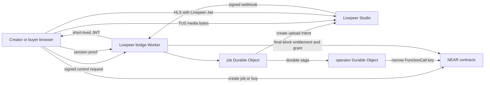

# NEAR + Livepeer Paid Media v1 Implementation Plan

> Status: `DECISION_LOCKED / CONDITIONAL_GO / NOT_DEPLOYED`
>
> Initial baseline: `origin/main@c1c59f6a30006492582ab3898b7bba466b9e7f2c`
>
> Delivery model: incremental PR branches from the latest accepted `origin/main`
>
> This is the only active target plan for the paid-media rewrite. The current
> public-alpha runtime remains live until a separately approved cutover.

## 1. Decision and evidence status

| Layer | Decision |
|---|---|
| Livepeer component fit | `GO` |
| Architecture direction | `CONDITIONAL_GO` |
| Implementation progress | `PR_2_MERGED / PR_3_PROVIDER_CANARY_PARTIAL` |
| Testnet and staging | `NO_GO` |
| Production | `NO_GO` |

This plan locks the architecture boundary and delivery sequence. It does not
prove that Livepeer accepts an exact 20 GB source without cost exposure, that a
supported browser can resume a real upload, that NEAR testnet finalization
works, or that any runtime has been deployed.

The input evaluation was reviewed from the local architecture evidence branch
as `near-livepeer-serverless-paid-media-evaluation.md`, SHA-256
`1b676eb620c35ae52357e280cfa3e9e2d0320c49e13b1318aaf118b8cb7de5fa`.
This plan is self-contained because that evidence file was untracked when this
integration branch was created.

## 2. Product scope

The first release supports one paid-video path:

- creator upload from an explicitly supported desktop browser;
- one wallet transaction to create the paid publication job;
- direct browser-to-Livepeer TUS upload with no media bytes in YouTick servers;
- NEAR-native USDC purchase;
- 98% creator and 2% platform settlement;
- finalized entitlement plus a short-lived Play grant for playback;
- wallet-free playback-token refresh after the Play grant exists.

The first release does not include:

- gift, trial, sponsored, zero-price, free-publish or managed-guest paths;
- EVM, cross-chain, swaps or one-click payment routes;
- browser encryption, KMS, Lighthouse CID publication or R2 media ingest;
- DRM, Smart TV, 4K/HDR or a second media replica;
- a VM, D1 database or Cloudflare Queue.

These exclusions must not remain as hidden compatibility state in the new ABI,
worker protocol, web flow or release tests.

## 3. Locked architecture



The locked boundaries are:

1. NEAR is the source of truth for jobs, payments, entitlement, grants,
   publication and sale availability.
2. Livepeer sees plaintext and owns ingest, transcode, storage and HLS delivery.
3. The Cloudflare Worker carries control and authorization only. Media request
   bodies must never pass through it, Next.js or a YouTick API.
4. Use one SQLite-backed Durable Object class with named instances, not one
   global object:
   - `job:<network>:<contract>:<job_id>:<generation>`;
   - `operator:<network>:<operator_public_key>:<key_epoch>`.
5. There is no cross-object transaction. Job-to-operator work uses a persisted,
   idempotent outbox/saga.
6. The operator uses a finite-allowance FunctionCall key restricted to the
   exact receiver and approved zero-deposit methods. FullAccess is forbidden.
7. The Livepeer upload endpoint is a bearer capability. It is redacted from
   logs and cleared from client persistence after completion, expiry or cancel.
8. Provider hashes are provider-issued fingerprints, not independent byte
   integrity proof.
9. New v1 contract IDs and profile `paid-media-livepeer-v1` are used. Existing
   public-alpha contracts are not migrated in place.

## 4. Trust boundary

| Principal | Capability and exposure | Required containment |
|---|---|---|
| Livepeer Studio | Sees plaintext, stores and serves media, can mutate or delete an asset | JWT from creation, project/token binding, re-fetch, negative playback probes, reconciler and takedown policy |
| Worker deploy authority | Can access Worker secrets | Separate production authority, audit, rotation and least privilege; do not claim HSM custody |
| Livepeer bridge Worker | Can mint playback JWTs and submit provider publication facts | Exact protocol validation, short TTLs, narrow NEAR key, fail closed and immutable audit state |
| Creator browser | Receives a bearer TUS endpoint and can ignore UI limits | Allowlist, quota, reservation, provider budget, source-size verification and orphan deletion |
| NEAR RPC provider | Supplies finality, entitlement and grant inputs | Final-block reads, semantic contract re-check, timeout recovery and fail closed |
| NEAR contracts | Authoritative settlement and policy state | Generation binding, global identity uniqueness, idempotency and timelocked recovery |

A compromised bridge must not be able to transfer funds. It may still mint an
unauthorized playback JWT or submit false provider facts within contract
constraints; these are explicit residual risks.

## 5. Authoritative identities and state

Every off-chain record binds:

- network and contract ID;
- job ID and generation;
- creator account;
- profile ID and profile configuration hash;
- expected source bytes;
- Livepeer project identity;
- asset ID hash and playback ID;
- state version and last transition time.

Asset identifiers are stored with domain separation that includes environment,
network, contract and profile. Asset ID and playback ID uniqueness is global,
not merely per job.

### Job state machine

```text
ONCHAIN_AUTHORIZED
  -> INTENT_RESERVED
  -> ASSET_REQUESTING
  -> UPLOAD_READY
  -> UPLOADING
  -> PROCESSING
  -> READY_VERIFIED
  -> FINALIZE_QUEUED
  -> ONCHAIN_PUBLISHED
```

Side states are:

```text
CREATE_AMBIGUOUS
FAILED_RETRYABLE
FAILED_TERMINAL
CANCEL_PENDING
DELETE_PENDING
DELETED
SUSPENDED
```

Every transition defines actor, prerequisite, generation, idempotency key,
timeout, retry limit and compensation. A transient provider or RPC failure must
not irreversibly mark an on-chain job as failed.

Client-reported upload progress is UX evidence only. Provider status and the
final asset re-fetch are authoritative for readiness.

## 6. Upload protocol

1. The browser creates the paid job on NEAR with the exact source byte count.
2. The browser sends a canonical signed request to the bridge.
3. The job object verifies the final on-chain job and reserves the intent before
   calling Livepeer.
4. The Livepeer asset is created with JWT playback policy, fixed profile and
   deterministic routing metadata in the first request.
5. The browser uploads directly to the returned TUS endpoint.
6. Timeout during asset creation enters `CREATE_AMBIGUOUS`; it must not blindly
   create another asset.
7. The bridge reconciles by deterministic metadata, records one accepted asset
   and deletes provable orphans.

The public Livepeer API does not currently document a server-bound
`expectedBytes`, `maxBytes`, upload URL lifetime or idempotency key. Therefore
an honest UI byte check is not a security boundary.

Exact 20 GB admission has two allowed outcomes:

- Livepeer supplies and the canary proves a pre-upload maximum-length binding;
  then `20_000_000_000` succeeds and one byte more is rejected before provider
  cost.
- No such binding exists; then the product explicitly accepts cost exposure and
  requires creator allowlists, active-intent quota, budget reservation, project
  hard limits, post-upload size enforcement and deletion. The release evidence
  must not claim pre-cost rejection.

References:

- [Livepeer direct upload guide](https://docs.livepeer.org/v1/developers/guides/upload-video-asset)
- [Livepeer API support matrix](https://docs.livepeer.org/v1/references/api-support-matrix)
- [Livepeer request-upload API](https://docs.livepeer.org/v1/api-reference/asset/upload)

## 7. Webhook and provider readiness

Webhook processing must:

1. read the exact raw body;
2. validate timestamp tolerance and every supported `v1` HMAC signature using
   constant-time comparison;
3. derive a dedup key from signed timestamp, raw-body hash and asset transition;
4. route by deterministic provider metadata to the named job object;
5. tolerate duplicate, unknown and out-of-order events;
6. re-fetch provider state before changing readiness.

A public webhook event ID is not treated as stable unless the provider contract
and captured fixtures prove it.

`READY_VERIFIED` requires:

- `GET /asset/{assetId}` returns the expected asset, project/token ownership,
  creator routing metadata, JWT policy, source size and ready state;
- `GET /playback/{playbackId}` returns the expected playback binding and actual
  outputs;
- HLS, download and static playback without a JWT fail with 401/403;
- a JWT with the wrong key, subject or expiry fails;
- the correct ES256 JWT succeeds through the supported player path.

Provider `hash`, `size` and `videoSpec` are treated as optional until the real
account canary proves otherwise. A provider hash may be stored as optional audit
metadata but does not prove independent integrity. Requested `profiles` do not
replace verification of actual playback outputs.

References:

- [Livepeer webhook verification](https://docs.livepeer.org/v1/developers/guides/setup-and-listen-to-webhooks)
- [Livepeer JWT access control](https://docs.livepeer.org/v1/developers/guides/access-control-jwt)
- [Livepeer Studio OpenAPI](https://github.com/livepeer/docs/blob/main/api/studio.yaml)

## 8. NEAR operator and finality

The operator outbox persists the signed transaction bytes, transaction hash,
nonce and recent block hash before broadcast.

Broadcast rules:

- use final transaction waiting or poll the same transaction hash;
- on timeout, query the existing hash and final semantic contract state before
  signing again;
- never advance from an optimistic response alone;
- use one explicit final block hash when entitlement and Play grant are read
  from separate contracts.

The initial operator key is restricted to:

- `finalize_livepeer_publication`;
- `suspend_livepeer_sales`.

Every call attaches zero deposit. The key uses a finite, monitored allowance.
Resume, bridge rotation and destructive recovery remain governance/timelock
operations.

References:

- [NEAR access keys](https://docs.near.org/protocol/accounts-contracts/access-keys)
- [NEAR transaction RPC](https://docs.near.org/api/rpc/transactions)

## 9. Contract profile

Reuse the paid-only USDC job, entitlement, 98/2 settlement and withdrawal
recovery core already present on the baseline branch. Do not import the earlier
R2/Lighthouse/KMS profile fields.

The Livepeer profile records at minimum:

- job ID, generation, creator and expected source bytes;
- profile ID and configuration hash;
- asset ID hash and playback ID;
- Livepeer project identity hash;
- verified provider source size;
- optional provider source fingerprint;
- ready and published timestamps;
- availability state.

Contract invariants:

- only the configured bridge account may finalize;
- old generations cannot finalize;
- profile, creator and source bytes must match the authorized job;
- asset and playback identities are globally unique;
- an exact finalize replay is idempotent;
- a conflicting replay fails;
- publication identity is immutable;
- new purchases fail immediately while sales are suspended;
- existing entitlement records are never erased by takedown.

Availability is separate from immutable publication:

- `ACTIVE`: sales and playback tokens allowed;
- `SALES_SUSPENDED`: new sales denied; existing entitlement playback allowed;
- `TAKEDOWN`: sales and playback tokens denied; entitlement history retained.

Refund behavior and the authority required to resume sales are Gate 0 product
and governance decisions.

## 10. Playback authorization

The browser signs a canonical request envelope containing:

```text
domain
version
method
route
network
contract
account
resource
session public key
origin
device nonce
expires at
body hash
```

The bridge verifies the Ed25519 session proof, derives the account from the
on-chain grant owner, and reads entitlement plus grant at one final block.

JWT rules:

- ES256/P-256;
- `sub` equals the exact playback ID;
- lifetime is the smaller of the configured 2-5 minute window and remaining
  grant lifetime;
- response is `Cache-Control: no-store`;
- browser storage is memory-only;
- HLS requests use the `Livepeer-Jwt` header;
- query-string tokens remain forbidden unless a separate security decision
  explicitly changes the protocol.

Desktop Chrome and Edge are the initial matrix. Safari/iOS native HLS is not a
supported claim until a real device proves header propagation and refresh.

## 11. P0 decision gates

Provider/runtime implementation remains blocked until the following are
recorded in this plan or a linked ADR/vendor evidence file:

1. Exact upload-length binding, URL lifetime, refresh/revoke and idempotency.
2. Provider filtering or lookup needed to recover ambiguous creates.
3. CORS and 30%/70% browser resume behavior.
4. Guaranteed versus optional asset size, hash and video metadata fields.
5. Actual output-rendition query and JWT-negative access coverage.
6. Deletion timing, retention, DPA, region and SLA.
7. Failed, aborted and retried upload billing behavior plus a project budget
   control.
8. Refund, sale suspension, takedown and resume authority.
9. Supported browser/device matrix.
10. Final method names, allowance budget and rotation authority.

Fail-closed implementation may proceed behind a disabled flag only after the
affected PR's protocol is locked. No P0 uncertainty may be silently converted
to a production assumption.

Current gate ownership:

| P0 scope | Status | Blocks |
|---|---|---|
| Provider upload, recovery, browser, metadata, playback, deletion and billing evidence (1-7) | `OPEN / PROVIDER_CANARY_REQUIRED` | Provider-facing PR-3 and PR-4 behavior |
| Refund, takedown and exact resume policy (8) | `OPEN / PRODUCT_GOVERNANCE_DECISION_REQUIRED` | PR-4 policy and PR-6 operations |
| Desktop Chrome and Edge matrix (9) | `LOCKED` | Safari/iOS claims remain excluded |
| Method allowlist and governance/timelock principle (10) | `LOCKED` | None for disabled PR-2 primitives |
| Numeric key allowance and exact governance account (10) | `OPEN / OPERATOR_EVIDENCE_REQUIRED` | Transaction signing, key provisioning and deployment |

PR-2 may implement only the disabled persistence, validation, final-read and
outbox primitives. It must not add provider mutation, request-signature bypass,
transaction signing, credentials or deployment while the later gates remain
open.

## 12. Pull request sequence

### PR-0 - Truth, protocol and CI routing

Status: `MERGED` by PR #62 at
`1ee10752ab596fcd0aaf3ac3cbf4f385fec139b5`.

Planned surfaces:

- this plan and its source evaluation;
- `docs/adr/adr-010-livepeer-paid-media.md`;
- superseded v4 contract README truth markers;
- `protocol/paid-media-livepeer-v1/README.md`;
- `protocol/paid-media-livepeer-v1/schema.json`;
- `protocol/paid-media-livepeer-v1/golden-vectors.json`;
- `scripts/check-paid-media-livepeer-v1.mjs`;
- documentation and protocol changed-file routes in CI.

Acceptance:

- one canonical target and no conflicting `TARGET` document;
- docs build and link checks pass;
- schema and golden vectors pass;
- `git diff --check` passes;
- no runtime, contract or deploy change.

Stop for review before PR-1.

### PR-1 - Contract and ABI

Status: `MERGED` by PR #63 at
`c4b235bfc55111ca0d25c1be13f851c6125ec43f`.

Planned surfaces:

- `contracts/nft-ticket/src/` and focused Livepeer profile tests;
- `contracts/access-control/src/lib.rs` only if the playback view must expose
  remaining grant lifetime;
- ABI checker, contract README and focused CI routes.

Acceptance:

- wrong bridge, generation, profile, creator and source size fail;
- asset/playback reuse across jobs fails;
- exact replay succeeds without duplicate state;
- conflicting replay fails;
- old KMS/CID publication fields are absent from the new profile ABI;
- fmt, clippy, contract build, unit, sandbox and ABI checks pass.

Stop for review before PR-2.

### PR-2 - Disabled control plane foundation

Status: `MERGED / HARD_DISABLED / NOT_DEPLOYED` by PR #64 at
`298e9395225a7f6c5473810454615bee2e92e096`. Focused persistence,
concurrency, outbox, redaction, type and Worker dry-run checks pass.

Create `workers/livepeer-bridge` with Worker routing, SQLite Durable Object
state, protocol validation, NEAR final reads and persisted outbox primitives.
Provider mutation and deployment remain disabled.

Acceptance:

- restart and object eviction preserve state;
- concurrent intent reservation accepts one winner;
- duplicate outbox work is idempotent;
- external fetch interleaving cannot skip reservation state;
- secrets, TUS URLs and signed transactions are redacted from logs.

Stop for review before PR-3.

### PR-3 - Livepeer upload and provider canaries

Status: `PROVIDER_CANARY_PARTIAL / DEPLOYED_S3_OFFSET_BUG_CONFIRMED / NOT_DEPLOYED`
on 2026-08-01. JWT intent creation and delete/not-found cleanup pass in the
dedicated Sandbox project. A separately approved Chrome run created an exact
20 MiB synthetic source with `tus-js-client@4.3.1`; cross-origin TUS creation
worked, but a sub-5 MiB incomplete part was omitted from subsequent HEAD offset
calculation; the next PATCH returned HTTP 409 and three HEAD retries remained at
zero. Livepeer's public `/api/version` endpoint reports the exact deployed
Studio SHA whose frozen lockfile resolves the affected `@tus/s3-store@1.0.0`;
upstream fixed the exact bug and added sub-5 MiB regression coverage in `1.0.1`.
Provider remediation and supported mitigation are tracked in
[Studio issue #2352](https://github.com/livepeer/studio/issues/2352). The asset
was deleted and authenticated inventory returned to zero. Chrome restart,
30%/70%, Edge, endpoint lifetime and exact 20 GB gates remain open. A new
provider mutation requires renewed asset-budget approval. See
[the bounded provider receipt](../evidence/livepeer-provider-canary-2026-08-01.md).

Add the Livepeer client, upload-intent route, `tus-js-client` browser flow,
device-key request signing and focused UI tests. Do not port the R2 upload path.

Acceptance:

- exact byte behavior follows the selected P0 outcome;
- real 30% and 70% uploads resume only missing data;
- sleep, network loss and browser restart are covered;
- CORS and endpoint lifetime are measured;
- ambiguous create recovery and orphan cleanup pass;
- no media byte enters YouTick infrastructure;
- feature flag remains disabled while any mandatory provider canary is open.

Stop for review before PR-4.

### PR-4 - Webhook, verification and NEAR finalize

Add raw-body webhook verification, digest dedup, provider re-fetch, playback
negative probes, operator outbox and final NEAR transaction recovery.

Acceptance:

- duplicate, unknown and out-of-order webhooks are safe;
- wrong project, token identity, policy, playback or size fails closed;
- crash-after-sign and timeout-after-broadcast do not duplicate finalization;
- nonce contention and two parallel jobs recover;
- final chain view matches the submitted publication tuple.

Stop for review before PR-5.

### PR-5 - Playback

Add the session-proof token endpoint and Livepeer player path.

Acceptance:

- wrong account, resource, origin, device, generation or playback ID fails;
- expired and revoked grants fail;
- JWT-free and malformed JWT playback fails;
- correct playback refreshes without a wallet popup;
- tokens are short-lived, no-store and absent from persistent browser storage;
- the supported device matrix passes real playback.

Stop for review before PR-6.

### PR-6 - Reconciler, operations and testnet E2E

Add asset/policy drift reconciliation, sale suspension, evidence schema,
rotation and outage runbooks, exact-SHA testnet deployment and one real paid
upload/buy/watch/withdraw flow.

Acceptance:

- upload, ready, finalize, USDC purchase, entitlement, grant, HLS and withdrawal
  pass against real providers;
- provider, NEAR RPC and Worker outages fail closed and recover;
- API token, webhook secret, JWT key and NEAR key rotation are rehearsed;
- takedown and sale suspension preserve the selected product policy;
- cost, retention and deletion evidence is recorded;
- deployed contract, Worker and web artifacts match the approved SHA.

Stop for explicit activation approval.

### PR-7 - Controlled cutover and legacy cleanup

Use fresh v1 contract IDs, run at least a 72-hour closed canary and activate the
public path only after separate approval. Remove R2/Lighthouse/KMS paid-media
target code only after its last consumer is inventoried and gone.

No destructive clear-state operation belongs to normal application delivery.

## 13. Cost and capacity gate

The provider list price is an input, not a budget proof. The cost model must
include:

- source duration and requested rendition multiplication;
- storage duration;
- delivered viewer minutes;
- failed, aborted and repeated uploads;
- orphan retention and deletion delay;
- Durable Object requests, storage and alarms;
- NEAR RPC reads per JWT refresh;
- NEAR transaction gas and FunctionCall key allowance;
- monitoring and operational response.

At a 2-5 minute JWT lifetime, entitlement and grant reads scale with viewer
session length. The load test and budget must use expected concurrent viewers,
not only the number of uploaded assets.

Provider commercial terms, retention and billing must be captured as dated
evidence before production approval.

- [Livepeer pricing](https://livepeer.studio/pricing)

## 14. Evidence and release rules

Evidence layers remain separate:

1. local/static checks;
2. exact-SHA CI;
3. provider canary;
4. NEAR testnet and real USDC flow;
5. exact-SHA staging/runtime activation;
6. closed production canary;
7. public production activation.

A docs build, green PR, Worker health response or provider asset alone cannot
prove deployment, payment, playback or production readiness.

## 15. Stop conditions

Stop the affected phase when any of these is true:

- media bytes pass through Next.js, a YouTick API or Worker;
- exact provider behavior is assumed instead of canary-tested;
- the asset is created without JWT policy;
- an ambiguous provider create is blindly retried;
- provider webhook verification does not use the signed raw body;
- optional provider fields are treated as guaranteed;
- provider hash is described as independent integrity proof;
- different final blocks are used for one playback decision;
- signed transaction state is not persisted before broadcast;
- the operator key can attach deposit, call unrelated methods or move funds;
- an old generation or conflicting replay can publish;
- a mutable provider asset is represented as permanently available;
- local or CI success is presented as deployed or live capability;
- branch scope includes an unrelated worktree or bulk historical merge.

## 16. Branch and change-control rule

- Base every implementation PR on the latest accepted `origin/main`.
- Treat `agent/current-youtick-architecture-final` as decision and evidence
  history, not a wholesale merge source.
- Port only reviewed files and hunks required by the current PR.
- Do not use `git add -A` in a mixed worktree.
- Stop after each PR acceptance gate and obtain explicit approval for the next
  phase or any deploy.
