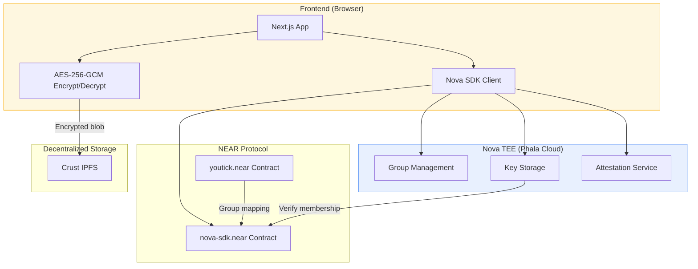
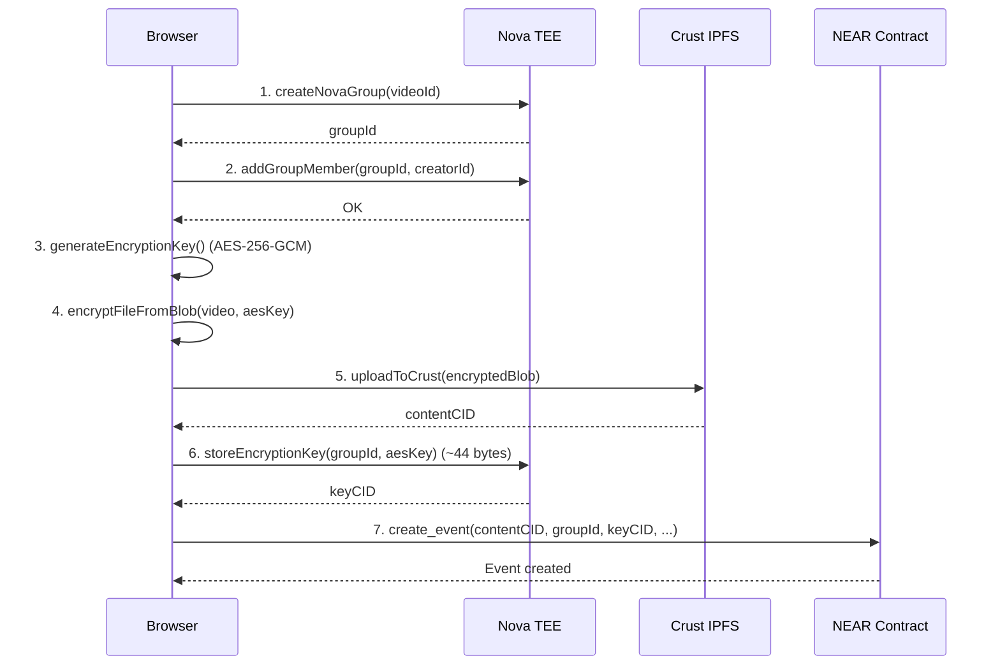
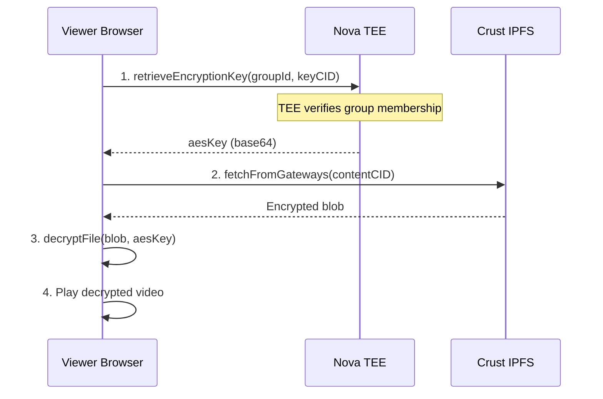

# Nova Protocol Integration

> TEE-based encryption and group-based access control for YouTick video content.

**Contract:** `nova-sdk.near` (mainnet) |
**SDK:** `nova-sdk-js` v1.0.3 |
**Encryption:** AES-256-GCM |
**TEE Provider:** Phala Cloud (Intel SGX)

---

## Overview

Nova Protocol provides Trusted Execution Environment (TEE) encryption and group-based access control for YouTick's video content. Running on Phala Cloud, Nova ensures that encryption keys never leave the secure enclave, providing verifiable privacy guarantees.

YouTick uses Nova for three core functions:

1. **Group management** -- Create access-control groups tied to video content
2. **Key storage** -- Store AES encryption keys inside the TEE, gated by group membership
3. **Attestation** -- Verify that the TEE enclave is running expected code

The encryption itself happens client-side in the browser. Nova does not process video files directly; it only manages the tiny AES keys (~44 bytes) that protect them.

---

## Architecture



**Data separation by design:**

| Component | Knows | Does Not Know |
|-----------|-------|---------------|
| NEAR Contract | Group membership, video CIDs, metadata | Encryption keys, video contents |
| Nova TEE | Encryption keys, key versions | Video contents, video CIDs, membership lists |
| Crust IPFS | Encrypted blobs | Decryption keys, video contents, permissions |

---

## Module Structure

```
apps/web/lib/nova/
├── index.ts              # Module entry point, NOVA convenience API
├── config.ts             # Configuration, SDK singleton, CORS proxy routing
├── types.ts              # 60+ type definitions (NovaError, interfaces, guards)
├── client.ts             # Upload/download with hybrid Crust+Nova encryption
├── auth.ts               # Auth token management (30-min TTL, in-memory cache)
├── groups.ts             # Group management (create, add member, verify)
├── public-groups.ts      # Public groups for thumbnails and free content
├── key-storage.ts        # Hybrid Crust+Nova AES key management
├── costs.ts              # Cost estimation (group: ~0.67 NEAR, member: ~0.01 NEAR)
├── attestation.ts        # TEE attestation verification (structure, freshness, hash)
├── pending-access-queue.ts  # Post-purchase access retry tracking
└── post-purchase.ts      # Add buyer to group after ticket purchase
```

Each module follows a consistent pattern: public function validates inputs, calls the Nova SDK singleton (from `config.ts`), wraps errors into typed `NovaError` instances, and logs `[DECENTRALIZATION_METRIC]` events for transparency.

---

## Authentication Flow

Nova authentication is managed through SDK session tokens, not NEAR wallet signatures.

```
generateNovaAuthToken(accountId)
    |
    +--> Check in-memory cache (Map<accountId, NovaAuthToken>)
    |        |
    |        +-- Cache hit & not expired --> Return cached token
    |        +-- Cache miss or expired ---+
    |                                     |
    +--> authenticateWithNOVA()           |
    |        |                            |
    |        +--> sdk.authStatus()        |
    |        |        |                   |
    |        |        +-- authenticated --> Continue
    |        |        +-- not authenticated --> sdk.refreshToken()
    |        |                                     |
    |        |                                     +--> Retry authStatus()
    |        |
    +--> verifyAttestation() (non-blocking, catch errors)
    |
    +--> Create NovaAuthToken { authToken, accountId, expiresAt, teeAttestation }
    |
    +--> Cache in tokenCache Map
    |
    +--> Return token
```

**Key characteristics:**

- **Cache-first strategy** with 30-minute TTL stored in an in-memory `Map`
- **SDK-managed lifecycle** -- the Nova SDK handles its own session tokens via API key
- **Non-blocking attestation** -- TEE verification runs after auth but does not block on failure
- **Per-account tokens** -- each NEAR account ID gets its own cached token

---

## Hybrid Upload Architecture

YouTick uses a hybrid upload strategy instead of sending files directly through Nova. This design choice solves a critical constraint: Nova's TEE endpoints reject large payloads (HTTP 413 Payload Too Large) because they are optimized for small key material, not multi-hundred-megabyte video files.

### Why Hybrid?

1. **Avoids 413 Payload Too Large** -- Nova cannot handle large video files through its API
2. **Client-side encryption** -- Unencrypted video data never leaves the browser
3. **TEE-enforced access control** -- Nova still gates decryption key retrieval by group membership
4. **Decentralized persistence** -- Crust IPFS provides permanent, replicated storage

### Upload Flow



### Download Flow



### Nova URL Format

Encrypted content is referenced using a Nova URL scheme:

```
nova://{groupId}/{contentCID}
```

The `groupId` identifies the access-control group. The `contentCID` points to the encrypted blob on Crust IPFS. The `keyCID` (stored in the contract's event metadata) points to the AES key inside Nova.

---

## Group-Based Access Control

Groups are the fundamental access-control primitive. Each video maps to one Nova group. Membership in the group is the sole requirement for retrieving the decryption key from the TEE.

### Lifecycle

1. **Creator uploads video** -- A new group is created with the creator as the first member
2. **Buyer purchases ticket** -- The `buy_ticket` contract method triggers adding the buyer to the group via `addGroupMember()`
3. **Viewer requests playback** -- Nova TEE checks membership before releasing the AES key
4. **Group membership is permanent** -- Once added, members retain access unless the group is deleted

### Group Creation

Groups are registered through the Nova SDK's `registerGroup()` method, which performs two operations:

1. On-chain group creation on `nova-sdk.near`
2. TEE group registration inside the Shade Agent

A known race condition exists: the MCP tool can succeed on-chain but fail at TEE verification because the NEAR RPC has not propagated the new state. The `createNovaGroup()` function in `config.ts` handles this with:

- **3-attempt retry** with escalating delays (3s, 5s, 8s)
- **Recovery check** on balance errors -- verifies if the previous attempt already created the group on-chain
- **5-second TEE propagation wait** after recovery detection

### Adding Members

The `addGroupMember()` function in `groups.ts` includes nonce-conflict retry logic:

- **3 attempts** with escalating delays (2s, 4s, 8s)
- Nonce errors (`ak_nonce`, `tx_nonce`) are common when multiple transactions execute in quick succession
- Non-retryable errors (authorization failures) are thrown immediately

### Membership Verification

```typescript
// Check membership before showing play button (UI optimization)
const canWatch = await isGroupMember(groupId, viewerAccountId);

// TEE enforces this check again at key retrieval time
// so the UI check is advisory, not authoritative
```

---

## TEE Attestation Verification

Attestation lets the client verify that the Nova TEE is running the expected code inside a genuine Intel SGX enclave.

### Verification Pipeline

The `verifyAttestationData()` function performs three checks in sequence:

| Check | What It Validates | Failure Behavior |
|-------|-------------------|------------------|
| **Structure** | All required fields present (`platform`, `enclave_hash`, `quote`, `report`, `timestamp`, `valid_until`) | Returns `{ verified: false, failedCheck: 'structure' }` |
| **Freshness** | `timestamp` within `maxAge` (default 1 hour) and `valid_until` not expired | Returns `{ verified: false, failedCheck: 'freshness' }` |
| **Enclave hash** | Matches `NEXT_PUBLIC_NOVA_ENCLAVE_HASH` if configured | Returns `{ verified: false, failedCheck: 'enclave_hash' }` |

### Caching and Non-Blocking Behavior

- **10-minute cache** -- The `verifyAttestation()` function caches results (pass or fail) to avoid spamming the endpoint
- **404 suppression** -- If the attestation endpoint returns 404, further fetch attempts are suppressed for 10 minutes to reduce browser console noise
- **Non-blocking by default** -- Attestation failures during `generateNovaAuthToken()` are caught and logged as warnings; they do not prevent authentication
- **Opt-in blocking** -- Upload and fetch operations accept a `verifyAttestation: true` option that throws on attestation failure

---

## Cost Model

Costs are queried dynamically via `sdk.estimateFee()` with a 10-minute cache. Fallback values are used if the query fails.

| Operation | Estimated Cost | Fallback | Who Pays |
|-----------|---------------|----------|----------|
| Create group (`register_group`) | ~0.67 NEAR | 0.70 NEAR | Creator (from prepaid balance via `fund_nova_platform`) |
| Add member (`add_member`) | ~0.01 NEAR | 0.005 NEAR | Platform (included in service fee) |
| Store key (`upload` ~44 bytes) | Included in group | -- | -- |
| Retrieve key (`retrieve`) | Free (view call) | -- | -- |
| Auth token | Free | -- | -- |

The creator pre-funds Nova operations by calling `fund_nova_platform()` on the YouTick contract, which transfers the group registration fee to the platform's Nova sub-account.

---

## CORS Proxy Architecture

The Nova SDK's endpoints (`nova-sdk.com` for auth, `nova-mcp.fastmcp.app` for MCP) do not support CORS from browser origins. YouTick routes all Nova API calls through a proxy.

```
Browser Request
    |
    +--> /api/nova-proxy/[...path]   (Next.js API route, dev)
    |         or
    +--> https://nova-proxy.{account}.workers.dev   (Cloudflare Worker, production)
            |
            +--> Injects real NOVA_API_KEY (server-only secret)
            |
            +--> Forwards to Nova API endpoint
            |
            +--> Returns response to browser
```

**Security model:**

- `NOVA_API_KEY` (without `NEXT_PUBLIC_` prefix) is the real secret, stored server-side only
- `NEXT_PUBLIC_NOVA_API_KEY` is set to `enabled` or `proxy-injected` as a boolean flag
- The SDK constructor receives `'proxy-injected'` as the API key; the proxy replaces it with the real key
- A config-time warning fires if `NEXT_PUBLIC_NOVA_API_KEY` appears to contain a real key (length > 20)

**Configuration:**

```bash
# .env.local
NOVA_API_KEY=your-real-secret-key              # Server-only
NEXT_PUBLIC_NOVA_API_KEY=enabled               # Client flag
NEXT_PUBLIC_NOVA_PROXY_URL=https://nova-proxy.example.workers.dev  # Production proxy
# Falls back to /api/nova-proxy for local development
```

---

## Error Handling and Recovery

All errors are wrapped in the typed `NovaError` class with one of 12 error codes:

| Error Code | Trigger | Recovery Strategy |
|------------|---------|-------------------|
| `NO_SESSION_KEY` | Session key missing from localStorage | Prompt user to set up session key |
| `AUTH_FAILED` | SDK authentication failed | Clear cache, regenerate token |
| `TEE_UNAVAILABLE` | Shade Agent is down | Show user-facing error, retry later |
| `UPLOAD_FAILED` | File or key upload failed | Retry with exponential backoff |
| `FETCH_FAILED` | File or key retrieval failed | Retry, try alternate gateways |
| `ACCESS_DENIED` | User not a group member | Verify purchase, trigger post-purchase flow |
| `NOT_FOUND` | File or key CID not found | Check CID, verify storage order |
| `GROUP_CREATE_FAILED` | Group registration failed | 3-attempt retry with propagation delays |
| `GROUP_ADD_FAILED` | Failed to add member | 3-attempt nonce retry |
| `GROUP_QUERY_FAILED` | Failed to query group data | Return empty, log warning |
| `INVALID_CONFIG` | Missing API key or account ID | Check environment variables |
| `NETWORK_ERROR` | Timeout or connection error | RPC failover, retry |
| `ATTESTATION_FAILED` | TEE attestation did not pass | Non-blocking by default; log warning |

### Retry Patterns

**Group creation** (`createNovaGroup` in `config.ts`):
- 3 attempts with delays of 3s, 5s, 8s
- Recovery check on balance errors (previous attempt may have succeeded)
- 5s TEE propagation wait after recovery

**Member addition** (`addMemberViaNOVA` in `groups.ts`):
- 3 attempts with delays of 2s, 4s, 8s
- Targets nonce conflicts specifically

**Key storage** (`storeEncryptionKey` in `key-storage.ts`):
- 4 attempts with delays of 3s, 5s, 8s, 12s
- Re-triggers `registerGroup()` if TEE reports missing group key
- Handles proxy timeout and network errors

---

## Constants Reference

All constants are defined in `NOVA_CONSTANTS` within `config.ts`:

| Constant | Value | Purpose |
|----------|-------|---------|
| `AUTH_TOKEN_CACHE_DURATION` | 30 minutes | In-memory auth token TTL |
| `UPLOAD_TIMEOUT` | 15 minutes | Max time for file upload (supports 500 MB files) |
| `FETCH_TIMEOUT` | 30 seconds | Max time for file/key retrieval |
| `MAX_FILE_SIZE` | 500 MB | Maximum paid video upload size |
| `MAX_FREE_FILE_SIZE` | 20 MB | Maximum free video upload size |
| `TEE_HEALTH_TIMEOUT` | 10 seconds | TEE health check timeout |
| `ATTESTATION_CACHE_DURATION` | 10 minutes | Attestation result cache TTL |
| `ATTESTATION_MAX_AGE` | 1 hour | Maximum attestation freshness |
| `ATTESTATION_FETCH_TIMEOUT` | 10 seconds | Attestation endpoint fetch timeout |

---

## Related Documentation

- [Session Keys](./session-keys.md) -- Signless UX that powers Nova authentication
- [Smart Contract](./smart-contract.md) -- On-chain group mapping and event storage
- [Storage](./storage.md) -- Crust IPFS encrypted blob storage
- [User Flows](../guides/user-flows.md) -- End-to-end upload, purchase, and playback flows
