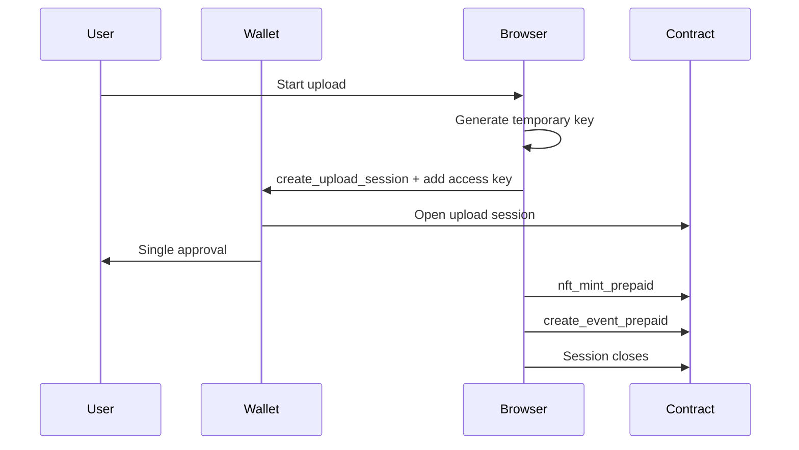

# Session Keys & Upload Sessions

> YouTick's low-popup authorization model splits into two halves:
> **upload session** (publishing) and **signless access key + session grant**
> (paid playback).

---

## 1. Upload Session

The preferred publish path is the **upload session** model.

In this model the frontend:

1. Generates a temporary public key.
2. Opens a short-lived authorization on the contract via
   `create_upload_session`.
3. Adds a function-call key on the user's account that can only call
   `nft_mint_prepaid` and `create_event_prepaid`.
4. Closes the session when the upload finishes.

Main code:

- `apps/web/lib/upload-session-manager.ts`
- `apps/web/lib/batch-transactions.ts`
- `apps/web/components/UploadForm.tsx`

### Why?

- opens for upload only
- allows only two methods
- bounded by an explicit budget and TTL
- cleaned up when the work is done

### Flow

### Security Bounds

- the method list is fixed
- the allowance is bounded
- there is a TTL
- the contract tracks the remaining budget

---

## 2. Signless Access Key (paid playback)

During paid playback **no wallet popup opens**. This is achieved through a
signless access key + session grant combination.

Flow:

1. When the wallet first connects (or a managed account is created), the
   browser generates an **ed25519 keypair**. `apps/web/lib/signless-access-key.ts`
   defines this key as a narrowly-scoped (limited-allowance) function-call
   access key that may only call `issue_session_grant` on
   `access.youtick.near`.
2. The key is written to `BrowserKeyStore` through
   `apps/web/lib/keystore-v7.ts`.
3. When playback is needed, `apps/web/lib/access-grants.ts` calls
   `issue_session_grant` with this key and receives a **10-minute Play
   session grant** (5 minutes for Publish).
4. `apps/web/lib/kms/client.ts` issues the KMS retrieve call with this
   session grant first. If the grant is rejected
   (`SESSION_GRANT_REJECTED` or `SIGNLESS_PLAYBACK_UNAVAILABLE`), the UI
   asks for a reconnect.

### Why?

- Asking for a wallet popup per playback segment isolates users.
- The session grant is verified on-chain; it is not an off-chain shared
  secret.
- The same abstraction works for managed (guest/trial) accounts.

### Bounds

- The grant is gated by
  `subject_id == caller || creator || ticket_owner` in
  `contracts/access-control/src/lib.rs::issue_session_grant`.
- If KMS retrieve rejects the grant, the client does **not**
  auto-invalidate; for managed accounts, retrieve falls back to a
  local-key-signed call. For non-managed accounts,
  `SESSION_GRANT_REJECTED` is surfaced to the UI.
- If the local key is lost, the player surfaces
  `SIGNLESS_PLAYBACK_UNAVAILABLE` and asks the user to reconnect.

### Main Files

- `apps/web/lib/signless-access-key.ts`
- `apps/web/lib/keystore-v7.ts`
- `apps/web/lib/access-grants.ts`
- `apps/web/lib/kms/client.ts`
- `apps/web/components/IpfsPlayer.tsx` (UI-side error messages)

---

## Boundary Between the Two Halves

| Topic | Upload Session | Signless Access Key |
|---|---|---|
| Contract | `youtick.near` (`create_upload_session`) | `access.youtick.near` (`issue_session_grant`) |
| Allowed methods | `nft_mint_prepaid`, `create_event_prepaid` | `issue_session_grant` |
| Lifetime | One publish session (short) | One device/wallet connection; each grant 5-10 min |
| Storage | Temporary keypair + on-chain session record | `BrowserKeyStore` (local) + on-chain access key |
| Typical UX | Single wallet approval (`create_upload_session`) | No popups after the ticket is purchased |

Both paths exist to avoid a long-lived, fully-scoped device key; they
just narrow publish and playback in different ways.
