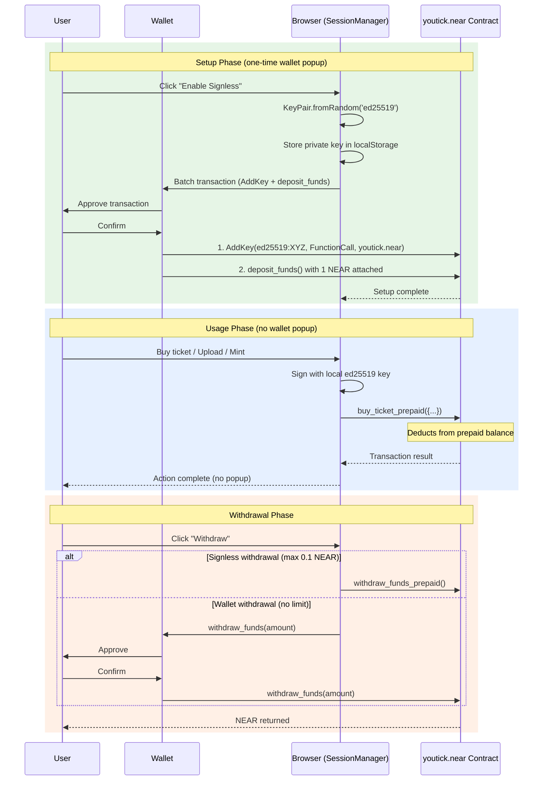

# Session Keys

> Signless transactions on NEAR Protocol via Function Call access keys and on-chain prepaid balance.

**Location:** `apps/web/lib/session-manager.ts` |
**Contract:** `youtick.near` |
**Key Type:** ed25519 FunctionCall Access Key

---

## Overview

Session keys enable signless UX by combining NEAR Protocol's FunctionCall access keys with an on-chain prepaid balance system. After a one-time wallet signature during setup, users interact with YouTick without any further wallet popups.

The system works in three phases:

1. **Setup** (1 wallet popup) -- Generate a local key pair, add it as a FunctionCall access key on-chain, and deposit NEAR into the contract's prepaid balance
2. **Usage** (unlimited signless operations) -- The local key signs transactions that deduct from the prepaid balance instead of requiring attached deposits
3. **Withdrawal** -- Users can reclaim unspent prepaid balance at any time

---

## How It Works



---

## SessionManager Class API

### Constructor

```typescript
const sessionManager = new SessionManager(accountId: string);
```

Creates a new SessionManager bound to a specific NEAR account. Internally initializes a `BrowserKeyStore` for localStorage access.

### Key Management

| Method | Signature | Description |
|--------|-----------|-------------|
| `hasSessionKey()` | `(): Promise<boolean>` | Checks if a valid session key exists locally AND on-chain. Removes stale keys automatically. Also verifies the key targets the correct contract and has sufficient remaining allowance (> 0.005 NEAR). |
| `createSessionKey()` | `(wallet, gasAmount?: string): Promise<void>` | Full setup: generates key pair, stores locally, sends batch transaction (AddKey + deposit_funds). Default deposit: 1 NEAR. |
| `createSessionKeyMinimal()` | `(wallet): Promise<void>` | Minimal setup for users with existing balance. Deposits 0.5 NEAR instead of 1 NEAR. |
| `generateSessionKeyPair()` | `(): Promise<string>` | Generates and stores a key pair locally, returns the public key string. Does not interact with the chain. Used when the caller handles the wallet transaction externally. |
| `saveSessionKey()` | `(keyPair: KeyPair): Promise<void>` | Stores an existing key pair in localStorage. |
| `importWalletFunctionCallKey()` | `(): Promise<boolean>` | Imports a function call key from wallet-selector's localStorage. Handles MyNearWallet (redirect-based, key in localStorage) and detects MeteorWallet (injected, key not accessible). |

### Contract Calls (Signless)

| Method | Signature | Description |
|--------|-----------|-------------|
| `callMethod()` | `(method: string, args: object, gas?: string): Promise<unknown>` | Executes a single contract method using the local session key. Default gas: 300 TGas. Includes nonce retry logic (2 attempts with exponential backoff). |
| `sendBatchTransaction()` | `(txActions: Action[], gas?: string): Promise<unknown>` | Executes multiple actions in a single transaction using the local session key. |

### Balance Management

| Method | Signature | Description |
|--------|-----------|-------------|
| `getAccountBalance()` | `(nodeUrl: string): Promise<number>` | Queries `get_user_balance` on the contract. Returns prepaid balance in NEAR. |
| `hasSufficientGas()` | `(nodeUrl: string, minAmount?: number): Promise<boolean>` | Returns `true` if prepaid balance >= `minAmount` (default: 1.0 NEAR). |
| `ensureGas()` | `(wallet, nodeUrl: string, minAmount?: number): Promise<void>` | Auto top-up: deposits 1 NEAR if balance is below `minAmount`. Requires wallet signature. |
| `topUpGas()` | `(wallet, amount: string): Promise<void>` | Manual deposit via wallet signature. Calls `deposit_funds` with the specified amount attached. |
| `withdrawFunds()` | `(wallet, amount: string): Promise<void>` | Withdraw via wallet signature. No amount cap. Requires 1 yoctoNEAR attached deposit. |
| `withdrawFundsSilent()` | `(amount: string): Promise<unknown>` | Signless withdrawal using the session key. Calls `withdraw_funds_prepaid`. Capped at 0.1 NEAR by the contract. |

---

## Callable Methods (Signless)

These contract methods support session key execution. They deduct costs from the caller's prepaid balance rather than requiring an attached deposit:

| Method | Purpose | Typical Cost |
|--------|---------|-------------|
| `buy_ticket_prepaid` | Purchase a ticket for a video | Video price + service fee |
| `create_event_prepaid` | Create a new video event | 0.1 NEAR (storage deposit) |
| `nft_mint_prepaid` | Mint an NFT ticket | 0.1 NEAR (storage deposit) |
| `fund_nova_platform` | Transfer NEAR to Nova sub-account for group registration | ~0.67 NEAR |
| `withdraw_funds_prepaid` | Withdraw prepaid balance (signless, capped at 0.1 NEAR) | Gas only |

All `_prepaid` methods follow the same pattern: the contract verifies the caller has sufficient prepaid balance, deducts the cost, and executes the operation.

---

## Security Model

### FunctionCall Key Restrictions

Session keys are FunctionCall access keys, not FullAccess keys. They are subject to NEAR Protocol's built-in restrictions:

- **Cannot transfer NEAR** directly from the account
- **Contract-scoped** -- limited to calling `youtick.near` only
- **Method-scoped** (optional) -- can be restricted to specific methods
- **Allowance-limited** -- gas spending is capped by the key's allowance

### Withdrawal Cap

The contract enforces a 0.1 NEAR maximum for signless withdrawals:

```rust
let max_signless_withdraw = NearToken::from_millinear(100);
require!(
    amount <= max_signless_withdraw,
    "Amount exceeds signless limit (0.1 NEAR)"
);
```

This limits the damage from a compromised session key. Full withdrawals require a wallet signature.

### Key Compromise Mitigation

If a session key is compromised, the exposure is limited:

1. **Max loss** is the prepaid balance (not the main account balance)
2. **Cannot transfer** NEAR from the main account
3. **User can revoke** by adding a new full-access key and deleting the compromised key
4. **Contract caps** signless withdrawals at 0.1 NEAR

### Nonce Retry Logic

The `callMethod()` implementation retries on nonce errors to handle concurrent transaction submission:

- **2 retry attempts** with exponential backoff (1s, 2s)
- Targets `InvalidNonce` TypedError specifically
- Non-nonce errors are thrown immediately

---

## Key Storage

Session keys are stored in the browser's `localStorage` using the `BrowserKeyStore` class (from `lib/keystore-v7.ts`).

### Storage Format

```
Key:   near-api-js:keystore:{accountId}:{networkId}
Value: ed25519:{base58-encoded-private-key}
```

**Example:**

```
Key:   near-api-js:keystore:alice.near:mainnet
Value: ed25519:3D4YudUahN1nawWoQ...
```

### On-Chain Verification

`hasSessionKey()` validates the local key against the blockchain before use:

1. Retrieves the key from localStorage
2. Queries the account's access key list via RPC
3. Verifies the public key exists on-chain
4. Confirms the key targets `youtick.near` (correct contract)
5. Checks remaining allowance (minimum 0.005 NEAR)
6. Removes the local key if any check fails

This prevents stale keys from causing silent transaction failures.

### RPC Failover

All on-chain queries use the RPC failover system:

```typescript
const RPC_ENDPOINTS = [
    'https://rpc.fastnear.com',         // Primary
    'https://rpc.mainnet.near.org',     // Secondary
    'https://near.lava.build'           // Tertiary
];
```

If the primary RPC is unavailable, operations automatically fall through to the next endpoint.

---

## Setup Examples

### Standard Setup (1 NEAR)

```typescript
const sessionManager = new SessionManager(accountId);

const hasKey = await sessionManager.hasSessionKey();
if (!hasKey) {
    // Single wallet popup: AddKey + deposit 1 NEAR
    await sessionManager.createSessionKey(wallet, '1');
}
```

### Minimal Setup (0.5 NEAR)

```typescript
// For users with existing balance (smaller deposit needed)
await sessionManager.createSessionKeyMinimal(wallet);
```

### Signless Purchase

```typescript
await sessionManager.callMethod('buy_ticket_prepaid', {
    receiver_id: accountId,
    encrypted_cid: eventCid
});
// No wallet popup -- signed with local session key
```

### Signless Event Creation

```typescript
await sessionManager.callMethod('create_event_prepaid', {
    encrypted_cid: cid,
    title: 'My Concert',
    description: 'Live performance recording',
    price: '1000000000000000000000000' // 1 NEAR in yocto
});
```

### Signless Withdrawal

```typescript
// Max 0.1 NEAR without wallet popup
await sessionManager.withdrawFundsSilent('0.1');

// Unlimited amount with wallet popup
await sessionManager.withdrawFunds(wallet, '5');
```

---

## Exports

```typescript
// Primary class
export class SessionManager { ... }

// Re-exported utilities
export { getCurrentRpcUrl, withRpcFailover, NETWORK_ID, CONTRACT_ID };
```

---

## Related Documentation

- [Smart Contract](./smart-contract.md) -- Prepaid balance methods and access control
- [Nova Protocol](./nova-protocol.md) -- TEE encryption powered by session key auth
- [User Flows](../guides/user-flows.md) -- End-to-end flows showing signless interactions
