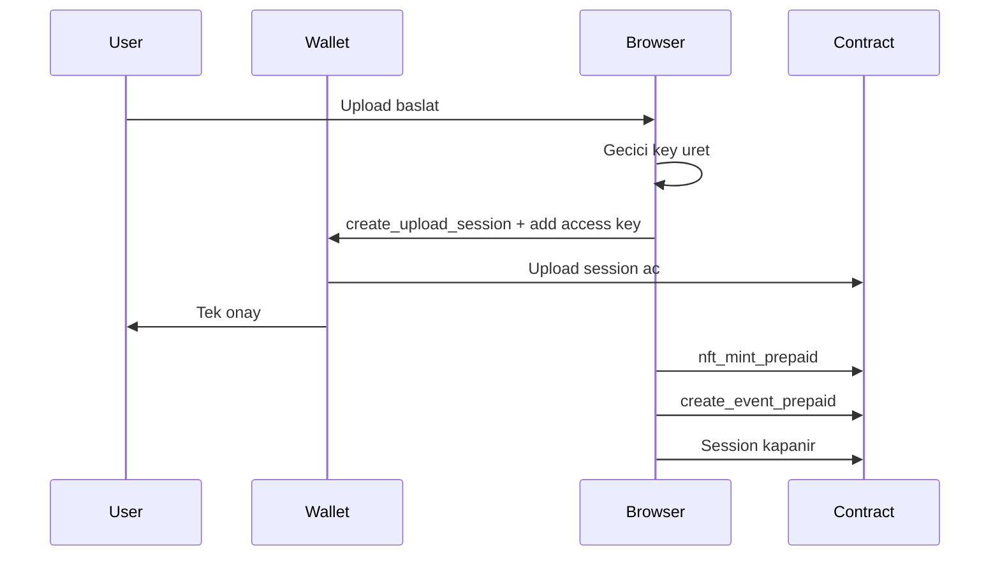

# Session Keys and Upload Sessions

> YouTick'te dusuk popup'li yetkilendirme modeli

---

## Bugun hangi yol aktif?

Aktif ve tercih edilen yol **upload session** modelidir.

Bu modelde frontend:

1. Gecici bir public key uretir
2. `create_upload_session` ile kontratta kisa omurlu bir yetki acar
3. Kullanicinin hesabina sadece `nft_mint_prepaid` ve `create_event_prepaid` icin function-call key ekler
4. Yukleme bitince bu oturumu kapatir

Bu akisin ana kodu:

- `apps/web/lib/upload-session-manager.ts`
- `apps/web/components/UploadForm.tsx`

---

## Neden upload session?

Bu model tek bir uzun omurlu anahtara dayanmaz. Daha dar kapsamlidir:

- sadece upload icin acilir
- sadece iki metoda izin verir
- belirli bir butce ve sure ile sinirlanir
- is bitince temizlenir

Bu sayede hem daha az popup olur hem de yetki alani daha kucuk kalir.

---

## Akis

---

## Legacy yardimcilar

Frontend icinde hala `SessionManager` sinifi bulunur:

- eski function-call key import etme
- eski deploy'lar icin fallback davranisi
- `UploadForm` icinde son care olarak kullanilabilen legacy akis

Bu yol yeni dokumanlarda ana akis olarak kabul edilmez. Yani:

- yeni gelistirmede once upload session dusun
- eski session-key yardimcilarini sadece uyumluluk katmani gibi gor

---

## Guvenlik sinirlari

Upload session modelinde yetki dar tutulur:

- method listesi sabittir
- allowance sinirlidir
- TTL vardir
- kontratta kalan butce izlenir

Bu model, "bir kere izin ver ve uzun sure kullan" mantigindan daha guvenlidir.

---

## Dikkat edilmesi gerekenler

1. Upload session kontratta yoksa frontend legacy fallback'e duser.
2. KMS auth cache temizligi ile wallet durumunun birlikte dusunulmesi gerekir.
3. Upload akisinda hata olursa session temizligi unutulmamalidir.

---

## Ilgili Dosyalar

- `apps/web/lib/upload-session-manager.ts`
- `apps/web/lib/session-manager.ts`
- `apps/web/lib/batch-transactions.ts`
- `apps/web/components/UploadForm.tsx`
