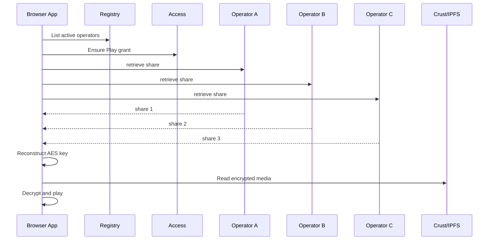

# Storage and Delivery

> How encrypted media moves from the browser to IPFS and back into the player

---

## Current Live Model

Today, YouTick runs through this storage and playback path:

1. the browser generates an AES-256-CTR key
2. the video is encrypted in chunks or segments
3. encrypted output is uploaded to Crust/IPFS
4. the AES key is split into shares
5. shares are stored across active decryption operators
6. playback reconstructs the AES key in the browser after enough shares arrive

This gives three benefits:

- IPFS only sees encrypted media
- no single operator needs the full playback key
- AES-CTR still supports fast seek and segmented playback

---

## Upload Flow

### 1. Encryption

`apps/web/lib/kms/encryption.ts`:

- uses AES-256-CTR
- defaults to `1 MB` chunks
- supports random-access decryption for seek

For MP4-based uploads, the app can package segmented delivery manifests so playback can start earlier.

### 2. IPFS Upload

The upload can include:

- encrypted video payloads
- a segmented delivery manifest
- init segments and media segments
- thumbnail and poster assets

Delivery assets are uploaded through Crust. Playback reads through multiple gateway options.

### 3. Key Share Storage

The browser no longer treats the AES key as one value that belongs to one KMS worker.

Instead:

- it reads the active operator set from the registry
- it splits the AES key into shares
- it stores one share per operator

Each operator only stores its own encrypted share.

---

## Playback Flow

The player:

1. resolves the manifest and metadata
2. checks ownership or creator entitlement
3. requests shares from active operators in parallel
4. reconstructs the key after enough shares arrive
5. reads encrypted media from IPFS and decrypts in the browser

The latest implementation also stops waiting once the threshold is reached.

---

## Gateway Strategy

Media delivery still does not depend on a single IPFS gateway:

- Crust endpoints are tried first
- public IPFS gateways remain available as fallback
- range requests are used when supported
- full-download fallback still exists for degraded cases

This keeps playback resilient even if one media endpoint is slow or unreliable.

---

## What the Chain Stores

The contract does not store raw video or the AES key.

It stores:

- `encrypted_cid`
- event title and description
- price and optional USD price
- video metadata
- entitlement ownership

Key material is handled off-chain by the operator layer, but entitlement remains on-chain.

---

## Why This Design

| Need | Current answer |
|------|----------------|
| Protect the raw video | Browser-side encryption |
| Avoid one full-key holder | Share-based operator storage |
| Keep playback fast | AES-CTR + segmented delivery |
| Avoid a single operator bottleneck | `3-of-5` reconstruction |
| Keep storage decentralized | Crust + IPFS gateway fallback |

---

## Related Files

- `apps/web/lib/kms/encryption.ts`
- `apps/web/lib/kms/shares.ts`
- `apps/web/lib/kms/client.ts`
- `apps/web/lib/video-delivery.ts`
- `apps/web/lib/crust/*`
- `workers/youtick-kms/src/index.ts`
