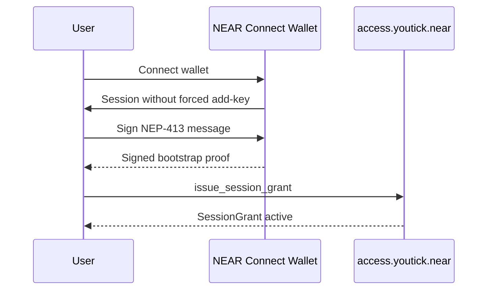
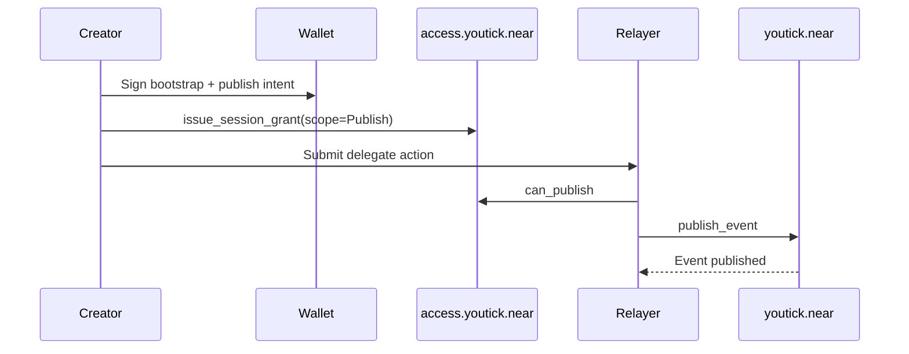
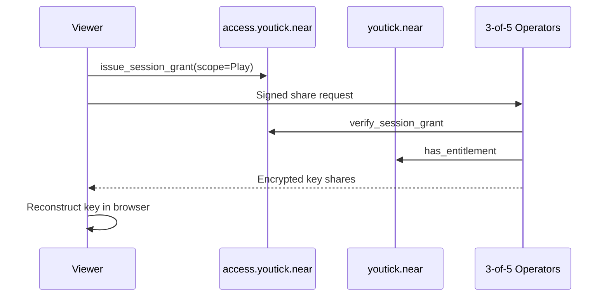
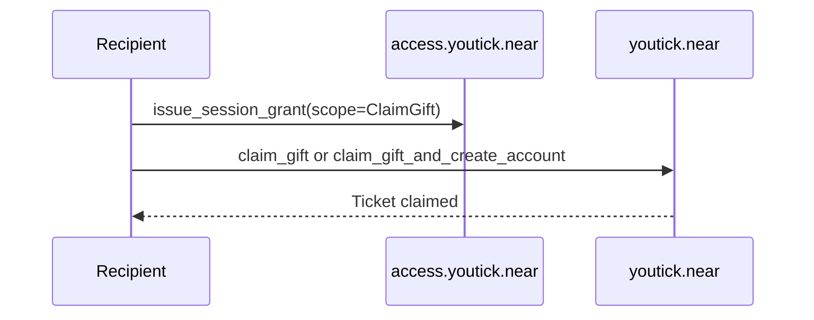
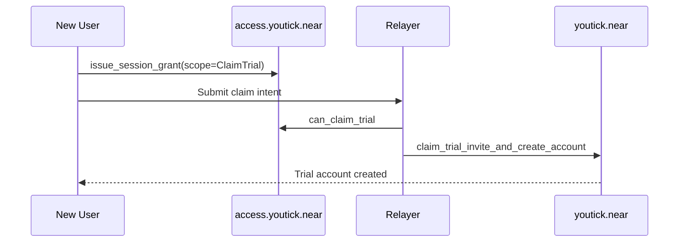

# Youtick Zero Trust Architecture v1

> Target-state ADR for NEAR-native identity, on-chain authorization, and a shared decryption operator network

**Status:** Proposed  
**Date:** March 15, 2026  
**Type:** Architecture Decision Record  
**Target Contracts:** `youtick.near`, `access.youtick.near`, `registry.youtick.near`

---

## Context

Today, YouTick runs on:

- a single `nft-ticket` smart contract surface
- browser-side media encryption
- Cloudflare KMS for key storage and key release
- Crust/IPFS for encrypted media storage
- upload sessions for narrow publish authorization

This model has worked well enough to ship the product. In particular, the current upload-session flow is a strong foundation:

- it avoids a single long-lived browser key
- it narrows the allowed method set
- it limits both time and budget

But it still falls short of the target zero-trust model:

- playback decryption still depends on a single KMS trust root
- onboarding secrets can still reach the browser
- `ACCESS_PASS` is encoded as a magic value rather than an explicit entitlement type
- the boundary between off-chain verification and on-chain authority is not clear enough

This ADR defines the target architecture, not a short-term migration shape.

---

## Decision

The following decisions are fixed for v1:

### 1. `account_id` is the identity root

Every subject is identified by a NEAR `account_id`:

- named account
- implicit account
- `0x...` NEAR account

There is no separate identity contract. The account itself is the root identity.

### 2. Authorization decisions live on-chain

The trust split is:

- `youtick.near` stores market state and entitlements
- `access.youtick.near` stores short-lived session grants and scope policy
- `registry.youtick.near` stores decryption operators and relayers
- off-chain services do not invent permissions; they only verify and enforce them

### 3. Wallet bootstrap uses NEAR Connect

The target wallet bootstrap stack is:

- NEAR Connect
- NEP-413 for wallet-signed authentication
- sign-in without a forced add-key path
- NEP-366 for gasless delegated execution
- NEP-518-compatible handling for EVM wallets on NEAR

### 4. Public onboarding keys are removed

No onboarding secret is allowed to remain an active browser-side path.

Trial and invite flows move to:

- short-lived session grants
- explicit invite drops
- relayers that only sponsor gas and never become the authority source

### 5. Sensitive flows use `session grant`

Playback, publish, gift, and trial flows all converge on one application session model:

```text
SessionScope = Play | Publish | ClaimGift | ClaimTrial
```

Core session shape:

```text
SessionGrant {
  owner_id,
  session_pk,
  scope,
  resource_id?,
  expires_at_ms,
  origin_hash?,
  device_hash?,
  revoked
}
```

### 6. `ACCESS_PASS` stops being a magic string

Access-pass behavior becomes explicit:

```text
EventKind = TicketedVideo | AccessPass
```

The contract exposes the entitlement surface directly through:

- `has_access_pass`
- `has_entitlement`

### 7. A single KMS is not the target trust root

The target playback model is a shared operator network rather than one worker:

- `registry.youtick.near` stores the active operator set
- default threshold is `3-of-5`
- every operator must check:
  - `verify_session_grant`
  - `has_entitlement`
  before it returns a share

The current KMS only appears in this ADR as current state and migration context.

### 8. Governance is owner-managed

For this ADR, governance is intentionally owner-managed:

- each contract exposes `set_owner`
- moderator, operator, and relayer delegation flows are owner-controlled
- DAO governance is out of scope for v1

---

## Architecture

### Referenced Standards

- `NEP-413` for wallet-signed authentication
- `NEP-366` for gasless delegated execution
- `NEP-452` for drop-style claim patterns
- `NEP-518` for EVM wallet login on NEAR

### Contract Topology

| Contract | Responsibility | Source of Truth |
|----------|----------------|-----------------|
| `youtick.near` | events, tickets, passes, gift drops, trial pool, moderation | content and entitlement |
| `access.youtick.near` | session grants, scope policy, runtime authorization helpers | session and scope |
| `registry.youtick.near` | decryption operators and relayers | operator allowlist |

### Runtime Defaults

| Scope | TTL | Binding |
|------|-----|---------|
| `Play` | 10 minutes | `resource_id` + origin + device |
| `Publish` | 20 minutes | creator + origin + device |
| `ClaimGift` | 15 minutes | drop-bound |
| `ClaimTrial` | 15 minutes | invite-bound |

Additional rules:

- relayers sponsor gas but never become the authority source
- operators cannot fabricate entitlement
- long-lived session grants are not allowed

### Core Types

```text
ScopePolicy {
  max_ttl_ms,
  require_origin,
  require_device
}

ThresholdConfig {
  total_operators,
  required_shares
}

OperatorRecord {
  account_id,
  endpoint,
  transport_public_key,
  kind,
  active
}
```

### Wallet Bootstrap



### Publish



### Playback



### Gift Claim



### Trial Invite



### Public Contract Surface

#### `youtick.near`

**Change methods**

- `publish_event`
- `update_event_metadata`
- `set_event_price`
- `buy_ticket`
- `create_gift_drop`
- `claim_gift`
- `claim_gift_and_create_account`
- `create_trial_invite_drop`
- `claim_trial_invite_and_create_account`
- `fund_trial_pool`
- `withdraw_trial_pool`
- `grant_moderator`
- `revoke_moderator`
- `ban_event`
- `unban_event`
- `set_owner`

**View methods**

- `get_event`
- `get_events_paginated`
- `get_creator_events`
- `get_gift_drop`
- `get_trial_invite_drop`
- `get_trial_pool_balance`
- `get_purchase_logs`
- `get_purchase_count`
- `get_video_metadata`
- `has_ticket`
- `has_access_pass`
- `has_entitlement`
- `get_entitlement_snapshot`
- `is_moderator`
- standard NFT view methods

#### `access.youtick.near`

**Change methods**

- `issue_session_grant`
- `revoke_session_grant`
- `revoke_subject_sessions`
- `set_scope_policy`
- `set_market_contract`
- `set_registry_contract`
- `pause_scope`
- `unpause_scope`
- `set_owner`

**View methods**

- `get_session_grant`
- `list_session_grants`
- `get_scope_policy`
- `verify_session_grant`
- `can_execute`
- `can_play`
- `can_publish`
- `can_claim_gift`
- `can_claim_trial`

#### `registry.youtick.near`

**Change methods**

- `upsert_decryption_operator`
- `deactivate_decryption_operator`
- `upsert_relayer`
- `deactivate_relayer`
- `set_threshold_config`
- `set_owner`

**View methods**

- `get_decryption_operator`
- `list_decryption_operators`
- `get_relayer`
- `list_relayers`
- `get_threshold_config`
- `is_active_decryption_operator`
- `is_active_relayer`

---

## Consequences

### Positive

- playback authorization no longer depends on a single KMS worker
- publish, playback, gift, and trial flows share one session model
- access-pass behavior becomes explicit
- relayer and operator boundaries become easier to reason about
- wallet bootstrap becomes cleaner and more predictable

### Tradeoffs

- the platform moves from one contract to three
- session and entitlement logic becomes clearer but more involved
- the operator network introduces more infrastructure than a single worker
- owner-managed governance is fast but less decentralized than a DAO-controlled design

---

## Migration Notes

### Current State Summary

The current repo still reflects:

- a single active contract in `contracts/nft-ticket/src/lib.rs`
- one KMS worker in `workers/youtick-kms/src/index.ts`
- a strong but narrow upload-session model in `apps/web/lib/upload-session-manager.ts`
- browser-visible onboarding-key traces in the current trial flow

### Deprecated / Legacy Surface

The following methods are not active paths in target v1:

- `create_upload_session`
- `revoke_upload_session`
- `get_upload_session`
- `nft_mint_prepaid`
- `create_event_prepaid`
- `add_onboarding_key`
- `remove_onboarding_key`
- `create_sponsored_trial_direct`
- `claim_free_ticket_direct`
- `create_sponsored_trial`
- `claim_free_ticket_sponsored`

Additional note:

- the magic `ACCESS_PASS` branch inside `has_ticket` is removed in favor of `has_access_pass` and `has_entitlement`

### Method Mapping

| Old Surface | Target Surface |
|-------------|----------------|
| `create_upload_session` + `nft_mint_prepaid` + `create_event_prepaid` | `issue_session_grant(scope=Publish)` + `publish_event` |
| `add_onboarding_key` + `create_sponsored_trial_direct` | `issue_session_grant(scope=ClaimTrial)` + `claim_trial_invite_and_create_account` |
| `claim_free_ticket_direct` | `create_gift_drop` or `create_trial_invite_drop` flow |
| `has_ticket` + magic `ACCESS_PASS` | `has_ticket` + `has_access_pass` + `has_entitlement` |
| single KMS key retrieval | `verify_session_grant` + `has_entitlement` + `3-of-5` operator share retrieval |

### Documentation Intent

This page describes the target architecture. The live system has not fully moved to this shape yet. For the current runtime, continue to use:

- [System Architecture](./README.md)
- [Session Keys & Upload Sessions](./session-keys.md)
- [Storage & Delivery](./storage.md)
- [Smart Contract](./smart-contract.md)
