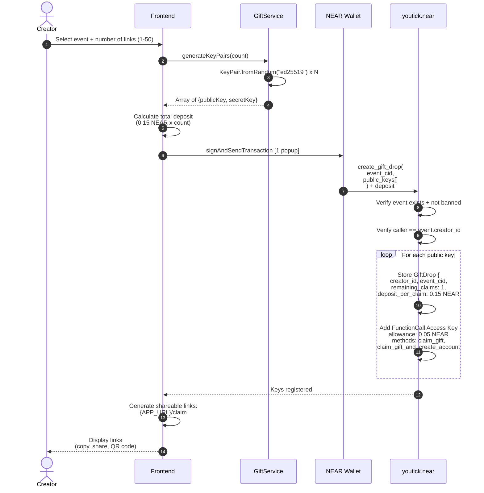
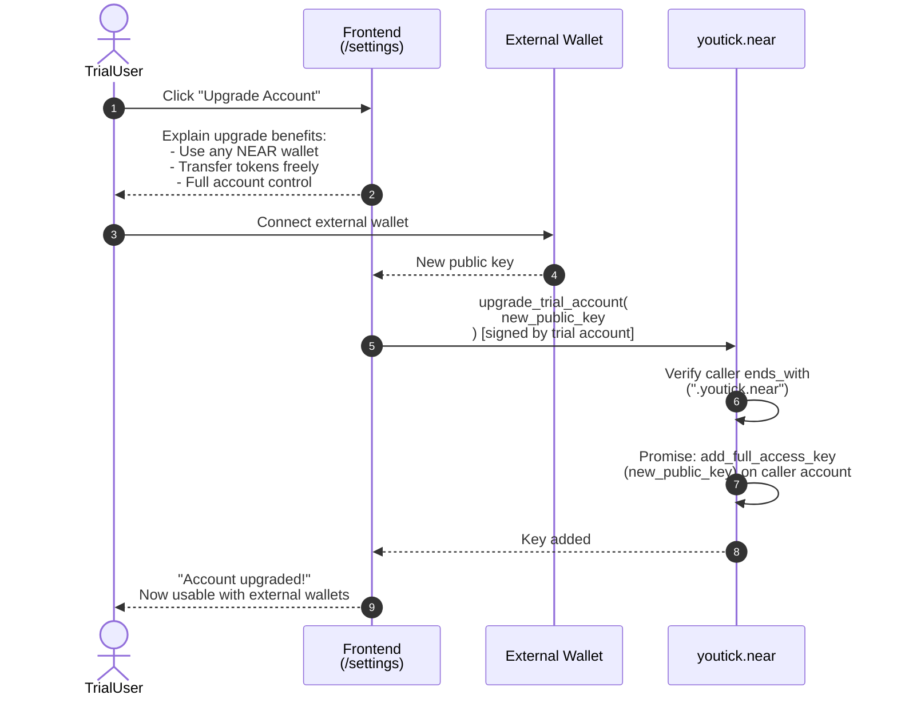

# YouTick User Flows

> Complete technical documentation of every end-to-end user flow in the YouTick decentralized video-on-demand platform. Each flow includes a Mermaid sequence diagram, step-by-step technical details, UX notes, error handling, and cost breakdowns.

**Contract**: `youtick.near` (mainnet) | **Nova**: `nova-sdk.near` | **IPFS**: Crust IPFS (`crustipfs.xyz`)

---

## Table of Contents

| # | Flow | Actor | Result |
|---|------|-------|--------|
| 1 | [Upload Flow](#1-upload-flow) | Creator | Video listed as event |
| 2 | [Purchase and Watch Flow](#2-purchase-and-watch-flow) | Viewer | NFT ticket + video playback |
| 3 | [Prepaid / Session Key Flow](#3-prepaid--session-key-flow) | Any user | Signless UX for all operations |
| 4 | [Gift Link Flow](#4-gift-link-flow) | Creator / Recipient | Free ticket distribution + claim |
| 5 | [Trial Account Flow](#5-trial-account-flow) | New user | Sponsored NEAR account |
| 6 | [wNEAR / Stablecoin Payment Flow](#6-wnear--stablecoin-payment-flow) | Viewer | Ticket purchase via USDC/wNEAR |
| 7 | [Nova TEE Attestation Flow](#7-nova-tee-attestation-flow) | System | TEE integrity verification |
| 8 | [Account Upgrade Flow](#8-account-upgrade-flow) | Trial user | Full NEAR account |

---

## 1. Upload Flow

**Actor**: Creator (connected wallet)

A creator selects a video file, fills in metadata (title, description, price), and publishes it. The frontend orchestrates session key setup, Nova group creation, client-side encryption, IPFS upload, and on-chain event/NFT registration -- all without a backend server.

### Prerequisites

- NEAR wallet connected (MyNearWallet or Meteor)
- Sufficient NEAR balance for session key deposit (minimum 0.5 NEAR recommended)
- Nova API key configured (`NEXT_PUBLIC_NOVA_API_KEY=enabled`)
- For paid videos: additional 0.67 NEAR for Nova group registration cost

### Sequence Diagram

```mermaid
sequenceDiagram
    autonumber
    actor Creator
    participant FE as Frontend<br/>(UploadForm)
    participant SM as SessionManager
    participant Wallet as NEAR Wallet
    participant Nova as NovaSDK<br/>(TEE)
    participant NovaPub as Nova Public<br/>Group
    participant IPFS as Crust IPFS
    participant Contract as youtick.near

    Creator->>FE: Select video file + enter metadata<br/>(title, description, price)
    FE->>FE: Validate file size<br/>(paid: max 500 MB, free: max 20 MB)

    rect rgb(40, 40, 60)
        Note over FE,Wallet: Session Key Setup (one-time)
        FE->>SM: hasSessionKey()?
        alt No session key
            SM->>SM: generateSessionKeyPair()<br/>(ed25519 random)
            SM->>Wallet: batchInitialSetup()<br/>[1 wallet popup]
            Wallet->>Contract: AddKey (FunctionCall access)<br/>+ deposit_funds(0.5 NEAR)
            SM->>SM: Store keypair in localStorage
        end
    end

    rect rgb(40, 60, 40)
        Note over FE,Nova: Nova Group Creation
        FE->>Nova: generateNovaAuthToken(creatorId)<br/>(cached 30 min)
        FE->>FE: generateThumbnail(videoFile)<br/>(first frame via canvas)
        FE->>NovaPub: uploadToPublicGroup(thumbnail)<br/>Returns thumbnail CID
        FE->>Nova: createGroup(name: video-{uuid})
        Nova->>Nova: registerGroup() on-chain<br/>(nova-sdk.near contract)
        Nova->>Nova: addGroupMember(creatorId)
        Nova-->>FE: Return groupId
    end

    rect rgb(60, 40, 40)
        Note over FE,IPFS: Encryption + Upload
        FE->>Nova: Encrypt video (AES-256-GCM)<br/>via TEE key management
        Nova-->>FE: Encrypted blob
        FE->>IPFS: Upload encrypted blob<br/>(Crust IPFS pinning)
        IPFS-->>FE: Return content CID (Qm...)
        FE->>Nova: Store AES key in TEE<br/>(bound to groupId)
    end

    rect rgb(40, 40, 80)
        Note over FE,Contract: On-Chain Registration (signless)
        FE->>SM: callMethod("nft_mint_prepaid")<br/>{receiver_id, token_metadata, video_metadata}
        SM->>Contract: nft_mint_prepaid()<br/>[via session key, NO wallet popup]
        Contract->>Contract: Deduct 0.1 NEAR from prepaid
        Contract->>Contract: Mint NFT to creator
        Contract->>Contract: Store nova_group_id in event_nova_groups
        FE->>SM: callMethod("create_event_prepaid")<br/>{encrypted_cid, title, description, price}
        SM->>Contract: create_event_prepaid()<br/>[via session key, NO wallet popup]
        Contract->>Contract: Deduct 0.1 NEAR from prepaid
        Contract->>Contract: Store Event on-chain
    end

    Contract-->>FE: Event listed on platform
    FE-->>Creator: Upload complete - redirect to video page
```

### Step-by-Step Details

| Step | Technical Detail | User Sees | Cost |
|------|-----------------|-----------|------|
| 1 | File input + metadata form | Upload form with drag-and-drop | -- |
| 2 | Check `file.size` against `NOVA_CONSTANTS.MAX_FILE_SIZE` | Error toast if too large | -- |
| 3 | `SessionManager.hasSessionKey()` checks localStorage + on-chain verification | Nothing (background) | -- |
| 4 | `batchInitialSetup()` combines `AddKey` + `deposit_funds` in one batch | **Single wallet popup** | 0.5 NEAR deposit |
| 5 | `generateNovaAuthToken()` with 30-min cache via Nova proxy | Nothing (background) | -- |
| 6 | Canvas element extracts first video frame as JPEG thumbnail | Preview thumbnail | -- |
| 7 | `createNovaGroup()` with retry logic (3 attempts, escalating delays) | "Creating access group..." spinner | ~0.67 NEAR (paid videos) |
| 8 | AES-256-GCM encryption in browser via Nova TEE key | Progress bar (encryption) | -- |
| 9 | Crust IPFS upload with progress callback | Progress bar (uploading) | -- |
| 10 | `nft_mint_prepaid()` via session key | "Minting NFT..." spinner | 0.1 NEAR (from prepaid) |
| 11 | `create_event_prepaid()` via session key | "Creating event..." spinner | 0.1 NEAR (from prepaid) |

### Error Handling

| Error | Cause | Recovery |
|-------|-------|----------|
| `Insufficient prepaid balance` | Not enough NEAR in gas tank | Prompt user to top up via `deposit_funds()` |
| `Event with this CID already exists` | Duplicate upload attempt | Generate new UUID and retry |
| `Nova RPC unavailable` | Nova proxy or TEE offline | Retry with exponential backoff (3s, 5s, 8s) |
| `Balance insufficient` on group create | Previous attempt consumed deposit | Check if group exists on-chain; recover if so |
| Session key exhausted | Allowance spent | Prompt for new session key creation (1 popup) |

### Decentralization Notes

> [!NOTE]
> **Fully decentralized.** Every step runs client-side. No backend server is involved.
> - Session keys are generated and stored in browser localStorage
> - Nova groups are registered on-chain via the Nova SDK's MCP server
> - Encryption happens in the browser using TEE-managed keys
> - IPFS upload goes directly to Crust's pinning service
> - Contract calls use session keys for signless transactions

---

## 2. Purchase and Watch Flow

**Actor**: Viewer (any connected wallet or session key holder)

A viewer navigates to a video page. The frontend checks NFT ownership. If the viewer owns a ticket, it verifies Nova group membership, fetches the encrypted video from IPFS, decrypts it client-side, and plays it. If not, it shows a purchase card. After purchase, the viewer is added to the Nova group for immediate playback.

### Prerequisites

- NEAR wallet connected
- For purchase: sufficient NEAR balance (ticket price + 0.01 NEAR storage + nova service fee)
- Nova API key configured

### Sequence Diagram

```mermaid
sequenceDiagram
    autonumber
    actor Viewer
    participant FE as Frontend<br/>(WatchPage)
    participant RQ as React Query<br/>(Cache)
    participant Contract as youtick.near
    participant Nova as NovaSDK<br/>(TEE)
    participant IPFS as Crust IPFS
    participant Browser as Browser<br/>(Video Player)

    Viewer->>FE: Navigate to /watch?cid=xxx

    rect rgb(40, 40, 60)
        Note over FE,Contract: Ownership Check
        FE->>RQ: Check cache for nft_tokens_for_owner
        alt Cache miss
            RQ->>Contract: nft_tokens_for_owner(viewerId)
            Contract-->>RQ: Token list
        end
        RQ-->>FE: Token list (cached 30s)
        FE->>FE: Find token matching encrypted_cid
    end

    alt Viewer owns NFT ticket
        rect rgb(40, 60, 40)
            Note over FE,Browser: Decrypt and Play
            FE->>Nova: isGroupMember(groupId, viewerId)
            Nova-->>FE: true

            alt Not a member (NovaAccessSync)
                FE->>Nova: addGroupMember(groupId, viewerId, creatorId)
                Note right of Nova: Self-healing via<br/>NovaAccessSync component
            end

            FE->>IPFS: Fetch encrypted video blob<br/>(Crust gateway + fallbacks)
            IPFS-->>FE: Encrypted blob bytes
            FE->>Nova: Retrieve AES key from TEE<br/>(TEE verifies group membership)
            Nova-->>FE: AES-256-GCM key
            FE->>FE: Decrypt video client-side<br/>(Web Crypto API)
            FE->>Browser: URL.createObjectURL(decryptedBlob)
            Browser-->>Viewer: Video plays in IpfsPlayer
        end

    else Viewer does NOT own ticket
        rect rgb(60, 40, 40)
            Note over FE,Contract: Purchase Flow
            FE->>Viewer: Show TicketPurchaseCard<br/>(price, creator info, buy button)
            Viewer->>FE: Click "Buy Ticket"

            FE->>FE: Check purchase method
            alt Has session key + sufficient prepaid balance
                FE->>Contract: buy_ticket_prepaid(receiver_id, encrypted_cid)<br/>[signless via session key]
            else No session key or low balance
                FE->>Viewer: Wallet popup for signature
                Viewer->>Contract: buy_ticket(receiver_id, encrypted_cid)<br/>[attached deposit: price + 0.01 + nova_fee]
            end

            Contract->>Contract: Verify event exists + not banned
            Contract->>Contract: apply_commission(price)

            rect rgb(50, 50, 30)
                Note over Contract: Payment Split
                Contract->>Contract: 98% creator_amount
                Contract->>Contract: 1% trial_pool
                Contract->>Contract: 1% commission_pool
            end

            Contract->>Contract: Transfer 98% to creator
            Contract->>Contract: Transfer nova_service_fee to<br/>nova platform account
            Contract->>Contract: Refund excess deposit to buyer
            Contract->>Contract: Mint NFT to viewer
            Contract->>Contract: Log PurchaseLog entry
            Contract-->>FE: Token minted

            rect rgb(40, 50, 50)
                Note over FE,Nova: Post-Purchase Nova Access
                FE->>FE: Wait 1.5s (NEAR nonce settlement)
                FE->>Nova: addBuyerToNovaGroup(eventCid, viewerId)
                Nova->>Nova: addGroupMember(groupId, viewerId)
                alt Nova add fails
                    FE->>FE: Queue in pendingAccessQueue<br/>(localStorage, max 10 retries, 24h TTL)
                end
            end

            FE->>FE: Decrypt and play (same as above)
        end
    end
```

### Payment Breakdown

| Recipient | Share | Purpose |
|-----------|-------|---------|
| Creator | 98% of ticket price | Content creator revenue |
| Trial Pool | 1% of ticket price | Funds sponsored trial accounts |
| Commission Pool | 1% of ticket price | Platform operating costs |
| Nova Platform | `nova_service_fee` (configurable, max 0.1 NEAR) | Nova TEE group access costs |
| Storage | 0.01 NEAR (from deposit) | On-chain NFT storage |

### Post-Purchase Nova Access Sync

When a viewer purchases a ticket, the frontend calls `addBuyerToNovaGroup()` to grant decryption access. This operation is **non-blocking** -- if it fails, the ticket purchase is still valid.

The `pendingAccessQueue` provides self-healing:

| Property | Value |
|----------|-------|
| Storage | `localStorage` (key: `youtick:pending_nova_access`) |
| Max retries | 10 |
| TTL | 24 hours |
| Backoff schedule | 5s, 15s, 30s, 1m, 5m, 15m, 1h, 2h, 4h |
| Deduplication | By `eventCid::buyerAccountId` |

The `NovaAccessSync` component on the watch page also attempts self-healing: if the viewer owns an NFT but is not a Nova group member, it automatically triggers `addGroupMember()`.

### Error Handling

| Error | Cause | Recovery |
|-------|-------|----------|
| `Event not found` | Invalid CID in URL | Show "Video not found" page |
| `This event has been banned` | Content moderation | Show "Content unavailable" notice |
| `Insufficient deposit` | Price changed or insufficient NEAR | Show updated price, prompt re-purchase |
| `No prepaid balance` | Session key without funds | Fall back to wallet signature |
| Nova membership check fails | Nova proxy timeout | Retry; TEE is authoritative at decrypt time |
| IPFS fetch timeout | Gateway congestion | Multi-gateway failover: Crust, ipfs.io, dweb.link |

### Decentralization Notes

> [!NOTE]
> **Fully decentralized.** Ownership is verified on-chain. Decryption keys are managed by Nova TEE -- no backend server can grant or revoke access. The fallback access queue runs entirely in the browser.

---

## 3. Prepaid / Session Key Flow

**Actor**: Any user (creator or viewer)

Session keys enable **signless transactions** by creating a FunctionCall access key scoped to the `youtick.near` contract. Combined with a prepaid deposit ("gas tank"), users can mint NFTs, create events, and purchase tickets without wallet popups after the initial setup.

### Prerequisites

- NEAR wallet connected
- Minimum 0.25 NEAR for initial deposit (covers NFT mint + event creation + buffer)

### Sequence Diagram

```mermaid
sequenceDiagram
    autonumber
    actor User
    participant FE as Frontend
    participant SM as SessionManager
    participant KS as BrowserKeyStore<br/>(localStorage)
    participant Wallet as NEAR Wallet
    participant Contract as youtick.near

    User->>FE: First interaction requiring session key

    rect rgb(40, 40, 60)
        Note over FE,Contract: Session Key Setup (one-time, 1 wallet popup)
        FE->>SM: hasSessionKey()?
        SM->>KS: getKey(networkId, accountId)
        KS-->>SM: null (no key found)

        SM->>SM: KeyPair.fromRandom("ed25519")
        SM->>KS: setKey(networkId, accountId, keyPair)

        FE->>Wallet: batchInitialSetup() [1 popup]
        Note right of Wallet: Batch transaction contains:<br/>1. AddKey (FunctionCall scope)<br/>   contract: youtick.near<br/>   allowance: 0.25 NEAR<br/>   methods: all contract methods<br/>2. deposit_funds(0.5 NEAR)

        Wallet->>Contract: AddKey + deposit_funds
        Contract->>Contract: Store user deposit<br/>in user_deposits map
        Contract-->>FE: Session key active
    end

    rect rgb(40, 60, 40)
        Note over FE,Contract: Subsequent Operations (signless)
        User->>FE: Any action (buy, mint, create event...)
        FE->>SM: callMethod(method, args)
        SM->>KS: getKey(networkId, accountId)
        KS-->>SM: KeyPair (cached)
        SM->>SM: Create KeyPairSigner
        SM->>SM: Build Account(accountId, rpcUrl, signer)
        SM->>Contract: signAndSendTransaction()<br/>[NO wallet popup]
        Note right of Contract: Uses *_prepaid() variants:<br/>buy_ticket_prepaid()<br/>nft_mint_prepaid()<br/>create_event_prepaid()
        Contract->>Contract: Deduct cost from<br/>user_deposits[accountId]
        Contract-->>FE: Transaction result
    end

    rect rgb(50, 50, 30)
        Note over FE,Contract: Balance Management
        User->>FE: Check balance
        FE->>SM: getAccountBalance(rpcUrl)
        SM->>Contract: get_user_balance(accountId) [view]
        Contract-->>SM: Balance in yoctoNEAR

        alt Balance too low
            User->>FE: Top up
            FE->>SM: topUpGas(wallet, amount)
            SM->>Wallet: deposit_funds() [1 popup]
        end

        alt Withdraw funds
            User->>FE: Withdraw
            alt Small amount (<=0.1 NEAR)
                FE->>SM: withdrawFundsSilent()<br/>[signless via session key]
                SM->>Contract: withdraw_funds_prepaid()
            else Large amount (>0.1 NEAR)
                FE->>Wallet: withdraw_funds() [1 popup]
                Note right of Wallet: Requires 1 yoctoNEAR<br/>security deposit
            end
        end
    end
```

### Session Key Validation

The `hasSessionKey()` method performs multi-level validation:

1. **Local check**: Does a key exist in `BrowserKeyStore` (localStorage)?
2. **On-chain check**: Does the public key exist as an access key on the user's account?
3. **Contract check**: Is the key scoped to `youtick.near`?
4. **Allowance check**: Does the key have at least 0.005 NEAR remaining allowance?

If any check fails, the stale key is removed from localStorage and the user is prompted to create a new session key (1 wallet popup).

### Wallet-Specific Behavior

| Wallet | Session Key Behavior |
|--------|---------------------|
| MyNearWallet | Stores FunctionCall key in localStorage automatically; `importWalletFunctionCallKey()` can detect it |
| Meteor Wallet | Keys managed by browser extension; not accessible to page; `createSessionKey()` generates a dApp-managed key |

### Security Constraints

| Constraint | Value | Purpose |
|------------|-------|---------|
| Max signless withdrawal | 0.1 NEAR | Prevents session key abuse |
| Key allowance minimum | 0.005 NEAR | Ensures 1-2 more operations are possible |
| Nonce retry limit | 2 retries with 1s/2s delays | Handles NEAR nonce race conditions |

### Decentralization Notes

> [!IMPORTANT]
> **Fully decentralized.** Session keys are standard NEAR FunctionCall access keys stored on-chain. The private key never leaves the browser's localStorage. No server is involved in key management or transaction signing.

---

## 4. Gift Link Flow

**Actor**: Creator (generates links) and Recipient (claims)

Creators can generate shareable gift links that allow recipients to claim free NFT tickets. Each link contains an ed25519 private key that corresponds to a FunctionCall access key on the contract. Recipients can claim to an existing account or create a new sub-account in the same transaction.

### Prerequisites

**Creator**:
- Must be the event creator
- NEAR wallet connected
- 0.15 NEAR per gift link

**Recipient**:
- Gift link URL (no wallet or account required)

### Sequence Diagram: Gift Creation

### Sequence Diagram: Gift Claim

```mermaid
sequenceDiagram
    autonumber
    actor Recipient
    participant FE as Frontend<br/>(/claim page)
    participant GS as GiftService
    participant Contract as youtick.near
    participant Nova as NovaSDK<br/>(TEE)

    Recipient->>FE: Open gift link<br/>/claim#key={secretKey}

    FE->>GS: parseGiftLink(url)
    GS->>GS: Derive publicKey from secretKey<br/>(KeyPair.fromString)
    GS-->>FE: {secretKey, publicKey}

    FE->>Contract: get_gift_info_full(publicKey) [view]
    Contract-->>FE: GiftDrop {eventCid, creatorId,<br/>remainingClaims, depositPerClaim}

    alt Gift invalid or already claimed
        FE-->>Recipient: "This gift link is invalid<br/>or has already been claimed"
    end

    FE->>Contract: get_event(eventCid) [view]
    Contract-->>FE: Event {title, description, price}
    FE-->>Recipient: Show gift details<br/>(event title, creator, claim options)

    alt Recipient has existing NEAR account
        Recipient->>FE: Enter account ID
        FE->>GS: claimGiftToExisting(secretKey, receiverId)

        Note over GS,Contract: Transaction signed with GIFT KEY<br/>(not user's wallet)
        GS->>GS: KeyPair.fromString(secretKey)
        GS->>GS: Create Account(contractId, rpcUrl, signer)
        GS->>Contract: claim_gift(receiver_id)<br/>[signed with gift access key]

        Contract->>Contract: Lookup GiftDrop by signer pubkey
        Contract->>Contract: remaining_claims = 0
        Contract->>Contract: Remove from gift_drops map
        Contract->>Contract: Delete access key (one-time use)
        Contract->>Contract: Mint NFT to receiver_id<br/>(with "Gift ticket:" prefix)
        Contract-->>FE: Token minted

    else Recipient has no NEAR account
        Recipient->>FE: Choose username (e.g. "alice")
        FE->>FE: Generate new KeyPair for user
        FE->>GS: claimGiftAndCreateAccount(<br/>  secretKey,<br/>  "alice.youtick.near",<br/>  newPublicKey<br/>)

        GS->>Contract: claim_gift_and_create_account(<br/>  new_account_id,<br/>  new_public_key<br/>) [signed with gift key]

        Contract->>Contract: Lookup GiftDrop by signer pubkey
        Contract->>Contract: remaining_claims = 0
        Contract->>Contract: Remove from gift_drops map
        Contract->>Contract: Delete gift access key

        rect rgb(40, 60, 40)
            Note over Contract: Account Creation (0.11 NEAR)
            Contract->>Contract: Promise: create_account<br/>"alice.youtick.near"
            Contract->>Contract: Promise: add_full_access_key<br/>(newPublicKey)
            Contract->>Contract: Promise: transfer 0.11 NEAR
        end

        rect rgb(60, 40, 40)
            Note over Contract: Callback: NFT Mint (0.01 NEAR)
            Contract->>Contract: on_account_created()
            Contract->>Contract: Mint NFT to alice.youtick.near
        end

        Contract-->>FE: Account + NFT created

        FE->>FE: Store new key in localStorage:<br/>near-api-js:keystore:{accountId}:{network}
    end

    rect rgb(40, 50, 50)
        Note over FE,Nova: Grant Video Access
        FE->>Nova: addBuyerToNovaGroup(<br/>  eventCid, recipientId)
        Nova->>Nova: addGroupMember(groupId, recipientId)
        alt Fails
            FE->>FE: Queue in pendingAccessQueue
        end
    end

    FE-->>Recipient: "Gift claimed!" - redirect to watch page
```

### Gift Link Cost Breakdown

| Component | Cost | Purpose |
|-----------|------|---------|
| Account creation | 0.11 NEAR | Sub-account storage + initial balance |
| NFT storage | 0.01 NEAR | On-chain token metadata |
| Access key gas | 0.03 NEAR | Allowance for claim transaction |
| **Total per link** | **0.15 NEAR** | Paid by creator at drop creation |

### Error Handling

| Error | Cause | Recovery |
|-------|-------|----------|
| `Invalid or already claimed gift key` | Link reused or expired | Show "already claimed" message |
| `Account creation failed` | Username taken or invalid | Prompt for different username |
| `Event has been banned` | Content moderation | Show "content unavailable" |
| Nova group add fails | TEE unavailable | Queued for background retry |

### Decentralization Notes

> [!NOTE]
> **Fully decentralized.** Gift links use NEAR protocol's native access key system. The claim transaction is signed with the gift key itself -- no wallet or server is needed. Account creation uses contract-managed sub-accounts (`{user}.youtick.near`).

---

## 5. Trial Account Flow

**Actor**: New user (no NEAR account)

New users can create a sponsored NEAR sub-account funded from the contract's trial pool. The primary method is **relayer-less** using an onboarding FunctionCall access key stored in the browser. A server-side relayer exists as a fallback.

### Prerequisites

- None (the entire flow is designed for users with no NEAR wallet)
- Trial pool must have sufficient funds (at least 0.1 NEAR)
- Onboarding must be enabled in contract config
- Daily trial limit must not be exceeded (default: 100/day)

### Sequence Diagram

```mermaid
sequenceDiagram
    autonumber
    actor NewUser
    participant FE as Frontend<br/>(/trial page)
    participant GS as GiftService
    participant OBI as OnboardingKeyInit<br/>(Component)
    participant LS as localStorage
    participant Contract as youtick.near
    participant API as /api/trial/sponsored<br/>(Fallback Relayer)

    rect rgb(40, 40, 60)
        Note over FE,LS: Onboarding Key Bootstrap (app load)
        OBI->>LS: Check for onboarding key<br/>(onboarding_key:{contractId})
        alt Key not in localStorage
            OBI->>OBI: Load from ONBOARDING_CONFIG.secretKey<br/>(NEXT_PUBLIC_ONBOARDING_KEY env var)
            OBI->>LS: Store onboarding key
        end
    end

    NewUser->>FE: Visit /trial page
    FE->>GS: hasOnboardingKey()
    GS->>LS: Check onboarding_key:{contractId}

    alt Has onboarding key (decentralized path)
        LS-->>GS: Onboarding key found
        FE-->>NewUser: Show username input form

        NewUser->>FE: Enter username "alice"
        FE->>FE: Validate: 2-32 chars,<br/>lowercase + digits + - + _

        FE->>GS: createSponsoredTrialDirect("alice")
        GS->>GS: KeyPair.fromRandom("ed25519")<br/>(for new user account)

        GS->>GS: KeyPair.fromString(onboardingKey)<br/>(parse stored key)
        GS->>GS: Create Account(contractId, rpcUrl,<br/>KeyPairSigner(onboardingKey))

        GS->>Contract: create_sponsored_trial_direct(<br/>  username: "alice",<br/>  new_public_key: userPubKey<br/>) [signed with onboarding key]

        Contract->>Contract: Verify onboarding enabled
        Contract->>Contract: Verify signer pubkey in<br/>onboarding_keys set
        Contract->>Contract: Check + increment daily limit
        Contract->>Contract: Validate username format
        Contract->>Contract: Deduct 0.1 NEAR from trial_pool

        Contract->>Contract: Promise: create_account<br/>"alice.youtick.near"
        Contract->>Contract: Promise: add_full_access_key
        Contract->>Contract: Promise: transfer 0.1 NEAR

        Contract-->>GS: Account created

        GS->>LS: Store user key:<br/>near-api-js:keystore:{accountId}:{network}
        GS->>LS: Store trialAccountId

        GS-->>FE: {success: true,<br/>accountId: "alice.youtick.near",<br/>method: "direct"}

    else No onboarding key (fallback to relayer)
        LS-->>GS: No key found

        FE-->>NewUser: Show username input form
        NewUser->>FE: Enter username "alice"

        FE->>GS: createSponsoredTrialRelayer("alice")
        GS->>GS: KeyPair.fromRandom("ed25519")

        GS->>API: POST /api/trial/sponsored<br/>{username, new_public_key}
        API->>Contract: create_sponsored_trial(<br/>  "alice", pubKey<br/>) [relayer signature]
        Contract->>Contract: Verify caller == owner
        Contract->>Contract: Same creation flow as above
        Contract-->>API: Account created
        API-->>GS: {account_id: "alice.youtick.near"}

        GS->>LS: Store user key + trialAccountId
        GS-->>FE: {success: true, method: "relayer"}
    end

    FE-->>NewUser: "Account ready!" - redirect to /discover

    Note over FE: Console log:<br/>[DECENTRALIZATION_METRIC]<br/>trial_create method=direct|relayer
```

### Direct vs Relayer Comparison

| Aspect | Direct (Onboarding Key) | Relayer (API Fallback) |
|--------|------------------------|----------------------|
| Decentralized | Yes | No (requires server) |
| Authentication | Onboarding FunctionCall key in localStorage | Relayer account private key on server |
| Rate limiting | Contract-enforced daily limit | API-enforced |
| Security | Key scoped to `create_sponsored_trial_direct` only | Owner-level access |
| Fallback | Falls through to relayer | N/A (terminal) |
| Retry on auth error | 1 retry with fresh RPC before fallback | No retry |

### Anti-Abuse Measures

| Measure | Implementation | Value |
|---------|---------------|-------|
| Daily limit | `daily_trial_counts` LookupMap (day-rounded timestamp) | 100/day (configurable) |
| Master switch | `onboarding_config.enabled` | Owner can disable instantly |
| Key authorization | `onboarding_keys` LookupSet on-chain | Only registered keys work |
| Key scope | FunctionCall key restricted to `create_sponsored_trial_direct, claim_free_ticket_direct` | Cannot call other methods |
| Key allowance | 1 NEAR gas allowance | Limits total operations |
| Username validation | 2-32 chars, lowercase alphanumeric + `-` + `_` | Prevents abuse |

### Error Handling

| Error | Cause | Recovery |
|-------|-------|----------|
| `Onboarding is currently disabled` | Owner disabled onboarding | Show "registration paused" message |
| `Daily trial limit reached` | 100+ accounts created today | Show "try again tomorrow" |
| `Trial pool empty` | Insufficient funding | Show "contact platform owner" |
| `Username must be 2-32 characters` | Invalid input | Show validation error, prompt correction |
| `Unauthorized: Signer's key is not an onboarding key` | Stale or revoked key | Retry once, then fall back to relayer |

### Decentralization Notes

> [!IMPORTANT]
> **Primary path is decentralized.** The onboarding key method requires no server. The relayer fallback exists only for edge cases where the onboarding key is unavailable or unauthorized. The `[DECENTRALIZATION_METRIC]` console log tracks which method was used.

---

## 6. wNEAR / Stablecoin Payment Flow

**Actor**: Viewer with stablecoins (USDC, USDT) or wNEAR

Viewers can pay for tickets using stablecoins or wNEAR. The flow leverages the `ft_on_transfer` NEP-141 callback pattern: the user sends wNEAR to the contract via `ft_transfer_call`, the contract unwraps it to native NEAR, splits the payment, and mints the NFT.

### Prerequisites

- NEAR wallet connected
- wNEAR or stablecoin balance
- For stablecoins: 1Click SDK integration for swap

### Sequence Diagram

```mermaid
sequenceDiagram
    autonumber
    actor User
    participant FE as Frontend
    participant SDK as 1Click SDK
    participant wNEAR as wrap.near
    participant Contract as youtick.near
    participant Creator as Creator Account
    participant NovaPlatform as Nova Platform

    User->>FE: Click "Pay with USDC"

    rect rgb(40, 40, 60)
        Note over FE,wNEAR: Step 1: Swap Stablecoin to wNEAR
        FE->>SDK: Initiate USDC to wNEAR swap
        SDK->>SDK: Calculate swap via DEX routing
        SDK->>wNEAR: ft_transfer_call to youtick.near<br/>msg: {action, buyer_id, encrypted_cid}
    end

    rect rgb(40, 60, 40)
        Note over wNEAR,Contract: Step 2: NEP-141 ft_on_transfer
        wNEAR->>Contract: ft_on_transfer(<br/>  sender_id: "user.near",<br/>  amount: "1010000000...",<br/>  msg: '{"action":"buy_ticket",<br/>    "buyer_id":"user.near",<br/>    "encrypted_cid":"Qm..."}'<br/>)

        Contract->>Contract: SECURITY: Verify predecessor<br/>== "wrap.near"
        Contract->>Contract: Parse JSON message
        Contract->>Contract: Verify sender_id == buyer_id
        Contract->>Contract: Lookup event, verify not banned
        Contract->>Contract: Verify wNEAR amount covers<br/>price + storage + nova_fee
    end

    rect rgb(60, 40, 40)
        Note over Contract,wNEAR: Step 3: Unwrap wNEAR
        Contract->>wNEAR: near_withdraw(amount)<br/>[1 yoctoNEAR deposit]
        wNEAR->>wNEAR: Burn wNEAR tokens
        wNEAR->>Contract: Transfer native NEAR<br/>(via Promise receipt)
        wNEAR-->>Contract: Unwrap successful
    end

    rect rgb(40, 50, 50)
        Note over Contract,NovaPlatform: Step 4: Callback - Process Purchase
        Contract->>Contract: on_wnear_unwrap_for_purchase()
        Contract->>Contract: Verify promise_result(0) succeeded
        Contract->>Contract: apply_commission(price)<br/>98% creator / 1% trial / 1% commission

        Contract->>Creator: Transfer 98% (native NEAR)
        Contract->>NovaPlatform: Transfer nova_service_fee
        Contract->>User: Refund excess (if any)

        Contract->>Contract: Log PurchaseLog (type: Prepaid)
        Contract->>Contract: Mint NFT to buyer via<br/>buy_ticket_internal()

        Contract-->>wNEAR: Return U128(0)<br/>("all tokens used, no refund")
    end

    Contract-->>FE: NFT minted
    FE->>FE: addBuyerToNovaGroup()
    FE-->>User: Ticket purchased, video ready
```

### Security Checks

| Check | Implementation | Purpose |
|-------|---------------|---------|
| Predecessor == `wrap.near` | `require!(predecessor.as_str() == "wrap.near")` | Only accept wNEAR, not arbitrary tokens |
| sender_id == buyer_id | `require!(sender_id == buyer_id)` | Prevent unauthorized purchases |
| Amount covers total cost | `require!(received >= price + storage + nova_fee)` | Ensure full payment |
| Unwrap verification | `promise_result(0)` check in callback | Handle unwrap failures |

### Failure Recovery

| Failure Point | Behavior |
|---------------|----------|
| `ft_on_transfer` panics | `wrap.near` processes `ft_resolve_transfer`, refunds wNEAR to sender |
| `near_withdraw` fails | wNEAR was NOT burned; `wrap.near` handles refund |
| Callback panics after unwrap | Native NEAR stays in contract; manual recovery needed |
| Free ticket via wNEAR | Returns full amount (refund); free tickets should use direct method |

### Decentralization Notes

> [!NOTE]
> **Fully decentralized.** The `ft_on_transfer` pattern is a standard NEP-141 callback. The 1Click SDK swap and wNEAR unwrap all happen on-chain. No backend server is involved.

---

## 7. Nova TEE Attestation Flow

**Actor**: System (runs during authentication)

The Nova TEE attestation flow verifies the integrity of the Trusted Execution Environment that manages encryption keys. This is a non-blocking background check with caching.

### Prerequisites

- Nova API key configured
- Nova proxy endpoint accessible

### Sequence Diagram

```mermaid
sequenceDiagram
    autonumber
    participant FE as Frontend<br/>(Auth Flow)
    participant Cache as Attestation<br/>Cache (memory)
    participant Proxy as Nova Proxy<br/>(Cloudflare Worker)
    participant TEE as Nova TEE<br/>(Enclave)

    FE->>Cache: Check cached attestation
    alt Cache hit (< 10 min old)
        Cache-->>FE: Cached AttestationVerificationResult
        Note right of FE: Return immediately<br/>(no network call)
    else Cache miss or stale
        alt Endpoint recently 404'd
            Cache-->>FE: {verified: false,<br/>error: "endpoint not available"}
            Note right of FE: Skip fetch to avoid<br/>browser console noise
        else Endpoint available
            FE->>Proxy: GET /attestation<br/>[10s timeout]
            Proxy->>TEE: Request attestation data
            TEE-->>Proxy: TEEAttestation {<br/>  platform, enclave_hash,<br/>  quote, report,<br/>  timestamp, valid_until<br/>}
            Proxy-->>FE: TEEAttestation JSON

            rect rgb(40, 60, 40)
                Note over FE: Verification Checks (pure function)
                FE->>FE: 1. Structure check:<br/>All fields present + correct types
                FE->>FE: 2. Freshness check:<br/>timestamp within maxAge (1 hour)<br/>valid_until not expired
                FE->>FE: 3. Enclave hash check:<br/>Matches NEXT_PUBLIC_NOVA_ENCLAVE_HASH<br/>(if configured)
            end

            FE->>Cache: Store result<br/>(10 min TTL)

            alt Verification passed
                FE->>FE: {verified: true,<br/>platform, enclaveHash,<br/>attestedAt, validUntil}
            else Verification failed
                FE->>FE: {verified: false,<br/>error, failedCheck:<br/>"structure"|"freshness"|"enclave_hash"}
                Note right of FE: Non-blocking: caller<br/>decides whether to throw
            end
        end
    end
```

### Verification Checks

| Check | What It Validates | Max Age / Threshold |
|-------|-------------------|---------------------|
| Structure | All 6 required fields present with correct types (`platform`, `enclave_hash`, `quote`, `report`, `timestamp`, `valid_until`) | N/A |
| Freshness | `timestamp` is recent; `valid_until` is in the future | `ATTESTATION_MAX_AGE` = 1 hour |
| Enclave hash | Matches `NEXT_PUBLIC_NOVA_ENCLAVE_HASH` (optional) | Exact match |

### Caching Constants

| Constant | Value | Purpose |
|----------|-------|---------|
| `ATTESTATION_CACHE_DURATION` | 10 minutes | How long to reuse cached results |
| `ATTESTATION_MAX_AGE` | 1 hour | Maximum acceptable attestation age |
| `ATTESTATION_FETCH_TIMEOUT` | 10 seconds | Network request timeout |

### Non-Blocking Design

Attestation verification is intentionally **non-blocking**:

- Failures are logged as warnings, not errors
- Callers receive the result and decide their own policy
- The TEE is still authoritative for actual key operations regardless of attestation status
- After a 404, fetch is suppressed for `ATTESTATION_CACHE_DURATION` to avoid console noise

### Decentralization Notes

> [!NOTE]
> **Verification is decentralized.** The `verifyAttestationData()` function is a pure function with no side effects -- it can run entirely in the browser. The attestation data originates from the TEE enclave itself. The proxy is a stateless relay.

---

## 8. Account Upgrade Flow

**Actor**: Trial user (sub-account of `youtick.near`)

Trial accounts created via the gift or trial flows start as sub-accounts with a single Full Access Key generated during creation. The upgrade flow adds a new Full Access Key from an external wallet, enabling the user to manage their account with standard NEAR wallets.

### Prerequisites

- Existing trial account (`{username}.youtick.near`)
- User has access to a NEAR wallet they want to connect

### Sequence Diagram

### What Changes After Upgrade

| Capability | Before Upgrade | After Upgrade |
|------------|---------------|---------------|
| Wallet access | localStorage key only | Any NEAR wallet |
| Token transfers | Limited (no external wallet) | Full transfer capability |
| Account recovery | Lost if browser data cleared | Recoverable via wallet |
| dApp interactions | YouTick only | Any NEAR dApp |
| Key management | Single key | Multiple keys (original + new) |

### Security

| Check | Purpose |
|-------|---------|
| `caller.ends_with(".youtick.near")` | Only sub-accounts of the contract can upgrade via this method |
| Contract sponsors gas | Trial user does not need NEAR balance to upgrade |
| Original key preserved | User retains their original key as backup |

### Decentralization Notes

> [!NOTE]
> **Fully decentralized.** The upgrade transaction is a standard NEAR `add_full_access_key` action executed via a cross-contract call. The contract sponsors the gas cost. No server involvement.

---

## Appendix: Contract Method Reference

### Change Methods (require signature)

| Method | Caller | Deposit | Purpose |
|--------|--------|---------|---------|
| `create_event` | Any | 0.1 NEAR | Create video event |
| `create_event_prepaid` | Session key | From prepaid | Create event (signless) |
| `buy_ticket` | Any | price + 0.01 + nova_fee | Purchase ticket |
| `buy_ticket_prepaid` | Session key | From prepaid | Purchase (signless) |
| `nft_mint` | Owner only | 1+ yoctoNEAR | Direct NFT mint |
| `nft_mint_prepaid` | Session key | From prepaid | Mint (signless) |
| `deposit_funds` | Any | Amount to deposit | Fund gas tank |
| `withdraw_funds` | Any | 1 yoctoNEAR | Withdraw all funds |
| `withdraw_funds_prepaid` | Session key | None | Withdraw (max 0.1 NEAR) |
| `create_gift_drop` | Event creator | 0.15 NEAR/link | Create gift links |
| `claim_gift` | Gift key holder | None | Claim to existing account |
| `claim_gift_and_create_account` | Gift key holder | None | Claim + create account |
| `create_sponsored_trial_direct` | Onboarding key | None | Create trial (decentralized) |
| `create_sponsored_trial` | Owner/relayer | None | Create trial (relayer) |
| `upgrade_trial_account` | Sub-account | None | Add Full Access Key |
| `fund_trial_pool` | Any | Amount | Fund trial pool |
| `ft_on_transfer` | wrap.near only | Via wNEAR | Stablecoin purchase |
| `fund_nova_platform` | Session key | From prepaid | Fund Nova account |

### View Methods (no signature)

| Method | Returns | Purpose |
|--------|---------|---------|
| `get_event` | `EventResponse` | Single event details |
| `get_events` | `Vec<(String, EventResponse)>` | List events (offset/limit) |
| `get_events_paginated` | `PaginatedEventsResponse` | Cursor-based pagination |
| `get_user_balance` | `U128` | Prepaid balance |
| `is_gift_valid` | `bool` | Check gift link validity |
| `get_gift_info_full` | `GiftDrop` | Full gift details |
| `get_trial_pool_balance` | `U128` | Trial pool funds |
| `get_onboarding_config` | `OnboardingConfig` | Daily limit + enabled status |
| `get_daily_trial_count` | `u32` | Today's trial count |
| `verify_ownership` | `bool` | Check NFT ownership |
| `get_tokens_with_video` | `Vec<(Token, VideoMetadata)>` | User's tokens + video data |

---

## Related Documentation

- [Smart Contract Architecture](../architecture/smart-contract.md) -- Contract design and storage layout
- [Session Keys](../architecture/session-keys.md) -- Signless UX implementation
- [Nova Protocol](../architecture/nova-protocol.md) -- TEE encryption and group access
- [Nova SDK Integration Guide](./nova-sdk.md) -- SDK setup and usage
