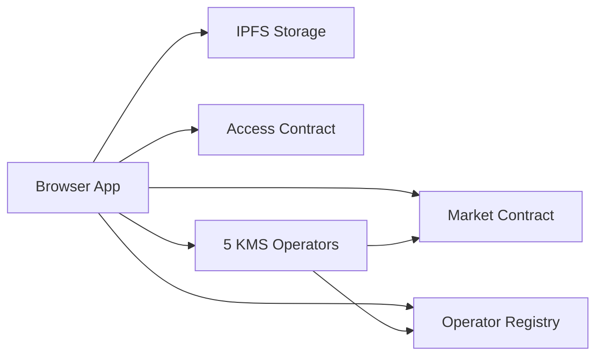

# YouTick Public Architecture Overview

YouTick is a public-alpha ticketed video access platform. Creators publish
encrypted media, viewers buy or claim access, and playback is allowed only when
the app can prove the viewer has an entitlement.

## Trust Model

| Area | Today | Plan |
|---|---|---|
| Ownership and ticket state | NEAR contracts | Keep on-chain |
| Media bytes | Encrypted IPFS assets | Add more provider redundancy |
| Playback keys | Share-based KMS operators on Cloudflare Workers | Independent operator hosting |
| Governance | Owner-controlled public alpha | Multisig / DAO handover |

## System Flow

## Layers

The browser encrypts media before upload and reconstructs the playback key only
after enough KMS shares are returned. The market contract stores events,
tickets, purchase logs and creator ownership. The access contract stores
short-lived session grants for off-chain authorization. The registry contract is
the source of truth for active KMS operators.

Encrypted media and manifests are stored on IPFS. Lighthouse is the primary
write provider through the Storage API Worker. Playback uses the Media Delivery
Worker and public IPFS gateway fallback; the legacy Crust runtime fallback has
been removed.

KMS is threshold-based. The current design targets five operators with three
shares required for playback. A single operator should not be enough to recover
the playback key, and one unavailable operator should not stop playback by
itself.

## Failure Modes

If one KMS operator is down, playback should continue while at least three valid
shares are reachable. If registry verification fails, the affected worker should
fail closed. If content is taken down on-chain, KMS retrieve checks the banned
state and returns a generic not-found/unauthorized response.

## Public-Alpha Status

YouTick should be described as hybrid decentralized during public alpha, not
fully decentralized. NEAR state and ticket ownership are on-chain, but hosting,
operator runtime, persistence redundancy and emergency governance still include
centralized operational controls.
