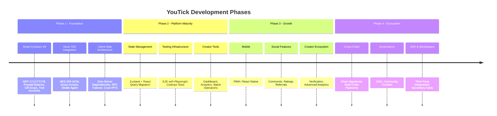

# Development Roadmap

> YouTick strategic roadmap -- from foundation to ecosystem

---

## Timeline Overview

---

## Phase 1: Foundation (Completed)

> [!NOTE]
> Phase 1 established the core decentralized platform with zero server dependencies. All components operate client-side.

### Smart Contract (V8)

- [x] NEP-171/177/178 NFT ticket contract (Rust, NEAR SDK 5.5.0)
- [x] Event creation and management with metadata
- [x] Ticket purchase with 98/1/1 revenue split (creator / trial pool / commission)
- [x] Prepaid balance system ("Gas Tank" for session key operations)
- [x] Gift drop system (access-key-based content sharing, 1-50 links per call)
- [x] Trial account sponsorship (onboarding keys, relayer-less)
- [x] wNEAR integration (NEP-141 `ft_on_transfer`)
- [x] Content moderation (ban/unban with `BanReason` enum)
- [x] Purchase audit trail (on-chain `PurchaseLog` with typed entries)
- [x] Commission pool management (owner-withdrawable)
- [x] V8 storage keys (two-byte collision-safe prefixes)
- [x] Lazy storage pattern for non-migration additions (`event_price_usd`, `banned_events`)
- [x] Nova group index (event-level CID-to-group mapping)
- [x] Nova auto-funding (platform account for service fees per ticket)
- [x] USD price tracking per event (optional, lazy storage)

### Frontend

- [x] Next.js 16 App Router architecture (React 19, TypeScript 5)
- [x] NEAR Wallet Selector integration
- [x] Video upload with multi-step progress UI and Nova encryption
- [x] Encrypted video playback (IpfsPlayer with multi-gateway failover)
- [x] Ticket purchase card with cost breakdown (NEAR + storage deposit)
- [x] Gift link generation and claiming (both paths: existing account, new account)
- [x] Trial account onboarding flow (client-side with onboarding key)
- [x] User profile with tickets and events
- [x] Video discovery page with cursor-based pagination
- [x] Responsive design (mobile/tablet/desktop)
- [x] i18n support (English + Turkish)
- [x] Nova access sync component (automatic membership synchronization)
- [x] Nova-encrypted thumbnail support
- [x] Account setup wizard (session key + prepaid balance onboarding)

### Infrastructure

- [x] Nova Protocol TEE encryption (AES-256-GCM via Shade Agent)
- [x] IPFS storage via Crust Network (W3Auth for signless uploads)
- [x] Multi-gateway IPFS failover (7+ gateways with health tracking)
- [x] Multi-endpoint NEAR RPC failover (fastnear, near.org, lava.build)
- [x] Session key management (24h expiry, on-chain validation per use)
- [x] Client-side decentralization (zero server dependencies for core flows)
- [x] Web4 gateway support
- [x] Decentralization metrics logging (`[DECENTRALIZATION_METRIC]` events)

---

## Phase 2: Platform Maturity (In Progress)

> [!IMPORTANT]
> Phase 2 focuses on production hardening, developer experience, and creator tools. The goal is a platform stable enough for external creators.

### State Management and Performance

- [ ] Migrate from Context API to Zustand for global state management
- [ ] Integrate React Query (TanStack) for server state and caching
- [ ] Code splitting and lazy loading optimization
- [ ] Image and video thumbnail lazy loading
- [ ] Bundle size optimization (tree-shaking, dynamic imports)

### Testing Infrastructure

- [ ] E2E testing suite with Playwright (upload, watch, purchase, gift, trial flows)
- [ ] Smart contract unit test expansion (edge cases, failure paths)
- [ ] Frontend component testing (Vitest + React Testing Library)
- [ ] CI/CD pipeline for automated testing on pull requests

### Error Handling and Recovery

- [ ] Comprehensive error boundary implementation across all flows
- [ ] Pending access queue (retry failed Nova group additions with backoff)
- [ ] Transaction failure recovery (prepaid balance reconciliation)
- [ ] Gateway failure reporting and automatic recovery

### Creator Tools

- [ ] Creator dashboard (upload history, ticket sales, revenue tracking)
- [ ] Analytics views (views, purchases by time period, revenue per video)
- [ ] Batch operations (bulk gift link creation, multi-video management)
- [ ] Enhanced video metadata editing (post-creation updates)

### Discovery and Content

- [ ] Advanced search and filtering on discover page (by creator, price range, category)
- [ ] Video categories and tagging system
- [ ] Content recommendation based on purchase history
- [ ] Notification system for new content and purchases

---

## Phase 3: Growth and Scale (Planned)

> [!NOTE]
> Phase 3 extends the platform to mobile users and introduces social features to drive organic growth.

### Mobile Experience

- [ ] Progressive Web App (PWA) with offline capability
- [ ] React Native mobile application (iOS + Android)
- [ ] Push notifications for events and purchases
- [ ] Offline playback for purchased content (encrypted cache)

### Social Features

- [ ] Comments and ratings on videos (on-chain or hybrid)
- [ ] Creator profiles with follow/subscribe functionality
- [ ] Social sharing with preview cards (Open Graph metadata)
- [ ] Referral system with on-chain tracking and rewards

### Creator Ecosystem

- [ ] Creator verification system (identity attestation)
- [ ] Advanced analytics dashboard (engagement metrics, audience demographics)
- [ ] Multi-language support expansion (beyond English + Turkish)
- [ ] Scheduled publishing (time-locked content release)

### Authentication Expansion

- [ ] Fast Auth integration (email/social login with MPC key recovery)
- [ ] Web3Auth / Magic SDK support (progressive onboarding)
- [ ] Multi-factor authentication for high-value operations

---

## Phase 4: Ecosystem (Future)

> [!NOTE]
> Phase 4 transforms YouTick from a platform into an ecosystem with cross-chain access, governance, and third-party integrations.

### Cross-Chain Access

- [ ] Chain Signatures (NEAR MPC) for cross-chain ticket purchases
- [ ] EVM wallet support (MetaMask, WalletConnect) via chain abstraction
- [ ] Multi-chain payment acceptance (ETH, USDC, stablecoins)

### Governance

- [ ] DAO governance for platform decisions (commission rates, moderation policy)
- [ ] Community-driven content curation
- [ ] Treasury management (commission pool governed by token holders)
- [ ] Proposal and voting mechanism

### Marketplace

- [ ] Secondary NFT marketplace for ticket resale
- [ ] Creator royalties on secondary sales (NEP-199)
- [ ] Bundle pricing and subscription models
- [ ] Auction-based ticket sales for premium content

### Creator Tokenomics

- [ ] Creator tokens (social tokens per channel)
- [ ] Staking mechanisms for exclusive content access
- [ ] Revenue sharing with early supporters

### Live Content

- [ ] Live streaming with token-gated access (Nova-encrypted streams)
- [ ] Real-time chat for live events
- [ ] Live tipping and donations (on-chain, instant settlement)

### Developer Ecosystem

- [ ] SDK for embedding YouTick players in third-party sites
- [ ] Plugin system for extensions (custom player skins, analytics integrations)
- [ ] API for external marketplace integration
- [ ] Developer documentation portal

---

## Technical Debt

> [!WARNING]
> Items tracked here represent known improvements that should be addressed to maintain long-term code health.

| Priority | Item | Impact | Effort |
|----------|------|--------|--------|
| High | Migrate from Context API to Zustand for global state | Reduces re-renders, improves maintainability | Medium |
| High | Implement comprehensive E2E test suite (Playwright) | Catches regressions, enables confident deployments | High |
| High | Improve error handling and recovery across all flows | Reduces user-facing failures, improves reliability | Medium |
| Medium | Add OpenAPI/Swagger documentation for API routes | Enables external developer integration | Low |
| Medium | Contract storage optimization (cleanup stale trial counts) | Reduces on-chain storage costs | Low |
| Medium | Refactor landing page components into smaller modules | Improves code organization, reduces bundle size | Low |
| Low | Add Storybook for component development and documentation | Improves developer experience for UI work | Low |
| Low | Implement service worker for offline capability | Enables PWA features, improves mobile experience | Medium |

---

## Security Milestones

> [!CAUTION]
> Security milestones are prerequisites for public mainnet launch with external creators. These should be completed before Phase 3.

| Priority | Milestone | Status | Target |
|----------|-----------|:------:|--------|
| Critical | Smart contract security audit (external, independent firm) | Planned | Phase 2 |
| Critical | Frontend security review (XSS, injection, key exposure) | Planned | Phase 2 |
| High | Penetration testing (full platform, including Nova integration) | Planned | Phase 2-3 |
| High | Formal verification of critical contract methods (payment split, withdrawal caps) | Planned | Phase 3 |
| Medium | Bug bounty program launch (Immunefi or equivalent) | Planned | Phase 3 |
| Medium | SOC 2 compliance evaluation (if enterprise adoption is pursued) | Planned | Phase 4 |
| Low | Regular dependency audit automation (Dependabot, Snyk) | Planned | Phase 2 |

---

## Metrics and Success Criteria

### Phase 2 Exit Criteria

- [ ] E2E tests cover all five core flows (upload, watch, purchase, gift, trial)
- [ ] State management migration complete (Zustand + React Query)
- [ ] Creator dashboard functional with basic analytics
- [ ] Error recovery implemented for all critical paths
- [ ] Smart contract audit completed with no critical findings

### Phase 3 Exit Criteria

- [ ] Mobile app published (App Store + Play Store) or PWA operational
- [ ] Social features live (comments, ratings, referrals)
- [ ] 3+ languages supported
- [ ] Bug bounty program active
- [ ] 100+ external creators onboarded

### Phase 4 Exit Criteria

- [ ] Cross-chain payments operational (at least 1 EVM chain)
- [ ] DAO governance deployed and operational
- [ ] Secondary marketplace functional
- [ ] SDK published with documentation
- [ ] Self-sustaining economics (trial pool, commission pool covering operations)

---

## Contributing

Want to help build the future of decentralized video? Check the [Contributing Guide](./contributing.md) for how to get started. Issues tagged `good-first-issue` are ideal for new contributors.

---

*Roadmap last updated: February 2026*
