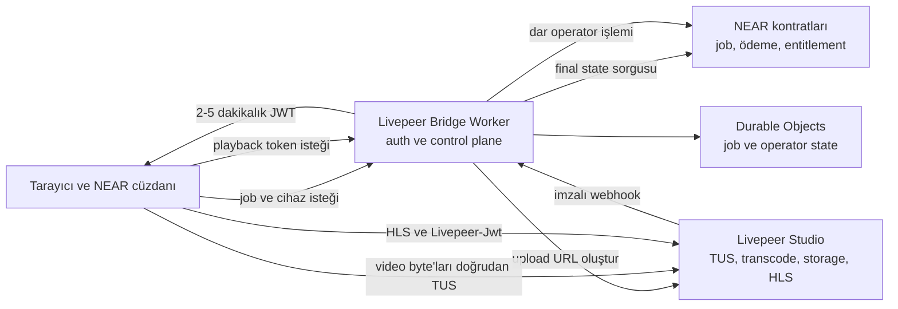

# NEAR + Livepeer Studio Serverless Paid Media Architecture Evaluation

> **Durum:** `SOURCE_EVALUATION / SUPERSEDED_BY_ADR_010 / NOT_DEPLOYED`
>
> **Tarih:** 2026-08-01
>
> **Kapsam:** Ücretli VOD, 20 GB kaynak video, NEAR ödeme/yetki gerçeği, Livepeer Studio medya işleme ve video taşımayan serverless erişim köprüsü
>
> **Kanonik plan etkisi:** Bu dosya ADR-010 kararının kaynak değerlendirmesidir.
> Kanonik hedef [NEAR + Livepeer Paid Media v1 planıdır](./docs/architecture/near-livepeer-paid-media-implementation-plan.md).
> Çelişki halinde plan ve ADR-010 önceliklidir; bu dosya deploy onayı vermez.

## 1. Yönetici özeti

Uygulama, iki ana ürün platformu olarak NEAR Protocol ve Livepeer Studio kullanılarak kurulabilir. Ancak güvenli ücretli video için NEAR kontratı ile Livepeer arasında çalışan küçük bir off-chain erişim katmanı zorunludur.

Bu katman geleneksel, sürekli çalışan bir backend sunucusu olmak zorunda değildir. Cloudflare Worker serverless backend rolünü karşılayabilir.

Önerilen en küçük üretim mimarisi:

```text
NEAR contracts
+ Livepeer Studio
+ 1 dedicated Cloudflare Worker
+ 1 SQLite-backed Durable Object class
```

Video byte'ları hiçbir zaman Worker, Next.js veya Web4 proxy üzerinden taşınmaz. Tarayıcı videoyu Livepeer'ın TUS endpoint'ine doğrudan yükler.

Karar özeti:

| Soru | Karar |
|---|---|
| Geleneksel backend sunucusu şart mı? | Hayır |
| Serverless Worker backend olabilir mi? | Evet |
| Studio API key Worker'da tutulabilir mi? | Evet, Worker Secret olarak |
| JWT private key Worker'da tutulabilir mi? | Evet, Worker Secret olarak |
| NEAR operator key Worker'da tutulabilir mi? | Evet, yalnız dar FunctionCall key olarak |
| Tekrar wallet popup göstermeyen playback korunabilir mi? | Evet |
| Satın alma tamamen imzasız olabilir mi? | Hayır |
| Livepeer plaintext görebilir mi? | Evet; ürün kararıyla kabul edildi |
| 3-of-5/5-of-5 KMS korunacak mı? | Hayır; ürün gereksinimi değil |
| Immutable CID/full-byte bağımsız doğrulama korunacak mı? | Hayır; ürün gereksinimi değil |
| DRM veya ekran kaydı engelleme sağlanır mı? | Hayır |

## 2. Kararı belirleyen ürün girdileri

Bu GO kararı aşağıdaki açık kabullere dayanır:

1. "Yalnız iki teknoloji", iki ana ürün platformu anlamına gelir. Video taşımayan küçük bir auth/control bridge kabul edilir.
2. Livepeer'ın transcode sırasında videoyu açık halde görmesi kabul edilir.
3. Mevcut threshold KMS, immutable CID ve bağımsız full-byte verifier özellikleri zorunlu ürün gereksinimleri değildir.
4. "Tek imza", kullanıcı deneyiminde tekrar wallet popup gösterilmemesi anlamına gelir. Arka plandaki cihaz, webhook ve JWT imzaları kabul edilir.

Bu kabuller değişirse karar yeniden değerlendirilmelidir.

## 3. Livepeer Protocol ve Livepeer Studio ayrımı

Livepeer Protocol; Gateway, Orchestrator, transcode işleri ve protokol ödemelerini sağlar. Dosya kabulü, kalıcı saklama, CDN, oynatma URL'leri, API anahtarları ve erişim politikaları ise yönetilen Livepeer Studio ürününün yetenekleridir.

Bu tasarım Livepeer Protocol'e doğrudan bağlanan özel bir Gateway kurmayı değil, Livepeer Studio kullanmayı hedefler.

Sonuç olarak:

- NEAR, kimlik, ödeme, job ve entitlement gerçeğidir.
- Livepeer Studio, upload, transcode, storage ve HLS delivery sağlayıcısıdır.
- Cloudflare Worker, iki sistem arasındaki güvenilir erişim ve otomasyon köprüsüdür.
- Cloudflare bu modelde üçüncü bir altyapı sağlayıcısıdır; fakat üçüncü bir medya veya ödeme otoritesi değildir.

Kaynaklar:

- [Livepeer Protocol architecture](https://docs.livepeer.org/v2/about/protocol/architecture)
- [Livepeer Studio overview](https://docs.livepeer.org/v2/solutions/livepeer-studio/overview)

## 4. Hedef mimari



### 4.1 Worker sorumlulukları

Worker yalnız şu üç public akışı taşır:

1. `upload-intent`
   - Final NEAR job, creator, generation ve ingest key doğrulaması.
   - Byte ve kota kontrolü.
   - Livepeer Studio'dan kısa ömürlü TUS upload URL oluşturma.

2. `livepeer-webhook`
   - Raw body HMAC ve timestamp doğrulaması.
   - Replay/idempotency kontrolü.
   - Asset/task durumunu Studio API'den yeniden okuma.
   - Doğrulanmış sonucu operator single-writer akışına verme.

3. `playback-token`
   - Final NEAR entitlement ve Play grant doğrulaması.
   - Account, resource, origin, device ve expiry kontrolü.
   - Playback ID'ye bağlı kısa ömürlü Livepeer JWT üretme.

Worker şunları yapmaz:

- Video upload proxy'si olmaz.
- HLS segmentlerini taşımaz.
- Video transcode etmez.
- Kalıcı medya saklamaz.
- Ödeme veya entitlement gerçeği olmaz.

## 5. Serverless ve secret modeli

Klasik backend sunucusu gerekmez. Worker'ın kendisi güvenilir backend sınırıdır.

### 5.1 Secret binding'leri

| Değer | Saklama | Amaç |
|---|---|---|
| `LIVEPEER_STUDIO_API_KEY` | Worker Secret | Upload URL oluşturma ve asset doğrulama |
| `LIVEPEER_JWT_PRIVATE_KEY` | Worker Secret | Playback JWT imzalama |
| `LIVEPEER_WEBHOOK_SECRET` | Worker Secret | Webhook HMAC doğrulama |
| `NEAR_OPERATOR_SECRET_KEY` | Worker Secret | Dar on-chain finalize işlemi |
| `LIVEPEER_JWT_PUBLIC_KEY` | Normal config | Livepeer playback policy |
| Contract ID, RPC URL, allowed origins | Normal config | Runtime yönlendirmesi |

Secret değerleri şu yüzeylerde bulunmamalıdır:

- Wrangler `[vars]`
- Git repository
- Frontend bundle
- Durable Object, KV veya D1 kaydı
- Request/response gövdesi
- Log, trace veya health response

Cloudflare Worker Secrets şifreli binding olarak tutulur ve değer dashboard/Wrangler üzerinden tekrar gösterilmez. Ancak Worker kodu çalışma anında değeri okuyabilir. Bu nedenle Worker Secrets bir HSM değildir; deploy yetkisi de güven sınırına dahildir.

Tek Worker kullanıldığı sürece normal Worker Secrets en sade tercihtir. Account-level Secrets Store yalnız aynı secret birden fazla Worker tarafından paylaşılmaya başlanırsa değerlendirilmelidir.

Kaynaklar:

- [Cloudflare Worker Secrets](https://developers.cloudflare.com/workers/configuration/secrets/)
- [Cloudflare Secrets Store integration](https://developers.cloudflare.com/secrets-store/integrations/workers/)

### 5.2 Kriptografi desteği

Cloudflare Web Crypto; ECDSA, HMAC, SHA-256 ve Ed25519 işlemlerini destekler. Bu yetenekler şunlar için yeterlidir:

- Livepeer ES256/P-256 JWT üretme.
- Livepeer webhook HMAC-SHA256 doğrulama.
- Browser cihazının Ed25519 kontrol isteğini doğrulama.
- NEAR operator işlem imzası.

Livepeer signing key'in private kısmı yalnız key oluşturulurken gösterilir. Oluşturulduğu anda güvenli biçimde Worker Secret olarak kaydedilmelidir.

Kaynaklar:

- [Cloudflare Web Crypto](https://developers.cloudflare.com/workers/runtime-apis/web-crypto/)
- [Livepeer signing key API](https://docs.livepeer.org/api-reference/signing-key/create)
- [Livepeer JWT implementation](https://github.com/livepeer/ui-kit/blob/e145297d75d2ea1ad2049b9b16671a44ec914322/packages/core/src/crypto/jwt.ts)

### 5.3 Deploy ve rotation sınırı

Production için:

- Dev, staging ve production ayrı Livepeer projeleri ve anahtarları kullanmalıdır.
- Worker deploy yetkisi yalnız kontrollü CI rolünde olmalıdır.
- Dashboard üzerinden plansız production kod düzenleme kapatılmalıdır.
- Health endpoint yalnız secret'ın tanımlı olup olmadığını raporlamalı, değer veya fingerprint döndürmemelidir.
- API, JWT, webhook ve NEAR operator key için örtüşmeli rotation tatbikatı yapılmalıdır.
- Yeni key deploy edilip doğrulandıktan sonra eski key revoke edilmelidir.

## 6. Durable Object ve single-writer tasarımı

Upload URL oluşturma ve JWT imzalama stateless olabilir. Fakat bütün iş akışı stateless bırakılamaz:

```text
Livepeer asset oluştur
→ cevabı kaydet
→ webhook bekle
→ asset'i yeniden doğrula
→ NEAR'a finalize yaz
```

Worker bu adımlar arasında kapanabilir. Webhook tekrar veya sıra dışı gelebilir. Aynı job için iki eşzamanlı upload isteği iki farklı asset oluşturabilir. Aynı NEAR operator key'iyle paralel işlemler nonce yarışına girebilir.

Başlangıçta tek SQLite-backed Durable Object sınıfı, iki mantıksal anahtarla kullanılmalıdır:

```text
job:<job_id>:<generation>
operator:<operator_public_key>
```

### 6.1 Job nesnesi

`job:*` nesnesi:

- Upload intent nonce'unu atomik tüketir.
- Bir job/generation için yalnız bir Livepeer asset kabul eder.
- Asset ID, playback ID ve provider durumunu kalıcı tutar.
- Duplicate ve sıra dışı webhook'ları idempotent işler.
- Başarısız provider kontrolünü alarm ile tekrarlar.
- Farklı ikinci asset/playback bağlamasını reddeder.

### 6.2 Operator nesnesi

`operator:*` nesnesi:

- NEAR'a gönderilecek işlemleri kalıcı outbox'ta tutar.
- Bir operator public key için tek writer olur.
- NEAR access-key nonce yarışını önler.
- RPC sonucu belirsizse tekrar imzalamadan önce final chain state'i okur.
- Başarısız işlemleri alarm ile yeniden dener.

Bu tek-writer bilinçli bir başlangıç sınırıdır. Ölçülmüş throughput problemi oluşursa birden fazla dar operator key veya Queue tabanlı sharding değerlendirilebilir.

### 6.3 Neden KV değil?

Workers KV eventually consistent çalışır. Bu nedenle aşağıdaki kararlar için authoritative state olamaz:

- Webhook replay/idempotency.
- Tek kullanımlık nonce.
- Asset creation kilidi.
- Operator nonce sıralaması.

KV yalnız yaklaşık rate-limit ve cache için kullanılabilir.

### 6.4 D1 ve Queue ne zaman eklenir?

Başlangıç mimarisine D1 veya Queue eklenmez.

D1 yalnız şu ihtiyaçlarda değerlendirilir:

- Bütün job'larda SQL sorgusu.
- Operasyon paneli.
- Uzun süreli audit geçmişi.
- Toplu reconciliation ve raporlama.

Queue yalnız şu ihtiyaçlarda değerlendirilir:

- Formal dead-letter queue.
- Yüksek webhook trafiği.
- Operator Durable Object'ın ölçülmüş throughput sorunu.

Kaynaklar:

- [Cloudflare Durable Objects](https://developers.cloudflare.com/durable-objects/)
- [Durable Object coordination rules](https://developers.cloudflare.com/durable-objects/best-practices/rules-of-durable-objects/)
- [Workers KV consistency](https://developers.cloudflare.com/kv/concepts/how-kv-works/)

## 7. Upload akışı

1. Browser job'a özel Ed25519 ingest key üretir.
2. Creator tek wallet popup ile `create_paid_job` çağırır.
3. NEAR job; creator, source byte sayısı, generation ve ingest public key'i bağlar.
4. Browser Worker'a cihaz anahtarıyla imzalı upload-intent gönderir.
5. Worker final NEAR state üzerinden şunları doğrular:
   - Creator ve job sahipliği.
   - Job/generation eşleşmesi.
   - Ingest public key eşleşmesi.
   - Timestamp, nonce, method, route, origin ve body hash.
   - `source_bytes <= 20_000_000_000`.
   - Job'ın henüz farklı bir provider asset'ine bağlanmamış olması.
6. Worker private Studio API key ile TUS upload URL oluşturur.
7. Browser videoyu doğrudan Livepeer'a yükler.
8. Livepeer Worker'a imzalı webhook gönderir.
9. Worker raw gövdeyi parse etmeden önce HMAC ve timestamp kontrolü yapar.
10. Worker webhook gövdesine dayanarak publish etmez; asset/task durumunu Studio API'den yeniden okur.
11. Ready asset'in byte sayısı, SHA-256 ve video profili kontrol edilir.
12. Operator Durable Object dar NEAR finalize işlemini gönderir.

Livepeer TUS resumable upload destekler ve browser'ın oluşturulan endpoint'e doğrudan yükleme yapmasını önerir. Resmî VOD destek matrisinde 30 GB'a kadar kaynak dosya listelense de tam 20 GB, resume ve codec profili gerçek canary ile doğrulanmalıdır.

Kaynaklar:

- [Livepeer upload guide](https://docs.livepeer.org/v1/developers/guides/upload-video-asset)
- [Livepeer API support matrix](https://docs.livepeer.org/v1/references/api-support-matrix)
- [Cloudflare Workers limits](https://developers.cloudflare.com/workers/platform/limits/)

## 8. Webhook güvenliği

Webhook doğrulama sırası:

1. Request body raw byte olarak bir kez okunur.
2. `Livepeer-Signature` içinden timestamp ve bütün `v1` imzaları çıkarılır.
3. Raw body üzerinde HMAC-SHA256 hesaplanır.
4. İmza constant-time comparison ile doğrulanır.
5. Header timestamp, body timestamp ve yerel tolerans kontrol edilir.
6. Event ID Durable Object'ta atomik idempotency anahtarı olarak tüketilir.
7. Ancak bundan sonra body JSON olarak parse edilir.
8. Provider state Studio API'den yeniden okunur.

Şu davranışlar yasaktır:

- `request.json()` çağırıp yeniden serialize edilen gövdeyle HMAC kontrolü.
- Yalnız webhook payload'ına dayanarak job publish etme.
- Duplicate event'i ikinci on-chain transition olarak işleme.
- İmza hatasında fail-open davranma.

Kaynak: [Livepeer webhook verification](https://docs.livepeer.org/v1/developers/guides/setup-and-listen-to-webhooks)

## 9. İçerik doğrulaması

Bağımsız full-byte verifier ve immutable CID kaldırılabilir. Livepeer asset cevabında şu bilgiler bulunabilir:

- Source byte sayısı.
- SHA-256 hash.
- Video formatı.
- Duration, codec, çözünürlük ve track bilgileri.

Önerilen doğrulanmış publication kaydı:

```text
job_id
generation
provider = livepeer
playback_id
asset_id_hash
source_bytes
source_sha256
video_profile
provider_status = ready
ready_at
```

Livepeer'ın private `asset_id` değeri Durable Object'ta tutulur. Zincire `asset_id_hash`, playback ID ve doğrulanmış medya bilgileri yazılabilir.

Bu doğrulamanın güven sınırı:

- Yanlış dosya, eksik upload ve accidental corruption tespit edilebilir.
- Hash kriptografiktir fakat hash'i üreten provider Livepeer'dır.
- Kötü niyetli veya ele geçirilmiş Livepeer'a karşı bağımsız kanıt sağlamaz.
- Kabul edilen provider trust modelinde bu yeterlidir.

Kaynak: [Livepeer Asset API](https://docs.livepeer.org/v1/api-reference/asset/update)

## 10. Playback ve yetkilendirme

1. İzleyici USDC satın alma işlemini wallet ile onaylar.
2. NEAR finalize edilmiş entitlement üretir.
3. Mevcut dar FunctionCall key ile Play grant wallet popup açmadan alınır.
4. Browser Worker'a cihaz/session kanıtıyla playback-token isteği gönderir.
5. Worker final NEAR state üzerinden şunları kontrol eder:
   - `has_entitlement`.
   - Play grant.
   - Account ve resource.
   - Origin ve device.
   - Grant expiry.
6. Worker playback ID'ye bağlı 2-5 dakikalık JWT üretir.
7. JWT ömrü Play grant'in kalan süresini aşamaz.
8. Player HLS isteklerinde `Livepeer-Jwt` header kullanır.
9. Uzun videoda token wallet popup olmadan sessiz yenilenir.

JWT bir bearer token'dır. Livepeer'ın uyguladığı temel scope playback ID ve süredir. Custom account/device claim'lerinin Livepeer tarafından zorunlu yetkilendirme koşulu olarak uygulandığı varsayılmamalıdır. Account, entitlement, origin ve device kontrolü token üretilmeden önce Worker'da yapılır.

Token URL query parametresinde taşınmamalıdır; log ve browser geçmişine sızabilir. HLS header kullanılmalıdır.

Kaynak: [Livepeer JWT access control](https://docs.livepeer.org/v1/developers/guides/access-control-jwt)

## 11. Signless ve wallet popup davranışı

"Signless", kriptografik olarak imzasız anlamına gelmez. Kullanıcı tekrar wallet popup görmez; cihaz/session key ve Worker imzaları arka planda çalışır.

| İşlem | Görünür wallet popup |
|---|---:|
| Dar FunctionCall key provision | Bir defalık |
| Creator job oluşturma | Job başına 1 |
| TUS upload ve resume | 0 |
| Livepeer webhook/finalize | 0 |
| USDC satın alma | Satın alma başına 1 |
| Play grant | Provision sonrasında 0 |
| Playback JWT | 0 |
| HLS segment istekleri | 0 |

Sistemde arka planda şu imzalar bulunmaya devam eder:

- NEAR wallet transaction.
- Browser cihaz/session anahtarı.
- Livepeer webhook HMAC.
- Worker ES256 playback JWT.
- Worker NEAR operator transaction.

## 12. NEAR operator key modeli

Worker'da FullAccess key tutulmaz.

Önerilen FunctionCall key:

```text
account: livepeer-bridge.youtick.near
receiver: paid-media contract
methods:
  - finalize_livepeer_publication
  - suspend_livepeer_sales
deposit: 0
allowance: sınırlı
```

NEAR access key argümanları kısıtlamaz. Bu nedenle kontratın kendisi şu invariantları doğrulamalıdır:

- Yalnız yapılandırılmış bridge hesabı çağırabilir.
- Job, generation, creator ve status eşleşmelidir.
- Source byte sayısı job ile aynı olmalıdır.
- Aynı asset/playback kaydı idempotent başarı vermelidir.
- Farklı ikinci asset/playback kesin reddedilmelidir.
- Published job yeniden yazılamamalıdır.
- Yanlış profile ile Livepeer finalize çağrılamamalıdır.

Kaynak: [NEAR access keys](https://docs.near.org/protocol/accounts-contracts/access-keys)

## 13. Kontrat etkisi

Mevcut `finalize_paid_publish` akışı byte-integrity, beş KMS receipt ve source-delete kanıtını zorunlu tutar. Livepeer mimarisi bu metoda sahte CID, KMS veya delete verisi göndererek bağlanmamalıdır.

Yeni ve açıkça ayrılmış bir publication profili gerekir:

```text
profile = paid-media-livepeer-v1
```

Önerilen dar metot:

```text
finalize_livepeer_publication(
  job_id,
  generation,
  playback_id,
  asset_id_hash,
  source_bytes,
  source_sha256,
  video_profile
)
```

Yeni bridge eski KMS Worker'ın legacy `has_ticket` çağrısını kopyalamamalı; doğrudan paid-media v4 `has_entitlement` view metodunu kullanmalıdır.

Repo kanıtları:

- [Mevcut KMS/CID finalize kapısı](./contracts/nft-ticket/src/lib.rs)
- [V4 entitlement view](./contracts/nft-ticket/src/lib.rs)
- [Mevcut Worker NEAR access-key kontrolü](./workers/storage-api/src/index.ts)
- [Mevcut DO binding](./workers/storage-api/wrangler.toml)
- [Mevcut direct-R2 control-plane açıklaması](./workers/storage-api/README.md)

## 14. Güvenlik ve failure modeli

| Olay | Beklenen davranış |
|---|---|
| NEAR final RPC erişilemiyor | Upload/playback token fail-closed |
| Livepeer API erişilemiyor | Yeni upload ve provider doğrulaması bekler |
| Worker erişilemiyor | Yeni upload/token üretimi durur; mevcut JWT expiry'ye kadar çalışabilir |
| Duplicate webhook | Idempotent no-op |
| Sıra dışı webhook | Geçersiz transition reddedilir veya pending tutulur |
| Webhook imzası hatalı | 4xx ve hiçbir state değişikliği yok |
| Provider ready ama NEAR write başarısız | Durable outbox ve alarm retry |
| NEAR sonucu belirsiz | Final state okunur; körlemesine yeniden gönderilmez |
| JWT çalındı | Playback ID ve TTL sınırında expiry'ye kadar kullanılabilir |
| Studio API key çalındı | Rotation/revoke; asset yönetim riski kabul edilir |
| Operator key çalındı | Dar FC scope, kontrat invariantları ve on-chain revoke |
| Cloudflare deploy yetkisi çalındı | Bütün Worker secrets risk altında; incident rotation gerekir |

Bu model şunları garanti etmez:

- Livepeer'dan gizli plaintext.
- Ticari DRM.
- Ekran kaydı engelleme.
- Yetkili izleyicinin segmentleri kaydetmesini engelleme.
- Provider-independent ciphertext veya CID doğrulaması.

## 15. Sadelik kararı

İlk production adayı için:

```text
1 Worker
+ 1 Durable Object class
+ Worker Secrets
```

Yapılmayacaklar:

- Livepeer SDK yalnız üç REST çağrısı için zorunlu dependency yapılmaz; native `fetch` tercih edilir.
- D1 yalnız ileride operasyon/audit sorgusu gerektiğinde eklenir.
- Queue yalnız ölçülmüş throughput veya formal DLQ ihtiyacında eklenir.
- Ayrı VM/backend sunucusu kurulmaz.
- Mevcut beş KMS Worker taşınmaz.
- Livepeer mevcut R2/Lighthouse/processor zincirinin yanına ikinci paralel medya hattı olarak eklenmez.

## 16. Production kabul kapıları

### 16.1 Secret sınırı

- Worker bundle, config, log ve health response içinde private key bulunmamalı.
- Dev/staging/prod ayrı key kullanmalı.
- API, JWT, webhook ve operator key rotation tatbikatı geçmeli.
- FullAccess NEAR key Worker'da bulunmamalı.

### 16.2 Upload

- Tam `20_000_000_000` byte upload başarıyla tamamlanmalı.
- `20_000_000_001` için kanonik plandaki iki sonuçtan biri kanıtlanmalı:
  provider maliyeti öncesi ret veya açıkça kabul edilmiş maliyet maruziyeti ve
  bütçe/kota/silme kontrolleri.
- Gerçek dosyada 30/70 kesinti ve resume çalışmalı.
- Video byte'larının Worker'a gelmediği request/log kanıtıyla doğrulanmalı.
- Aynı job için iki eşzamanlı upload-intent yalnız bir asset üretmeli.

### 16.3 Webhook ve state

- Sahte, eski, duplicate ve sıra dışı webhook testleri geçmeli.
- Raw body HMAC doğrulaması kanıtlanmalı.
- Webhook sonrası Studio API re-fetch zorunlu olmalı.
- Worker restart/crash sonrasında job state kaybolmamalı.
- Durable Object alarm retry'si gerçek failure ile doğrulanmalı.

### 16.4 NEAR operator

- İki farklı job aynı anda finalize edilirken nonce çakışmamalı.
- Aynı finalize tekrarında idempotent başarı alınmalı.
- Farklı ikinci playback/asset kaydı reddedilmeli.
- Operator key yalnız hedef receiver ve method listesine sahip olmalı.
- RPC sonucu belirsiz testinde final view ile recovery yapılmalı.

### 16.5 Playback

- Doğru entitlement ve grant ile HLS oynatılmalı.
- Yanlış account, resource, origin, device ve playback ID reddedilmeli.
- Expired JWT reddedilmeli.
- JWT ömrü on-chain grant'in kalan süresini aşmamalı.
- Uzun videoda sessiz token refresh wallet popup açmamalı.
- Revoke gecikmesi JWT TTL'ini aşmamalı.

### 16.6 İçerik doğrulaması

- Livepeer `source_bytes` job ile eşleşmeli.
- Provider SHA-256 zincir kaydıyla eşleşmeli.
- Video profile beklenen codec/çözünürlük politikasını geçmeli.
- Provider-dependent hash sınırı ürün ve güvenlik dokümanında açıkça belirtilmeli.

### 16.7 Kesinti ve maliyet

- NEAR, Worker ve Livepeer kesintileri ayrı ayrı denenmeli.
- Güvenlik kararları fail-closed kalmalı.
- Beklenen eşzamanlı izleyici, startup ve seek süreleri ölçülmeli.
- Studio fiyatları, rendition çarpanı, storage süresi ve retry ücretleri vendor'dan yazılı doğrulanmalı.

## 17. Repo gerçeği ve geçiş sınırı

2026-08-01 tarihli yerel incelemede:

- Repo içinde Livepeer entegrasyonu bulunmamaktadır.
- Mevcut paid-media v4 hedefi `NOT_DEPLOYED` durumundadır.
- PR-3 processor/verifier çalışması kirli çalışma ağacında devam etmektedir.
- V4 paid playback ve tam testnet upload → buy → watch akışı tamamlanmış değildir.
- Bu değerlendirme deploy veya canlı capability kanıtı değildir.

Kanonik hedef plan:
[near-livepeer-paid-media-implementation-plan.md](./docs/architecture/near-livepeer-paid-media-implementation-plan.md).
Karar kaydı: [ADR-010](./docs/adr/adr-010-livepeer-paid-media.md).

Mevcut KMS/CID kontrolleri sessizce gevşetilmemeli veya sahte kanıtlarla bypass
edilmemelidir. Livepeer v1 yeni kontrat ve profil kimlikleri kullanmalıdır.

## 18. Nihai karar

> **NEAR + Livepeer Studio + video taşımayan Cloudflare Worker bridge yeterlidir. Geleneksel backend sunucusu gerekmez. Worker Secrets gerekli anahtarları taşıyabilir; tek SQLite-backed Durable Object sınıfı job idempotency'sini ve NEAR operator single-writer akışını korur.**

Bu karar, Livepeer plaintext trust boundary'sinin ve provider-dependent içerik hash'inin açıkça kabul edilmesine; KMS/CID/DRM beklentilerinin ürün kapsamı dışında kalmasına bağlıdır.

## 19. Kaynaklar

### Livepeer

- [Protocol architecture](https://docs.livepeer.org/v2/about/protocol/architecture)
- [Studio overview](https://docs.livepeer.org/v2/solutions/livepeer-studio/overview)
- [Upload an asset](https://docs.livepeer.org/v1/developers/guides/upload-video-asset)
- [API support matrix](https://docs.livepeer.org/v1/references/api-support-matrix)
- [API authentication](https://docs.livepeer.org/v1/api-reference/overview/authentication)
- [JWT access control](https://docs.livepeer.org/v1/developers/guides/access-control-jwt)
- [Signing key API](https://docs.livepeer.org/api-reference/signing-key/create)
- [Webhook verification](https://docs.livepeer.org/v1/developers/guides/setup-and-listen-to-webhooks)
- [Asset API](https://docs.livepeer.org/v1/api-reference/asset/update)

### NEAR

- [Access keys](https://docs.near.org/protocol/accounts-contracts/access-keys)
- [Smart contract boundaries](https://docs.near.org/smart-contracts/what-is)
- [Meta-transactions](https://docs.near.org/protocol/transactions/meta-tx)

### Cloudflare

- [Worker Secrets](https://developers.cloudflare.com/workers/configuration/secrets/)
- [Web Crypto](https://developers.cloudflare.com/workers/runtime-apis/web-crypto/)
- [Workers limits](https://developers.cloudflare.com/workers/platform/limits/)
- [Durable Objects](https://developers.cloudflare.com/durable-objects/)
- [Durable Object rules](https://developers.cloudflare.com/durable-objects/best-practices/rules-of-durable-objects/)
- [Workers KV consistency](https://developers.cloudflare.com/kv/concepts/how-kv-works/)
